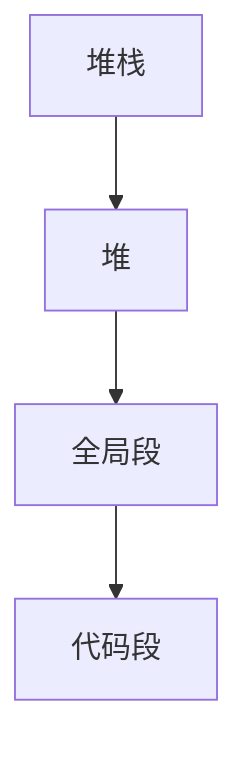

## 1 翁恺C


## 2 韩顺平C


C内存布局

> 内存自底向上增大
>
> + 代码段
> + 全局段
> + 堆
> + 堆栈

```cpp

// 全局变量，存储在全局段
int ga = 10;
int gb = 10;

int main() {
  int la = 10;
  int lb = 10;
  
  // 静态变量，存储在全局段
  static int sa = 10;
  static int sb = 10;
  
  // stdlib.h
  int *p = (int*)malloc(4);
  int *p2 = (int*)malloc(4);
  
  count << "局部变量与局部常量地址 la " << &la << " lb " << lb << endl;
  
  count << "全局变量全局常量与静态变量地址 ga= " << &ga << " gb= " << gb << "sa= " << sa << "sb= " << sb << endl;
  
}
```




## 3 C++基础


### 3.1 文件操作

> 步骤
>
> 1. 引入头文件「`fstream / ofstream / ifstream`」
> 2. 创建输入输出流对象
> 3. 文件路径与打开方式
> 4. 读写文件
> 5. 关闭文件


| unsinged int | desc                                   |
| ------------ | -------------------------------------- |
| ios::in      | 以读方式打开                           |
| ios::out     | 以写方式打开                           |
| ios::app     | 追加                                   |
| ios::trunc   | 如果文件存在，删除后创建               |
| ios::binary  | 操作二进制文件「文本文件、二进制文件」 |
| ios::ate     | 读写，直接定位到文件尾                 |

> 可以通过 | 合并多个操作
>
> `ios::in | ios::binary`


### 3.2 lambda

> lambda可以方便的定义和创建匿名函数
>
> [capture list] (params list) mutable exception -> return type {function body}


#### 1 基本使用

`[capture list] (params list) mutable exception -> return type {function body}`

+ capture list：捕获外部变量的列表
+ params list：形参列表
+ mutable：是否可修改捕获的变量
+ exception：异常设定
+ return type：返回类型
+ function body：函数体


我们可以省略某些成分来声明“不完整”的lambda式，常见的有以下几种

| 序号 | 格式                                                 |
| ---- | ---------------------------------------------------- |
| 1    | [capture list] (params list) -> return type { body } |
| 2    | [capture list] (params list) -> {body}               |
| 3    | [capture list] {body}                                |


#### 2 λ 排序

> 1. 定义函数排序
> 2. 定义仿函数排序
> 3. 定义lambda排序

``` cpp
#include ...
using namespace std;

vector<int> v {1, 2, 7, 5, 4};

// 3 lambda形式排序
sort(v.begin(), v.end(), [](int a, int b) -> bool {
  return a < b;
});

// 1 函数排序
bool m_compare(int a, int b) {
  return a < b;
}
sort(v.begin(), v.end(), m_compare)

// 2 自定义仿函数
class M_compare {
public:
  bool operator()(int a, int b) {
    return a < b;
  }
};
// 仿函数排序
// M_compare()是一个匿名对象
sort(v.begin(), v.end(), M_compare())

```


#### 3 变量捕获

| 捕获形式    | 说明                                                         |
| ----------- | ------------------------------------------------------------ |
| []          | 不捕获外部变量                                               |
| [var1, ...] | 默认以值捕获多个外部变量（逗号分隔），引用捕获需要加取地址符（&） |
| [this]      | 以值的形式捕获this指针                                       |
| [=]         | 以值的形式捕获所有外部变量                                   |
| [&]         | 以引用的形式捕获所有外部变量                                 |
| [=, &x]     | 捕获所有外部变量，x以引用形式捕获，其余变量以值形式捕获      |
| [&, x]      | 捕获所有外部变量，x以值的形式捕获，其余变量以引用形式捕获    |


## 4 C++ 面向对象


### 4.1 C++内存模型

> 1. 代码段『存放CPU执行的机器指令，只读、共享』
>
> 2. 全局段『存放全局变量、静态变量、常量（字符串常量，const修饰的全局常量），程序结束后该区域内存由OS释放』
>
> 3. 堆区『由程序员分配和释放，使用new, delete』
>
>    `int *p = new int(10)`
>
>    其中p分配在栈（&p获取p的地址），10分配在堆（p指向堆区中的10）
>
> 4. 堆栈『不要返回局部变量的指针 / 引用，该区域内存由编译器管理』

`#define N 200`

`const int a = 200`

宏定义在预处理阶段替换，const修饰的常量在编译阶段替换

> 1. 预处理：宏定义展开，头文件展开，条件编译
> 2. 编译：检查语法，将预处理后文件编译生成汇编文件
> 3. 汇编：将汇编文件生成目标文件（二进制文件）
> 4. 链接：将目标文件链接为可执行程序


## 5 C++提高

1. 泛型编程
2. STL


### 5.1 模板编程

> `template<typename T>  / template<class T>`


### 5.2 STL 6大组件

> 标准模板库6大组件
>

#### 1. Allocator

分配器

#### 2. 容器

「vector、list、deque、set、map」

##### vector

``` cpp
#include <vector>
#include <algorithm>

// 提供给for_each回调
void myPrint(int val) {
  cout << val;
}

int main() {
  vector<int> v;
  v.push_back(10);
  v.push_back(20);
  v.push_back(30);
  
  // 遍历方式一
  for (int t : v) {
    cout << t;
  }
  cout << endl;
  
  // 迭代器遍历
  for (auto it = v.begin(); it != v.end(); b++) {
    cout << *b
  }
  cout << endl;
  
  // for_each遍历
  for_each(v.begin(), v.end(), myPrint)
}
```

##### list


##### deque


#### 3. 算法

> sort
>
> find, find_if
>
> copy
>
> for_each
>
> count, count_if


#### 4. 迭代器

> 左闭右开
>
> begin()
>
> end()
>
> cbegin()
>
> cend()


#### 5. 仿函数

「重载()，行为类似函数，可作为算法的某种策略」


#### 6. 适配器


## 6 侯捷C++


### 6.1 STL源码分析

> STL以GP编程模型完成
>
>  
>
> OOP：面向对象编程『主要以继承，配合面向接口编程为主』
>
> GP：泛型编程『对象间关系通常以组合形式构建』


#### 1. 容器测试

> API 测试
>
> 代码请查看：[cpp-all](https://github.com/Timesless/cpp-all)


#### 2. 操作符重载

栗子：

> 由于list是双向链表
>
> 它的iterator需要实现指针的所有操作
>
> ++ 不是依据指针 + 元素的大小，而是跳转到下一个元素，比较复杂

``` cpp
template<class T, class Ref, class Ptr>
  struct __list_iterator {

  // 将名称命名为self
  typedef __list_iterator<T, Ref, Ptr> self;
  typedef __list_node<T> *link_type;

  // 实际数据
  link_type node;

  ...
    
  reference operator*();

  pointer operator->();
  // 前置++，返回引用

  self& operator++() {
    node = (link_type)((*node).next);
    return *this;
  }

  // 后置++，返回值「返回右值」，所以后++不能连续两次「i++++ ×」
  self operator++(int){
    // =为拷贝构造， 所以 *this变成了拷贝构造的参数，而不是查找reference operator*();
    self tmp = *this;
    // 调用已重载的前置++
    ++*this;
    return tmp
  }
  ...

}
```


#### 2. 模板编程


##### 类模板

``` cpp
// 定义
// template<typename T>
template<class T>
class Test {
private:
  T val;
};

// 使用
Test<int> t;
```

> 类模板的泛化与特化
>
> 泛化之外的特化「对于特定的类型使用特化的类模板」
>
> + 泛化「Generalization」
>
>   template<class T> struct S
>
> + 特化「Specialization」、局部特化「偏特化, Partial Specialization」
>
>   template<> struct S<int>

``` cpp
// 泛化
tempalte <class T> struct __type_traits {};

// 特化
// 如果类型是int，那么会使用当前模板
template<> struct __type_traits<int> {};

// 特化
template<> struct __type_traits<double> {};

// 泛化
template<class T, class Alloc = alloc> class Vector {};
// 局部特化
template<class Alloc> class Vector<bool, Alloc> {};


// 使用泛化的类模板
__type_traits<long> t1
// 使用int类型特化类模板
__type_traits<int> t2;
```


##### 函数模板

``` cpp
template<class T>
inline
const T& min(const T &a, const T &b) {
  return a < b ? a : b;
}
```


#### 3 容器

> GNU 2. 9**容器之间关联关系都以组合的形式构建**， GP
>
> GNU 4.9 **以继承的形式构建**，OOP
>
>  
>
> set, map 基于rb_tree实现，有序
>
> unordered_set, unordered_map 基于 hashtable实现，无序


| 标准库(std)            | 非标准库      |
| ---------------------- | ------------- |
| forward_list           | slist         |
| unordered_set          | hash_set      |
| unordered_map          | hash_map      |
| unordered_multiset     | hash_multiset |
| unordered_multimap     | hash_multimap |
| array「i新增标准容器」 |               |


#### 容器源码

+ vector

``` cpp
template <class T, class Alloc = alloc> class Vector {
  
public:
  typedef T value_type;
  typedef value_type* iterator;
  typedef value_type& reference;
  typedef size_t size_type;
  
protected:
  iterator start;
  iterator finish;
  iterator end_of_storage;
  
public:
  iterator begin() {
    return start;
  }
  iterator end() {
    return finish;
  }
 	// 为什么使用函数调用而不是属性，因为以后可能会更改实现
  // 而size() 永远是 end() - begin()
  size_type size() {
    return size_type(end() - begin());
  }
  size_type capacity() {
    return size_type(end_of_storage - begin);
  }
  bool empty() const {
    return begin() == end();
  }
  reference operator[](size_type idx) {
    return *(begin() + idx);
  }
  reference front() {
    return *begin();
  }
  // [) 前闭后开
  reference back() {
    return *(end() - 1);
  }
  ...
};
```

