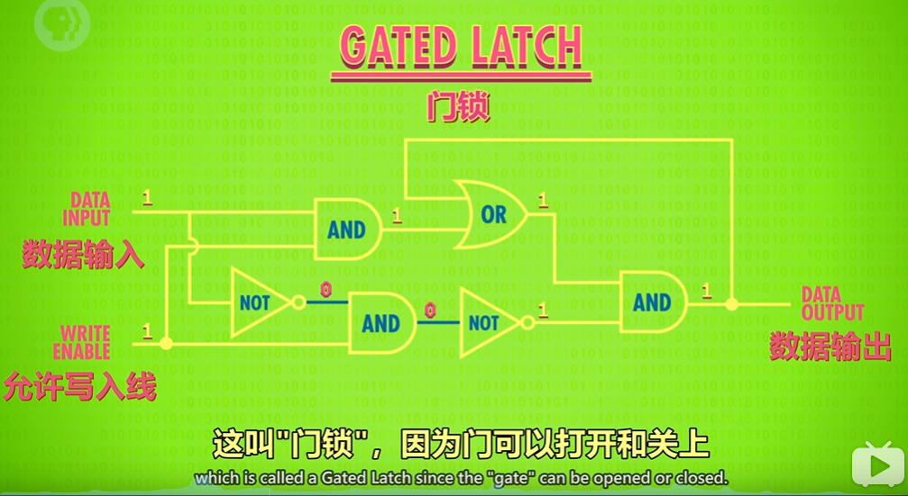

#### ALU

##### 逻辑门

NOT

OR

AND

XOR

==用与或非门组成异或门==

对于p, q。 XOR表示为：~(p & q) & (p | q)

##### *半加器

二进制位加法只有4种情况

0 + 0 = 0

0 + 1 = 1

1 + 0 = 1

1 + 1 = 10

前三种情况对应，XOR logic table，而最后一种情况对应一半的XOR logic table = 0

而我们还需要一个 1 + 1 = 1表示另一半 = 1，所以还需要进位的 AND

所以半加器由 XOR + AND构成

​			AND	XOR

0 + 0 	0		0

0 + 1	0		1

1 + 0	0		1

1 + 1	1		0

输入A, B输出Sum, Carry

##### 全加器

##### 8b行波进位加法器

最后一个全加器有进位，也就是溢出

##### 超前进位加法器

固定门延迟为3级

#### Memory

SRAM锁存器

