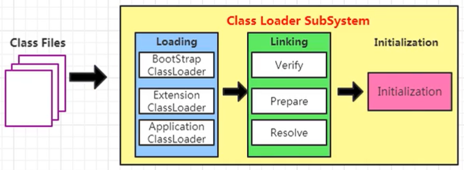
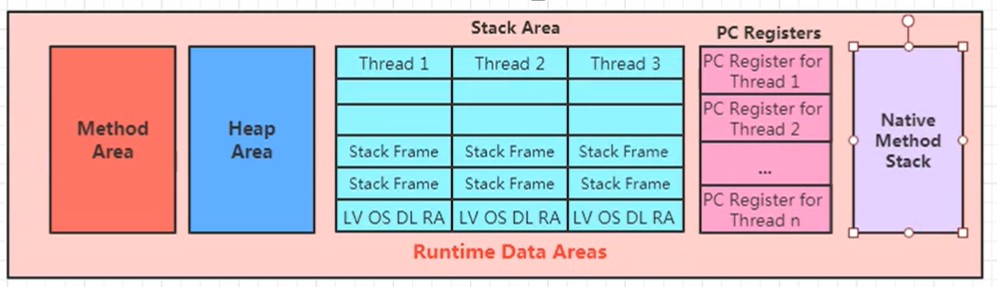
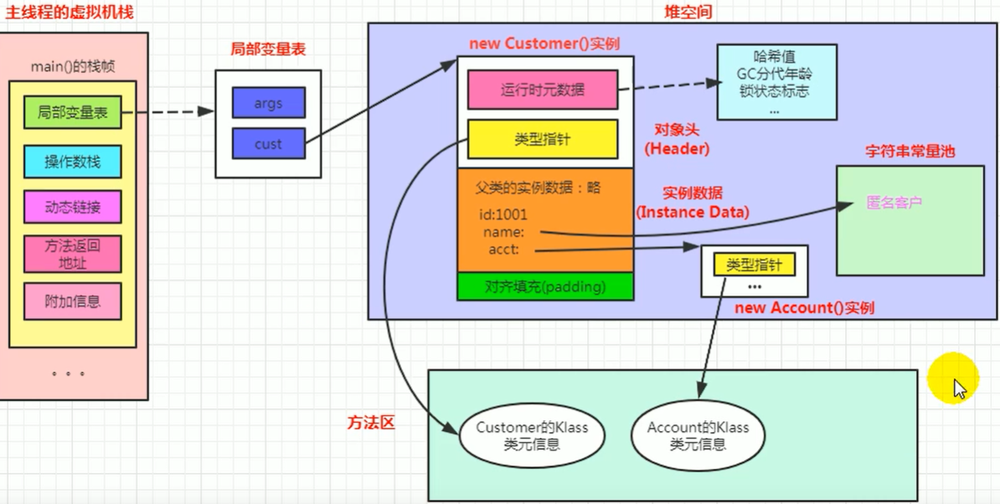
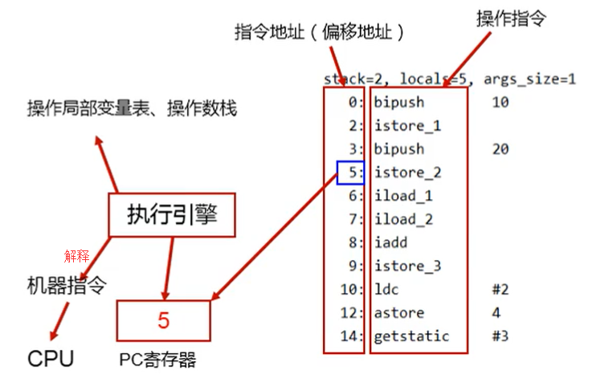
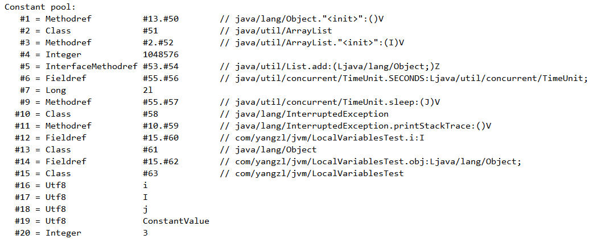

==JVM部分指令集==

``` properties

0x00	nop	什么都不做

0x02	iconst_m1	将 int 型-1 推送至栈顶
0x03	iconst_0	将 int 型 0 推送至栈顶

0x10	bipush	将单字节的常量值（-128~127）推送至栈顶
0x11	sipush	将一个短整型常量值（-32768~32767）推送至栈顶
0x12	ldc		将 int，float 或 String 型常量值从常量池中推送至栈顶
0x13	ldc_w	将 int，float 或 String 型常量值从常量池中推送至栈顶（宽 索引）
0x14	ldc2_w	将 long 或 double 型常量值从常量池中推送至栈顶（宽索引）
0x15	iload	将指定的 int 型局部变量推送至栈顶

0x19	aload	将指定的引用类型局部变量推送至栈顶

0x2a	aload_0	将第一个引用类型局部变量推送至栈顶
0x2b	aload_1	将第二个引用类型局部变量推送至栈顶
0x2c	aload_2	将第三个引用类型局部变量推送至栈顶
0x2d	aload_3	将第四个引用类型局部变量推送至栈顶
0x2e	iaload	将 int 型数组指定索引的值推送至栈顶
0x2f	laload	将 long 型数组指定索引的值推送至栈顶


0xb6	invokevirtual	调用实例方法
0xb7	invokespecial	调用超类构造方法，实例初始化方法，私有方法
0xb8	invokestatic	调用静态方法
0xb9	invokeinterface	调用接口方法
0xba	invokedynamic	调用动态链接方法

0xbb	new	创建一个对象，并将其引用值压入栈顶
0xbc	newarray	创建一个指定原始类型（如int, float, char…）的数组，并将其引用值压入栈顶
0xbd	anewarray	创建一个引用型（如类，接口，数组）的数组，并将其引用值压入栈顶
0xbe	arraylength	获得数组的长度值并压入栈顶

0xbf	athrow	将栈顶的异常抛出
0xc0	checkcast	检验类型转换，检验未通过将抛出ClassCastException
0xc1	instanceof	检验对象是否是指定的类的实例，如果是将1压入栈顶，否则将0压入栈顶

0xc2	monitorenter	获得对象的锁，用于同步方法或同步块
0xc3	monitorexit	释放对象的锁，用于同步方法或同步块
```

==JVM常用工具 & 命令==

``` shell
# jps


# jinfo


# jmap


# jstat


# jstack


# jconsole【gui】


# jvisualvm【gui】


# javap


# javac（前端编译器）


# jar


```


JVM从上到下3块结构：

> 字节码文件（由不同语言提供，scala，jython等）具有跨平台性
>
> JVM指令集，跨语言的平台。mixed mode（半解释，半编译）
>
> 架构模型：JVM基于栈的指令集架构

+ 类加载子系统
+ 运行时数据区
+ 执行引擎

> 执行引擎是 Java 虚拟机最核心的组成部分之一。「虚拟机」是相对于「物理机」的概念，这两种机器都有代码执行的能力，区别是物理机的执行引擎是直接建立在处理器、硬件、指令集和操作系统层面上的，而虚拟机执行引擎是由自己实现的，因此可以自行制定指令集与执行引擎的结构体系，并且能够执行那些不被硬件直接支持的指令集格式。
>
> 在 Java 虚拟机规范中制定了虚拟机字节码执行引擎的概念模型，这个概念模型成为各种虚拟机执行引擎的统一外观（Facade）。在不同的虚拟机实现里，执行引擎在执行 Java 代码的时候可能会有解释执行（通过解释器执行）和编译执行（通过即时编译器产生本地代码执行）两种方式，也可能两者都有，甚至还可能会包含几个不同级别的编译器执行引擎。但从外观上来看，所有 Java 虚拟机的执行引擎是一致的：输入的是字节码文件，处理过程是字节码解析的等效过程，输出的是执行结果
>
> 

| 基于寄存器的指令集架构（所有物理机） | 基于栈的指令集架构                                           |
| ------------------------------------ | ------------------------------------------------------------ |
| x86指令集                            |                                                              |
| 依赖于硬件                           | 不需要硬件支持                                               |
| 性能更高，指令更少                   | 性能低，指令多                                               |
| 一地址指令，二地址指令，三地址指令   | 多为零地址指令，执行依赖于操作数栈（只操作栈顶）             |
| 2 + 3 基于寄存器的指令               | 2  + 3基于栈的指令（字面量在编译时被常量折叠）               |
| mov eax, 2;<br />add eax, 3          | iconst_2; istore_1; iconst_3; istore_2; iload_1; iload_2; iadd; istore_3 |

``` java
System.halt(-1);
System.exit(-1);

// 前端编译器编译生成字节码文件
// 生成类初始化方法<clinit>（没有静态变量和静态块不会生成）
// 生成实例初始化方法<init>
// <init>，为实例变量分配内存空间，初始化零值，根据源码顺序执行赋初值或代码块
```


### 1 类加载子系统



> ==Prepare： 为静态变量分配内存，并初始化0值；对final的静态字面量显式赋值，如果不是字面值静态常量，那么会赋初始化0值（与静态变量一样）==
>
> Resolve：将一部分符号引用转换为直接引用（入口地址），前提条件是在编译时能确定的方法，这些方法的调用称为解析，Java中符合==编译可知，运行期不变==的主要包括：静态方法和私有方法
>
> Initialization：执行\<clinit\>()
>
> Extension ClassLoader：主要识别jre/lib/ext目录
>
> 对Java核心源码进行保护，称为沙箱安全机制

Java提供5种方法调用字节码指令

+ invokestatic：静态方法调用；
+ invokespecila：构造器，私有方法，父类方法调用；
+ invokevirtual：虚方法调用；
+ invokeinterface：接口方法调用，在运行时再确定一个实现该接口的对象
+ invokedynamic：在运行时动态解析出调用点全限定符所引用的方法，然后执行该方法（lambda）

==只要能被invokestatic和invokespecial指令调用的方法，都可以在解析阶段确定唯一的调用版本，符合这个条件的有静态方法、私有方法、实例构造器（隐式static）、父类方法 4 类，它们在加载的时候就会把符号引用解析为直接引用；除此之外final（隐式private）也被规定为非虚方法，但它是被invokevirtual指令调用的==，其他方法被称为虚方法


### 2 运行时数据区





Ali架构


​                     Thread1【VMS，NMS，PC】

堆  <---->      Thread2【VMS，NMS，PC】   < --->  方法区

​            		 Thread3【VMS，NMS，PC】


#### JVM后台线程

+ 虚拟机线程：执行偏向锁撤销，线程挂起，需要JVM到达安全点（堆区不会变化）

+ 周期任务线程
+ 编译线程：将字节码编译为机器码
+ 信号调度线程
+ GC线程


#### 2.1 虚拟机栈

+ ==Local Variable==：基本单位是Slot。long和double占2个slot，其它类型占1个slot

+ ==Oprend Stack==（操作数栈）

> 数组 / 链表（物理结构）
>
> 根据字节码指令，往操作数栈中压入 / 弹出数据
>
> int i = 2; int j = 3; int k = i + j;
>
> 指令： iconst_2(pop) -> istore_1 -> iconst_3 -> istore_2 -> iload_1(pop) -> iload_2 -> iadd -> istore_3


**栈顶缓存技术**（TOS，top of stack caching）

将栈顶元素全部缓存到CPU的寄存器中（间接使用寄存器），减少内存的访问次数

``` java
static void foo(Object o) {
    Object tmp = o;
}
// 对应指令为：
aload_1;
astore_2;
// 类似于这样的Java代码
stack.push(localVariables[0]);
localVariables[1] = stack.pop();
// 栈在内存中
一次访问localVariables[0]，一次写入operand stack
一次弹出operand stack，一次写入localVariables[1]
// 仅仅是访问栈顶元素， 需付出2次内存读，2次内存写
    
// 使用TOS，类似于如下代码
tosElement = locals[0];
locals[1] = tosElemnt;
// 对应一次内存读，一次内存写，一次寄存器读，一次寄存器写
```


+ ==Dynamic Linking==

**栈与方法区之间的联系**


**方法调用**

> 绑定：字段 / 方法 / 类在符号引用被替换为直接引用（方法区地址）的过程，只发生一次
>
> 静态绑定（前绑定）：
>
> ​	编译期确定，例如final，private（隐式final），静态方法，构造器（隐式static），父类方法
>
> 动态绑定（后绑定）：方法重写 -> 虚方法（virtual）
>
> ​	==在方法区建立虚方法表（在链接的解析阶段创建，符号引用转换为直接引用），表中存放各虚方法的实际入口地址==


+ ==Return Address==（正常返回，异常返回）

> 存放该方法PC寄存器的值
>
> 异常返回地址，由异常表确定返回地址


#### 2.2 堆

``` properties
# 参数
-Xms
-Xmx
-Xmn
-XX:NewRatio=2
-XX:SurvivorRatio=6

-XX:+PrintFlagsInitial
-XX:+PrintFlagsFinal

```

**新生代 + 老年代 + 方法区（逻辑上属于堆，物理上不是）**

永久代移除，改为元空间（String Table 和 静态域 有变化）


#### 对象




> 对象创建字节码指令：
>
> new（虚拟机层面）
>
> dup
>
> invokespecial
>
> astore_1

==对象创建==：

+ JVM层面：
    + 在堆区分配本类和父类所有实例变量内存（指针碰撞，空闲列表）【CAS，TLAB】
    + 初始化0值
    + 设置对象头。
+ Java层面（执行\<init\>()）
    + 执行父类\<init\>执行本类\<init\>（合并显示赋值，构造块，构造方法）
+ 将堆区对象地址赋值給引用（例如：Sub s = new Sub();）


**按回收区域，一种是部分收集（Partial GC），一种是整堆收集（Full GC）**

+ 部分收集

    YGC / Minor GC

    ​	Eden区域满，触发YGC

​		Major GC

​			收集老年代，比Minor GC慢10倍以上，STW时间也更长

​		Mixed GC

+ Full GC（收集整个堆和方法区），**Full GC频繁，将Metaspace设置一个较大值**

> 在Minor GC之前，虚拟机 **检查老年代剩余最大连续空间是否大于新生代所有对象总空间**
>
> ​	如果大于，那么此次Minor GC安全
>
> ​	如果小于，那么查看 **历次晋升的平均大小**
>
> ​		老年代剩余最大连续空间如果大于：尝试Minor GC，但有可能失败
>
> ​		如果小于：进行Full GC


**内存回收策略（对象提升（Promotion）规则）**

> 优先分配到Eden
>
> 大对象直接分配到老年代
>
> 长期存活对象分配到老年代（默认15）
>
> 动态对象年龄判断
>
> ​	survivor中相同年龄所有对象大小总和大于surivor一半，那年龄大于 | 等于该年龄的对象进入老年代
>
> 分配担保机制
>
> ​	-XX:HandlePromotionFailure


**TLAB**

> 每个线程在Eden区域有TLAB私有区域，快速分配，占Eden1%


#### 逃逸分析

> + 栈上分配
> + 锁消除
> + 标量替换


#### 逃逸

> + 返回值
> + 为成员变量赋值
> + 引用成员变量的值


#### 2.3 PC

字节码指令地址指示器；分支，循环，跳转，异常处理，线程恢复都依赖PC




#### 2.4 方法区




> 规范：
>
> ​	类型信息（类，接口，枚举，注解）的域信息，方法信息；
>
> ​	**运行时常量池：字节码文件常量池被类加载器（加载，链接，初始化）合并到运行时数据区中**
>
> ​	静态变量；
>
> ​	即时编译后的代码缓存
>
> **1.7之后字符串常量和静态变量移到堆中存放（JSHDB工具）：在堆中便于GC（方法区中GC频率低）**
>
> 常量池回收：只要常量没有被任何地方引用，就可以被回收


### 3 执行引擎


解释执行字节码指令

JIT 编译字节码指令为本地机器指令（X86，ARM架构），并缓存在方法区


#### 3.1 Interpreter（解释器）


#### 3.2 JIT Complier（即时编译器（后端编译器））

C1编译器-->client模式：简单可靠优化耗时短

**C2编译器 -->server模式：耗时较长优化，（栈上分配，标量替换，同步消除）**

即时编译比解释执行速度快一个数量级

​	JDK10编译器Graal


**AOT**（Ahead of time compiler）

jaotc工具


#### 3.3 Garbage Collection（垃圾收集器）


### 4 String Table

是一个固定大小的Hashtable，1.7默认长度为60013


``` java
String s = new String("a") + new String("b");	// 常量池中无ab

// JDK6及以前会在常量池创建"ab"并返回引用，7之后只是在常量池中引用堆中"ab"的引用
String intern = s.intern();

// JDK6是false，7以后是true
intern == "ab"

```


==intern()在JDK6会在常量池新建"ab"串并返回引用，在7以后常量池中只是一个引用，指向堆的new String("ab")==


### 5 垃圾回收

