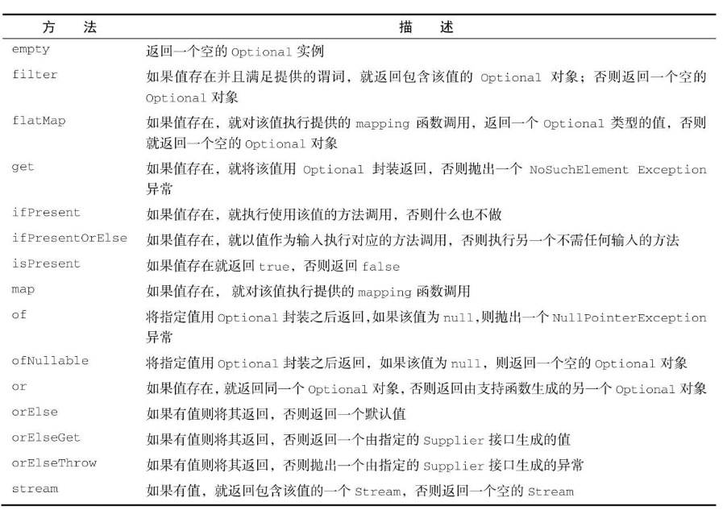

## 第一部分

第一部分旨在帮助你初步使用Java 8。学完这一部分，你将对Lambda表达式有充分的了解，并可以编写简洁而灵活的代码，能够轻松适应不断变化的需求。

+ 第1章总结Java的主要变化（Lambda表达式、方法引用、流和默认方法），为学习后面的内容做准备。
+ 第2章介绍行为参数化，这是Java 8非常依赖的一种软件开发模式，也是引入Lambda表达式的主要原因。
+ 第3章对Lambda表达式和方法引用进行全面的介绍，每一步都提供了代码示例和测验。


### 2 行为参数化

通过行为参数化传递一个代码块，被调用时才延迟执行。


#### 筛选苹果

``` java
enum Color { GREEN, RED; }

/**
 * 1 按颜色筛选苹果
 */
static List<Apple> filterAppleByColor(List<Apple> apples, Color c) {
    List<Apple> result = ...;
    for (Apple apple : apples)  {
        if (Green.equals(c))
            result.add(apple);
    }
    return result;
}

/**
 * 2 可能改变需求，按重量筛选
 */
static List<Apple> filterApplesByWeight(List<Apple> apples, int weight) {
    // 代码同上
    ...;
    if (apple.getWeight() > 150)
        ...;
}

/**
 * 3 对所有可能需要的属性作为参数
 * 但对于调用就很笨拙
 */
static List<Apple> filterApples(List<Apple> apples, Color c, int weight) {
    // 代码同上
    ...;
}
List<Apple> heavyApps = filterApples(apple, null, 150);

/**
 * 4 考虑行为参数化，我们需要更高层次的抽象，一种可能的解决是对标准建模
 * 根据Apple的某些属性，返回一个boolean值。我们称之为 “谓词”
 * 此时我们对于接口采用不同实现类，谓之“策略模式”，代码如下
 * greenApple策略：GreenApplePredicate
 * 其它策略以此类推
 */
interface ApplePredicate {
    boolean test(Apple apple);
}
class GreenApplePredicate implements ApplePredicate {
    @Override
    public boolean test(Apple apple) {
        return Green.equals(apple.getColor())
    }
}
class HeavyApplePredicate implements ApplePredicate {
    @Override
    public boolean test(Apple apple) {
        return apple.getWeight() > 150;
    }
}

/**
 * 5 我们再提供一次抽象，封装为一个函数（类方法）
 */
static List<Apple> filterApples(List<Apple> apples, ApplePredicate p) {
    List<Apple> rs = ...;
    for (Apple apple : apples) {
        // 谓词封装了测试条件
        if (p.test(apple)) {
            rs.add(apple);
        }
    }
    return rs;
}

/**
 * 6 我们可以考虑传递代码（匿名内部类）
 * 调用5提供的函数，以匿名内部类的方式提供策略
 * tips：对于匿名内部类的this，指自己
 */
List<Apple> heavyApples = filterApples(apples, new HeavyApplePredicate() {
    @Override
    public boolean test(Apple apple) {
        return apple.getWeight() > 150;
    }
});


/**
 * 7 对于Java8，我们可以使用λ表达式
 */
List<Apple> heavyApples = filterApples(apples, apple -> apple.getWeight() > 150);

/**
 * 8 最后，我们将类型抽象化
 * 这样我们可以把filter()用在橘子，香蕉 | 其它水果上
 */
static <T> List<T> filter(List<T> list, Prediate<T> p) {
    List<T> result = ...;
    for (T t : list) {
        if (p.test(t)) {
            result.add(t);
        }
    }
    return result;
}
```


#### 标准库中真实例子

```java
// Comparator
apples.sort((x, y) -> Integer.compare(x.getWeight(), y.getWeight()));

// Runnable
new Thread(() -> sout(Thread.currentThread().getName()));

/**
 * Callable<V>
 * tips: submit()有返回值， execute()无返回值
 */
ExecutorService service = Excutors.newCachedThreadPool();
Future<String> tName = service.submit(() -> Thread.currentThread().getName());
```


### 3 Lambda


#### 方法引用


#### lambda复合

##### 谓词复合

``` java
Predicate<String> p1 = String::isEmpty();
Predicate<String> p2 = s -> s.startWith("z");
Predicate<String> p3 = s -> s.length() < 10;

Predicate<String> finalPredicate = p1.and(p2).or(p3).negate(p3);
```


##### 比较器复合

``` java
Comparator<Apple> cmp = Comparator.comparing(Apple::getWeight);
Comparator<Apple> cmp2 = Comparator.comparing(Apple::getColor);

Comparator<Integer> finalCmp = cmp.reversed().tenComparaing(cmp2)

```


##### 函数复合

``` java
IntFunction fx = x -> x + 1;
IntFunction gx = x -> x << 1;

IntFunction gfx = fx.addThen(gx);
IntFunction fgx = fx.compose(gx);

// 对于x = 1，gfx = 4，fgx = 3;
```


#### 小结

❏ Lambda表达式可以理解为一种匿名函数：它没有名称，但有参数列表、函数主体、返回类型，可能还有一个可以抛出的异常的列表。

❏ Lambda表达式让你可以简洁地传递代码。

❏ 函数式接口就是仅仅声明了一个抽象方法的接口。

❏ 只有在接受函数式接口的地方才可以使用Lambda表达式。

❏ Lambda表达式允许你直接内联，为函数式接口的抽象方法提供实现，并且将整个表达式作为函数式接口的一个实例。

❏ Java 8自带一些常用的函数式接口，放在java.util.function包里，包括Predicate <T>、Function<T,R>、Supplier<T>、Consumer<T>和BinaryOperator<T>，如表3-2所述。

❏ 为了避免装箱操作，对Predicate<T>和Function<T, R>等通用函数式接口的基本类型特化：IntPredicate、IntToLongFunction等。

❏ 环绕执行模式（即在方法所必需的代码中间，你需要执行点儿什么操作，比如资源分配和清理）可以配合Lambda提高灵活性和可重用性。

❏ Lambda表达式所需要代表的类型称为目标类型。

❏ 方法引用让你重复使用现有的方法实现并直接传递它们。

❏ Comparator、Predicate和Function等函数式接口都有几个可以用来结合Lambda表达式的默认方法。


## 第二部分：流

使用流进行函数式数据处理


Stream API。通过Stream API，你将能够写出功能强大的代码，以声明性方式处理数据。学完这一部分，你将充分理解流是什么，以及如何在Java应用程序中使用它们来简洁而高效地处理数据集。

+ 第4章介绍流的概念，并解释它们与集合有何异同。
+ 第5章详细讨论为了表达复杂的数据处理查询可以使用的流操作。其间会谈到很多模式，如筛选、切片、查找、匹配、映射和归约。
+ 第6章介绍收集器——Stream API的一个功能，可以让你表达更为复杂的数据处理查询。
+ 第7章探讨流如何得以自动并行执行，并利用多核架构的优势。此外，你还会学到为正确而高效地使用并行流，要避免的若干陷阱。


### 4 Stream API

+ 什么是流
+ 集合与流
+ 内部迭代
+ 中间操作与终端操作

流是Java API新成员，它允许以声明式编程的方式来处理数据

==“流：从支持数据处理操作的源生成的元素序列”==


### 5 使用流

+ 筛选、切片、映射
+ 查找，匹配，规约
+ 数值流
+ 多个源创建流
+ 无限流


#### 5.1 谓词筛选

+ filter
+ takeWhile（Java 9）
+ dropWhile（9）

``` java
boolean test(T t);

List<Integer> odd = Stream.rangeClosed(0,100)
    .filter(i -> i & 1 == 0)
    .forEach(System.out.println);
```


#### 5.2 其它

+ limit
+ skip
+ map
+ flatMap（扁平化）

``` java
// 对于["hello", "world"]想返回['h', 'e', 'l', ...]

Arrays.stream(words).map(word -> word.split(""))
    // 生成流并把流合并起来，即扁平化为一个流
    .flatMap(Arrays::stream)
    .collect(Collectors.toList());
```

+ anyMatch（至少一个匹配）
+ noneMatch（无匹配）
+ allMatch（全部匹配）
+ findFirst
+ findAny（不关心返回哪个元素，并行时限制较少）


#### 5.5 规约

==将流规约为一个值，可利用并行化的优势（Fork/Join Pool）==

+ 最大最小值

``` java
Optional<Integer> maxOptional = numbers.stream().reduce(Integer::max);
// 针对数值类型，API有max(), min()的实现
numbers.stream().max(Integer::compare);
numbers.steram().min(Integer::compare);
numbers.stream().count();
```


**map | filter等操作从输入流中获取每个元素，输出0 | 1个结果，我们称无状态的；sort | distinct等操作接收一个流生成一个流（关键区别，排序和删除重复项都需要知道先前的历史==例如：排序要求所有元素都放入缓冲区后才能开始输出，当流很大时可能存在问题，我们称这些为有状态操作==）**

reduce，sum，max等操作需要内部状态累积，但是内部状态很小，仅仅是一个int / double，不管多少元素需要处理，内部状态是**有界的**


+ distinct（有状态，无界）

+ skip（有状态，无界）
+ limit（有状态，无界）
+ sorted（有状态，无界）
+ reduce（有状态，有界）


#### *5.7 原始类型流

==IntStream，DoubleStream，LongStream。分别将流中元素特化为int，long，double，避免装箱拆箱成本==

数值流还支持其它方便的方法

+ max
+ min
+ average

当转换回对象流时使用boxed()，mapToObj


#### 5.8 其它生成流

+ 数组（Arrays.stream(), Stream.of()）
+ 文件（Files.lines(path, charset)）

+ 函数（无限流）
    + 迭代（Stream.iterate(0, UnaryOperator）
    + generate（Stream.generate(Supplier)）


#### 总结

Stream API可以表达复杂的数据处理查询。常用的流操作总结在表5-1中。

❏ 你可以使用filter、distinct、takeWhile (Java 9)、dropWhile (Java9)、skip和limit对流做筛选和切片。

❏ 如果你明确地知道数据源是排序的，那么用takeWhile和dropWhile方法通常比filter高效得多。

❏ 你可以使用map和flatMap提取或转换流中的元素。

❏ 你可以使用findFirst和findAny方法查找流中的元素。你可以用allMatch、noneMatch和anyMatch方法让流匹配给定的谓词。

❏ 这些方法都利用了短路：找到结果就立即停止计算；没有必要处理整个流。

❏ 你可以利用reduce方法将流中所有的元素迭代合并成一个结果，例如求和或查找最大元素。

❏ filter和map等操作是无状态的，它们并不存储任何状态。reduce等操作要存储状态才能计算出一个值。sorted和distinct等操作也要存储状态，因为它们需要把流中的所有元素缓存起来才能返回一个新的流。这种操作称为有状态操作。

❏ 流有三种基本的原始类型特化：IntStream、DoubleStream和LongStream。它们的操作也有相应的特化。

❏ 流不仅可以从集合创建，也可从值、数组、文件以及iterate与generate等特定方法创建。

❏ 无限流所包含的元素数量是无限的（想象一下所有可能的字符串构成的流）。这种情况是有可能的，因为流中的元素大多数都是即时产生的。使用limit方法，你可以由一个无限流创建一个有限流。


### 6 *收集

+ Collectors创建和使用收集器
+ 将数据流规约为一个值
+ 汇总
+ 分组和分区
+ 自定义收集器


#### 6.2 汇总、统计

``` java
import static java.util.stream.Collectors.*

list.stream().collect(Collectors.counting());
list.stream().count();

list.stream.collect(maxBy(Comparator.natureOrder()));
minBy(comparator);

// 卡路里汇总
int totalCalories = list.stream().collect(summingInt(Dish::getCalories));
summingLong();
summingDouble();
double avgCalories = averagingInt / Double / Long;

// 统计
IntSummaryStatistics statistics = list.stream()
    .collect(summarizingInt(Dish::getCalories));
summarizingDouble();
summarizingLong();
statistics.getTotal();
.getAverage();
.getMax();
.getMin();
.getCount();

```


字符串连接

``` java
list.stream().map(Dish::getName).collect(joining());
joining(", ");
// 连接字符，首尾字符
joining(", ", "[", "]");
```


#### 6.3 广义的规约汇总

==我们已讨论的所有收集器（collect()），都是reducing工厂方法定义的一个特殊的规约过程==

即：reducing的工厂方法可实现已讨论的任意类型的规约操作


广义Collectors.reducing需要三个参数：

+ 起始值
+ Functional（映射函数）
+ BinaryOperator（combiner，累积器）


**你可能会思考，reduce和collect有什么不同**

``` java
int totalCalories = list.stream()
    .collect(reducing(0, Dish::getCalories, Integer::sum));
int totalCalories = list.stream().map(Dish::getCalories)
    .reduce(0, Integer::sum)
```

通常意义上来讲，reduce旨在将一个数据流规约为一个值，而collect（内部实现为reduce）就是要改变容器，从而累积需要输出的结果。

reduce不适合并行，collect可以

并且，从理解上来说，collect更容易理解。

**根据情况，选择最佳方案**


#### 6.4 分组

``` java
// 如果先使用flter，那么某些分类下无数据
list.stream().collect(groupingBy(Dish::getType, 
                     filtering(dish -> dish.getCalories() > 500, toList())));
list.stream().collect(groupingBy(Dish::getType,
                                 mapping(Dish::getName, toList())));
flatMappling();

// map = {MEAT=3, FISH=2, OTHER=4}
Map<Dish.Type, Long> map = list.stream()
    .collect(groupingBy(Dish::getType, counting()));

// groupingBy(f)是groupingBy(f, toList())的简便写法
```


多级分组，分区


#### 6.5 *收集器接口

Collector接口中实现的许多收集器，例如toList或groupingBy。这也意味着，你可以为Collector接口提供自己的实现，从而自由地创建自定义归约操作

``` java
public Interface Collector<T, A, R> {
    Supplier<A> supplier();
    Biconsumer<A, T> accumulator();
    Function<A, R> finisher();
    BinaryOperator<A> combiner();
    Set<Characteristics> characteristics();
}
/**
 * 既然是接口，那我就可以new
 * T是要收集项目的泛型
 * A是累加器的类型
 * R是收集操作得到的对象的类型
 * finisher()，在累计过程完成之后，将整个累加器对象转换为最后的集合对象
 * supplier()，构造一个集合
 * accumulator()，累加器（list.add(item)）
 * combiner()， 并行流使用，合并两个容器（会用到Fork/Join框架和Spliterator抽象）
 * characteristics()，流是否可以并行规约、可以使用哪些优化
 *	UNORDERED：规约结果不受流中项目遍历和累计顺序的影响
 *	CONCURRENT：accumulator函数可从多个线程同时调用，且该收集器可并行规约。
 *	IDENTITY_FINISH：finisher()返回的是恒等函数，可跳过（累加对象就是规约最终结果）
 */
// 匿名实现
new CollectorImpl<> {
    
}
// 具名实现
Class ToListCollector<T> implements Collector<T, List<T>, List<T>> {
    @Override
    public Supplier<List<T>> supplier() {
        return ArrayList::new;
    }
    @Override
    public BinaryOperator<List<T>, T>() {
        return List::add;
    }
    @Override
    public BinaryOperator<List<T>>() {
        return (list1, list2) -> {
            list1.addAll(list2);
            return list1;
        };
    }
    @Override
    public Function<List<T>> finisher() {
        return Function.identity();
    }
    @Override
    public Set<Characteristics> characteristics() {
        return Collections
            .unmodifiableSet(EnumSet.of(IDENTITY_FINISH, CONCURRENT));
    }
}
```


**自定义收集而不实现Collector**

Stream.collect(Supplier, Accumulator, Combiner)

``` java
list.stream().collect(ArrayList::new, List::add, List::addAll);
```


**TODO: 创建自己的收集器接口**


#### 总结

❏ collect是一个终端操作，它接受的参数是将流中元素累积到汇总结果的各种方式（称为收集器）。

❏ 预定义收集器包括将流元素归约和汇总到一个值，例如计算最小值、最大值或平均值。这些收集器总结在表6-1中。

❏ 预定义收集器可以用groupingBy对流中元素进行分组，或用partitioningBy进行分区。

❏ 收集器可以高效地复合起来，进行多级分组、分区和归约。

❏ 你可以实现Collector接口中定义的方法来开发自己的收集器。


### 7 并行流

❏ 用并行流并行处理数据

❏ 并行流的性能分析

❏ 分支/合并框架

❏ 使用Spliterator分割流

``` java
// 修改Fork/Join Pool线程池大小
System.setProperty("java.util.concurrent.ForkJoinPool.common.parallelism", "12");
// 默认核数个线程
Runtime.getRuntime().availableProcessors();

// 使用JMH 微测试
```


#### 7.1 正确使用并行流

+ 并行流并不总是比顺序流快
+ 留意装箱拆箱
+ limit，findFirst适合顺序流，findAny适用并行流

+ 还需考虑操作流水线的总计算成本（合并等操作）

+ 数据流的数据结构是否易于分解


| 源              | 可分解性 |
| --------------- | -------- |
| ArrayList       | 极佳     |
| IntStream.range | 极佳     |
| Hashset         | 好       |
| TreeSet         | 好       |
| LinkedList      | 差       |
| Stream.iterate  | 差       |


#### 7.2 Fork/Join

以递归的方式将可并行的任务拆分为更小的任务（RecursiveTask / RecursiveAction）。

``` java
public abstract class RecursiveTask<R> extends ForkJoinTask<R> {
    protected abstract R compute();
}

public abstract class RecursiveAction extends ForkJoinTask<Void> {
    protected abstract Void compute();
}

// 伪代码
if (任务不可分)
    顺序执行;
else {
    将任务分解为两个子任务；
    递归调用本方法，拆分每个任务，等待所有子任务完成；
    合并每个子任务的结果；
}

// 测试实现
class TestCalculator extends RecursiveTask<Long> {
    // fields ...
    // constructors ...
    
    @Override
    protected Long compute() {
        int len = end - start;
        if (len < threshold) {
            long sum = 0;
            for (int i = start; i < end; ++i) {
                sum += i;
            }
            return sum;
        } else {
            int mid = (len - start) / 2 + start;
            TestCalculator leftTask = new TestCalculator(start, mid);
            leftTask.fork();
            TestCalculator rightTask = new TestCalculator(mid, end);
           	long rightRs = rightTask.compute();
            // join会阻塞，所以放到最后调用
            return rightRs + leftTask.join();
        }
    }
}
```


**正确使用Fork/Join Pool**

+ 对一个任务调用join()会阻塞调用方，所以join()请留在最后

+ ==不应该在RecursiveTask内部使用invoke()，应该直接调用compute() | fork()，只有顺序代码才执行invoke()（就是说第一次调用的时候使用）==
+ 需要预热，才被JIT编译器优化
+ 分解为两个任务时，应该一个调用compute()，一个调用fork()（排进Fork/Join Pool池中执行）

+ 使用多个ForkJoinPool是没有什么意义的。一般来说把它实例化一次，然后把实例保存在静态字段中，使之成为单例

+ 工作窃取（任务以双端链式队列保存）


#### 7.3 Spliterator

Spliterator也用于遍历数据源中的元素，但它是为了并行执行而设计的


## 第三部分

使用流和lambda进行高效编程

第三部分探索Java 8和Java 9的多个主题，这些主题中的技巧能让你的Java代码更高效，并能帮助你利用现代的编程习语改进代码库。这一部分的出发点是介绍高级的编程思想，本书后续内容并不依赖于此。

第8章是这一版新增的，探讨Java 8和Java 9对Collection API的增强。内容涵盖如何使用集合工厂，如何使用新的编程模式处理List和Set，以及使用Map的惯用模式。

第9章探讨如何利用Java 8的新功能和一些秘诀来改善现有的代码。此外，该章还探讨了一些重要的软件开发技术，如设计模式、重构、测试和调试。

第10章也是这一版新增的，介绍依据领域特定语言（domain-specific language, DSL）实现API的思想。这不仅是一种强大的API设计方法，而且正变得越来越流行。Java中已经有API采用这种模式实现，譬如Comparator、Stream以及Collector接口。


#### 8.1 集合工厂

+ Java9引入新的集合工厂，创建的都是不可变对象

``` java
// Java9
List<String> friends = List.of("zz", "rr");
/** 
 * 如果你进一步审视List接口，会发现List.of包含了多个重载的版本，包括：
 * 如果使用变长参数，需要负担分配数组，初始化，垃圾回收的开销
 * 使用定长（最多10个）参数的函数没有这部分开销，对于Set.of，Map.of同样
 */
static <E> List<E> of(E e1, E e2, E e3, E e4);
static <E> List<E> of(E e1, E e2, E e3, E e4, E e5);


```


#### 8.2 接口新增API

❏ removeIf移除集合中匹配指定谓词的元素。实现了List和Set的所有类都提供了该方法（事实上，这个方法继承自Collection接口）。

❏ replaceAll用于List接口中，它使用一个函数（UnaryOperator）替换元素。

❏ sort也用于List接口中，对列表自身的元素进行排序。

+ map底层数据结构更新

+ map.forEach（遍历键值对）

+ Map排序
    + Entry.comparingByValue
    + Entry.comparingByKey

+ map.getOrDefault("key", "defaultVal");
+ map.ComputeIfAbsent（如果键缺失，或该键对应值为空）
+ map.ComputeIfPresent
+ map.compute（根据键计算新值）
+ map.replaceAll()
+ map.replace

+ map.merge("key", 1, map.get("key") + 1);


#### 8.4 ConcurrentHashMap

+ forEach
+ reduce
+ search

对以上每种操作都支持4种形式的参数，键，值，键值，Map.Entry

concurrentMap.forEachKey / forEachValue / forEach / forEachEntry


#### 总结

❏ Java 9支持集合工厂，使用List.of、Set.of、Map.of以及Map.ofEntries可以创建小型不可变的List、Set和Map。

❏ 集合工厂返回的对象都是不可变的，这意味着创建之后你不能修改它们的状态。

❏ List接口支持默认方法removeIf、replaceAll和sort。

❏ Set接口支持默认方法removeIf。❏ Map接口为常见模式提供了几种新的默认方法，并降低了出现缺陷的概率。

❏ ConcurrentHashMap支持从Map中继承的新默认方法，并提供了线程安全的实现。


### 10 DSL

SQL，XML，Spring Integration（链式调用）

“？我的理解：所谓DSL就是用语言开发一套领域特定的API，方便理解并调用，内部实现逻辑自己封装”

+ 内部DSL（使用JVM语言构建的DSL）
+ 外部DSL（自身作为新语言的DSL）


#### 10.1 DSL通常的设计

+ 方法链接（dsl.withOne().withTwo().with...，链式调用）
+ 嵌套（dsl.withOne(withTwo(), withThree())，高阶函数）


### 11 Optional

对于Grovvy，有安全导航操作符（safe navigation operator）避免NPE

`def insuranceName = person? .getCar? .getInsurance? .getName;`

``` java
// Optional<Person>
String rs = person
    // 这里不能使用map，getCar返回为Optional<Car>（实例变量以Optional<Car>声明）
    .flatMap(Person::getCar)
    .flatMap(Car::getInsurance)
    .map(Insurance::getName)
    .orElse("unknown");

// 操作由Optional构成的Stream
// Optional看作持有零个或一个元素的stream
```

+ get
+ orElse
+ orElseGet（orElse的延迟版本）
+ orElseThrow
+ ifPresent
+ isPresent
+ or（Java9，不会解包Optional对象）
+ ifPresentOrElse


#### 11.1 Optional方法




#### 总结

❏ null引用在历史上被引入到程序设计语言中，目的是为了表示变量值的缺失。

❏ Java 8中引入了一个新的类java.util.Optional，对存在或缺失的变量值进行建模。

❏ 你可以使用静态工厂方法Optional.empty、Optional.of以及Optional.ofNullable创建Optional对象。

❏ Optional类支持多种方法，比如map、flatMap、filter，它们在概念上与Stream类中对应的方法十分相似。

❏ 使用Optional会迫使你更积极地解引用Optional对象，以应对变量值缺失的问题，最终，你能更有效地防止代码中出现不期而至的空指针异常。

❏ 使用Optional能帮助你设计更好的API，用户只需要阅读方法签名，就能了解该方法是否接受一个Optional类型的值。


### 12 日期API

+ LocalDate
+ LocalTime
+ LocalDateTime
+ Period（一段日期）
+ Duration（一段时间）
+ Instant

==所有的类实现Temporal，Temporal接口定义了如何读取和操纵 为时间建模的对象的值==


#### 12.1 TemporalAdjuster

==将日期调整到下个周日、下个工作日，或者是本月的最后一天==。这时，你可以使用重载版本的with方法，向其传递一个提供了更多定制化选择的TemporalAdjuster对象，更加灵活地处理日期

``` java
@FunctionalInterface
public interface TemporalAdjuster {
    Temporal adjustInto(Temporal temporal);
}

// 使用预定义方法
LocalDate date2 = date1.with(TemporalAdjusters.nextOrSame(DayOfWeek.SUNDAY));
date2.with(lastDayOfMonth());

// lambda实现TemporalAdjuster接口，自定义逻辑

```


#### 12.3 时区

一共40个时区，由IANA（因特尔编号分配机构）的时区数据提供。

`ZoneId zone = TimeZone.getDefault().toZoneId();`

`ZoneId.of('Europe/Rome');`，地区ID都为"{区域/城市}"格式


#### 总结

❏ Java 8之前老版的java.util.Date类以及其他用于建模日期和时间的类有很多不一致及设计上的缺陷，包括易变性以及糟糕的偏移值、默认值和命名。

❏ 新版的日期和时间API中，日期-时间对象是不可变的。

❏ 新的API提供了两种不同的时间表示方式，有效地区分了运行时人和机器的不同需求。

❏ 你可以用绝对或者相对的方式操纵日期和时间，操作的结果总是返回一个新的实例，老的日期-时间对象不会发生变化。

❏ TemporalAdjuster让你能够用更精细的方式操纵日期，不再局限于一次只能改变它的一个值，并且你还可按照需求定义自己的日期转换器。

❏ 你现在可以按照特定的格式需求，定义自己的格式器，打印输出或者解析日期-时间对象。这些格式器可以通过模板创建，也可以自己编程创建，并且它们都是线程安全的。

❏ 你可以用相对于某个地区/位置的方式，或者以与UTC/格林尼治时间的绝对偏差的方式表示时区，并将其应用到日期-时间对象上，对其进行本地化。

❏ 你现在可以使用不同于ISO-8601标准系统的其他日历系统了。


### 13 Java8接口

+ 静态方法
+ 默认方法


实例：

+ removeIf（Collection，假设你是API负责人，你收到关于removeIf的很多请求，希望能为ArrayList，TreeSet，LinkedList及其它类型集合添加removeIf）
+ sort（List）


静态方法及接口

==同时定义接口以及工具辅助类（companion class）是Java语言常用的一种模式，工具类定义了与接口实例协作的很多静态方法。比如，Collections就是处理Collection对象的辅助类。由于静态方法可以存在于接口内部，因此你代码中的这些辅助类就没有了存在的必要，你可以把这些静态方法转移到接口内部。为了保持后向的兼容性，这些类依然会存在于Java应用程序的接口之中。==


抽象类和接口：

+ 一个类只能继承一个抽象类，但可以实现多个接口
+ 抽象类可以通过字段保存一个通用状态，接口不能有实例变量


==从一个拥有100个方法及字段的类进行继承就不是个好主意，因为这其实会引入不必要的复杂性。你完全可以使用代理（组合）有效地规避这种窘境，即创建一个方法通过该类的成员变量直接调用该类的方法==


#### 13.2 兼容类型

+ 源码级别兼容（向接口添加新方法，子类没有实现新方法，无法通过编译，所以不是源码级别兼容）
+ 二进制兼容（现有的二进制执行文件能继续无缝链接（验证，准备，解析）和运行，比如，給接口添加方法是二进制兼容的，只要不调用就不会错误）
+ 函数行为兼容（发生变更后，程序接受同样的输入能得到相同的结果）


#### 13.4 *多继承解决

如果一个类使用相同的函数签名从多个地方（比如另一个类或接口）继承了方法，那么通过三条规则可以进行判断。

(1) 类中的方法优先级最高。类或父类中声明的方法的优先级高于任何声明为默认方法的优先级。

(2) 如果无法依据第一条进行判断，那么子接口的优先级更高：函数签名相同时，优先选择拥有最具体实现的默认方法的接口，即如果B继承了A，那么B就比A更加具体。

(3) 最后，如果还是无法判断，那么继承了多个接口的类必须通过显式覆盖和调用期望的方法，显式地选择使用哪一个默认方法的实现。


#### 总结

❏ Java 8中的接口可以通过默认方法和静态方法提供方法的代码实现。

❏ 默认方法的开头以关键字default修饰，方法体与常规的类方法相同。

❏ 向发布的接口添加抽象方法不是源码兼容的。

❏ 默认方法的出现能帮助库的设计者以后向兼容的方式演进API。❏ 默认方法可以用于创建可选方法和行为的多继承。

❏ 我们有办法解决由于一个类从多个接口中继承了拥有相同函数签名的方法而导致的冲突。

❏ 类或者父类中声明的方法的优先级高于任何默认方法。如果前一条无法解决冲突，那就选择同函数签名的方法中实现得最具体的那个接口的方法

❏ 两个默认方法都同样具体时，你需要在类中覆盖该方法，显式地选择使用哪个接口中提供的默认方法。


## 第五部分

构建并发

第15章是这一版新增的，从宏观的角度介绍异步API的思想，包括Future、反应式编程背后的“发布-订阅”协议（封装在Java 9的Flow API中）。

第16章探讨CompletableFuture，它可以让你用声明性方式表达复杂的异步计算，从而让StreamAPI的设计并行化。

第17章也是这一版新增的，详细介绍Java 9的Flow API，并提供反应式编程的实战代码解析


### 15 CompleteableFuture

**Future的改进版本，可组合的CompleteableFuture**

Executor仅仅为==Runnable提供execute()==，ExecutorService接口继承了Executor，可以使用==submit()执行一个Callable==（ExecutorService将线程提交与任务执行解耦）


#### 15.1 执行器与线程池

==Java5提供执行器框架，其思想类似于一个高层的线程池，可解耦任务的提交与执行==


2016年英特尔公司生产的酷睿i7-6900K服务器处理器有八个核，每个核上有两个对称多处理（SMP）的硬件线程（==因此CPU即使短暂延迟，譬如缓存未命中，CPU也能继续执行指令==），这样算下来就有16个硬件线程。


**线程池的缺点**

 使用k个线程的线程池只能并发地执行k个任务。提交的任务如果超过这个限制，线程池不会创建新线程去执行该任务，这些超限的任务会被加入等待队列，直到现有任务执行完毕才会重新调度空闲线程去执行新任务。

通常情况下，这种工作模式运行得很好，它让你可以一次提交多个任务，而不必随机地创建大量的线程。然而，采用这种方式时你需要特别留意任务是否存在会进入睡眠、等待I/O结束或者等待网络连接的情况。一旦发生阻塞式I/O，这些任务占用了线程，却会由于等待无法执行有价值的工作。假设你的CPU有4个硬件线程，创建的线程池大小为5，你一次性提交了20个执行任务（如图15-3所示）。你希望这些任务会并发地执行，直到所有20个任务执行完毕。假设首批提交的线程中有3个线程进入了睡眠状态或者在等待I/O，那就只剩2个线程可以服务剩下的15个任务了。如此一来，你只能取得你之前预期吞吐量的一半（==如果你创建的线程池中工作线程数为8，那么还是能取得同样预期吞吐量的）。==

以上说明：当线程池有IO / 阻塞时，工作线程数量应该加大，如果是计算密集型那么同核数即可


``` java
// A
work1();
TimeUnit.sleep(TimeUnit.SECONDS, 10);
work2();

// B
ScheduledExecurtorService scheduleService = Executors.newScheduledExecutorService();
work1();
scheduleService.schedule(work2(), 10, TimeUnit.SECONDS);

public static void work1() {
    sout("work1");
}
public static void work2() {
    sout("work2");
}

/**
 * 假设AB都在线程池执行
 * 	那A是如何执行：首先被加入线程池执行队列，然后执行，过程中被sleep阻塞占用工作线程10s
 * 	期间没有执行任何任务，接着执行work2，执行结束之后释放工作线程
 *
 *	B：先执行work1，然后该工作线程被终止了，不过终止之前向线程池调度了一个延迟执行队列
 * B看起来更好，没有睡眠占用CPU时间，B调度任务只消耗了几字节内存
 */
```

如果早期提交的任务或者正在执行的任务需要等待后续任务，而这也正是Future典型的使用模式，那么可能会导致线程池死锁。


尽量避免向线程池提交可能阻塞（譬如睡眠，或者要等待某个事件）的任务


#### 15.2 *同步异步API

``` java
int f(int x);
int g(int x);

// 调用
int y = f(x);
int z = g(x);
sout(y + z);

/**
 * 可行的办法1：显式操纵线程
 */
class Client {
    main(String[] args) {
        Result rs = new Result();
        final int x = 1337;
        Thread t1 = new Thread(() -> result.left = f(x)).start();
        Thread t2 = new Thread(() -> result.right = g(x)).start();
        t1.join();
        t2.join();
        sout(result.left + result.right)
    }
    // 此处是必须要一个类的，lambda内部只能使用final类型的外部对象变量。
    private static class Result {
        int left, right;
        ...;
    }
}

/**
 * 可行的办法2：使用Future API
 * 然而该代码依然收到显式调用submit的模板代码污染
 */
main(String[] args) {
    ExecutorService executor = Executors.newFixedThreadPool(2);
    Future<Integer> y = executor.submit(() -> f(x));
    // 这个调用可使用同步（此处为了API风格统一）
    Future<Integer> z = executor.submit(() -> g(x));
    sout(y.get() + z.get());
    executor.shutdown();
}

/**
 * 可行的方法3：Future风格的API
 * 注意Future风格应该是封装Future API，实现无模板式调用
 * 其思想是：调用f(x)，可直接返回一个Future对象
 */
Future<Integer> y = f(x);
Future<Integer> z = g(x);
sout(y.get() + z.get());

/**
 * 可行的方法4：反应式风格的API
 * 其核心思想是：修改f，g的函数签名来使用回调风格的编程
 * 改代码，打印结果可能不统一，有可能是相加之后的值，有可能是最快拿到的值
 */
void f(int x, IntConsumer dealResult);
// 对于异常处理，需要提供相应的回调执行
void f(int x, IntConsumer dealResult, Consumer<Throwable> dealException);
// 若存在多个回调，将它们等价的封装为对象的方法，而不是一次传递多个回调。例：
interface Subscriber<T> {
    void onComplete();
    void onError(Throwable throwable);
    void onNext(T item);
}

main(String[] args) {
    int x = 1337;
    Result rs = new Result();
    f(x, (int y) -> {
        result.left = y;
        sout(result.left + result.right);
    });
    g(x, (int z) -> {
       result.right = z;
        sout(result.left + result.right);
    });
}
```

通常而言，Java编译器不会对这段代码执行任何的优化，因为f和g可能存在一些交互，而编译器对此知之甚少。

然而，如果你非常明确地知道f与g不存在任何的交互，或者你对此毫不关心，那么你可以在各自独立的CPU核上分别执行f和g，从而缩短程序的执行时间


==反应式编程允许方法f和g多次调用它们的回调函数dealWithResult。而原始版本的f和g使用return返回结果，return只能被调用一次。Future与此类似，它也只能完成一次==，执行Future的计算结果可以通过get()方法获取。某种程度上，**反应式风格的异步API天然更适合于处理一系列的值（稍后会将它与流对比），而Future式的API更适合作为一次性处理的概念框架。**


####  异常处理

无论是基于Future的异步API还是反应式异步API，==被调方法的概念体（conceptual body）都在另一个线程中执行，调用方很可能已经退出了执行==，不在调用异常处理器的作用域内。

CompeletableFuture类的get()可返回异常信息，exceptionally()可进行异常恢复

提供异常处理的回调：

`void f(int x, IntConsumer dealResult, Consumer<Throwable> dealException);`

如果有多个回调函数，你可以将它们等价地封装成单一对象中的方法来传递一个对象而不是传递多个回调函数。譬如，Java9的Flow API就将多个回调函数封装成了一个对象（即Subscriber<T>类，它包含了四个回调函数形式的方法）。下面是其中的三个函数：

interface Subscriber\<T> {
    void onComplete();
    void onError(Throwable throwable);
    void onNext(T item);
}

那么调用变为：

`void f(int x, Subscriber<Integer> s);`

`s.onError(t); `

==我们通常将这些调用称为“消息 或 事件”==


#### 15.4 "线框-管道"模型

==理解和设计并发系统最好的方式是使用图形，我们称之为线框-管道模型==

​								q1	

x	—>	p	<sup>↗</sup><sub>↘</sub>				<sub>↗</sub><sup>↘</sup>	t	—>

​								q2	

``` java
/**
 * 1 这段代码很清晰，Java会顺序执行q1，q2的调用，而你想并发处理
 * 2 另一种方法是使用Future并行执行f,g
 * 3 组合器CompletableFuture
 */
int t = p(x);
r(q1(t), q2(t));

// 2
Future<Integer> left = executor.submit(() -> q1(t));
Future<Integer> right = executor.submit(() -> q2(t));
r(left.get(), right.get());
```


### 16 *CompletableFuture

**组合式异步编程**

更具描述能力的特性的原因，比如下面这些。

❏ 将两个异步计算合并为一个——这两个异步计算之间相互独立，同时第二个又依赖于第一个的结果

❏ 等待Future集合中的所有任务都完成。

❏ 仅等待Future集合中最快结束的任务完成（有可能因为它们试图通过不同的方式计算同一个值），并返回它的结果。

❏ 通过编程方式完成一个Future任务的执行（即以手工设定异步操作结果的方式）。

❏ 应对Future的完成事件（即当Future的完成事件发生时会收到通知，并能使用Future计算的结果进行下一步的操作，不只是简单地阻塞等待操作的结果）


==❏ 通过Stream你可以用流水线串接一系列的操作，使用map、filter或者其他类似的方法进行“行为参数化”，它可有效避免采用迭代器时总是出现模板代码。==

==❏ 同样的，CompletableFuture提供了thenCompose、thenCombine和allOf这样的操作，其能以函数式程序设计的方式对Future的通用模式进行细粒度的控制，帮助你避免采用命令式编程时常见的模板代码。==


#### 16.1 同步、异步API

> ==阻塞和非阻塞通常用于描述操作系统的某种I/O实现。然而，这些术语也常常等价地用在非I/O的上下文中，即“异步调用”和“同步调用”。==

CompletableFuture类自身提供了大量精巧的工厂方法，使用这些方法能更容易地完成整个流程，还不用担心实现的细节

+ CompletableFuture API

``` java
// 生产者方法会交由ForkJoinPool池中某个线程执行
CompletableFuture.runAsync(() -> calculatePrice(product));

/**
 * CompletableFuture 组合式异步 线程串行化 3组API
 */

// 不接受上次的返回值，且本身也不返回结果
CompletableFuture<Void> thenRun(Runnable);
CompletableFuture<Void> thenRunAsync(Runnable);
CompletableFuture<Void> thenRunAsync(Runnable, Executor);

// 接受上次的返回值，但本身不返回结果
CompletableFuture<Void> thenAccept(Consumer<? super T>);
CompletableFuture<Void> thenAcceptAsync(Consumer<? super T>);
CompletableFuture<Void> thenAcceptAsync(Consumer<? super T>, Executor);

// 接收上次的返回值，并且本身会返回执行后的结果
CompletableFuture<U> thenApply(Function<? super T, ? extends U>);
CompletableFuture<U> thenApplyAsync(Function<? super T, ? extends U>);
CompletableFuture<U> thenApplyAsync(Function<? super T, ? extends U>, Executor);

/*
 * thenApply 与 thenCompose 的区别。 令 fx = x + 1, gx = x * 2
 * thenApply 相当于  g(f(x))
 * thenCompose 相当于 f(g(x))
 */

// 接受上次的返回值，并且本身会返回执行后的结果
CompletableFuture<U> thenCompose(Function<? super T, ? extends U>);
CompletableFuture<U> thenComposeAsync(Function<? super T, ? extends U>);
CompletableFuture<U> thenComposeAsync(Function<? super T, ? extends U>, Executor);

/**
 * CompletableFuture 多任务组合
 *
 * runAfterEither / runAfterEitherAsync
 * acceptEither
 * applyToEither
 *
 * runAfterBoth / runAfterBothAsync
 * thenAcceptBoth / thenAcceptBothAsync
 * 无applyToBoth
 */
class CompletableFuture<T> implements Future<T>, CompletionStage<T> {
  
}
CompletableFuture<Void> runAfterEither(CompletionStage<?>, Runnable);
CompletableFuture<Void> runAfterEitherAsync(CompletionStage<?>, Runnbale);
CompletableFuture<Void> runAfterEitherAsync(CompletionStage<?>, Runnbale, Executor);

// 调用
future1.runAfterEither(future2, () -> {
  sout("任务1、2任意完成一个，我就开始执行");
});


/*
 * allOf 所有都执行完毕，根据源码 ->任务队列是一颗完全二叉树调度的
 * anyOf 其中一个执行完毕
 */
public static CompletableFuture<Void> allOf(CompletableFuture<?>... cfs) {
  return andTree(cfs, 0, cfs.length - 1);
}
static CompletableFuture<Void> andTree(CompletableFuture<?>[] cfs,int lo, int hi) {
  CompletableFuture<Void> d = new CompletableFuture<Void>();
  if (lo > hi) // empty
    d.result = NIL;
  else {
    CompletableFuture<?> a, b;
    int mid = (lo + hi) >>> 1;
    if ((a = (lo == mid ? cfs[lo] :
              andTree(cfs, lo, mid))) == null ||
        (b = (lo == hi ? a : (hi == mid+1) ? cfs[hi] :
              andTree(cfs, mid+1, hi)))  == null)
      throw new NullPointerException();
    if (!d.biRelay(a, b)) {
      BiRelay<?,?> c = new BiRelay<>(d, a, b);
      a.bipush(b, c);
      c.tryFire(SYNC);
    }
  }
  return d;
}
```


#### 结果与异常

> whenComplete 可以感知结果但并不能修改结果
>
> exceptionally 感知异常
>
> handle 可以处理结果与异常

``` java
// 传入结果与异常，不返回结果
CompletableFuture<T> whenComplete(BiConsumer<? superT, ? super Throwable>);
CompletableFuture<T> whenCompleteAsync(BiConsumer<? superT, ? super Throwable>);
CompletableFuture<T> whenCompleteAsync(BiConsumer<? superT, ? super Throwable>, Executor);

// 传入异常，返回异常代表的结果
CompletableFuture<T> exceptionally(Function<Throwable, ? extend T>);

// 传入结果与异常，返回一个处理后的结果
CompletableFuture<U> handle(BiFunction<? super T, Throwable, ? extends U>);
CompletableFuture<U> handleAsync(BiFunction<? super T, Throwable, ? extends U>);
CompletableFuture<U> handleAsync(BiFunction<? super T, Throwable, ? extends U>, Executor);
```


#### 16.2 Stream & CompletableFuture

==确定线程池大小：N<sub>threads</sub>=N<sub>CPU</sub>＊U<sub>CPU</sub>＊(1+W/C)==

❏ NCPU是处理器的核的数目，可以通过Runtime.getRuntime().available Processors()得到；

❏ UCPU是期望的CPU利用率（该值应该介于0和1之间）；

❏ W/C是等待时间与计算时间的比率。


并行：使用流还是CompletableFuture

❏ 如果你进行的是计算密集型的操作，并且没有I/O，那么推荐使用Stream接口，因为实现简单，同时效率也可能是最高的（**如果所有的线程都是计算密集型的，那就没有必要创建比处理器核数更多的线程**）。

==为CPU密集型和I/O密集型的操作分别创建单独的线程池还有更深层的好处，你可以更精细地监控不同类型任务的性能，从而更好地配置和调整线程池的规模，更好地适应业务的需求==

❏ 反之，如果你并行的工作单元还涉及等待I/O的操作（包括网络连接等待），那么使用CompletableFuture灵活性更好，你可以像前文讨论的那样，依据等待/计算，或者W/C的比率设定需要使用的线程数。这种情况不使用并行流的另一个原因是，处理流的流水线中如果发生I/O等待，流的延迟特性会让我们很难判断到底什么时候触发了等待。


#### 16.3 构造同步异步

``` java
// 获取最优价格，并计算折扣
public List<String> findPrices(String product) {
    List<CompletableFuture<String>> futures = shops.stream()
        .map(shop -> CompletableFuture.supplyAsync(() -> shop.getPrice(product)))
        // 不涉及io，不涉及远程服务（可第一时间执行），所以采用同步
        .map(future -> future.thenApply(PriceFormat::parse))
        // 使用一个异步任务构造Future（申请折扣）
        .map(future -> future.thenCompose(priceFormat -> CompletableFuture.supplyAsync(() -> Discount.applyDiscount(priceFormat))))
        .collect(toList());
  return futures.stream()
      .map(CompletableFuture::join)
      .collect(toList());
}
```


#### 16.4 整合CompletableFuture

你需要将两个完全不相干的CompletableFuture对象的结果整合起来，而且你也不希望等到第一个任务完全结束才开始第二个任务。这时候应该调用thenCombine()，它接受名为BiFunction的第二个参数，这个参数定义了当两个CompletableFuture对象完成计算后，结果如何合并；如果使用thenCombineAsync会导致BiFunction中定义的合并操作被提交到线程池中，那么由另一个任务以异步的方式执行。


和你之前看到的thenCompose和thenCombine方法一样，thenAccept方法也提供了一个异步版本，名为thenAcceptAsync。异步版本的方法会对处理结果的消费者进行调度，从线程池中选择一个新的线程继续执行，不再由同一个线程完成CompletableFuture的所有任务。因为你想要避免不必要的上下文切换，更重要的是你希望避免在等待线程上浪费时间，尽快响应CompletableFuture的completion事件，所以这里没有采用异步版本。

``` java
CompletableFuture[] futures = ...;
// 所有future执行完毕，join返回
CompletableFuture.allOf(futures).join();

// 任意future执行完毕，join返回
anyOf(futures).join();
```


#### 总结

❏ 执行比较耗时的操作时，尤其是那些依赖一个或多个远程服务的操作，使用异步任务可以改善程序的性能，加快程序的响应速度。

❏ 你应该尽可能地为客户提供异步API。使用CompletableFuture类提供的特性，你能够轻松地实现这一目标。

❏ CompletableFuture类还提供了异常管理的机制，让你有机会抛出/管理异步任务执行中发生的异常。

❏ 将同步API的调用封装到一个CompletableFuture中，你能够以异步的方式使用其结果。

❏ 如果异步任务之间相互独立，或者它们之间某一些的结果是另一些的输入，那么你可以将这些异步任务构造或者合并成一个。

❏ 你可以为CompletableFuture注册一个回调函数，在Future执行完毕或者它们计算的结果可用时，针对性地执行一些程序。

❏ 你可以决定在什么时候结束程序的运行，是等待由CompletableFuture对象构成的列表中所有的对象都执行完毕，还是只要其中任何一个首先完成就中止程序的运行。

❏ Java 9通过orTimeout和completeOnTimeout方法为CompletableFuture增加了对异步超时机制的支持。


### 17 反应式编程

❏ 什么是反应式编程以及反应式宣言的原则

❏ 应用级和系统级的反应式编程

❏ 采用反应式流（reactive stream）以及Java 9 Flow API实现的一个例子

❏ 一种广泛采用的反应式库——RxJava、Reactor

❏ 如何使用RxJava转换和整合多个反应式流

❏ 如何使用弹珠图可视化地记录反应式流上的操作


==**事件、消息、信号、事件循环、发布订阅、监听、背压（流量控制机制）、推模式、拉模式**==


反应式宣言：

+ 响应性
+ 韧性
+ 弹性
+ 消息驱动

反应式的这些需求和行为都汇集浓缩到了反应式流（ReactiveStreams）项目中。这个项目的成员来自于Netflix、Red Hat、Twitter、Lightbend等公司。

反应式流提供4个相互关联的接口，现在是Java9语言的组成部分，由`java.util.concurrent.Flow`类提供

==**很多第三方库提供了这些接口的实现，包括：Akka（Lightbend），Reactor（Pivotal），Vert.x（红帽）**==


#### 17.1 Flow

``` java
public class Flow {
    
    @FunctionalInterface
    interface Publisher<T> {
        void subscribe(Subscriber<? super T> s);
    }
    
    /**
     * onSubscribe调用 —> onSubscribe onNext *(onError | onComplete) ?
     * 说明：
     * onSubscribe始终作为第一个事件被调用
     * 接下来任意多个onNext
     * onComplete回调，终止
     * 异常则执行onError
     */
    @FunctionalInterface
    interface Subscriber<T> {
        void onSubscribe(Subscription s);
        void noNext(T t);
        void onError(Throwable t);
        void onComplete();
    }
    
    public interface Subscription {
        // publisher 发送给 subscriber元素数量不超过n
        void request(long n);
        void cancel();
    }
    
    /**
     * 空接口，可用于转换数据
     */
    public interface Processor<T,R> extends Subscriber<T>, Publisher<R> {
        
    }
}
```


Java9只提供接口而不提供实现？

Akka和RxJava（reactive extension）第三方库已经有实现，标准化使得不同库之间互通和调用成为可能。


#### 17.2 RxJava

阅读RxJava文档后，你会发现其中一个类是io.reactivex.Flowable类，是Java 9 Flow中基于拉模式的背压特性（通过request方式）；另一个类是RxJava最初始的版本，即io.reactivex.Observable的Publisher，它不支持背压。这个类更容易使用

``` java
// 适当时候释放对应元素，Observable的Subscriber会依次接收1，2，onComplete()消息
Observable<String> strs = Observable.just("1", "2");

// 按固定时间间隔发出事件，无限递增序列
Observable<Long> onePerSec = Observable.interval(1, TimeUnit.SENCONDS);
// 调用
onePerSec.blockingSubscribe(i -> sout(Template.fetch('New York')));
// 你可能会得到异常信息，所以应该处理
```


#### 总结

❏ 反应式编程背后的基本思想已经有二三十年的历史了，不过由于现代应用处理大量数据的需求以及用户预期的改变，它又再次出现在聚光灯下，变得炙手可热。

❏ 反应式编程思想的正式提出是在反应式宣言中，它指出反应式软件必须具备四个相互关联的特性：响应性、韧性、弹性以及消息驱动。

❏ 反应式编程原则通过微调，既可以用于构建单一应用，也可以用于设计反应式系统，整合多个应用。

❏ 反应式应用基于反应式流承载的一个或多个事件流的异步处理。由于反应式流在开发反应式应用中的角色如此重要，Netflix、Pivotal、Lightbend以及Red Hat等多家公司成立了联盟，致力于推动反应式概念的标准化，试图打破不同反应式库之间的互操作性障碍。

❏ 由于反应式流异步处理的天然特征，它们往往都自带背压机制。背压可以避免处理速度慢的消费方被高速的消息生产方压垮。

❏ 反应式设计及其标准流程已经正式引入了Java。Java 9的Flow API定义了四个核心接口：Publisher、Subscriber、Subscription以及Processor。

❏ 大多数情况下，这些接口不需要开发者直接去实现，它们主要作为实现反应式语义的第三方库的通用接口。

❏ 应用最广泛的反应式库是RxJava，它（除了Java 9 Flow API中定义的那些基本特性之外）额外提供了很多便利而强大的操作。譬如，使用它提供的操作，你可以很便利地对单一反应式流中的元素进行转换和过滤，还可以整合和聚集多个流。


## 第六部分

函数式编程及未来演进


第六部分是本书最后一部分，我们会返回来谈谈怎么用Java编写高效的函数式程序，还会将Java的功能和Scala做比较。

第18章是一个完整的函数式编程教程，会介绍一些术语，并解释如何在Java 8中编写函数式风格的程序。

==第19章涵盖更高级的函数式编程技巧，包括高阶函数、柯里化、持久化数据结构、延迟列表和模式匹配。这一章既提供了可以用在代码库中的实际技术，也提供了能让你成为更渊博的程序员的学术知识。==

第20章将对比Java与Scala的功能。Scala和Java一样，是一种在JVM上实现的语言，近年来发展迅速，在编程语言生态系统中已经威胁到了Java的一些方面。

第21章会回顾这段学习Java 8并慢慢走向函数式编程的历程。此外，我们还会猜测，在Java 8、9以及10中添加的小功能之后，未来可能会有哪些增强和新功能出现。


### 18 函数式

❏ 为什么要进行函数式编程

❏ 什么是函数式编程

❏ 声明式编程以及引用透明性

❏ 编写函数式Java的准则

❏ 迭代和递归


函数式编程背后的概念，比如副作用、不变性、声明式编程、引用透明性


**对一个大型的遗留软件系统进行升级，稍有理智的外包Java程序员只会依赖如下这种言不由衷的格言做决定，“搜索一下代码中有没有使用synchronized关键字，如果有就直接拒绝**


==一个方法既不修改它内嵌类的状态，也不修改其他对象的状态，使用return返回所有的计算结果，那么我们称其为纯粹的或者无副作用的。==

到底哪些因素造成副作用呢：

❏ 除了构造器内的初始化操作，对类中数据结构的任何修改，包括字段的赋值操作（一个典型的例子是setter）

❏ 抛出一个异常

❏ 进行输入/输出操作，比如向一个文件写数据


#### 18.1 声明式编程


“如何做”风格的编程非常适合经典的面向对象编程，有些时候也称之为命令式编程，因为它的特点是它的指令和计算机底层的词汇非常相近，比如赋值、条件分支以及循环

另一种方式则关注要做什么（把最终实现细节留给函数库）


**==函数式编程具体实践了声明式编程，“是一种使用函数进行编程的方式”==**

什么是函数：

在函数式编程的上下文中，一个函数对应于一个数学函数：它接受零个或多个参数，生成一个或多个结果，并且不会有任何副作用。你可以把它看成一个黑盒，它接收输入并产生一些输出（例如log，sin）


**当谈论函数式时，我们想说的其实是“像数学函数那样——没有副作用”**

+ 完全不产生副作用（纯粹的函数式编程）
+ 允许函数内部执行一些非函数式操作（操作的结果不会暴露给系统中的其他部分）（函数式编程）


假设这样一个函数或者方法，它没有副作用，进入方法体执行时会对一个字段的值加一，退出方法体之前会对该字段的值减一。对一个单线程的程序而言，这个方法是没有副作用的，在多线程时，你可以用加锁的方式对方法的方法体进行封装，掩盖这一问题，你甚至可以再次声称该方法符合函数式的约定。但是，这样做之后，你就失去了在你的多核处理器的两个核上并发执行两个方法调用的能力。它的副作用对程序可能是不可见的，但对于程序员而言是可见的，因为程序运行的速度变慢了


==我们的准则是，被称为函数式的函数或方法都只能修改本地变量。它引用的对象都应该是不可修改的对象，==我们实际也允许对方法中全新创建的对象中的字段进行更新，不过这些字段对于其他对象都是不可见的，也不会因为保存对后续调用结果造成影响。


#### 18.2 引用透明性

“没有可感知的副作用”（不改变对调用者可见的变量、不进行I/O、不抛出异常）的这些限制都隐含着引用透明性。如果一个函数只要传递同样的参数值，总是返回同样的结果，那这个函数就是引用透明的。String.replace方法就是引用透明的，因为像"raoul".replace('r', 'R')这样的调用总是返回同样的结果（replace方法返回一个新的字符串，用大写的R替换掉所有小写的r），而不是更新它的this对象，所以它可以被看成函数式的。

``` java
// concat
static List<List<Integer>> concat(List<List<Integer>> a, b) {
    a.addAll(b);
    return a;
}

// 但我们建议这样做
List<List<Integer>> rs = new ArrayList<>(a);
rs.addAll(b);
return rs;
```


#### 18.3 迭代和递归

递归（recursion）是函数式编程特别推崇的一种技术，它能培养你思考要“做什么”的编程风格。纯粹的函数式编程语言通常不提供像while或者for这样的迭代结构

理论上的答案是每个程序都能使用无须修改的递归重写，通过这种方式避免使用迭代。使用递归，你可以消除每步都需更新的迭代变量

**==函数式语言提供了一种方法来解决每次调用创建栈帧，即尾调优化（tail-call optimization）==**基本的思想是你可以编写阶乘的一个迭代定义，不过迭代调用发生在函数的最后（所以我们说调用发生在尾部）。这种新型的迭代调用经过优化后执行的速度快很多

在其它JVM语言如Scala、Grovvy、Kotlin支持对这种形式递归的优化

``` java
static long factorial(long n) {
    return factorialTail(1, n);
}
/**
 * 递归调用发生在方法的最后
 * 这种形式的递归，不要在不同的栈帧保存每次计算的中间值，编译器可决定复用某个栈帧执行计算
 * 中间值直接以参数的形式传递给该方法
 */
static long facctorialTail(long rs, long n) {
    return n == 1 ? 1 : factorialTail(rs * n, n - 1);
}
```


#### 总结

❏ 从长远看，减少共享的可变数据结构能帮助你降低维护和调试程序的代价。

❏ 函数式编程支持无副作用的方法和声明式编程。

❏ 函数式方法可以由它的输入参数及输出结果进行判断。

❏ 如果一个函数使用相同的参数值调用，总是返回相同的结果，那么它是引用透明的。采用递归可以取代迭代式的结构，比如while循环。

❏ 相对于Java语言中传统的递归，“尾-递”可能是一种更好的方式，它开启了一扇门，让我们有机会最终使用编译器进行优化。


### 19函数式编程实践

❏ 一等成员、高阶方法、柯里化以及局部应用

❏ 持久化数据结构

❏ 生成Java Stream时的延迟计算和延迟列表

❏ 模式匹配以及如何在Java中应用

❏ 引用透明性和缓存


能够像普通变量一样使用的函数称为一等函数（first-class function）


#### 19.1 高阶函数与柯里化

高阶函数：

+ 接受至少一个函数作为参数
+ 返回一个函数


柯里化（**==带有n元组参数的函数转换为n个一致链的方法==**）：

是一种将具备两个参数（比如，x和y）的函数f转化为使用一个参数的函数g，并且这个函数的返回值也是一个函数，它会作为新函数的一个参数。后者的返回值和初始函数的返回值相同，即f(x, y) = (g(x))(y)。

**当一个函数少于函数完整参数列表被传递时，我们称这个函数是部分求值的**

``` java
static Function<Integer, Integer> multiplyCurry(int x) {
    return (Integer y) -> x * y;
}
// 2, 6, 10
Stream.of(1,3,5).map(multiplyCurry(2))
    .forEach(System.out::println);
```


####  19.2 *破坏式更新、函数式更新

``` java
// 节点类
class Tree {
    private String key;
    private int val;
    private Tree left, right;
    public Tree(String k, int v, Tree l, Tree r) {
        ...;
    }
}

class TreeProcessor {
    public static int lookup(String k, Tree t) {
        if (t == null) return defaultVal;
        if (k.equals(t.key)) return t.val;
        return lookup(k, k.compareTo(t.key) < 0 ? t.left : t.right);
    }
    
    /**
     * update1
     * 这种方式无法创建新节点
     */
    public static void update(String k, int newVal, Tree t) {
        // 无用操作
        if (t == null) new Tree(k, v, null, null);
        else if (k.equals(t.key)) t.val = newVal;
        else update(k, newVal, k.compareTo(t.key) < 0 ? t.left : t.right);
    }
    
    /**
     * update2
     * 空树时可以返回新创建的节点
     * 但所有用户都可感知这些修改
     */
    public static Tree update(String k, int newVal, Tree t) {
        if (t == null) return new Tree(k, nweVal, null, null);
        else if (k.equals(t.key))
            t.val = newVal;
        else if (k.compareTo(t.key) < 0)
            t.left = update(k, newVal, t.left);
        else
            t.right = update(k, newVal, t.right);
        return t;
    }
   
    /**
     * 采用函数式更新
     */
    public static Tree functionUpdate(String k, int newVal, Tree t) {
        return t == null ? new Tree(k, newVal, null, null) :
        k.equals(t.key) ? new Tree(k, newVal, t.left, t.right) :
        	k.compareTo(t.key) < 0 ?
           	new Tree(t.key, t.val, functionUpdate(k, newVal, t.left), t.right) :
        	new Tree(t.key, t.val, t.left, functionUpdate(k, newVal, t.right));
    }
}
```


#### 19.3 TODO 延迟列表

延迟列表同时还提供了一种极好的方式去理解高阶函数。你可以将一个函数作为值放置到某个数据结构中，大多数时候它就静静地待在那里，一旦对其进行调用（即根据需要），它能够创建更多的数据结构


#### 19.4 模式匹配

模式匹配是更具表达性的switch，目前Java未提供


#### 总结

❏ 一等函数是可以作为参数传递，可以作为结果返回，同时还能存储在数据结构中的函数。

❏ 高阶函数接受至少一个或者多个函数作为输入参数，或者返回另一个函数的函数。Java中典型的高阶函数包括comparing、andThen和compose。

❏ 柯里化是一种帮助你模块化函数和重用代码的技术。

❏ 持久化数据结构在其被修改之前会对自身前一个版本的内容进行备份。因此，使用该技术能避免不必要的防御式复制。

❏ Java语言中的Stream不是自定义的。

❏ 延迟列表是Java语言中让Stream更具表现力的一个特性。延迟列表让你可以通过辅助方法（supplier）即时地创建列表中的元素，辅助方法能帮忙创建更多的数据结构。

❏ 模式匹配是一种函数式的特性，它能帮助你解包数据类型。它可以被看成是Java语言中switch语句的一种泛化

❏ 遵守“引用透明性”原则的函数，其计算结构可以进行缓存。

❏ 结合器是一种函数式的思想，它指的是将两个或多个函数或者数据结构进行合并。


### 20 Scala


#### 20.1 闭包

第3章中我们曾经抛给大家一个问题：Java中的Lambda表达式是否是借由闭包组成的。温习一下，那么什么是闭包呢？

闭包是一个函数实例，它可以不受限制地访问该函数的非本地变量。

**不过Java中的Lambda表达式自身带有一定的限制：它们不能修改定义Lambda表达式的函数中的本地变量值。这些变量必须隐式地声明为fina**l。这些背景知识有助于我们理解“Lambda避免了对变量值的修改，而不是对变量的访问”。==与此相反，Scala中的匿名函数可以取得自身的变量，但并非变量当前指向的变量值==


**==Java8通过接口默认方法实现了行为多继承，不过依旧不支持状态多继承==**


#### 20.2 元组

Scala支持元素1-22个的元组

Java并不提供元组支持

``` java
// 如果想支持三个元素的元组，那么需要重新创建一个元组类
Class Pair<X, Y> {
    private final X x;
    private final Y y;
    public Pair(X x, Y y) {
        this.x = x;
        this.y = y;
    }
}
```


### 21 展望未来


#### Optional

Optional<T>类提供了map、filter和ifPresent方法。这些方法和Stream类中的对应方法有着相似的行为，它们都能以函数式的结构串接计算，由于库自身提供了缺失值的检测机制，不再需要用户代码的干预。这种进行内部检测还是外部检测的选择，与在Stream库中进行内部迭代，还是在用户代码中进行外部迭代的选择极其类似


#### Flow API

Java 9对反应式流进行了标准化，基于拉模式的反应式背压协议能避免慢速消费者被一个或多个快速生产者压垮。Flow API包含四个核心接口，实现了这些接口的第三方反应式库能提供更好的兼容性支持，这四个接口分别是：Publisher、Subscriber、Subscription和Processor。


#### 默认方法

接口中新引入默认方法对类库的设计者而言简直是如鱼得


#### Java9模块系统


#### Java10局部变量类型推断

`var map = new HashMap<String, Integer>(16)`


#### * 声明处形变

==2018年，JDK改进提议已经将“声明处型变”列为下一个Java版本默认支持的特性==

``` java
// 我们需要自行理解协变与逆变，代价颇高
List<? extends Number> list = new ArrayList<Integer>();
int i = list.get(0);

List<? super Number> list = new ArrayList<Object>();
// integer
list.add(2);
```


### 附录


#### lambda与字节码

==**将lambda表达式的代码体填入到运行时动态创建的静态方法，就完成了lambda表达式的字节码转换**==

``` java
public class Lambda {
    // 调用
    Function<Object, String> function = [dynamic invocation of lambda$1];
    // 静态方法
    static String lambda$1(Object obj) {
        return obj.toString();
    }
}


/**
 * 如果是带状态的捕获lambda（带参数传递上下文中的额外状态）
 * 例如：这种情况
 */
public class Lambda {
    final String header = "This is a";
    Function<Object, String> function = obj -> header + obj.toString();
}
// 那么静态方法需预留参数
public class Lambda {
    String header = "This is a";
    // 调用
    Function<Object, String> function = [dynamic invocation of lambda$1];
    // 静态方法
    static String lambda$1(Object obj, String str) {
        return str + obj.toString();
    }
}

    
```

