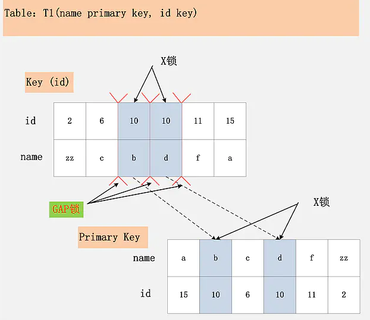
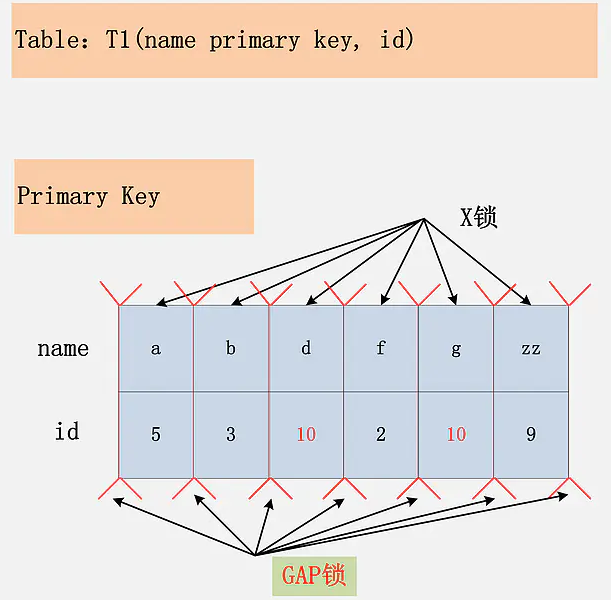
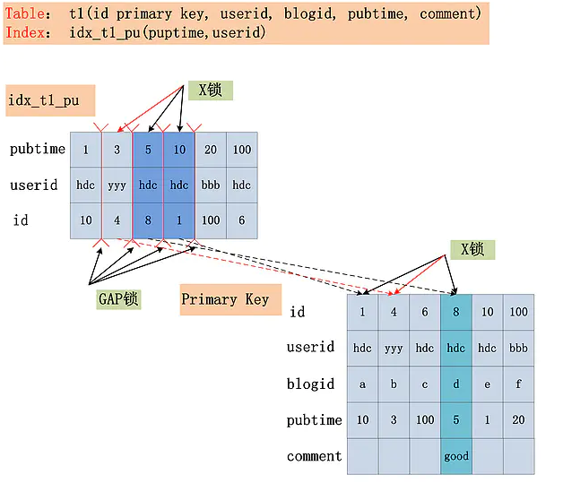

## 基本使用

``` mysql
// session 层面关闭bin_log
set session sql_log_bin = 0;

// global
set global sql_log_bin = 0;

// persist，配置修改将持久化到文件
set persist sql_log_bin = 0;
```


### 执行顺序

1. FROM
2. JOIN
3. ON
4. WHERE
5. GROUP BY
6. HAVING
7. SELECT
8. DISTINCT
9. ORDER BY
10. LIMIT

> **这么看来，笛卡尔积会优先于连表条件 ON 产生「？」**


### 常用 DDL

``` shell

# 这样修改字符编码会将所有字段都修改为 utf8mb4
alter table t convert character set utf8mb4;

# 只会修改表的编码，而字段是旧的编码
alter table t set charset = utf8mb4
```


### 常用函数

``` shell

select md5('a');

hex('a');

# -2
floor(-1.5)

# (0 -100]
rand() * 100

lpad(column, 8, '-')
rpad(column, 8, '-')
repeat('a', 3)
repeat('a', floor(1 + rand() * 19))

# length() 计算字节长度
length(column)

# 计算字符长度
char_length(column)

now()
# 带 3 位毫秒数
now(3)
sysdate()
CURRENT_TIMESTAMP

```


## 何登成技术博客


### 2PL

> 传统 RDBMS 加锁的原则「2PL, 二阶段锁」

以 MySQL 为例, 看看 2PL 在 MySQL 中的实现

| Transaction  | MySQL                                    |
| ------------ | ---------------------------------------- |
| begin;       |                                          |
|              | 加锁阶段                                 |
| insert into  | 加 Insert 对应的锁                       |
| update table | 加 Update 对应的锁                       |
| delete from  | 加 Delete 对应的锁                       |
| commit;      | 解锁阶段                                 |
|              | 同时释放 Insert Update Delete 操作加的锁 |


### Isolation Level


#### 数据库理论中 4 种隔离级别

+ RU「脏读, 不可重复读, 幻读」
+ RC「不可重复读, 幻读」
+ RR「幻读」
+ Serialiable「无并发性」


#### MySQL/InnoDB 实现的 4 种隔离级别

+ RU「存在脏读, 不可重复读, 幻读」

其它事务可以读到当前事务未提交的数据

+ RC「存在幻读现象」

针对当前读「粗略理解也就是在事务下」,**RC 隔离级别保证对读到的记录加锁「记录锁 / 行锁」**

+ RR「**不存在幻读现象**」

针对当前读,**RR 隔离级别对读到的记录加锁「记录锁」,同时对读取的范围加锁「间隙锁」, 新的满足范围条件的记录不能插入**

+ Serializable

从 MVCC 退化为基于锁的并发控制「会读写冲突」


### SQL 加锁分析


#### id 主键, RC 隔离级别

``` sql
Table: T(id primary key, name)
```

Primary Key

| id   | 1    | 4    | 10   | 20   |
| ---- | ---- | ---- | ---- | ---- |
| name | a    | c    | a    | d    |

> id 为主键, 只需在 id = 10 的这条记录加 X 锁


#### id 唯一索引, RC

``` sql
Table: T(name primary key, id unique key)

SQL: DELETE FROM T WHERE id = 5
```

Unique Key「id」

| id   | 1    | 3    | 5    | 6    |
| ---- | ---- | ---- | ---- | ---- |
| name | f    | b    | a    | d    |

Primary Key

| name | a    | b    | d    | f    |
| ---- | ---- | ---- | ---- | ---- |
| id   | 5    | 3    | 6    | 1    |

> id 是 unique 索引, 主键列是 name
>
> 此时, 会将 unique 索引上 id = 10 的记录加 X 锁
>
> 再根据读到的 name 列, 回主键索引「聚簇索引」将 name = 'a' 的记录加 X 锁


#### id 普通索引, RC

``` sql
Table: T(name primary key, id key)

SQL: delete from t1 where id = 10;
```

Key「id」

| id   | 2    | 10   | 10   | 11   |
| ---- | ---- | ---- | ---- | ---- |
| name | zz   | b    | d    | f    |

Primary Key

| name | b    | d    | f    | zz   |
| ---- | ---- | ---- | ---- | ---- |
| id   | 10   | 11   | 10   | 2    |

> id 索引上, 满足 id = 10 的记录都被加锁「非唯一索引可能对应多条记录」
>
> 这些记录对应主键索引上的记录也都加锁


#### id 无索引, RC

``` sql
Table: T(name primary key, id)

SQL: where id = 10;
```

Primary Key

| name | a    | b    | d    | g    | zz   |
| ---- | ---- | ---- | ---- | ---- | ---- |
| id   | 5    | 3    | 10   | 10   | 9    |

**结论：**若id列上没有索引，SQL会走聚簇索引的全扫描进行过滤，由于过滤是由MySQL Server层面进行的。因此每条记录，无论是否满足条件，都会被加上X锁。但是，为了效率考量，MySQL做了优化，对于不满足条件的记录，会在判断后放锁，最终持有的，是满足条件的记录上的锁，但是不满足条件的记录上的加锁/放锁动作不会省略。同时，优化也违背了2PL的约束。


#### id 主键, RR

同 id 主键, RC


#### id 唯一索引, RR

同 id 唯一索引, RC「id 唯一索引 1 个 X 锁, 对应聚簇索引上的记录一个 X 锁」


#### id 普通索引, RR



MySQL / InnoDB 引擎在 RR 级别下无幻读现象

``` sql
Table: T(name primary key, id key)

SQL: delete from t where id = 10;
```

Key「id」

| id   | 2    | 6    | 10   | 10   | 11   |
| ---- | ---- | ---- | ---- | ---- | ---- |
| name | zz   | c    | b    | d    | f    |

Primary Key

| name | b    | c    | d    | f    | zz   |
| ---- | ---- | ---- | ---- | ---- | ---- |
| id   | 10   | 6    | 10   | 11   | 2    |

**结论: **RR 隔离级别下, SQL 通过 id 索引定位到第一条满足条件的记录加 X 锁, 对 GAP 加 GAP 锁, 然后对主键索引上的记录加 X 锁, 然后继续读取下一条, 重复执行. 直到第一条不满足条件的记录「11, f」此时不加 X 锁但是需要 GAP 锁. 最后返回


#### id 无索引, RR



**结论：**在Repeatable Read隔离级别下，如果进行全表扫描的当前读，那么会锁上表中的所有记录，同时会锁上聚簇索引内的所有GAP，杜绝所有的并发 更新/删除/插入 操作。


### SQL 分析案例

``` sql
Table : T(id primary key, userid, blogid, pubtime, comment)

Index: idx_pt_uid(pubtime, userid)

SQL: DELETE FROM T WHERE pubtme > 1 and pubtime < 20
				AND userid = 'hdc' and comment is not NULL;
```

idx_pt_uid

| pubtime | 1    | 3    | 5    | 10   | 20   |
| ------- | ---- | ---- | ---- | ---- | ---- |
| userid  | hdc  | yyy  | hdc  | hdc  | bbb  |
| id      | 10   | 4    | 8    | 1    | 100  |

Primary Key

| id      | 1    | 4    | 8    | 10   | 100  |
| ------- | ---- | ---- | ---- | ---- | ---- |
| userid  | hdc  | yyy  | hdc  | hdc  | bbb  |
| blogid  | a    | b    | d    | e    | f    |
| pubtime | 10   | 3    | 5    | 1    | 20   |
| comment |      |      | good |      |      |


#### Index key

pubtime > 1 and pubtime < 20「确定 SQL 在 idx_pt_uid 索引上的范围」


#### Index Filter

userid = 'hdc'「不属于 Index Key, 可以在 idx_pt_uid 索引上进行过滤」

**当开启 ICP 时过滤可以在 index 上「不满足 Index Filter 的记录不会加 X 锁」, 否则会返回到 Server 层过滤「符合 Index Key 的所有记录都加 X 锁」**

| 启用 ICP                                       | 不启用 ICP                                                   |
| ---------------------------------------------- | ------------------------------------------------------------ |
| idx_pt_uid 索引[5, hdc, 8] [10, hdc, 1] + X 锁 | idx_pt_uid 索引 [3, yyy, 4] [5, hdc, 8] [10, hdc, 1] + X  锁 |


#### Table Filter

comment is not NULL 只能在聚簇索引上过滤




## 1. 事务并发控制

事务并发控制保证隔离性

#### 1.1 事务

数据库提供增删改查基础操作，用户可以灵活组合以实现复杂的语义，用户希望一组操作做为整体生效，这就是事务。

特性：原子性，隔离性，持久性是为了保证一致性


#### 1.2 2PL

悲观并发控制唯一实现2PL（Two-phase Locking二阶段锁）

> 阶段一：Growing，事务向锁管理器请求它需要的所有锁（存在加锁失败的可能）。
>
> 阶段二：Shrinking，事务释放Growing阶段获取的锁，不允许再请求新锁。
>
> **SS2PL**：只能在事务结束后释放锁，杜绝读未提交


#### 1.3 TO

乐观并发控制唯一实现 TO（Timestamp Ordering）

TO 通常有三种实现：

##### Basic T/O

##### OCC（Optimistic Concurrency Control）

> OCC分3阶段
>
> + Read Phase （对于读，放Read Set，对于写，写入临时区放入Write Set，属于未提交结果，其他事务读取不到【这与MVCC不同】）
> + Validation Phase，重扫Read Set，Write Set，检验数据是否满足Isolation Level，如果满足Commit否则Abort
> + Write Phase，或者叫做Commit Phase，把临时区数据更新到数据库中，完成事务提交


##### MVCC

**通过MVCC实现读写不阻塞，主流数据库几乎都采用该项优化技术**（并未完全解决事务并发控制, 如 Serializable 需要额外处理）

>  Multi-Version可看作另一个维度， 可以应用在任意算法上，形成
>
>  + MV-TO
>  + MV-2PL
>  + MV-OCC

MVCC为每条记录维护多个快照（Snapshot，物理版本），通过起止时间戳（Begin / End Timestamp）维护副本可见性

Read：通过起止时间戳判定记录是否对当前事务可见（OCC读不到未提交的记录，不需要判断）

Update： 创建一个新版本（Version）

Delete：更新End Timestamp

> InnoDB MVCC 只工作在 RC, RC 事务隔离级别下


##### Serializable

为实现 Serializable，MVCC 通过以下方式实现

+ 基于锁的MV-2PL，如MySQL

+ 基于TO的MV-TO，如PostgreSQL，准确来说PG实现为SSI（Serializable Snapshot Isolation），不算MV-TO

+ 基于OCC的乐观算法的 MV-OCC。即：读写时不验证，延迟到提交时验证


#### 1.4 意向锁

Intention Lock

> 层次越高的锁（表锁），可以有效减少对资源的占用，显著减少锁检查的次数，但会严重限制并发。
>
> 层次越低的锁（行锁，对OLTP最小操作单元是行），有利于并发执行，但在事务请求对象多的情况下，需要大量的锁检查。
>
> RDBMS 为了解决高层次锁限制并发的问题，引入意向（Intention）锁的概念

+ Intention-Shared (IS)：表明其内部一个或多个对象被S-Lock保护，例如某表加IS，表中至少一行被S-Lock保护。

+ Intention-Exclusive (IX)：表明其内部一个或多个对象被X-Lock保护。例如某表加IX，表中至少一行被X-Lock保护。

+ Shared+Intention-Exclusive (SIX)：表明内部至少一个对象被X-Lock保护，并且自身被S-Lock保护。例如某个操作要全表扫描，并更改表中几行，可以给表加SIX

读者可以思考一下，为啥没有XIX或XIS


####  1.5 InnoDB MVCC

实现原理：

+ 隐式字段
+ undo_log
+ Read View（读视图，Snapshot）

> MVCC「多版本并发控制协议」，在每行数据添加额外两列隐式字段，配合 undo_log 实现
>
> **主要提高读写并发，实现快照读与写不加锁**
>
> + txid（6B）
> + roll_ptr（7B，与数据库实际记录形成链表，根据 txid 判断当前记录对当前事务是否可读）


##### Snapshot & Current Read

快照读 & 当前读

``` sql
-- 快照读
SELECT * FROM table WHERE ?

-- 当前读（需要加锁）
SELECT * FROM table WHERE ? LOCK IN SHARE MODE （S锁）
SELECT * FROM table WHERE ? FOR UPDATE（X锁）
INSERT INTO table VALUES(...)
UPDATE table SET ? WHERE ?
DELETE FROM table WHERE ?
```

> UPDATE table SET ? WHERE ？

当update SQL发送给MySQL后

1. MySQL Server根据where条件请求InnoDB读取第一条满足条件的记录，InnoDB返回记录并加锁（current read）。
2. 待MySQL Server收到加锁的记录后，再发起一个update请求更新这条记录
3. 完成后再取下一条记录

> **由此update包含一个当前读，同理delete，insert「触发 Unique Key 冲突检测」**


**注: **针对一条当前读 SQL, InnoDB 与 MySQL Server 是一条一条交互的, 因此加锁也是一条一条进行的「先对一条满足条件的记录加锁, 返回给 Server 做 DML, 然后读取下一条」


### 2. log

> + error_log（错误日志）
>+ general_log（server 所有 sql 操作）
> + slow_query_log（慢查询日志）
> + bin_log（主从复制）
> + redo_log
> + undo_log（配合隐式字段（txid，roll_ptr）实现 MVCC）


## 高性能MySQL


