## 操作系统快速回顾

+ 处理机管理
+ 进程管理
    + 进程实体
    + 五状态模型
    + 进程同步
    + Linux进程管理
+ 存储管理
    + 内存分配与回收
    + 段页式存储管理
    + 虚拟内存
    + Linux存储管理
+ 作业管理
    + 进程调度
    + 死锁避免
+ 文件管理
    + Linux文件系统
    + Linux文件基本操作
+ 设备管理

> 操作系统是管理计算机硬件与软件资源的计算机程序
>
> 1. 实现对计算机的资源的抽象
> 2. 管理各种计算机资源
> 3. 提供用户与计算机之间的接口
>
>  
>
> 资源：
>
> 处理器资源、IO设备资源、存储器资源、文件资源、
>
>  
>
> 操作系统重要概念：
>
> + 并发性
>
> + 共享性
>
>     + 互斥共享
>     + 并发访问
>
>     ==共享性表现为多个程序并发的使用资源==
>
> + 虚拟性
>
>     ==虚拟性表现为把物理实体转变为若干逻辑实体==
>
>     由时分复用、空分复用技术来体现虚拟性
>
>     时分复用：虚拟处理器技术
>
>     空分复用：虚拟磁盘、虚拟内存
>
> + 异步性


### 1 进程

> 进程是OS资源分配的基本单位


#### 1.3 进程实体

PCB：描述和控制进程运行的通用数据结构，常驻内存

> PCB:
>
> + 标识符
>
> + 状态
>
> + 优先级
>
> + 程序计数器
>
> + 内存指针
>
> + 上下文数据
>
> + I/O状态信息
>
>     一切皆文件，操作的文件都保存在这
>
> + 记账信息
>
>  
>
> PCB中数据分大概分为4种类型：
>
> 1. 进程标识符
> 2. 处理机状态
> 3. 进程调度信息
> 4. 进程控制信息


#### 1.4 进程5状态模型

+ 创建

    > fork()创建进程
    >
    > 分为两步：创建PCB，插入就绪队列

+ 就绪

    > 获取了除CPU以外的其它所有资源

+ 运行

    > 处理机调度就绪的进程

+ 阻塞

    > 其它资源未就绪而无法执行（比如请求I/O，但设备未就绪）

+ 终止

    > 系统清理 -> PCB归还


#### 1.5 进程同步

+ 为什么要进程同步？

    > 请考虑生产者消费者、哲学家进餐问题

+ 进程同步的原则

    > 规范临界资源的原则

    + 空闲让进
    + 忙则等待（资源被占用，请求进程等待）
    + 有限等待
    + 让权等待（等待时让出CPU）

+ 线程同步

    > 进程中的多个线程共享进程的资源，所以也需要同步
    >
    >  
    >
    > 线程同步的方法：
    >
    > + 互斥量（互斥的使用资源）
    > + 读写锁
    > + 自旋锁
    > + 条件变量


#### 1.6 Linux进程管理


> 以tree形式查看所有进程
>
> pstree
>
> ==idle进程，pid = 0，是系统创建的第一个进程==
>
> ==init进程，pid = 1，是0号进程的子进程，完成系统初始化==


+ 前台进程

+ 后台进程

    > 以 & 挂载到systemd
    >
    > 2>&1 > /dev/null &

+ 守护进程（如crond、http、mysqld）


### 2 作业管理

> 


#### 2.1 作业调度


### 3 存储管理


#### 3.1 内存分配

> 三种分配方式

+ 单一连续分配
+ 固定分区分配
+ 动态分区分配（现代OS都采用这种）

> 涉及数据结构与分配算法

动态分配数据结构

+ 动态分区空闲表数据结构

+ 动态分区空闲链表数据结构


动态分区分配算法

+ 首次适应算法（FF，采用空闲链表数据结构）

    + 循环适应算法（对FF的改进，每次不是从头部开始）

+ 最佳适应算法（BF）

    > 将空闲链表按容量大小排序

+ 快速适应算法（QF）

    > 采用多个链表，每个链表链接空闲容量相同的区域


#### 3.2 内存回收

> 存在4种情况

+ 空闲区 - 回收区
+ 回收区 - 空闲区
+ 空闲区 - 回收区 - 空闲区
+ 回收区


#### 3.3 段页式存储管理

> 管理物理内存空间映射为逻辑空间

##### 3.3.1 页式存储管理

> 页表记录逻辑地址对应到物理地址
>
> ==**将进程的逻辑空间等分为若干个页面**==
>
> 现在逻辑地址空间较大，页面大小一般为4KB，在4G地址空间那么需要多达2<sup>20</sup>个页面（通过多级页表解决）

缺点：当一段连续的逻辑分布在多个页面中，将大大降低执行效率


##### 3.3.2 段式存储管理

> ==**将进程逻辑空间划分为若干段**（非等分）==
>
> 段的长度由连续逻辑的长度决定
>
> 主函数MAIN、子程序段X、子函数Y等

段表：

+ 短号
+ 段的起始地址
+ 段长


> 段页式管理：
>
> + 页是物理单位，段是逻辑单位（按进程的逻辑来分）
> + 分页是合理利用空间，分段是满足用户需求
> + 页由硬件固定，段长度可动态变化


##### 3.3.3 段页式存储管理

> 分页提高内存利用率
>
> 逻辑是用户写的，分段可以很好满足用户需求

+ 将进程逻辑空间按段式存储管理分为若干段
+ 将段内空间按页式存储管理等分为若干页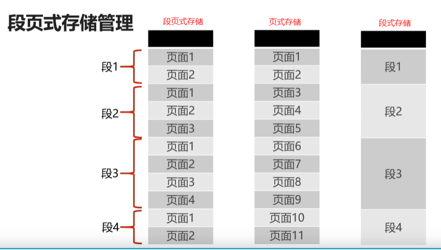储管理


#### 3.4 虚拟内存管理

将暂时不需要的内存置换到磁盘中，只加载必要的内存空间到物理内存


#####  3.4.2 程序局部性原理

> 空间局部性
>
> **==如果访问的页不存在，则发出缺页中断，发起页面置换==**


##### 3.4.3 虚拟内存置换算法

+ FIFO
+ LFU
+ LRU


#### 3.5 Linux内存管理


##### 3.5.1 Buddy内存管理算法 - 分配

> 是经典的内存管理算法，也是Linux实际使用的内存管理算法
>
> 算法基于计算机处理二进制的优势因此具有极高的效率
>
> 算法主要为了解决**内存外碎片**的问题


**什么是页内碎片？**

> 已经被分配出去（能明确指出属于哪个进程）的内存空间大于所请求的内存空间，不能被利用的那部分就是内部碎片


**什么是页外碎片？**

> 空间还没有被分配出去，但由于大小无法满足申请内存空间的进程


**Buddy算法如何分配内存？**

> Buddy内存分配原则：
>
> 向上取整为2的幂大小，如78k -> 128K
>
>  
>
> 伙伴系统：
>
> 一片连续内存的“伙伴”是相邻的另一片一样大小的连续内存
>
> 空闲区1-空闲区2：1，2大小相同，则12互为伙伴


Buddy算法会创建一系列空闲块双向链表，每种都是2的幂

+ 1KB - 1KB - 1KB - ...
+ 2KB - 2KB - 2KB
+ 4KB - ...
+ ...
+ 1MB - 1MB - ...

> 比如分配78K的空间，先查询有没有128K空闲内存块，如果没有继续查找256K，...
>
> 将256K的内存分配出去，128K足够，将剩下的128K作为其它空闲块的链表节点分配出去

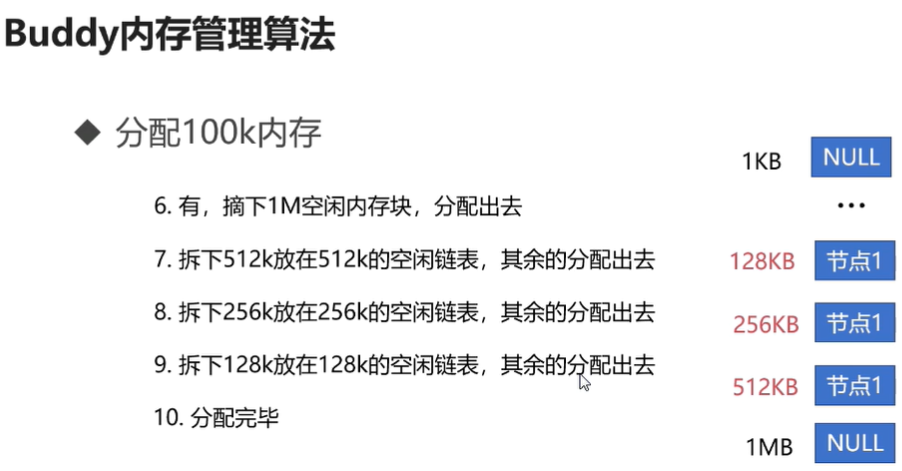


##### 3.5.2 Buddy内存回收


#### Linux交换空间

> 是磁盘空间的一个分区，Linux物理内存满时，将暂时不需要的内存置换到Swap区


+ 冷启动内存依赖（某些进程只在启动时需要大量内存）
+ 系统睡眠依赖（系统睡眠可以将很多数据置换回磁盘）
+ 大进程空间依赖


> Swap区与虚拟内存相似
>
> + Swap、虚拟内存都是在磁盘
> + Swap、虚拟内存都与主存发生置换
> + ==Swap是操作系统概念，虚拟内存是进程概念==
> + Swap主要是解决OS物理内存不足，虚拟内存解决进程物理空间不足


### 4 文件管理

#### 4.1 文件的逻辑结构

##### 4.1.1 逻辑结构的文件类型

+ 有结构文件

+ 无结构文件（流式文件）

    > 文件内容以字节为单位，如exe，dll，so文件等


##### 4.1.2 顺序文件

> 按照顺序才能放在存储介质中的文件
>
> 存储效率最高，可变长文件不适合（比如在中间删除，新增）


##### 4.1.3 索引文件

> 索引表，记录逻辑地址到物理地址的映射


#### 4.2 辅存的存储空间分配

+ 连续分配
+ 链接分配
    + 显示链接（FAT文件系统，一个FAT表记录）
+ 索引分配（现在系统都使用索引分配）

> 使用一个额外的盘块，存储文件需要的其它所有盘块


#### 4.3 目录管理

> 目录树


#### 4.4 Linux目录树

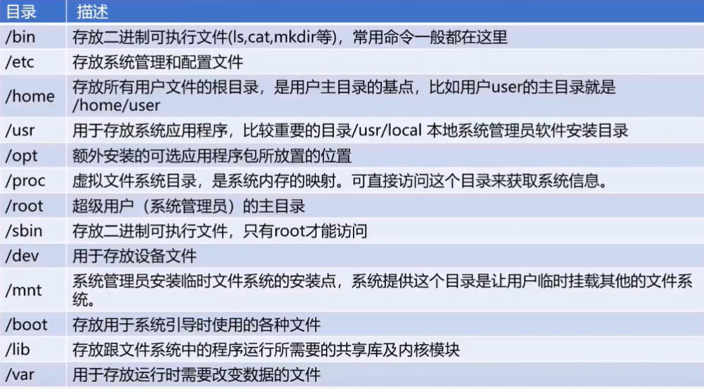


##### 4.4.1 文件类型

+ 套接字（s）
+ 普通文件（-）
+ 目录文件（d）
+ 符号链接（l）
+ 设备文件（c字符设备文件，b块设备文件）
+ FIFO（p）


#### 4.5 Linux文件系统

> 常见文件系统
>
> + FAT
> + NTFS
> + EXT2 / 3 / 4


##### FAT

> File Allocation Table
>
> + FAT16, FAT32，Dos / Windows使用的文件系统
>
> + 使用一张表保存盘块信息


##### NTFS

> New Technology File System
>
> WindowsNT，7,8,10环境的文件系统


##### EXT

> Extend file System：扩展文件系统
>
> Linux的文件系统，如Ubuntu、Centos

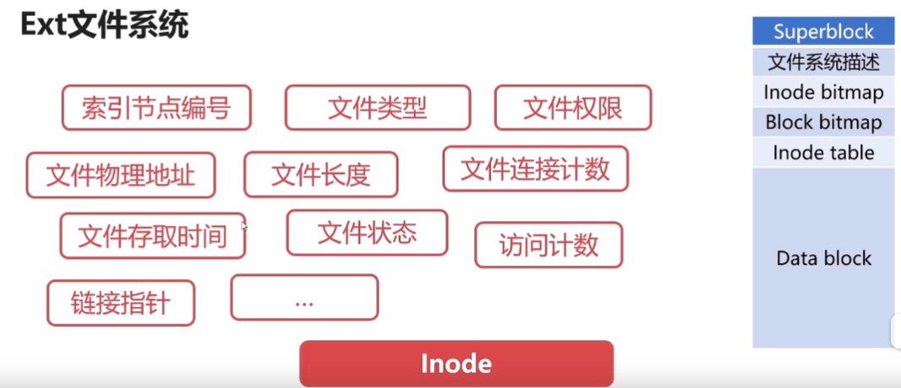

> 文件的名称不是存放在Inode节点上的，是存放在该文件目录的Inode节点
>
> Inode bitmap：Inode位示图


**Linux文件相关命令**

``` shell
# 查看挂载信息
df -T

# 查看Inode信息
dumpe2fs /dev/sda2 > dumpe2fs.log

# 查看文件详细信息
stat dumpe2fs.log

```


### 5 设备管理

> 广义的I/O设备：
>
> 对CPU而言，输入即I/O输入设备，输出即I/O输出设备


#### 5.1 缓冲区

> + **专用缓冲区只适用于特定I/O进程**
> + 当I/O进程较多时，对内存消耗很大
> + **==操作系统划出多个进程使用的公共缓冲区，称之为缓冲池==**


#### 5.2 SPOOLing技术

> 是关于慢速字符设备（如打印机）如何与计算机CPU交换信息的一种技术
>
> 虚拟设备技术，将低速共享设备模拟为高速共享设备
>
> 将同步调用变为了异步调用
>
>  
>
> + 在输入，输出之间增加了排队转储环节（输入井、输出井）
> + SPOOLing负责输入、出井与低速设备之间的调度

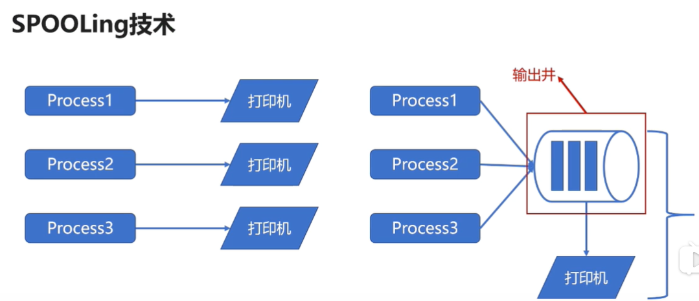


### 6 OS - 提升篇

> 用户态与内核态
>
> 上下文切换
>
> 协程
>
> 编写性能良好程序指南


#### 6.1 进程

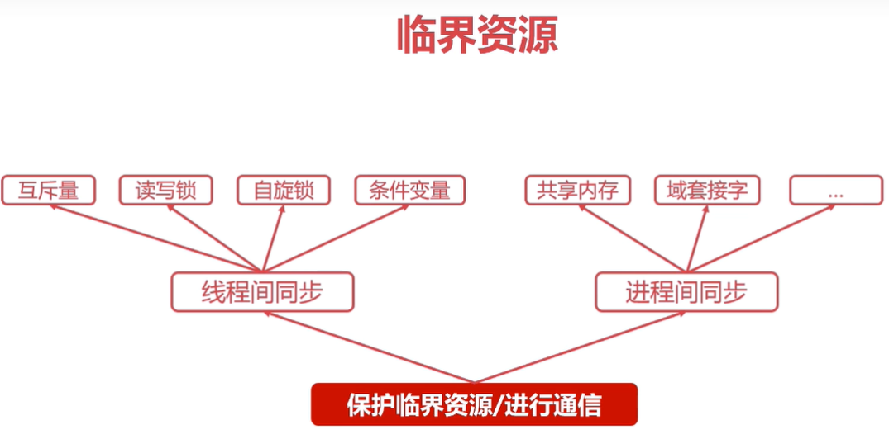

> + fork系统调用用于创建进程
>
> + fork创建的进程初始化状态与父进程一样
>
> + 系统会为fork的进程分配新的资源（包括CPU、内存）
> + ==**fork调用会返回两次（第一次由父进程返回，第二次由子进程返回），分别返回子进程id和0**==
> + 返回子进程id的是父进程，返回0的是子进程


``` c
using namespace std;
int main() {
  pid_t pid;
  // 初始化子进程共享父进程的逻辑空间
  int num = 999;
  pid = fork();
  if (pid == 0) {
    cout << "这是子进程" << endl;
    cout << "num in son: " << num << endl;
  } else if (pid > 0) {
    cout << "这是一个父进程" << endl;
    cout << "子进程id： " << pid << endl;
    cout << "num in father: " << num << endl;
  } else if (pid < 0) {
    cout << "创建进程失败" << endl;
  }
  return 0;
}
```


##### 6.1.1 进程同步

> 进程同步方式：
>
> + 共享内存
> + Unix域套接字


+ 共享内存

    > ==共享内存可以被多个进程读写，多个进程间传递速度最快，但未提供同步机制==
    >
    > 步骤：
    >
    > + 申请共享内存 `shmget`
    > + 连接到进程空间 `shmat`
    > + 使用共享内存
    > + 脱离进程空间`shmdt` & 删除`shtctl`

    // Server逻辑

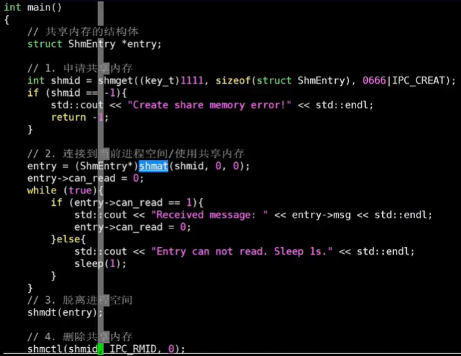


// Client逻辑

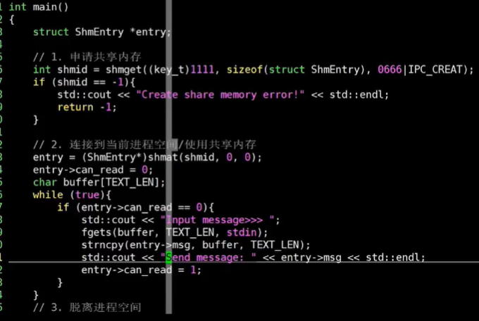

> Server、Client进程共享内存演示


+ Unix域套接字

    > ==提供类似网络套接字的功能，但不经过网卡，在同一台主机不同进程通信时使用==
    >
    > Nginx，uWSGI都使用了域套接字功能
    >
    > Server步骤：
    >
    > + 创建套接字
    > + 绑定套接字
    > + 监听套接字
    > + 接收 & 处理信息
    >
    > Client步骤：
    >
    > + 创建套接字
    > + 连接套接字
    > + 发送信息


#### 6.2 ==线程同步==

+ 互斥量（互斥锁）

    > 当某一个线程操作临界资源时，阻止另一个线程访问
    >
    > 开发者直接使用API完成资源的加锁，解锁操作
    >
    > 操作系统提供的API是 `pthread_mutex_t`

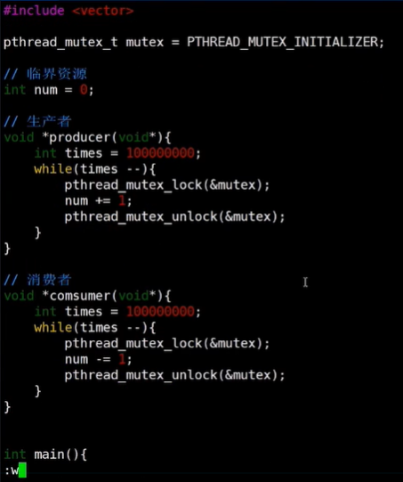

+ 自旋锁

    > **不让出CPU，是一种忙等待**
    >
    > ==避免进程或线程上下文切换开销==
    >
    > 操作系统内部很多使用自旋锁
    >
    > 不适合在单核CPU使用
    >
    > 操作系统提供`pthread_spinlock_t`

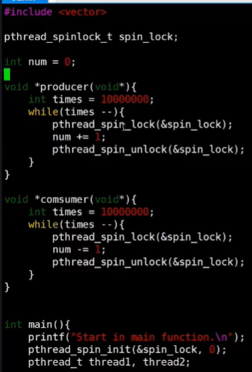

+ 读写锁

    > ==适用于多读少写临界资源的情况==
    >
    > 是一种特殊的自旋锁，对写操作互斥，对多读共享
    >
    > 操作系统提供`pthread_rwlock_t` API
    >
    > `pthread_rwlock_rdlock`：读锁
    >
    > `pthread_rwlock_wrlock`：写锁


+ 条件变量

    > 条件变量是一种比较复杂的线程同步方法
    >
    > 允许线程睡眠，直到满足某种条件
    >
    > **当满足条件时，可以向该线程发出信号，通知唤醒**
    >
    > OS 提供的c API `pthread_cond_t`
    >
    > `pthrad_cond_wait`：等待条件满足
    >
    > `pthread_cond_signal`： 等待被唤醒
    >
    > 需要配合互斥量使用`pthread_mutex_t`

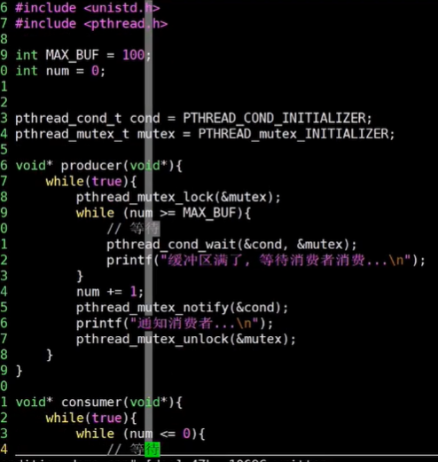


##### 线程同步4种方法对比


### 7 ==异步任务线程池==

> Java：ThreadPoolExecutor
>
> Python3：ThreadPoolExecutor
>
> ==不该局限为API调度==
>
> Python多线程 GIL锁，在多I/O的环境下很实用，在CPU密集时只能使用单核CPU


#### 7.1 Python同步原语

+ 互斥锁

``` python
lock = threading.Lock()

lock.acquire()

lock.release()
```


+ 条件变量（**==判断干活唤醒==**）

``` python
condition = threading.Condition()

condition.acquire()

condition.release()

condition.wait()

condition.notify()  
```


#### 7.2 实现线程安全的队列

> size
>
> put
>
> put_batch
>
> pop
>
> get

``` python

import threading
import time

# 线程安全的队列，是存放各种元素的“池”
class ThreadsafeQueue:
  
  # 构造函数，队列size默认无限大小
  def __init__(self, size = 0):
    self.max_size = size
    self.lock = threading.Condition()
    self.queue = []
  
  def size(self):
    self.lock.acquire()
    size = len(self.queue)
    self.lock.release()
    return size
  
  def put(self, item):
    # 这个获取不需要放在线程安全里面
    if self.max_size != 0 and self.size() == self.max_size:
      raise ThreadsafeQueueException()
      
    self.lock.acquire()
    self.queue.append(item)
    # 如果有线程在等待，那么放入元素之后需唤醒等待的线程
    self.lock.notify()
    self.lock.release()
  
  def put_batch(self, item_list):
    if not isinstance(item_list, list):
      item_list = list(item_list)
  	for item in item_list:
      self.put(item)
      
  def pop(self, timeout = 2):
    # 阻塞
    if self.size() == 0:
      self.lock.acquire()
     	self.lock.wait(timeout = timeout)
      self.lock.release()
    
    self.lock.acquire()
    if self.size() == 0
    	return None
    item = self.queue.pop()
    self.lock.release()
    return item
    
  def get(idx):
    self.lock.acquire()
    item = self.queue[idx]
    self.lock.release()
    return item
 
if __name__ == '__main__':
  queue = ThreadsafeQueue(size=100)
  
  def producer():
    while True:
      queue.put(1)
      time.sleep(1)
      
  def consumer():
    while True:
      item = queue.pop()
      print(item)
      time.sleep(1)
      
  
  thread1 = threading.Thread(target=producer)
  thread2 = threading.Thread(target=consumer)
  threa1.start()
  thread2.start()
  
  thread1.join()
  thread2.join()

class ThreadsafeQueueException(Exception):
  pass
```


#### 7.3 实现基本任务对象

> 任务参数
>
> 任务唯一标记（uuid）
>
> 任务执行的具体逻辑


``` python
import uuid


# 基本任务对象
class Task:
  
  def __init(self, func, *args, **kwargs):
    self.id = uuid.uuid4()
    # 任务执行的具体逻辑，以函数引用的方式传递
    self.call = func
    # 函数执行的元组参数
    self.args = args
    # 函数执行的map参数
    self.kwargs = kwargs
  
  def __str__(self):
    return 'Task id: {}'.format(self.id)
  
if __name__ == '__main__':
  # 以lambda方式提供函数
  task = Task(func = lambda : print('this is a basic task'))
  # 打印task的uuid
  print(task)
```


#### 7.4 实现处理线程与线程池

> 任务处理线程：
>
> + 不断的从任务队列取任务执行
> + 任务处理线程需要有一个标记，标记线程何时停止
>
>  
>
> 线程池：
>
> + 存放多个线程
> + 启动时，启动所有线程（start）
> + 停止时，停止所有线程，等待所有线程执行完毕（join）
> + 可以提交任务（put、put_batch）
> + size

``` python

import threading
import psutil
from task import Task


# 任务处理线程
class ProccessThread(threding.Thread):
  
  def __init__(self, task_queue):
    # 调用父类构造器
    super().__init__(self, *args, **kwargs)
    # 任务队列，当前线程不断从队列中取出任务执行
    self.task_queue = task_queue
    # 任务线程停止的标记
    self.dissmiss_flag = threading.Event()
    pass
  
  # 事件循环，一直从任务队列中取任务执行
  def run(self, queue):
    while True:
      # 线程要求停止
      if self.dismiss_flag.is_set():
        break
      
      task = self.task_queue.pop()
      if not isinstance(task, Task):
        continue
        
      # 执行task的实际逻辑
      result = task.call(self.args, *task.args, **task.kwargs)
      if isinstance(task, AyncTask):
        task.set_result(result)
	
  def stop(self):
    self.dissmiss_flag.set()
    

# 线程池
class ThreadPool:
  
  def __init__(self, size = 0):
    # 线程池默认大小为cpu核数 * 2
    if not size:
      size = psutil.cpu_count() << 1
    
    # 线程池
    self.pool = ThreadsafeQueue(size)
    # 任务队列，默认无界
    self.task_queue = ThreadsafeQueue()
    
    # 初始化线程池中线程
    for i in range(size):
      self.pool.put(ProcessThread(self.task_queue))
    
    pass
  
  # 启动线程池，启动所有线程
  def start(self):
    for i in range(self.pool.size()):
      thread = self.pool.get(i)
      thread.start()
  
  # 停止线程池，停止所有线程
  def join(self):
    for i in range(self.pool.size()):
      thread = self.pool.get(i)
      # 通过stop设置dissmis_flag标记
      thread.stop()
     
    while self.pool.size():
      thread = self.pool.pop()
      # 等待此次执行完毕
      thread.join()
  
  # 线程池的大小
  def size(self):
    return self.pool.size()
  
  # 向线程池提交任务
  def put(self, item):
    if not isinstance(item, Task):
      raise Exception()
    
    # 将任务提交到任务队列
    self.task_queue.put(item)
  
  # 批量提交任务
  def put_batch(self, item_list):
    if not isinstance(item_list, list):
      item_list = list(item_list)
    for item in item_list:
      self.put(item)
      
```


#### 7.5 测试

``` python

import task, pool

def test():
  # 初始化一个线程池
  # 生成任务
  # 提交任务
  pass


if __name__ == '__main__':
  test
```


#### 7.6 实现异步任务处理

``` python
# 

class AyncTask(Task):
  
  def __init__(self, func, *args, **kwargs):
    super().__init__(func, args, kwargs)
    self.result = None
    self.condition = threading.Condition()
  
  def set_result(self, result):
    self.condition.acquire()
    self.result = result
    self.condition.notify()
    self.condition.release()
    
  def get_result(self):
    self.condition.acquire()
    if not self.result:
      self.condition.wait()
    result = self.result
    self.condition.release()
		return result
  
if __name__ == '__main__':
  
  def async_logic():
    # 模拟长业务，看是否get_result是否会等待
    time.sleep(1)
    return sum(range(101))
  
  def test_async():
    
    pool = pool.ThreadPool()
    pool.start()
    
    for i in range(3):
      async_task = task.AsyncTask(func = async_logic)
      pool.put(async_task)
      
      result = async_task.get_result()
      # 模拟 main线程执行其它任务：time.sleep(5)
      print('result is : %d' % result)
      
```


#### 代码实现

``` python

# pool.py


# queue.py


# task.py


# test.py

```


## 操作系统

+ 处理机（cpu）管理
+ 存储器管理
+ 文件管理
+ 设备管理
+ 用户接口


> + 处理机管理的功能：
>
> ​	进程控制，进程同步，进程通信，调度（作业调度 & 进程调度）
>
> + 存储器管理的功能：
>     + 内存分配
>
>     内存分配数据结构，内存分配功能，内存回收功能
>
>     + 内存保护
>
>     确保程序只在自己的内存区域运行，**越界检查由硬件实现**
>
>     + 地址映射
>
>     每个进程中的地址是相对于起始地址计算的，称为**“逻辑地址”**， 存储器管理提供地址映射功能将逻辑地址与物理地址对应，在硬件支持下完成
>
>     + 内存扩充
>
>     请求调入功能（允许仅装载一部分用户程序和数据情况下，启动该程序运行，当运行时需要其他数据再将所需部分调入内存）
>
>     + 置换功能（SWAP）
>
>     （若内存空间不足以装入需要调入的部分，则将暂时不使用的程序和数据调出至磁盘）
>    
>     
>    
> + 文件管理的功能
>
>     + 文件存储空间管理
>     + 目录管理
>     + 文件读 / 写 / 共享 / 保护
>
> + 设备管理的功能
>
>     + 缓冲管理
>
>         单缓冲区机制，双向同时传送数据的双缓冲区禁止，公用缓冲池机制
>
>     + 设备分配与回收
>
>     + 设备驱动程序
>
>         实现处理机和设备控制器之间的通信，设备处理程序首先检查I/O请求的合法性、了解设备的状态是否空闲、了解有关传递参数以及设置设备的工作方式；然后，向设备控制器发出I/O命令，启动I/O设备去完成指定的I/O操作；最后，及时响应由控制器发来的中断请求，并根据该中断请求的类型调用相应的中断处理程序进行处理。对于设置了通道的计算机系统，设备处理程序还应能根据用户的I/O请求自动地构成通道程序
>
>     + 设备独立性和虚拟设备
>
>         将一个物理设备虚拟为多个逻辑设备
>
> + 用户接口：
>
>     命令接口，程序接口（由一组系统调用组成），GUI


#### OS特征

+ 并发
+ 共享（互斥共享，同时共享）

+ 虚拟（空分复用，时分复用）

+ 异步


#### OS运行机制

+ 指令
    + 特权指令（地址清零，输入输出，中断）
    + 非特权指令（i++）

> 特权指令需要在核心态下执行

+ 处理状态
  
    核心态（目态），用户态（管态）

> **程序状态字寄存器**（psw）中某个标识位标识当前处理器状态。0为用户态， 1为核心态

+ 程序
  
    内核程序，用户程序
    
    

#### OS内核

+ 时钟管理
+ 中断处理

> **中断机制实现了并发**
>
> + ==中断发生，CPU进入核心态==
> + 中断后，当前用户进程暂停运行，由OS内核对中断进行处理
> + 不同中断信号，会进行不同处理
>
> **中断是用户态切换为核心态唯一途径，核心态切换为用户态只需切换PSW标识为0**
>
> + 内中断（异常（缺页访问， by zero），例外，陷入（trap））
> + 外中断（外设请求，人工干预）

+ 原语

> 原语由一条或多条指令组成，具有原子性，原子性由**关中断指令**和**开中断指令**实现

+ 资源管理
    + 进程管理
    + 存储器管理
    + 设备管理

#### OS体系结构

+ 大内核（高性能）
+ 微内核（用户态核心态之间切换频繁）


#### 系统调用

> 向OS请求服务（特权指令），**资源相关操作都是系统调用**
>
> 汇编可以直接执行系统调用
>
> 例如：int $0X80（<kbd>trap / 陷入指令</kbd>）：CPU控制权交给OS，由OS执行系统调用
>
> **系统调用 interrupt x ，x标识操作类型，比如Linux，int 2 == #define __NR_fork 是创建一个进程**

+ 设备管理（设备 请求 / 释放 / 启动）
+ 文件管理（文件 读 / 写 / 创建 / 删除）
+ 进程控制（进程 创建 / 撤销 / 阻塞 / 唤醒）
+ 进程通信（进程之间 消息传递 / 信号传递）
+ 内存管理（内存 分配 / 回收）


#### 进程

> 程序段，数据段，<kbd>PCB</kbd>（进程控制块）组成进程实体
>
> ==**进程是除CPU之外，如系统资源（如打印机，内存地址空间）分配的基本单位**==
>
> **==线程（准确来说KLT线程）是CPU调度的基本单位==**
>
> PCB是进程存在的唯一标识
>
> PCB： 进程描述信息，进程控制和管理信息，资源分配清单，处理机相关（由于有中断 & 恢复，需保存各种寄存器的值）
>
> **就绪状态：拥有除处理机之外的其它资源**


#### 进程控制

> 进程控制由原语实现
>
> **进程创建 / 终止 / 阻塞 / 唤醒 / 切换 原语**
>
> 原语一般完成3个事情：
>
> + 更新PCB中信息
> + 将PCB插入合适的队列（就绪 / 阻塞）
> + 分配 / 回收资源
>
> 例如创建原语： 申请空白PCB，为新进程分配所需资源，初始化PCB，将PCB插入就绪队列


#### 进程通信

+ 共享存储（基于数据结构的共享（低级通信），基于存储区的共享（高级通信））
+ 消息传递（直接通信方式，间接通信方式）

> 消息头（发送PID，接收PID，消息类型），消息体
>
> 消息发送原语 / 消息接收原语

+ 管道通信

> 是一个缓冲区，Linux中管道为4K
>
> 管道通信只能采用<kbd>半双工通信</kbd>
>
> 各个进程互斥访问管道，当管道写满，write()调用被阻塞，管道为空read()系统调用被阻塞
>
> 没有写满不允许读，没有读完也不允许写


#### 线程

> 引入线程机制之后，**线程是CPU调度的基本单位，进程是资源分配的基本单位**
>
> **每个线程有线程ID，<kbd>TCB</kbd>（线程控制块）**
>
> 线程实现方式：<kbd>内核级线程</kbd>，<kbd>用户级线程</kbd>
>
> **内核级线程才是CPU调度的基本单位**
>
> 多线程模型（一对一，多对一，多对多模型）
>
> + 多个用户级线程映射为一个内核级线程
>
> + 一个用户级线程映射为一个内核级线程（线程切换OS需切换为核心态，开销较大）
> + n个用户级线程映射为m个内核级线程（n >= m）


#### 处理机调度

> 高级调度（作业调度），中级调度（内存调度），低级调度（进程调度）
>
> + 作业调度
>
> 外存 -> 内存
>
> 内存空间有限，无法将用户提交的作业全部载入内存，因此按一定规则选取作业调入内存，随后分配资源，建立进程（PCB）
>
> + 内存调度
>
> 外存 -> 内存
>
> 虚拟内存技术，将暂时不能运行的进程调至外存（swap）等待，此时为<kbd>挂起状态</kbd>，但PCB会常驻内存，当需要运行时，再被调入内存
>
> <kbd>七状态模型</kbd>
>
> ==创建，就绪，阻塞，运行，终止，就绪挂起，阻塞挂起 状态== 
>
> + 进程调度
>
> 内存 -> CPU


#### 进程调度

> **进程调度时机**：当前进程主动放弃（I/O）处理机，当前进程被动放弃（时间片）处理机
>
> ==临界资源==： 一个时间段只允许一个进程使用，各进程之间互斥访问临界资源
>
> ==临界区==：访问临界资源的代码
>
> 抢占式（优先处理紧急任务，时间片完毕可剥夺），非抢占式（只允许进程主动放弃处理机）
>
> 进程切换：（程序计数器，程序状态字，各种数据寄存器）
>
> + 对当前进程的数据保存至PCB
> + 对将要调度的进程从PCB中恢复数据
>
> ==进程调度一般几十毫秒一次==


#### 调度算法评价指标

> + CPU利用率
> + 系统吞吐量
> + 周转时间
> + 等待时间
> + 响应时间


#### 调度算法

+ FCFS（先来先服务）

+ SJF（短作业优先）

+ HRRN（高响应优先）

+ RR（时间片轮转）

优先调度算法

多级反馈队列调度算法（UNIX）（相对公平，响应快，短进程很快完成）

> First Come First Serve 非抢占式调度
>
> Short Job First 非抢占式调度
>
> High Response Ratio Next 非抢占式调度
>
> // 适用于交互式系统
>
> Round-Robin 主动放弃 / 时间片完毕则剥夺处理机，抢占式调度
>
> 优先级调度 抢占式调度
>
> 多级反馈队列有抢占式非抢占式实现


#### 进程互斥方法

+ 单标志法
+ 双标志先检查法
+ 双标志后检查法
+ Peterson
+ 中断屏蔽方法 -> 硬件实现（只适用于单处理机）
+ TSL指令 -> 硬件实现
+ Swap指令 -> 硬件实现


#### 信号量机制

> 用户进程可以使用OS提供的一对原语（wait & signal）对<kbd>信号量</kbd>进行操作，从而实现进程互斥，进程同步
>
> 信号量是一个变量（可以是一个整数，或者记录型变量），可以 **表示某种资源的数量**
>
> 只能有三种操作：初始化，P（申请），V（释放）
>
> **进程互斥将信号量初始为1（前P后V），进程同步将信号量初始为0（前V后P）**

+ 整形信号量：

``` c
// 初始化信号量
int S = 1；

// wait原语，“进入区”，资源不足循环等待
void wait(int S) {
	while (S <= 0);
	S = S - 1;

}

// signal原语，“退出区”，释放资源
void sinal(int S) {
	S = S + 1;
}
```

+ 记录型信号量

``` c

// 定义
typedef struct {
    int value;
    struct process *L;	// 等待队列
} semaphore;

// 
void wait(semaphore S) {
    S.value--;
    if (S.value < 0)
        block(S.L);	// 阻塞原语，放弃CPU
}

// 
void signal(semaphore S) {
    S.value ++;
    if (S.value <= 0)
        wakeup(S.L);	// 唤醒原语
}
```


#### 管程

> 信号量机制存在的问题：编写程序困难，易出错
>
> **管程实现进程互斥，同步。是一种更高级的同步机制**
>
> + 在管程中定义共享数据
> + 在管程中定义用于访问这些共享数据的“入口”（函数）
> + 管程每次开放其中一个“入口”，每次只有一个进程 / 线程进入，这种互斥特性由编译器实现
> + 可在管程中设置条件变量及等待 / 唤醒操作解决同步问题
>
> **感觉比较像 高内聚（资源类自己实现对资源的操作），线程操作资源类这个面向对象定义**
>
> **Java中synchronized关键字使用管程机制**
>
> 感觉就是面向对象，设计一定数据结构，并提供操作数据的方法。


#### 死锁检测算法

> 带权有向图，出度 = 入度则可消除，全部消除则无死锁


#### 内存

> 存储单元有多大，需要看计算机是按字节编址还是按字编址
>
> 按字节编址1字节一个存储单元
>
> **源代码 -> 编译 -> 链接（链接后形成完整的逻辑地址） -> 装入（将程序装入内存形成物理地址）**
>
> 链接三种方式：
>
> + 静态链接（装入前链接为一个完整的装入模块）
> + 装入时动态链接
> + 运行时动态链接（运行时需要目标块才执行链接与装入）
>
> 装入三种方式：
>
> + 绝对装入：编译时产生物理地址
>
> + 静态重定位：装入时将逻辑地址转换为物理地址
> + 动态重定位（**重定位寄存器，在运行时将逻辑地址转换为物理地址**）


#### 内存管理

1. 连续分配方式

> **动态分区分配，进程装入内存时根据进程的大小动态的建立分区**
>
> 使用什么数据结构记录内存的使用情况？
>
> 空闲分区表，空闲分区链（空闲分区的信息作为（双）链表节点）

+ 空闲分区表（按分区大小 / 按起始地址排列）

| 分区号 | 分区大小（MB） | 起始地址（MB） | 状态 |
| ------ | -------------- | -------------- | ---- |
| 1      | 14             | 60             | 空闲 |
| 2      | 4              | 60             | 空闲 |

​	1.1 动态分区分配算法

> 首次适应算法（按起始地址排列）
>
> 最佳适应算法（优先使用更小的空闲区，所以空闲分区按分区大小排列，产生比较多的碎片）
>
> 最坏适应算法（优先使用较大的空闲区，按空闲分区大小逆序排列）
>
> 临近适应算法（每次选取从上次结束位置开始（双向循环链表），所以空闲分区按起始地址排列）


2. 非连续分配方式

> 2.1 **分页存储管理**（比如：每个页4K）
>
> 采用分页存储，如何从逻辑地址转换为物理地址？
>
> 基本地址变换机构（查询页表，访问具体物理地址）
>
> **具有快表的地址变换机构**（先查询高速缓存，命中则计算，否则查询内存）

``` tex
页号 = 逻辑地址 / 页面长度
偏移量 = 逻辑地址 % 页面长度

物理地址 = 当前页号的起始地址 + 偏移量

操作系统为每个进程创建一张页表，记录页面和实际存放内存块之间的关系

假设使用32位表示逻辑地址，页面大小为2的12次幂 = 4096B = 4K

0号页的逻辑地址空间应该是 0 ~ 4095，二进制表示为：
0000000000000000000 000000000000 ~ 0000000000000000000 111111111111
1号页的逻辑地址空间是4096 ~ 8911，二进制表示为：
0000000000000000001 000000000000 ~ 0000000000000000001 111111111111
2号页的逻辑地址空间是8192 ~ 12287，二进制表示为：
0000000000000000010 000000000000 ~ 0000000000000000010 111111111111

可以得出，前20位可以表示页号， 后12位可以表示偏移量

某系统采用基本分页存储管理，并采用快表的地址变换机构，已知访问一次快表1us，访问一次内存100us，若快表命中率90%，那么访问一个逻辑地址的物理地址平均耗时多少？
	慢表访问物理地址需两次，第一次访问页表，第二次访问物理地址
	(1 +100) * 0.9 + (1 + 100 + 100) * 0.1 = 111us
```


2.2 基本分段存储管理

> 如何实现地址变换？


#### 页面置换算法

> 最佳置换算法（无法实现），先进先出（存在belady异常：分配内存块增多缺页异常不减反增），最近最久未使用（LRU，实现起来开销较大），时钟置换算法（NRU最近未使用算法，Not Recently Used）
>
> 


#### 文件存储管理

> 空闲文件管理：空闲表法，空闲链表法，成组链接法（UNIX），位示法
>
> 文件系统调用：create / delete / open / close / write / read 


### 设备管理

==I/O硬件由机械部分和电子部分（I/O控制器）组成==


#### I/O控制方式

> 四种方式：程序直接控制，中断驱动，DMA，通道控制


##### 程序控制方式

> CPU向I/O控制器发起读命令 -> I/O控制器返回设备状态到CPU寄存器 -> 寄存器（轮询阻塞）查看设备状态是否就绪 -> 就绪则从I/O控制器（数据寄存器）中取数据 -> 往存储器中写数据（CPU -> 存储器）
>
> CPU需轮询检查设备状态，数据单位为一个字


##### 中断驱动方式

> CPU不循环等待设备就绪，先切换到其它进程执行，当I/O完成，I/O控制器会向CPU发出中断信号，CPU收到中断信号挂起当前执行进，处理中断
>


CPU会在每条指令周期的末尾检查是否有中断信号

中断会导致从目态到管态切换，消耗比较大

数据单位为一个字，所以将有大量中断


##### DMA

直接存储器存取

> 从I/O设备直接到内存， 不经过CPU拷贝数据，数据单位是“块”
>
> read调用： I/O -> 内存
>
> write调用：内存 -> I/O
>

为了实现DMA，需要有一个DMA控制器

+ CPU-DMA控制器接口

+ I/O逻辑
+ 设备-DMA控制器接口


##### 通道控制方式

通道程序 = 任务清单


