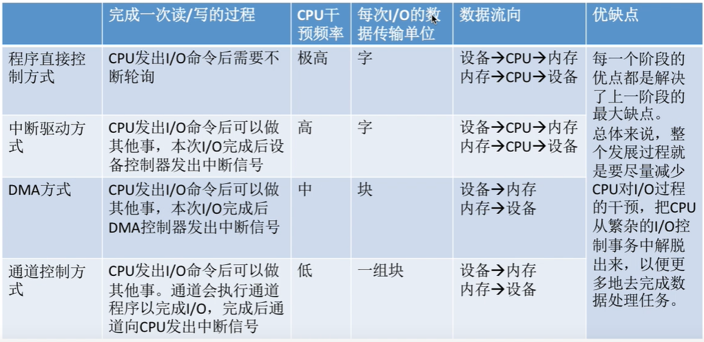

## 操作系统

+ 处理机（cpu）管理
+ 存储器管理
+ 文件管理
+ 设备管理
+ 用户接口


> + 处理机管理的功能：
>
> ​	进程控制，进程同步，进程通信，调度（作业调度 & 进程调度）
>
> + 存储器管理的功能：
>     + 内存分配
>
>     内存分配数据结构，内存分配功能，内存回收功能
>
>     + 内存保护
>
>     确保程序只在自己的内存区域运行，**越界检查由硬件实现**
>
>     + 地址映射
>
>     每个进程中的地址是相对于起始地址计算的，称为**“逻辑地址”**， 存储器管理提供地址映射功能将逻辑地址与物理地址对应，在硬件支持下完成
>
>     + 内存扩充
>
>     请求调入功能（允许仅装载一部分用户程序和数据情况下，启动该程序运行，当运行时需要其他数据再将所需部分调入内存）
>
>     + 置换功能（SWAP）
>
>     （若内存空间不足以装入需要调入的部分，则将暂时不使用的程序和数据调出至磁盘）
>     
>     
>     
> + 文件管理的功能
>
>     + 文件存储空间管理
>     + 目录管理
>     + 文件读 / 写 / 共享 / 保护
>
> + 设备管理的功能
>
>     + 缓冲管理
>
>         单缓冲区机制，双向同时传送数据的双缓冲区禁止，公用缓冲池机制
>
>     + 设备分配与回收
>
>     + 设备驱动程序
>
>         实现处理机和设备控制器之间的通信，设备处理程序首先检查I/O请求的合法性、了解设备的状态是否空闲、了解有关传递参数以及设置设备的工作方式；然后，向设备控制器发出I/O命令，启动I/O设备去完成指定的I/O操作；最后，及时响应由控制器发来的中断请求，并根据该中断请求的类型调用相应的中断处理程序进行处理。对于设置了通道的计算机系统，设备处理程序还应能根据用户的I/O请求自动地构成通道程序
>
>     + 设备独立性和虚拟设备
>
>         将一个物理设备虚拟为多个逻辑设备
>
> + 用户接口：
>
>     命令接口，程序接口（由一组系统调用组成），GUI


#### OS特征

+ 并发
+ 共享（互斥共享，同时共享）

+ 虚拟（空分复用，时分复用）

+ 异步


#### OS运行机制

+ 指令
    + 特权指令（地址清零，输入输出，中断）
    + 非特权指令（i++）

> 特权指令需要在核心态下执行

+ 处理状态
  
    核心态（目态），用户态（管态）

> **程序状态字寄存器**（psw）中某个标识位标识当前处理器状态。0为用户态， 1为核心态

+ 程序
  
    内核程序，用户程序
    
    

#### OS内核

+ 时钟管理
+ 中断处理

> **中断机制实现了并发**
>
> + ==中断发生，CPU进入核心态==
> + 中断后，当前用户进程暂停运行，由OS内核对中断进行处理
> + 不同中断信号，会进行不同处理
>
> **中断是用户态切换为核心态唯一途径，核心态切换为用户态只需切换PSW标识为0**
>
> + 内中断（异常（缺页访问， by zero），例外，陷入（trap））
> + 外中断（外设请求，人工干预）

+ 原语

> **原语由一条或多条指令组成，具有原子性，原子性由<kbd>关中断指令</kbd>和<kbd>开中断指令</kbd>实现**

+ 资源管理
    + 进程管理
    + 存储器管理
    + 设备管理

#### OS体系结构

+ 大内核（高性能）
+ 微内核（用户态核心态之间切换频繁）


#### 系统调用

> 向OS请求服务（特权指令），**资源相关操作都是系统调用**
>
> 汇编可以直接执行系统调用
>
> 例如：int $0X80（<kbd>trap / 陷入指令</kbd>）：CPU控制权交给OS，由OS执行系统调用
>
> **系统调用 interrupt x ，x标识操作类型，比如Linux，int 2 == #define __NR_fork 是创建一个进程**

+ 设备管理（设备 请求 / 释放 / 启动）
+ 文件管理（文件 读 / 写 / 创建 / 删除）
+ 进程控制（进程 创建 / 撤销 / 阻塞 / 唤醒）
+ 进程通信（进程之间 消息传递 / 信号传递）
+ 内存管理（内存 分配 / 回收）


#### 进程

> 程序段，数据段，<kbd>PCB</kbd>（进程控制块）组成进程实体
>
> ==**进程是除CPU之外，如系统资源（如打印机，内存地址空间）分配的基本单位**==
>
> **==线程（准确来说KLT线程）是CPU调度的基本单位==**
>
> PCB是进程存在的唯一标识
>
> PCB： 进程描述信息，进程控制和管理信息，资源分配清单，处理机相关（由于有中断 & 恢复，需保存各种寄存器的值）
>
> **就绪状态：拥有除处理机之外的其它资源**


#### 进程控制

> 进程控制由原语实现
>
> **进程创建 / 终止 / 阻塞 / 唤醒 / 切换 原语**
>
> 原语一般完成3个事情：
>
> + 更新PCB中信息
> + 将PCB插入合适的队列（就绪 / 阻塞）
> + 分配 / 回收资源
>
> 例如创建原语： 申请空白PCB，为新进程分配所需资源，初始化PCB，将PCB插入就绪队列


#### 进程通信

+ 共享存储（基于数据结构的共享（低级通信），基于存储区的共享（高级通信））
+ 消息传递（直接通信方式，间接通信方式）

> 消息头（发送PID，接收PID，消息类型），消息体
>
> 消息发送原语 / 消息接收原语

+ 管道通信

> 是一个缓冲区，Linux中管道为4K
>
> 管道通信只能采用<kbd>半双工通信</kbd>
>
> 各个进程互斥访问管道，当管道写满，write()调用被阻塞，管道为空read()系统调用被阻塞
>
> 没有写满不允许读，没有读完也不允许写


#### 线程

> 引入线程机制之后，**线程是CPU调度的基本单位，进程是资源分配的基本单位**
>
> **每个线程有线程ID，<kbd>TCB</kbd>（线程控制块）**
>
> 线程实现方式：<kbd>内核级线程</kbd>，<kbd>用户级线程</kbd>
>
> **内核级线程才是CPU调度的基本单位**
>
> 多线程模型（一对一，多对一，多对多模型）
>
> + 多个用户级线程映射为一个内核级线程
>
> + 一个用户级线程映射为一个内核级线程（线程切换OS需切换为核心态，开销较大）
> + n个用户级线程映射为m个内核级线程（n >= m）


#### 处理机调度

> 高级调度（作业调度），中级调度（内存调度），低级调度（进程调度）
>
> + 作业调度
>
> 外存 -> 内存
>
> 内存空间有限，无法将用户提交的作业全部载入内存，因此按一定规则选取作业调入内存，随后分配资源，建立进程（PCB）
>
> + 内存调度
>
> 外存 -> 内存
>
> 虚拟内存技术，将暂时不能运行的进程调至外存（swap）等待，此时为<kbd>挂起状态</kbd>，但PCB会常驻内存，当需要运行时，再被调入内存
>
> <kbd>七状态模型</kbd>
>
> ==创建，就绪，阻塞，运行，终止，就绪挂起，阻塞挂起 状态== 
>
> + 进程调度
>
> 内存 -> CPU


#### 进程调度

> **进程调度时机**：当前进程主动放弃（I/O）处理机，当前进程被动放弃（时间片）处理机
>
> <kbd>临界资源</kbd>： 一个时间段只允许一个进程使用，各进程之间互斥访问临界资源
>
> <kbd>临界区</kbd>：访问临界资源的代码
>
> 抢占式（优先处理紧急任务，时间片完毕可剥夺），非抢占式（只允许进程主动放弃处理机）
>
> 进程切换：（程序计数器，程序状态字，各种数据寄存器）
>
> + 对当前进程的数据保存至PCB
> + 对将要调度的进程从PCB中恢复数据
>
> ==进程调度一般几十毫秒一次==


#### 调度算法评价指标

> + CPU利用率
> + 系统吞吐量
> + 周转时间
> + 等待时间
> + 响应时间


#### 调度算法

<kbd>FCFS</kbd>（先来先服务）

<kbd>SJF</kbd>（短作业优先）

<kbd>HRRN</kbd>（高响应优先）

<kbd>RR</kbd>（时间片轮转）

优先调度算法

多级反馈队列调度算法（UNIX）（相对公平，响应快，短进程很快完成）

> First Come First Serve 非抢占式调度
>
> Short Job First 非抢占式调度
>
> High Response Ratio Next 非抢占式调度
>
> // 适用于交互式系统
>
> Round-Robin 主动放弃 / 时间片完毕则剥夺处理机，抢占式调度
>
> 优先级调度 抢占式调度
>
> 多级反馈队列有抢占式非抢占式实现


#### 进程互斥方法

+ 单标志法
+ 双标志先检查法
+ 双标志后检查法
+ Peterson
+ 中断屏蔽方法 -> 硬件实现（只适用于单处理机）
+ TSL指令 -> 硬件实现
+ Swap指令 -> 硬件实现


#### 信号量机制

> 用户进程可以使用OS提供的一对原语（wait & signal）对<kbd>信号量</kbd>进行操作，从而实现进程互斥，进程同步
>
> 信号量是一个变量（可以是一个整数，或者记录型变量），可以 **表示某种资源的数量**
>
> 只能有三种操作：初始化，P（申请），V（释放）
>
> **进程互斥将信号量初始为1（前P后V），进程同步将信号量初始为0（前V后P）**

+ 整形信号量：

``` c
// 初始化信号量
int S = 1；

// wait原语，“进入区”，资源不足循环等待
void wait(int S) {
	while (S <= 0);
	S = S - 1;

}

// signal原语，“退出区”，释放资源
void sinal(int S) {
	S = S + 1;
}
```

+ 记录型信号量

``` c

// 定义
typedef struct {
    int value;
    struct process *L;	// 等待队列
} semaphore;

// 
void wait(semaphore S) {
    S.value--;
    if (S.value < 0)
        block(S.L);	// 阻塞原语，放弃CPU
}

// 
void signal(semaphore S) {
    S.value ++;
    if (S.value <= 0)
        wakeup(S.L);	// 唤醒原语
}
```


#### 管程

> 信号量机制存在的问题：编写程序困难，易出错
>
> **管程实现进程互斥，同步。是一种更高级的同步机制**
>
> + 在管程中定义共享数据
> + 在管程中定义用于访问这些共享数据的“入口”（函数）
> + 管程每次开放其中一个“入口”，每次只有一个进程 / 线程进入，这种互斥特性由编译器实现
> + 可在管程中设置条件变量及等待 / 唤醒操作解决同步问题
>
> **感觉比较像 高内聚（资源类自己实现对资源的操作），线程操作资源类这个面向对象定义**
>
> **Java中synchronized关键字使用管程机制**
>
> 感觉就是面向对象，设计一定数据结构，并提供操作数据的方法。


#### 死锁检测算法

> 带权有向图，出度 = 入度则可消除，全部消除则无死锁


#### 内存

> 存储单元有多大，需要看计算机是按字节编址还是按字编址
>
> 按字节编址1字节一个存储单元
>
> **源代码 -> 编译 -> 链接（链接后形成完整的逻辑地址） -> 装入（将程序装入内存形成物理地址）**
>
> 链接三种方式：
>
> + 静态链接（装入前链接为一个完整的装入模块）
> + 装入时动态链接
> + 运行时动态链接（运行时需要目标块才执行链接与装入）
>
> 装入三种方式：
>
> + 绝对装入：编译时产生物理地址
>
> + 静态重定位：装入时将逻辑地址转换为物理地址
> + 动态重定位（**重定位寄存器，在运行时将逻辑地址转换为物理地址**）


#### 内存管理

1. 连续分配方式

> **动态分区分配，进程装入内存时根据进程的大小动态的建立分区**
>
> 使用什么数据结构记录内存的使用情况？
>
> 空闲分区表，空闲分区链（空闲分区的信息作为（双）链表节点）

+ 空闲分区表（按分区大小 / 按起始地址排列）

| 分区号 | 分区大小（MB） | 起始地址（MB） | 状态 |
| ------ | -------------- | -------------- | ---- |
| 1      | 14             | 60             | 空闲 |
| 2      | 4              | 60             | 空闲 |

​	1.1 动态分区分配算法

> 首次适应算法（按起始地址排列）
>
> 最佳适应算法（优先使用更小的空闲区，所以空闲分区按分区大小排列，产生比较多的碎片）
>
> 最坏适应算法（优先使用较大的空闲区，按空闲分区大小逆序排列）
>
> 临近适应算法（每次选取从上次结束位置开始（双向循环链表），所以空闲分区按起始地址排列）


2. 非连续分配方式

> 2.1 **分页存储管理**（比如：每个页4K）
>
> 采用分页存储，如何从逻辑地址转换为物理地址？
>
> 基本地址变换机构（查询页表，访问具体物理地址）
>
> **具有快表的地址变换机构**（先查询高速缓存，命中则计算，否则查询内存）

``` tex
页号 = 逻辑地址 / 页面长度
偏移量 = 逻辑地址 % 页面长度

物理地址 = 当前页号的起始地址 + 偏移量

操作系统为每个进程创建一张页表，记录页面和实际存放内存块之间的关系

假设使用32位表示逻辑地址，页面大小为2的12次幂 = 4096B = 4K

0号页的逻辑地址空间应该是 0 ~ 4095，二进制表示为：
0000000000000000000 000000000000 ~ 0000000000000000000 111111111111
1号页的逻辑地址空间是4096 ~ 8911，二进制表示为：
0000000000000000001 000000000000 ~ 0000000000000000001 111111111111
2号页的逻辑地址空间是8192 ~ 12287，二进制表示为：
0000000000000000010 000000000000 ~ 0000000000000000010 111111111111

可以得出，前20位可以表示页号， 后12位可以表示偏移量

某系统采用基本分页存储管理，并采用快表的地址变换机构，已知访问一次快表1us，访问一次内存100us，若快表命中率90%，那么访问一个逻辑地址的物理地址平均耗时多少？
	慢表访问物理地址需两次，第一次访问页表，第二次访问物理地址
	(1 +100) * 0.9 + (1 + 100 + 100) * 0.1 = 111us
```


2.2 基本分段存储管理

> 如何实现地址变换？


#### 页面置换算法

> 最佳置换算法（无法实现），先进先出（存在belady异常：分配内存块增多缺页异常不减反增），最近最久未使用（LRU，实现起来开销较大），时钟置换算法（NRU最近未使用算法，Not Recently Used）
>
> 


#### 文件存储管理

> 空闲文件管理：空闲表法，空闲链表法，成组链接法（UNIX），位示法
>
> 文件系统调用：create / delete / open / close / write / read 


### 设备管理

==I/O硬件由机械部分和电子部分（I/O控制器）组成==


#### I/O控制方式

> 四种方式：程序直接控制，中断驱动，DMA，通道控制


##### 程序控制方式

> CPU向I/O控制器发起读命令 -> I/O控制器返回设备状态到CPU寄存器 -> 寄存器（轮询阻塞）查看设备状态是否就绪 -> 就绪则从I/O控制器（数据寄存器）中取数据 -> 往存储器中写数据（CPU -> 存储器）
>
> CPU需轮询检查设备状态，数据单位为一个字


##### 中断驱动方式

> CPU不循环等待设备就绪，先切换到其它进程执行，当I/O完成，I/O控制器会向CPU发出中断信号，CPU收到中断信号挂起当前执行进，处理中断
>


CPU会在每条指令周期的末尾检查是否有中断信号

中断会导致从目态到管态切换，消耗比较大

数据单位为一个字，所以将有大量中断


##### DMA

直接存储器存取

> 从I/O设备直接到内存， 不经过CPU拷贝数据，数据单位是“块”
>
> read调用： I/O -> 内存
>
> write调用：内存 -> I/O
>

为了实现DMA，需要有一个DMA控制器

+ CPU-DMA控制器接口

+ I/O逻辑
+ 设备-DMA控制器接口


##### 通道控制方式

通道程序 = 任务清单


