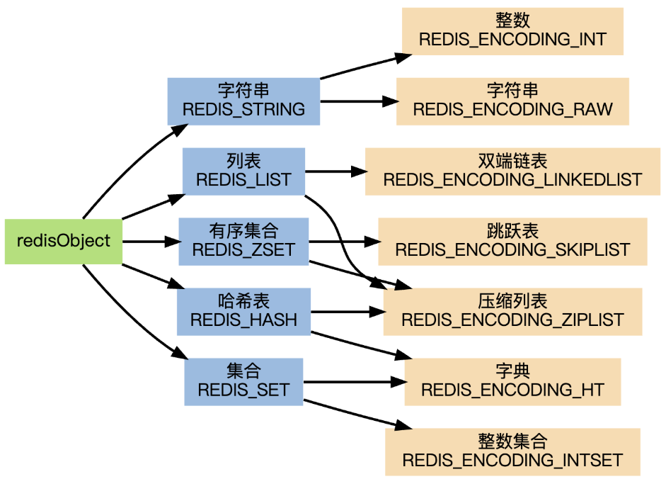

#### 第二章 SDS

simple dynamic string：简单动态字符串

+ O(1)获取长度
+ 避免缓冲区溢出
+ 减少修改字符串带来的内存重分配次数（free）
    + 空间预分配（SDS长度小于1MB，分配的free = len，大于等于1MB，分配free = 1MB）
    + 惰性空间释放（缩短SDS用free将这些字节记录，并等待以后使用）
+ 二进制安全（C串除字符串末尾不能包含空字符，SDS可以保存二进制数据）
+ 兼容C串部分函数（SDS也以"\0"结尾）

``` c
struct shshdr {
    // 记录已使用的字节数，即字符串的长度
    int len;
    // 记录未使用的字节数
    int free;
    char buf[];
}
```


#### 2.2 SDS与C串区别
通过未使用空间，SDS实现了空间预分配和惰性空间释放两种优化策略。
为了确保Redis可以适用于各种不同的使用场景，SDS的API都是二进制安全的（binary-safe），所有SDS API都会以处理二进制的方式来处理SDS存放在buf数组里的数据，程序不会对其中的数据做任何限制、过滤、或者假设，数据在写入时是什么样的，它被读取时就是什么样。


#### 第3章 链表

除链表键之外，发布与订阅、慢查询、监视器等功能也用到了链表，Redis服务器本身还使用链表来保存多个客户端的状态信息，以及使用链表来构建客户端输出缓冲区（output buffer）


#### 3.1 链表和链表节点的实现

list结构为链表提供了表头指针head、表尾指针tail，以及链表长度计数器len，而dup、free和match成员则是用于实现多态链表所需的类型特定函数

``` c
// 节点类
typedef struct listNode {
    // 前后节点的指针
    struct listNode* prev, next;
    // 多态类型的数据值
    void * value;
} listNode;

// 链表类，双端链表
typedef struct list {
    // 表头，表尾节点
    listNode* head, tail;
    unsigned long len;
    // 节点值复制函数，复制链表节点保存的值
    void *(*dup)(void *ptr);
    // 节点值释放函数，始放链表节点保存的值
    void (*free)(void， *ptr);
    // 节点值对比函数
	int (*match)(void *ptr, void *key);
} list;
```


#### 3.3 重点回顾
❑链表被广泛用于实现Redis的各种功能，比如列表键、发布与订阅、慢查询、监视器等。

❑每个链表节点由一个listNode结构来表示，每个节点都有一个指向前置节点和后置节点的指针，所以Redis的链表实现是双端链表。

❑每个链表使用一个list结构来表示，这个结构带有表头节点指针、表尾节点指针，以及链表长度等信息。

❑因为链表表头节点的前置节点和表尾节点的后置节点都指向NULL，所以Redis的链表实现是无环链表。

❑通过为链表设置不同的类型特定函数，Redis的链表可以用于保存各种不同类型的值


#### 第4章 字典

Redis的数据库就是使用字典来作为底层实现的，对数据库的增、删、查、改操作是构建在对字典的操作。
#### 4.1 字典的实现
==**又称符号表（symbol table），关联数组（associate array），映射（map）。是一种保存键值对的抽象数据结构**==

``` c
// 哈希表
typedef struct dictht {
    // 数组
    dictEntry **table;
    unsigned long size;
    // 哈希表大小掩码，用于计算索引值 = size - 1
    unsigned long sizemask;
    // 已有节点数量
    unsigned long used;
} dictht;

// 节点entry
typedef struct dictEntry {
    void *key;
    // 值
    union {
        void *val;
        uint64_tu64;
        int64_ts64;
    } v;
    // 指向下一个哈希表节点，形成单链表
    struct dictEntry *next;
} dictEntry;

/**
 * 字典数据结构
 */
typedef struct dict {
    // 类型特定函数
    dictType *type;
    void *privdata;
    // 哈希表
    dictht ht[2];
    // 当渐进式rehash没有进行时，值为-1
    int rehashidx;
} dict;

/**
 * 不同类型，设置不同函数
 */
typedef struct dictType {
    // 计算哈希值
    unsigned int(*hashFunction)(const void *key);
    // 键复制函数
    void *(*keyDup)(void *privdata, const void *key);
    // 值复制函数
    // 键对比函数
    // 键销毁函数
    // 值销毁函数
} dictType;
```

==ht属性是一个包含俩个项的数组，数组每项都是一个dictht哈希表（h1仅在渐进式rehash时会使用）==


#### 4.5 渐进式rehash

哈希表渐进式rehash详细步骤

1）为ht[1]分配空间，让字典同时持有ht[0]和ht[1]两个哈希表。

2）在字典中维持一个索引计数器变量rehashidx，并将它的值设置为0，表示rehash工作正式开始。

3）在rehash进行期间，每次对字典执行添加、删除、查找或者更新操作时，程序除了执行指定的操作以外，还会顺带将ht[0]哈希表在rehashidx索引上的所有键值对rehash到ht[1]，当rehash工作完成之后，程序将rehashidx属性的值增一。

4）随着字典操作的不断执行，最终在某个时间点上，ht[0]的所有键值对都会被rehash至ht[1]，这时程序将rehashidx属性的值设为-1，表示rehash操作已完成。

**渐进式rehash的好处在于它采取分而治之的方式，将rehash键值对所需的计算工作均摊到对字典的每个添加、删除、查找和更新操作上，从而避免了集中式rehash而带来的庞大计算量。**


#### 4.7 重点回顾

❑字典被广泛用于实现Redis的各种功能，其中包括数据库和哈希键。

❑Redis中的字典使用哈希表作为底层实现，每个字典带有两个哈希表，一个平时使用，另一个仅在进行rehash时使用。 

❑当字典被用作数据库的底层实现，或者哈希键的底层实现时，Redis使用MurmurHash2算法来计算键的哈希值。 

❑哈希表使用链地址法来解决键冲突，被分配到同一个索引上的多个键值对会连接成一个单向链表。

❑在对哈希表进行扩展或者收缩操作时，程序需要将现有哈希表包含的所有键值对rehash到新哈希表里面，并且这个rehash过程并不是一次性地完成的，而是渐进式地完成的


#### 第5章 跳跃表

Redis只在两个地方用到了跳跃表，一个是实现有序集合键，另一个是在集群节点中用作内部数据结构


#### 5.1 跳跃表的实现

跨度实际上是用来计算排位（rank）的：在查找某个节点的过程中，将沿途访问过的所有层的跨度累计起来，得到的结果就是目标节点在跳跃表中的排位。


#### 6.2 升级

每当我们要将一个新元素添加到整数集合里面，并且新元素的类型比整数集合现有所有元素的类型都要长时，整数集合需要先进行升级（upgrade），然后才能将新元素添加到整数集合里面。
无符号数零扩展，有符号数符号扩展容量


#### 第七章 压缩列表

内存连续的有序数据结构

ziplist：zlbytes、zltail、zllen、entry1、entry2、entryN、zlend

+ zlbytes：4字节，记录ziplist占用内存字节

+ zltail：4字节

+ zllen：2字节，列表节点数

+ entryX：变长字节，具体看节点内容

+ zlend：1字节，特殊值0xFF标记压缩列表结尾


zlentry节点

+ previous_entry_length：前一个节点长度
+ encoding：00 | 01 | 10 开头是字节数组、11开头是整数编码
+ data：字节数组 | 证书


#### 7.2 压缩列表节点的构成
因为节点的previous_entry_length属性记录了前一个节点的长度，所以程序可以通过指针运算，根据当前节点的起始地址来计算出前一个节点的起始地址
只要我们拥有了一个指向某个节点起始地址的指针，那么通过这个指针以及这个节点的previous_entry_length属性，程序就可以一直向前一个节点回溯，最终到达压缩列表的表头节点

#### 7.3 ziplist连锁更新
Redis将这种在特殊情况下产生的连续多次空间扩展操作称之为“连锁更新”（cascade update）
因为连锁更新在最坏情况下需要对压缩列表执行N次空间重分配操作，而每次空间重分配的最坏复杂度为O（N），所以连锁更新的最坏复杂度为O（N 2）。


#### 第8章 对象

Redis并没有直接使用这些数据结构来实现键值对数据库，而是基于这些数据结构创建了一个对象系统，这个系统包含**字符串对象、列表对象、哈希对象、集合对象和有序集合对象**这五种类型的对象，每种对象都用到了至少一种我们前面所介绍的数据结构。
**Redis的对象系统还实现了基于引用计数技术的内存回收机制**，当程序不再使用某个对象的时候，这个对象所占用的内存就会被自动释放；另外，Redis还通过引用计数技术实现了对象共享机制，这一机制可以在适当的条件下，通过让多个数据库键共享同一个对象来节约内存。




#### 8.1 对象的类型与编码
Redis中的每个对象都由一个redisObject结构表示，该结构中和保存数据有关的三个属性分别是

``` c
typedef struct redisObject {
    // 类型
    unsigned type:4;
    // 编码方式
    unsigned encoding:4;
    // 指向对象的指针
    void *ptr;
    
    // 引用计数
    int refcount;
    // 对齐
    unsigned notused:2;
    // LRU时钟:对象最后一次被命令程序访问的时间
    unsigned lru:22;
} robj;
```


**对于Redis数据库保存的键值对来说，键总是一个字符串对象，而值则可以是字符串对象、列表对象、哈希对象、集合对象或者有序集合对象的其中一种**
通过encoding属性来设定对象所使用的编码，而不是为特定类型的对象关联一种固定的编码，极大地提升了Redis的灵活性和效率，因为Redis可以根据不同的使用场景来为一个对象设置不同的编码，从而优化对象在某一场景下的效率。
介绍Redis中的五种不同类型的对象，说明这些对象底层所使用的编码方式，列出对象从一种编码转换成另一种编码所需的条件，以及同一个命令在多种不同编码上的实现方法。

``` shell
OBJECT ENCODING <key>
type <key>
```


#### 8.2 字符串对象

``` c
struct sdshdr {
    int len;
    int free;
    char buf[];
}
```


**==字符串对象的编码可以是int、raw或者embstr。==**
如果字符串对象保存的是一个字符串值，并且这个字符串值的长度大于32字节，那么字符串对象将使用一个简单动态字符串（SDS）来保存这个字符串值，并将对象的编码设置为raw。

embstr编码是专门用于保存短字符串的一种优化编码方式，这种编码和raw编码一样，都使用redisObject结构和sdshdr结构来表示字符串对象，但raw编码会调用两次内存分配函数来分别创建redisObject结构和sdshdr结构，而embstr编码则通过调用一次内存分配函数来分配一块连续的空间，空间中依次包含redisObject和sdshdr两个结构

**long double类型表示的浮点数在Redis中也是作为字符串值来保存的。**
因为Redis没有为embstr编码的字符串对象编写任何相应的修改程序（只有int编码的字符串对象和raw编码的字符串对象有这些程序），所以embstr编码的字符串对象实际上是只读的。当我们对embstr编码的字符串对象执行任何修改命令时，程序会先将对象的编码从embstr转换成raw，然后再执行修改命令。因为这个原因，embstr编码的字符串对象在执行修改命令之后，总会变成一个raw编码的字符串对象。


#### 8.3 列表对象

**==列表对象的编码可以是ziplist或者linkedlist==**

当列表对象可以同时满足以下两个条件时，列表对象使用ziplist编码： 

❑列表对象保存的所有字符串元素的长度都小于64字节；

❑列表对象保存的元素数量小于512个；不能满足这两个条件的列表对象需要使用linkedlist编码。


#### 8.4 哈希对象

**==哈希对象的编码可以是ziplist或者hashtable。==**

hashtable由dict结构实现

``` c
// 哈希对象
typedef struct dict {
    dictType *type;
    void *privdata;
    /**
     * ht[0]真正存放数据，渐进式rehash时dict[1]被使用
     */
    dictht ht[2];
    // -1 表示没有进行rehash
    long rehashidx;
    int iterators;
} dict;

// 哈希表数据结构
typedef struct dictht {
    dictEntry **table;
    unsigned long size;
    unsigned long sizemask;
    unsigned long used;
} dictht;
```


#### 8.5 集合对象

==**集合对象的编码可以是intset或者hashtable。**==
hashtable编码的集合对象使用字典作为底层实现，字典的每个键都是一个字符串对象，每个字符串对象包含了一个集合元素，而字典的值则全部被设置为NULL。
当集合对象可以同时满足以下两个条件时，对象使用intset编码： 

❑集合对象保存的所有元素都是整数值；

❑集合对象保存的元素数量不超过512个。 不能满足这两个条件的集合对象需要使用hashtable编码


#### 8.6 有序集合对象

**==有序集合对象的编码可以是ziplist或者skiplist==**

**skiplist编码的有序集合对象使用zset结构作为底层实现，一个zset结构同时包含一个字典和一个跳跃表「查找 O1，排序 OlogN」**
zset结构中的zsl跳跃表按分值从小到大保存了所有集合元素，每个跳跃表节点都保存了一个集合元素：跳跃表节点的object属性保存了元素的成员，而跳跃表节点的score属性则保存了元素的分值。通过这个跳跃表，程序可以对有序集合进行范围型操作，**比如ZRANK、ZRANGE等命令就是基于跳跃表API来实现的**。 除此之外，zset结构中的dict字典为有序集合创建了一个从成员到分值的映射，字典中的每个键值对都保存了一个集合元素：字典的键保存了元素的成员，而字典的值则保存了元素的分值。通过这个字典，程序可以用O（1）复杂度查找给定成员的分值，ZSCORE命令就是根据这一特性实现的，而很多其他有序集合命令都在实现的内部用到了这一特性。

``` c
typedef struct zset {
    // zrange,zrank
    ziplist *zsl;
    // O1获取元素
    dict *dict;
}
```


当有序集合对象可以同时满足以下两个条件时，对象使用ziplist编码：

 ❑有序集合保存的元素数量小于128个；

 ❑有序集合保存的所有元素成员的长度都小于64字节； 不满足以上两个条件的有序集合对象将使用skiplist编码。


#### 8.7 类型检查与命令多态

类型特定命令所进行的类型检查是通过redisObject结构的type属性来实现的：
Redis除了会根据值对象的类型来判断键是否能够执行指定命令之外，还会根据值对象的编码方式，选择正确的命令实现代码来执行命令。
#### 8.9 对象共享
在Redis中，让多个键共享同一个值对象需要执行以下两个步骤： 

1）将数据库键的值指针指向一个现有的值对象；

2）将被共享的值对象的引用计数增一。
目前来说，**Redis会在初始化服务器时，创建一万个字符串对象，这些对象包含了从0到9999的所有整数值，当服务器需要用到值为0到9999的字符串对象时，服务器就会使用这些共享对象，而不是新创建对象。**

#### 8.10 对象空转时长
除了前面介绍过的type、encoding、ptr和refcount四个属性之外，**redisObject结构包含的最后一个属性为lru属性，该属性记录了对象最后一次被命令程序访问的时间**
如果服务器打开了maxmemory选项，并且服务器用于回收内存的算法为volatile-lru或者allkeys-lru，那么当服务器占用的内存数超过了maxmemory选项所设置的上限值时，空转时长较高的那部分键会优先被服务器释放，从而回收内存。

#### 8.11 重点回顾
❑Redis数据库中的每个键值对的键和值都是一个对象。

❑**Redis共有字符串、列表、哈希、集合、有序集合五种类型的对象，每种类型的对象至少都有两种或以上的编码方式**，不同的编码可以在不同的使用场景上优化对象的使用效率。 

❑服务器在执行某些命令之前，会先检查给定键的类型能否执行指定的命令，而检查一个键的类型就是检查键的值对象的类型。 

❑Redis的对象系统带有引用计数实现的内存回收机制，当一个对象不再被使用时，该对象所占用的内存就会被自动释放。

❑**Redis会共享值为0到9999的字符串对象。** 

❑对象会记录自己的最后一次被访问的时间


#### 第九章 数据库

``` c
struct redisServer {
    // dbnum个数据库
    int dbnum;
    // 每一个数据库是一个redisDb结构
    redisDb **redisDb;
}

# 切换数据库
SELECT 2;

typedef struct redisDb {
    // 数据库键空间，保存所有键值对
    dict *dict;
    // 保存所有设置过期时间的键值对
    dict *expireDict;
} redisDb;
```


#### 9.3 数据库键空间
空间和用户所见的数据库是直接对应的：

❑**键空间的键也就是数据库的键，每个键都是一个字符串对象。** 

❑键空间的值也就是数据库的值，每个值可以是字符串对象、列表对象、哈希表对象、集合对象和有序集合对象中的任意一种Redis对象。
当使用Redis命令对数据库进行读写时，服务器不仅会对键空间执行指定的读写操作，还会执行一些额外维护操作


#### 9.4 设置键的生存时间或过期时间

**通过EXPIRE命令或者PEXPIRE命令**，客户端可以以秒或者毫秒精度为数据库中的某个键设置生存时间（Time To Live，TTL），在经过指定的秒数或者毫秒数之后，服务器就会自动删除生存时间为0的键：
虽然有多种不同单位和不同形式的设置命令，但实际上EXPIRE、PEXPIRE、EXPIREAT三个命令都是使用PEXPIREAT命令来实现的：无论客户端执行的是以上四个命令中的哪一个，经过转换之后，最终的执行效果都和执行PEXPIREAT命令一样。
redisDb结构的expires字典保存了数据库中所有键的过期时间，我们称这个字典为过期字典
在这个例子中，键空间保存了数据库中的所有键值对，而过期字典则保存了数据库键的过期时间。
PERSIST命令可以移除一个键的过期时间
在实际中，Redis检查键是否过期的方法和is_expired函数所描述的方法一致，因为直接访问字典比执行一个命令稍微快一些。

``` shell
EXPIRE <key> 20
EXPIRE AT <key> <timestamp>
PEXPIRE <key> 2000
```


#### 9.5 过期键删除策略
三种不同的删除策略

❑定时删除：在设置键的过期时间的同时，创建一个定时器（timer），让定时器在键的过期时间来临时，立即执行对键的删除操作

❑惰性删除：放任键过期不管，但是每次从键空间中获取键时，都检查取得的键是否过期，如果过期的话，就删除该键；如果没有过期，就返回该键

❑定期删除：每隔一段时间，程序就对数据库进行一次检查，删除里面的过期键。至于要删除多少过期键，以及要检查多少个数据库，则由算法决定

 在这三种策略中，第一种和第三种为主动删除策略，而第二种则为被动删除策略

#### 9.6 Redis的过期键删除策略

**惰性删除 + 定期删除**

过期键的惰性删除策略由db.c/expireIfNeeded函数实现，所有读写数据库的Redis命令在执行之前都会调用expireIfNeeded函数对输入键进行检查
过期键的定期删除策略由redis.c/activeExpireCycle函数实现，每当**==Redis的服务器周期性操作redis.c/serverCron函数==**执行时，activeExpireCycle函数就会被调用，它在规定的时间内，分多次遍历服务器中的各个数据库，从数据库的expires字典中随机检查一部分键的过期时间，并删除其中的过期键。 


#### 9.7 AOF、RDB和复制功能对过期键的处理
RDB持久化功能、AOF持久化功能以及复制功能是如何处理数据库中的过期键的？

在执行SAVE命令或者BGSAVE命令创建一个新的RDB文件时，程序会对数据库中的键进行检查，已过期的键不会被保存到新创建的RDB文件中。
AOF文件写入 当服务器以AOF持久化模式运行时，如果数据库中的某个键已经过期，但它还没有被惰性删除或者定期删除，那么AOF文件不会因为这个过期键而产生任何影响。 当过期键被惰性删除或者定期删除之后，程序会向AOF文件追加（append）一条DEL命令，来显式地记录该键已被删除。
和生成RDB文件时类似，在执行AOF重写的过程中，程序会对数据库中的键进行检查，已过期的键不会被保存到重写后的AOF文件中。
**通过由主服务器来控制从服务器统一地删除过期键，可以保证主从服务器数据的一致性，也正是因为这个原因，当一个过期键仍然存在于主服务器的数据库时，这个过期键在从服务器里的复制品也会继续存在。**
如果这时有客户端向从服务器发送命令GET message，那么从服务器将发现message键已经过期，但从服务器并不会删除message键，而是继续将message键的值返回给客户端，就好像message键并没有过期一样

``` shell
# 阻塞，主线程进行 RDB
SAVE
# fork 子进程进行 RDB
BGSAVE

# AOF 重写
BGREWRITEAOF
```


#### 9.8 数据库通知
数据库通知是Redis 2.8版本新增加的功能，这个功能可以让客户端通过订阅给定的频道或者模式，来获知数据库中键的变化，以及数据库中命令的执行情况。

**发布订阅模式；所以redis可作为注册中心**
某个键执行了什么命令”的通知称为键空间通知（key-space notification），除此之外，还有另一类称为键事件通知（key-event notification）的通知，它们关注的是“某个命令被什么键执行了”。

``` shell
SUBSCRIBE <subject1> <subject2> ...

PUBLISH <subject> <message>

# 取消订阅所有频道
UNSUBSCRIBE
UNSUBSCRIBE <subject>

# 模式匹配，订阅
PSUBSCRIBE news.*

# 模式匹配，取消订阅
PUNSUBSCRIBE news.*
```


#### 9.9 重点回顾
❑Redis服务器的所有数据库都保存在redisServer.db数组中，而数据库的数量则由redisServer.dbnum属性保存。

❑客户端通过修改目标数据库指针，让它指向redisServer.db数组中的不同元素来切换不同的数据库

❑**数据库主要由dict和expires两个字典构成，其中dict字典负责保存键值对，而expires字典则负责保存键的过期时间**

❑因为数据库由字典构成，所以对数据库的操作都是建立在字典操作之上的。

❑**数据库的键总是一个字符串对象，而值则可以是任意一种Redis对象类型**，包括字符串对象、哈希表对象、集合对象、列表对象和有序集合对象，分别对应字符串键、哈希表键、集合键、列表键和有序集合键

❑expires字典的键指向数据库中的某个键，而值则记录了数据库键的过期时间，过期时间是一个以毫秒为单位的UNIX时间戳。

❑**Redis使用惰性删除和定期删除两种策略来删除过期的键**：惰性删除策略只在碰到过期键时才进行删除操作，定期删除策略则每隔一段时间主动查找并删除过期键

❑执行SAVE命令或者BGSAVE命令所产生的新RDB文件不会包含已经过期的键

❑执行BGREWRITEAOF命令所产生的重写AOF文件不会包含已经过期的键。

❑当一个过期键被删除之后，服务器会追加一条DEL命令到现有AOF文件的末尾，显式地删除过期键。

❑当主服务器删除一个过期键之后，它会向所有从服务器发送一条DEL命令，显式地删除过期键。

❑**从服务器即使发现过期键也不会自作主张地删除它，而是等待主节点发来DEL命令**，这种统一、中心化的过期键删除策略可以保证主从服务器数据的一致性。

❑当Redis命令对数据库进行修改之后，服务器会根据配置向客户端发送数据库通知。


#### 第10章 RDB持久化
==我们将服务器中的非空数据库以及它们的键值对统称为数据库状态==
为解决这个问题，Redis提供了RDB持久化功能，这个功能可以将Redis在内存中的数据库状态保存到磁盘里面，避免数据意外丢失
RDB持久化功能所生成的RDB文件是一个经过压缩的二进制文件，通过该文件可以还原生成RDB文件时的数据库状态

#### 10.1 RDB文件的创建与载入
**有两个Redis命令可以用于生成RDB文件，一个是SAVE，另一个是BGSAVE。** 

SAVE命令会阻塞Redis服务器进程，直到RDB文件创建完毕为止，在服务器进程阻塞期间，服务器不能处理任何命令请求： 
redis＞ SAVE //等待直到RDB文件创建完毕 
OK
RDB文件的载入工作是在服务器启动时自动执行的，所以Redis并没有专门用于载入RDB文件的命令，只要Redis**服务器在启动时检测到RDB文件存在，它就会自动载入RDB文件。**
**如果服务器开启了AOF持久化功能，那么服务器会优先使用AOF文件来还原数据库状态。**
在BGSAVE命令执行期间，服务器处理SAVE、BGSAVE、BGREWRITEAOF三个命令的方式会和平时有所不同。

#### 10.2 自动间隔性保存
``` properties
900 1
300 10
60 10000
```

服务器程序会根据save选项所设置的保存条件，设置服务器状态redisServer结构的saveparams属性
**==Redis的服务器周期性操作函数serverCron默认每隔100毫秒就会执行一次，该函数用于对正在运行的服务器进行维护==**，它的其中一项工作就是检查save选项所设置的保存条件是否已经满足，如果满足的话，就执行BGSAVE命令。

#### 10.3 RDB文件结构
check_sum是一个8字节长的无符号整数，保存着一个校验和，这个校验和是程序通过对REDIS、db_version、databases、EOF四个部分的内容进行计算得出的。服务器在载入RDB文件时，会将载入数据所计算出的校验和与check_sum所记录的校验和进行对比，以此来检查RDB文件是否有出错或者损坏的情况出现
REDIS_ENCODING_*编码曾经在第8章中介绍过，如果忘记了可以去回顾一下。 1.字符串对象 如果TYPE的值为REDIS_RDB_TYPE_STRING，那么value保存的就是一个字符串对象，字符串对象的编码可以是REDIS_ENCODING_INT或者REDIS_ENCODING_RAW。

❑如果字符串的长度小于等于20字节，那么这个字符串会直接被原样保存。 

❑如果字符串的长度大于20字节，那么这个字符串会被压缩之后再保存

#### 10.4 分析RDB文件
RDB文件由四部分组成：

❑五个字节的"REDIS"字符串

❑四个字节的版本号（db_version）

❑一个字节的EOF常量

❑八个字节的校验和（check_sum）


一个带有过期时间的键值对将由以下部分组成： 

❑一个一字节长的EXPIRETIME_MS特殊值。

❑一个八字节长的过期时间（ms）。

❑一个一字节长的类型（TYPE）

❑一个键（key）和一个值（value）


RDB文件各个部分的意义

❑REDIS0006：RDB文件标志和版本号

❑376\0：切换到0号数据库

❑374：代表特殊值EXPIRETIME_MS

❑\2 365 336@001\0\0：代表八字节长的过期时间

❑\0 003 M S G：\0表示这是一个字符串键，003是键的长度，MSG是键

❑005 H E L L O：005是值的长度，HELLO是值

❑377：代表EOF常量

❑212 231 x 247 252 } 021 306：代表八字节长的校验和。


#### 10.5 重点回顾

❑RDB文件用于保存和还原Redis服务器所有数据库中的所有键值对数据。 

❑SAVE命令由服务器进程直接执行保存操作，所以该命令会阻塞服务器。 

❑BGSAVE令由子进程执行保存操作，所以该命令不会阻塞服务器。 

❑服务器状态中会保存所有用save选项设置的保存条件，当任意一个保存条件被满足时，服务器会自动执行BGSAVE命令。 

❑RDB文件是一个经过压缩的二进制文件，由多个部分组成。 

❑对于不同类型的键值对，RDB文件会使用不同的方式来保存它们。


#### 第11章 AOF持久化

RDB持久化保存数据库状态的方法是将msg、fruits、numbers三个键的键值对保存到RDB文件中，而AOF持久化保存数据库状态的方法则是将服务器执行的SET、SADD、RPUSH三个命令保存到AOF文件中。

#### 11.1 AOF持久化的实现
**AOF持久化功能的实现可以分为命令追加（append）、文件写入、文件同步（sync）三个步骤。**

**Redis的服务器进程就是一个事件循环（loop）**

+ 文件事件
+ 时间事件

这个循环中的**==文件事件负责接收客户端的命令请求，以及向客户端发送命令回复，而时间事件则负责执行像serverCron函数这样需要定时运行的函数==**。

为了提高文件的写入效率，在现代操作系统中，当用户调用write函数，将一些数据写入到文件的时候，操作系统通常会将写入数据暂时保存在一个内存缓冲区里面，等到缓冲区的空间被填满、或者超过了指定的时限之后，才真正地将缓冲区中的数据写入到磁盘里面。
系统提供了fsync和fdatasync两个同步函数，它们可以强制让操作系统立即将缓冲区中的数据写入到硬盘里面，从而确保写入数据的安全性。
但从安全性来说，always也是最安全的，因为即使出现故障停机，AOF持久化也只会丢失一个事件循环中所产生的命令数据。

#### 11.2 AOF文件的载入与数据还原
Redis读取AOF文件步骤如下

1）创建一个不带网络连接的伪客户端（fake client）：因为Redis的命令只能在客户端上下文中执行，而载入AOF文件时所使用的命令直接来源于AOF文件而不是网络连接，所以服务器使用了一个没有网络连接的伪客户端来执行AOF文件保存的写命令，伪客户端执行命令的效果和带网络连接的客户端执行命令的效果完全一样

2）从AOF文件中分析并读取出一条写命令

3）使用伪客户端执行被读出的写命令

4）一直执行步骤2和步骤3，直到AOF文件中的所有写命令都被处理完毕为止。

#### 11.3 AOF重写
因为AOF持久化是记录命令的，AOF文件中的内容会越来越多，使用AOF文件来进行数据还原所需的时间就越多。

**AOF文件重写并不需要对现有的AOF文件进行任何读取、分析或者写入操作，这个功能是通过读取服务器当前的数据库状态来实现的**

AOF原理：从数据库中读取键现在的值，然后用一条命令去记录键值对，代替之前记录这个键值对的多条命令

在实际中，为了避免在执行命令时造成客户端输入缓冲区溢出，重写程序在处理列表、哈希表、集合、有序集合这四种可能会带有多个元素的键时，会先检查键所包含的元素数量，如果元素的数量超过了redis.h/REDIS_AOF_REWRITE_ITEMS_PER_CMD常量的值，那么重写程序将使用多条命令来记录键的值

Redis决定将AOF重写程序放到子进程里执行，这样做可以同时达到两个目的：

❑子进程进行AOF重写期间，服务器进程（父进程）可以继续处理命令请求

❑子进程带有服务器进程的数据副本，使用子进程而不是线程，可以在避免使用锁的情况下，保证数据的安全性
为了解决这种数据不一致问题，Redis服务器设置了一个AOF重写缓冲区，这个缓冲区在服务器创建子进程之后开始使用，当Redis服务器执行完一个写命令之后，它会同时将这个写命令发送给AOF缓冲区和AOF重写缓冲区

在子进程执行AOF重写期间，服务器进程需要执行以下三个工作：

1）执行客户端发来的命令。

2）将执行后的写命令追加到AOF缓冲区。

3）将执行后的写命令追加到AOF重写缓冲区。
	1）将AOF重写缓冲区中的所有内容写入到新AOF文件中，这时新AOF文件所保存的数据库状态将和服务器当前的数据库状态一致

​	2）对新的AOF文件进行改名，原子地（atomic）覆盖现有的AOF文件，完成新旧两个AOF文件的替换。

#### 11.4 重点回顾
❑AOF文件通过保存所有修改数据库的写命令请求来记录服务器的数据库状态。

❑AOF文件中的所有命令都以Redis命令请求协议的格式保存。

❑命令请求会先保存到AOF缓冲区里面，之后再定期写入并同步到AOF文件。

❑appendfsync选项的不同值对AOF持久化功能的安全性以及Redis服务器的性能有很大的影响。 ❑服务器只要载入并重新执行保存在AOF文件中的命令，就可以还原数据库本来的状态。

❑AOF重写可以产生一个新的AOF文件，这个新的AOF文件和原有的AOF文件所保存的数据库状态一样，但体积更小。

❑AOF重写是一个有歧义的名字，该功能是通过读取数据库中的键值对来实现的，程序无须对现有AOF文件进行任何读入、分析或者写入操作。

❑在执行BGREWRITEAOF命令时，Redis服务器会维护一个AOF重写缓冲区，该缓冲区会在子进程创建新AOF文件期间，记录服务器执行的所有写命令。当子进程完成创建新AOF文件的工作之后，服务器会将重写缓冲区中的所有内容追加到新AOF文件的末尾，使得新旧两个AOF文件所保存的数据库状态一致。最后，服务器用新的AOF文件替换旧的AOF文件，以此来完成AOF文件重写操作。

#### 第12章 事件
**Redis服务器是一个事件驱动程序，服务器需要处理以下两类事件：**

❑**文件事件（file event）**：Redis服务器通过套接字与客户端（或者其他Redis服务器）进行连接，而文件事件就是服务器对套接字操作的抽象。服务器与客户端（或者其他服务器）的通信会产生相应的文件事件，而服务器则通过监听并处理这些事件来完成一系列网络通信操作

❑**时间事件（time event）**：Redis服务器中的一些操作（比如serverCron函数）需要在给定的时间点执行，而时间事件就是服务器对这类定时操作的抽象。

> 所谓 Redis 单线程是指 Redis 在处理文件事件是单线程的（单 Reactor）

#### 12.1 文件事件
文件事件是对套接字操作的抽象，每当一个套接字准备好执行连接应答（accept）、写入、读取、关闭等操作时，就会产生一个文件事件

**单Reactor单线程**
尽管多个文件事件可能会并发地出现，但I/O多路复用程序总是会将所有产生事件的套接字都放到一个队列里面，然后通过这个队列，以有序（sequentially）、同步（synchronously）、每次一个套接字的方式向文件事件分派器传送套接字。当上一个套接字产生的事件被处理完毕之后（该套接字为事件所关联的事件处理器执行完毕），I/O多路复用程序才会继续向文件事件分派器传送下一个套接字

**==Redis的I/O多路复用程序的所有功能都是通过包装常见的select、epoll、evport和kqueue这些I/O多路复用函数库来实现的==**

**程序会在编译时自动选择系统中性能最高的I/O多路复用函数库来作为Redis的I/O多路复用程序的底层实现**

每个I/O多路复用函数库在Redis源码中都对应一个单独的文件，比如ae_select.c、ae_epoll.c、ae_kqueue.c，诸如此类。因为Redis为每个I/O多路复用函数库都实现了相同的API，所以I/O多路复用程序的底层实现是可以互换的
Redis在I/O多路复用程序的实现源码中用

```lua
#include宏定义了相应的规则，程序会在编译时自动选择系统中性能最高的I/O多路复用函数库来作为Redis的I/O多路复用程序的底层实现
ifdef HAVE_EVPORT
	include 'ae_evport.c'
else
	ifdef HAVE_EPOLL
		include 'ae_epoll.c'
	else
		include 'ae_poll.c'
	endif
endif
```


如果一个套接字又可读又可写的话，那么服务器将先读套接字，后写套接字。
AE_WRITABLE。 ae.c/aeWait函数接受一个套接字描述符、一个事件类型和一个毫秒数为参数，在给定的时间内阻塞并等待套接字的给定类型事件产生，当事件成功产生，或者等待超时之后，函数返回。

后再去遍历所有监听的fd，看哪个fd的时间准备好了？而epoll则是为每个监听的fd设置callback？
指定的时间內，阻塞并等待所有被aeCreateFileEvent函数设置为监听状态的套接字产生文件事件，当有至少一个事件产生，或者等待超时后，函数返回。
ae.c/aeProcessEvents函数是文件事件分派器，它先调用aeApiPoll函数来等待事件产生，然后遍历所有已产生的事件，并调用相应的事件处理器来处理这些事件

❑为了对连接服务器的各个客户端进行应答，服务器要为监听套接字关联连接应答处理器。

❑为了接收客户端传来的命令请求，服务器要为客户端套接字关联命令请求处理器

❑为了向客户端返回命令的执行结果，服务器要为客户端套接字关联命令回复处理器

❑当主服务器和从服务器进行复制操作时，主从服务器都需要关联特别为复制功能编写的复制处理器。


#### 12.2 时间事件

一个时间事件主要由以下三个属性组成：

❑id：服务器为时间事件创建的全局唯一ID（标识号）。ID号按从小到大的顺序递增，新事件的ID号比旧事件的ID号要大

❑when：毫秒精度的UNIX时间戳，记录了时间事件的到达（arrive）时间

❑timeProc：时间事件处理器，一个函数。当时间事件到达时，服务器就会调用相应的处理器来处理事件。
事件处理器返回一个非AE_NOMORE的整数值，那么这个事件为周期性时间：当一个时间事件到达之后，服务器会根据事件处理器返回的值，对时间事件的when属性进行更新，让这个事件在一段时间之后再次到达，并以这种方式一直更新并运行下去

所有时间事件都放在一个无序链表中，每当时间事件执行器运行时，它就遍历整个链表，查找所有已到达的时间事件，并调用相应的事件处理器。
**正常模式下的Redis服务器只使用serverCron一个时间事件**，而在benchmark模式下，服务器也只使用两个时间事件。

``` python
def processTimeEvents():
    # 遍历服务器中的所有时间事件
    for time_event in all_time_event():
        # 检查事件是否已经到达
        if time_event.when ＜= unix_ts_now():
            # 事件已到达
            # 执行事件处理器，并获取返回值
            retval = time_event.timeProc()
            # 如果这是一个定时事件
            if retval == AE_NOMORE:
                # 那么将该事件从服务器中删除
                delete_time_event_from_server(time_event)
                # 如果这是一个周期性事件
            else:
                # 那么按照事件处理器的返回值更新时间事件的 when属性
                # 让这个事件在指定的时间之后再次到达
                update_when(time_event, retval)
```


持续运行的Redis服务器需要定期对自身的资源和状态进行检查和调整，从而确保服务器可以长期、稳定地运行，**这些定期操作由redis.c/serverCron函数负责执行，它的主要工作包括**

❑更新服务器的各类统计信息，比如时间、内存占用、数据库占用情况等

❑清理数据库中的过期键值对

❑关闭和清理连接失效的客户端

❑尝试进行AOF或RDB持久化操作

❑如果服务器是主服务器，那么对从服务器进行定期同步

❑**如果处于集群模式，对集群进行定期同步和连接测试**。Redis服务器以周期性事件的方式来运行serverCron函数，在服务器运行期间，每隔一段时间，serverCron就会执行一次，直到服务器关闭为止。

**在Redis2.6版本，服务器默认规定serverCron每秒运行10次**


#### 12.3 事件的调度与执行

将aeProcessEvents函数置于一个循环里面，加上初始化和清理函数，这就构成了Redis服务器的主函数，以下是该函数的伪代码表示：
**对文件事件和时间事件的处理都是同步、有序、原子地执行的，服务器不会中途中断事件处理，也不会对事件进行抢占，因此，不管是文件事件的处理器，还是时间事件的处理器，它们都会尽可地减少程序的阻塞时间，并在有需要时主动让出执行权，从而降低造成事件饥饿的可能性**。比如说，在命令回复处理器将一个命令回复写入到客户端套接字时，如果写入字节数超过了一个预设常量的话，命令回复处理器就会主动用break跳出写入循环，将余下的数据留到下次再写；另外，时间事件也会将非常耗时的持久化操作放到子线程或者子进程执行。

❑因为时间事件尚未到达，所以在处理时间事件之前，服务器已经等待并处理了两次文件事件

❑**因为处理事件的过程中不会出现抢占，所以实际处理时间事件的时间比预定的100毫秒慢了30毫秒。**

#### 12.4 重点回顾
❑Redis服务器是一个事件驱动程序，服务器处理的事件分为时间事件和文件事件两类

❑文件事件处理器是基于Reactor模式实现的网络通信程序

❑文件事件是对套接字操作的抽象：每次套接字变为可应答（acceptable）、可写（writable）或者可读（readable）时，相应的文件事件就会产生

❑文件事件分为AE_READABLE事件（读事件）和AE_WRITABLE事件（写事件）两类

❑时间事件分为定时事件和周期性事件：定时事件只在指定的时间到达一次，而周期性事件则每隔一段时间到达一次

❑服务器在一般情况下只执行serverCron函数一个时间事件，并且这个事件是周期性事件

❑文件事件和时间事件之间是合作关系，服务器会轮流处理这两种事件，并且处理事件的过程中也不会进行抢占。

❑时间事件的实际处理时间通常会比设定的到达时间晚一些。


#### 13.1 客户端属性

❑REDIS_MULTI标志表示客户端正在执行事务

❑REDIS_DIRTY_CAS标志表示事务使用WATCH命令监视的数据库键已经被修改，REDIS_DIRTY_EXEC标志表示事务在命令入队时出现了错误，以上两个标志都表示事务的安全性已经被破坏，只要这两个标记中的任意一个被打开，EXEC命令必然会执行失败。这两个标志只能在客户端打开了REDIS_MULTI标志的情况下使用。
命令表示例，该表是一个字典，字典的键是一个SDS结构，保存了命令的名字，字典的值是命令所对应的redisCommand结构，这个结构保存了命令的实现函数、命令的标志、命令应该给定的参数个数、命令的总执行次数和总消耗时长等统计信息。
执行命令所得的命令回复会被保存在客户端状态的输出缓冲区里面，每个客户端都有两个输出缓冲区可用，一个缓冲区的大小是固定的，另一个缓冲区的大小是可变的：

❑固定大小的缓冲区用于保存那些长度比较小的回复，比如OK、简短的字符串值、整数值、错误回复等等。

❑可变大小的缓冲区用于保存那些长度比较大的回复，比如一个非常长的字符串值，一个由很多项组成的列表，一个包含了很多元素的集合等等。


#### 14.1 命令请求的执行过程

命令实现函数会将命令回复保存到客户端的输出缓冲区里面，并为客户端的套接字关联命令回复处理器，当客户端套接字变为可写状态时，服务器就会执行命令回复处理器，将保存在客户端输出缓冲区中的命令回复发送给客户端。当命令回复发送完毕之后，回复处理器会清空客户端状态的输出缓冲区，为处理下一个命令请求做好准备。


#### 14.2 serverCron函数
Redis服务器中有不少功能需要获取系统的当前时间，而每次获取系统的当前时间都需要执行一次系统调用，**为了减少系统调用的执行次数，服务器状态中的unixtime属性和mstime属性被用作当前时间的缓存**

==**serverCron函数默认会以每100毫秒一次的频率更新unixtime属性和mstime属性，所以这两个属性记录的时间的精确度并不高**==

❑服务器只会在打印日志、更新服务器的LRU时钟、决定是否执行持久化任务、计算服务器上线时间（uptime）这类对时间精确度要求不高的功能上

❑**对于为键设置过期时间、添加慢查询日志这种需要高精确度时间的功能来说，服务器还是会再次执行系统调用，从而获得最准确的系统当前时间。**

serverCron函数默认会以每10秒一次的频率更新lruclock属性的值，因为这个时钟不是实时的，所以根据这个属性计算出来的LRU时间实际上只是一个模糊的估算值。

每次serverCron函数运行时，程序都会对服务器状态的shutdown_asap属性进行检查，并根据属性的值决定是否关闭服务器

在服务器执行BGSAVE命令的期间，如果客户端向服务器发来BGREWRITEAOF命令，那么服务器会将BGREWRITEAOF命令的执行时间延迟到BGSAVE命令执行完毕之后。服务器的aof_rewrite_scheduled标识记录了服务器是否延迟了BGREWRITEAOF命令

每次serverCron函数执行时，程序都会检查rdb_child_pid和aof_child_pid两个属性的值，只要其中一个属性的值不为-1，程序就会执行一次wait3函数，检查子进程是否有信号发来服务器进程

❑如果有信号到达，那么表示新的RDB文件已经生成完毕（对于BGSAVE命令来说），或者AOF文件已经重写完毕（对于BGREWRITEAOF命令来说），服务器需要进行相应命令的后续操作，比如用新的RDB文件替换现有的RDB文件，或者用重写后的AOF文件替换现有的AOF文件。
服务器状态的cronloops属性记录了serverCron函数执行的次数


#### 14.4 重点回顾

❑一个命令请求从发送到完成主要包括以下步骤

1）客户端将命令请求发送给服务器

2）服务器读取命令请求，并分析出命令参数

3）命令执行器根据参数查找命令的实现函数，然后执行实现函数并得出命令回复

4）服务器将命令回复返回给客户端

❑serverCron函数默认每隔100毫秒执行一次，它的工作主要包括更新服务器状态信息，处理服务器接收的SIGTERM信号，管理客户端资源和数据库状态，检查并执行持久化操作等等

❑服务器从启动到能够处理客户端的命令请求需要执行以下步骤

1）初始化服务器状态

2）载入服务器配置

3）初始化服务器数据结构

4）还原数据库状态

5）执行事件循环


#### 第15章 主从复制

主从服务器心跳检测机制的实现原理，并对基于心跳检测实现的几个功能进行介绍。

#### 15.2 旧版复制功能的缺陷
每次执行SYNC命令，主从服务器需要执行以下动作：

**1）主服务器需要执行BGSAVE命令来生成RDB文件**，这个生成操作会耗费主服务器大量的CPU、内存和磁盘I/O资源。

**2）主服务器需要将自己生成的RDB文件发送给从服务器**，这个发送操作会耗费主从服务器大量的网络资源（带宽和流量），并对主服务器响应命令请求的时间产生影响。

**3）接收到RDB文件的从服务器需要载入主服务器发来的RDB文件**，并且在载入期间，从服务器会因为阻塞而没办法处理命令请求。

``` shell
SYNC
```


#### 15.3 新版复制功能的实现
**==执行SYNC命令需要生成、传送和载入整个RDB文件，而部分重同步只需要将从服务器缺少的写命令发送给从服务器执行就可以了。==**


#### 15.4 部分重同步的实现
执行复制的双方——主服务器和从服务器会分别维护一个复制偏移量：
==复制积压缓冲区==是由主服务器维护的一个固定长度（fixed-size）先进先出（FIFO）队列，默认大小为1MB。
如果offset偏移量之后的数据（也即是偏移量offset+1开始的数据）仍然存在于复制积压缓冲区里面，那么主服务器将对从服务器执行部分重同步操作。

❑相反，如果offset偏移量之后的数据已经不存在于复制积压缓冲区，那么主服务器将对从服务器执行完整重同步操作

#### 15.7 心跳检测
如果因为网络故障，主服务器传播给从服务器的写命令在半路丢失，那么**当从服务器向主服务器发送REPLCONF ACK命令时，主服务器将发觉从服务器当前的复制偏移量少于自己的复制偏移量**，然后主服务器就会根据从服务器提交的复制偏移量，在复制积压缓冲区里面找到从服务器缺少的数据，并将这些数据重新发送给从服务器。

``` shell
REPLCONFACK
```


#### 15.8 重点回顾
❑Redis 2.8以前的复制功能不能高效地处理断线后重复制情况，但Redis 2.8新添加的部分重同步功能可以解决这个问题

❑**部分重同步通过复制偏移量、复制积压缓冲区、服务器运行ID三个部分来实现**

❑在复制操作刚开始的时候，从服务器会成为主服务器的客户端，并通过向主服务器发送命令请求来执行复制步骤，而在复制操作的后期，主从服务器会互相成为对方的客户端

❑主服务器通过向从服务器传播命令来更新从服务器的状态，保持主从服务器一致，而从服务器则通过向主服务器发送命令来进行心跳检测，以及命令丢失检测。


#### 第16章 Sentinel

**Sentinel（哨岗、哨兵）是Redis的高可用性（high availability）解决方案**：由一个或多个Sentinel实例（instance）组成的Sentinel系统（system）可以监视任意多个主服务器，以及这些主服务器属下的所有从服务器，并在被监视的主服务器进入下线状态时，自动将下线主服务器属下的某个从服务器升级为新的主服务器，然后由新的主服务器代替已下线的主服务器继续处理命令请求。
Sentinel系统将server2升级为新的主服务器，并让服务器server3和server4成为server2的从服务器的过程。之后，如果server1重新上线的话，它将被Sentinel系统降级为server2的从服务器

#### 16.1 启动并初始化Sentinel
当一个Sentinel启动时，它需要执行以下步骤：

1）初始化服务器。

2）将普通Redis服务器使用的代码替换成Sentinel专用代码。

3）初始化Sentinel状态。

4）根据给定的配置文件，初始化Sentinel的监视主服务器列表。

5）创建连向主服务器的网络连接。
PING、SENTINEL、INFO、SUBSCRIBE、UNSUBSCRIBE、PSUBSCRIBE和PUNSUBSCRIBE这七个命令就是客户端可以对Sentinel执行的全部命令了。
在应用了Sentinel的专用代码之后，接下来，服务器会初始化一个sentinel.c/sentinelState结构（后面简称“Sentinel状态”），这个结构保存了服务器中所有和Sentinel功能有关的状态（服务器的一般状态仍然由redis.h/redisServer结构保存）

Sentinel会创建两个连向主服务器的异步网络连接

❑一个是命令连接，这个连接专门用于向主服务器发送命令，并接收命令回复

❑另一个是订阅连接，这个连接专门用于订阅主服务器的`__sentinel__:hello`频道。

#### 16.3 获取从服务器信息
Sentinel除了会为这个新的从服务器创建相应的实例结构之外，Sentinel还会创建连接到从服务器的命令连接和订阅连接。

#### 16.4 向主服务器和从服务器发送信息
在默认情况下，**Sentinel会以每两秒一次的频率，通过命令连接向所有被监视的主服务器和从服务器发送以下格式的命令：**
示例包含以下信息：

❑Sentinel的IP地址为127.0.0.1端口号为26379，运行ID为e955b4c85598ef5b5f055bc7ebfd5e828dbed4fa，当前的配置纪元为0

❑主服务器的名字为mymaster，IP地址为127.0.0.1，端口号为6379，当前的配置纪元为0。

#### 16.5 接收来自主服务器和从服务器的频道信息
对于每个与Sentinel连接的服务器，Sentinel既通过命令连接向服务器的``__sentinel__:hello`频道发送信息，又通过订阅连接从服务器的`__sentinel__:hello`频道接收信息
当Sentinel通过频道信息发现一个新的Sentinel时，它不仅会为新Sentinel在sentinels字典中创建相应的实例结构，还会创建一个连向新Sentinel的命令连接，而新Sentinel也同样会创建连向这个Sentinel的命令连接，最终监视同一主服务器的多个Sentinel将形成相互连接的网络

#### 16.6 检测主观下线状态
在默认情况下，Sentinel会以每秒一次的频率向所有与它创建了命令连接的实例（包括主服务器、从服务器、其他Sentinel在内）发送PING命令，并通过实例返回的PING命令回复来判断实例是否在线。

#### 16.8 选举领头Sentinel
**Sentinel设置局部领头Sentinel的规则是先到先得**：最先向目标Sentinel发送设置要求的源Sentinel将成为目标Sentinel的局部领头Sentinel，而之后接收到的所有设置要求都会被目标Sentinel拒绝。

#### 16.9 故障转移
1）在已下线主服务器属下的所有从服务器里面，挑选出一个从服务器，并将其转换为主服务器。

2）让已下线主服务器属下的所有从服务器改为复制新的主服务器。

3）将已下线主服务器设置为新的主服务器的从服务器，当这个旧的主服务器重新上线时，它就会成为新的主服务器的从服务器。


#### 第17章 集群
**==Redis集群是Redis提供的分布式数据库方案，集群通过分片（sharding）来进行数据共享，并提供复制和故障转移功能。==**

集群通常有两种解决方案：

1. 全量复制
2. 分片复制


#### 17.1 节点
redisClient结构和clusterLink结构都有自己的套接字描述符和输入、输出缓冲区，这两个结构的区别在于，redisClient结构中的套接字和缓冲区是用于连接客户端的，而clusterLink结构中的套接字和缓冲区则是用于连接节点的
#### 17.2 槽指派

> Redis 集群并未采用一致性哈希算法，而是将整个集群数据分槽，每个节点负责一部分槽

**Redis集群通过分片的方式来保存数据库中的键值对**：集群的整个数据库被分为16384个槽（slot），数据库中的每个键都属于这16384个槽的其中一个，集群中的每个节点可以处理0个或最多16384个槽。
对于一个给定节点的slots数组来说，程序检查节点是否负责处理某个槽，又或者将某个槽指派给节点负责，这两个动作的复杂度都是O（1）。

 ==至于numslots属性则记录节点负责处理的槽的数量，也即是slots数组中值为1的二进制位的数量。==


#### 17.3 在集群中执行命令
在对数据库中的16384个槽都进行了指派之后，集群就会进入上线状态，这时客户端就可以向集群中的节点发送数据命令了。当客户端向节点发送与数据库键有关的命令时，接收命令的节点会计算出命令要处理的数据库键属于哪个槽，并检查这个槽是否指派给了自己

❑如果键所在的槽正好就指派给了当前节点，那么节点直接执行这个命令

❑如果键所在的槽并没有指派给当前节点，那么节点会向客户端返回一个MOVED错误，指引客户端转向（redirect）至正确的节点，并再次发送之前想要执行的命令。
**其中CRC16（key）语句用于计算键key的CRC-16校验和，而 &16383语句则用于计算出一个介于0至16383之间的整数作为键key的槽号**
节点和单机服务器在数据库方面的一个区别是，**==集群节点只能使用0号数据库==**，而单机Redis服务器则没有这一限制。


#### 17.6 复制与故障转移

集群中的每个节点都会定期地向集群中的其他节点发送PING消息，以此来检测对方是否在线，如果接收PING消息的节点没有在规定的时间内，向发送PING消息的节点返回PONG消息，那么发送PING消息的节点就会将接收PING消息的节点标记为疑似下线（probable fail，PFAIL）。
**故障转移的执行步骤**：

1）复制，下线主节点的所有从节点里面，会有一个从节点被选中。

2）被选中的从节点会执行SLAVEOF no one命令，成为新的主节点。

3）新的主节点会撤销所有对已下线主节点的槽指派，并将这些槽全部指派给自己。

4）新的主节点向集群广播一条PONG消息，这条PONG消息可以让集群中的其他节点立即知道这个节点已经由从节点变成了主节点，并且这个主节点已经接管了原本由已下线节点负责处理的槽。

5）新的主节点开始接收和自己负责处理的槽有关的命令请求，故障转移完成。

``` shell
SLAVEOF no one
```


#### 17.7 消息
每次发送MEET、PING、PONG消息时，发送者都从自己的已知节点列表中随机选出两个节点（可以是主节点或者从节点）
对于包含7000、7001、7002、7003四个节点的集群来说，如果节点7000收到了客户端发送的PUBLISH命令，那么节点7000将向7001、7002、7003三个节点发送PUBLISH消息

``` shell
MEET

PING
PONG
```


### 第四部分
独立功能的实现

第18章 发布与订阅

第19章 事务

第20章 Lua脚本

第21章 排序

第22章 二进制位数组

第23章 慢查询日志

第24章 监视器


#### 第18章 发布与订阅

``` shell
# 频道订阅发布
> SUBSCRIBE "news"
> UNSUBSCRIBE "news"
> PUBLISH "news" "today big news"

# 模式订阅发布
> PSUBSCRIBE “news.*”
> PUNSUBSCRIBE "news.*"
```


#### 18.1 频道的订阅与退订

``` python
def channel_publish(channel, message):
	# 如果channel键不存在于pubsub_channels字典，说明该频道无订阅者
    if channel not in server.pubsub_channel:
        return
    # 遍历channel订阅者链表
    for subscriber in server.pubsub_channel:
        send_message(subscriber, message)
```


当一个客户端执行SUBSCRIBE命令订阅某个或某些频道的时候，这个客户端与被订阅频道之间就建立起了一种订阅关系。Redis将所有频道的订阅关系都保存在服务器状态的pubsub_channels字典里面，这个字典的键是某个被订阅的频道，而键的值则是一个链表，链表里面记录了所有订阅这个频道的客户端：

#### 18.2 模式的订阅与退订

``` python
def pattern_publish(channel, message):
    # 遍历
    for pubsubPattern in server.pubsub_patterns:
        # 匹配
        if match(channel, pubsubPattern.pattern):
            send_message(pubsubPattern.client, message);
```


模式的退订命令PUNSUBSCRIBE是PSUBSCRIBE命令的反操作：当一个客户端退订某个或某些模式的时候，服务器将在pubsub_patterns链表中查找并删除那些pattern属性为被退订模式，并且client属性为执行退订命令的客户端的pubsubPattern结构。

#### 18.3 发送消息
当一个Redis客户端执行PUBLISH＜channel＞＜message＞命令将消息message发送给频道channel的时候，服务器需要执行以下两个动作：

1）将消息message发送给channel频道的所有订阅者。

2）如果有一个或多个模式pattern与频道channel相匹配，那么将消息message发送给pattern模式的订阅者。

#### 18.5 重点回顾
❑服务器状态在pubsub_channels字典保存了所有频道的订阅关系：SUBSCRIBE命令负责将客户端和被订阅的频道关联到这个字典里面，而UNSUBSCRIBE命令则负责解除客户端和被退订频道之间的关联

❑服务器状态在pubsub_patterns链表保存了所有模式的订阅关系：PSUBSCRIBE命令负责将客户端和被订阅的模式记录到这个链表中，而PUNSUBSCRIBE命令则负责移除客户端和被退订模式在链表中的记录

❑PUBLISH命令通过访问pubsub_channels字典来向频道的所有订阅者发送消息，通过访问pubsub_patterns链表来向所有匹配频道的模式的订阅者发送消息

❑PUBSUB命令的三个子命令都是通过读取pubsub_channels字典和pubsub_patterns链表中的信息来实现的。

#### 第19章 事务
Redis通过**MULTI、EXEC、WATCH**等命令来实现事务（transaction）功能。

``` SHELL
WATCH
MULTI
EXEC
DISCARD
```

事务提供了一种将多个命令请求打包，然后一次性、按顺序地执行多个命令的机制，并且在事务执行期间，服务器不会中断事务而改去执行其他客户端的命令请求，它会将事务中的所有命令都执行完毕，然后才去处理其他客户端的命令请求。

``` python
def EXEC():
    # 回复队列
    reply_queue = []
    # 遍历事务队列，读取参数，参数个数，命令
    for argv, argc, cmd in client.mstate.commands:
        reply = execute_command(cmd, argv, argc)
        reply_queue.append(reply)
    # 移除客户端事务状态标识
    client.flags &= ~REDIS_MULTI
    client.mstate.count = 0
    # 释放事务队列
    release_transaction_queue(client.mstate.commands)
    send_reply_to_client(client, reply_queue)
```


#### WATCH

==WATCH命令是一个乐观锁（optimistic locking）实现，==它可以在EXEC执行前监视任意数量的数据库键，并在EXEC命令执行时，检查被监视的键是否至少有一个被修改，如果是，那么服务器拒绝该事务执行。

每个Redis数据库都保存着一个watched_keys字典，这个字典的键是某个被WATCH命令监视的数据库键，而字典的值则是一个链表，链表中记录了所有监视相应数据库键的客户端

| watched_keys |

| "name"			 |	—>client1—>client2

| "age"				 |	—>client3

``` shell
> WATCH name
OK
> MULTI
OK
# client B> SET name "john"
> SET name "peter"
> QUEUED
> EXEC
(nil)
```

所有对数据库进行修改的命令，比如SET、LPUSH、SADD、ZREM、DEL、FLUSHDB等等，会将监视被修改键的客户端的REDIS_DIRTY_CAS标识打开，表示该客户端的事务安全性已经被破坏。

服务器接收EXEC，根据这个客户端是否打开了REDIS_DIRTY_CAS标识来决定是否执行事务


#### 19.1 事务的实现
客户端命令为EXEC、DISCARD、WATCH、MULTI四个命令的其中一个，那么服务器立即执行这个命令。

客户端命令是EXEC、DISCARD、WATCH、MULTI四个命令以外的其他命令，那么将这个命令放入一个事务队列里面，然后向客户端返回QUEUED。


#### 19.4 重点回顾
❑事务提供了一种将多个命令打包，然后一次性、有序地执行的机制

❑多个命令会被入队到事务队列中，然后按先进先出（FIFO）的顺序执行

❑**事务在执行过程中不会被中断，当事务队列中的所有命令都被执行完毕之后，事务才会结束**

❑带有WATCH命令的事务会将客户端和被监视的键在数据库的watched_keys字典中进行关联，当键被修改时，程序会将所有监视被修改键的客户端的REDIS_DIRTY_CAS标志打开

❑只有在客户端的REDIS_DIRTY_CAS标志未被打开时，服务器才会执行客户端提交的事务，否则的话，服务器将拒绝执行客户端提交的事务

❑Redis的事务总是具有ACID中的原子性、一致性和隔离性，当服务器运行在AOF持久化模式下，并且appendfsync选项的值为always时，事务也具有耐久性（持久性）


#### 20.1 创建并修改Lua环境
为了保证相同的脚本可以在不同的机器上产生相同的结果，Redis要求所有传入服务器的Lua脚本，以及Lua环境中的所有函数，都必须是无副作用（sideeffect）的纯函数（pure function，scala）。

#### 20.5 脚本管理命令的实现
SCRIPT FLUSH命令、SCRIPT EXISTS命令、SCRIPT LOAD命令、以及SCRIPT KILL命令。
SCRIPT FLUSH命令用于清除服务器中所有和Lua脚本有关的信息，这个命令会释放并重建lua_scripts字典，关闭现有的Lua环境并重新创建一个新的Lua环境。

``` shell
SCRIPT FLUSH
SCRIPT EXISTS
SCRIPT LOAD
SCRIPT KILL
```


#### 第21章 排序
ASC、DESC、ALPHA、LIMIT、STORE、BY、GET在内的所有SORT命令选项的实现原理。

#### 21.10 重点回顾
❑SORT命令通过将被排序键包含的元素载入到数组里面，然后对数组进行排序来完成对键进行排序的工作。 

❑在默认情况下，SORT命令假设被排序键包含的都是数字值，并且以数字值的方式来进行排序。

❑如果SORT命令使用了ALPHA选项，那么SORT命令假设被排序键包含的都是字符串值，并且以字符串的方式来进行排序。 

❑**SORT命令的排序操作由快速排序算法实现。**

❑SORT命令会根据用户是否使用了DESC选项来决定是使用升序对比还是降序对比来比较被排序的元素，升序对比会产生升序排序结果，被排序的元素按值的大小从小到大排列，降序对比会产生降序排序结果，被排序的元素按值的大小从大到小排列。 

❑当SORT命令使用了BY选项时，命令使用其他键的值作为权重来进行排序操作。 

❑当SORT命令使用了LIMIT选项时，命令只保留排序结果集中LIMIT选项指定的元素。 

❑当SORT命令使用了GET选项时，命令会根据排序结果集中的元素，以及GET选项给定的模式，查找并返回其他键的值，而不是返回被排序的元素。 

❑当SORT命令使用了STORE选项时，命令会将排序结果集保存在指定的键里面。 

❑当SORT命令同时使用多个选项时，命令先执行排序操作（可用的选项为ALPHA、ASC或DESC、BY），然后执行LIMIT选项，之后执行GET选项，再之后执行STORE选项，最后才将排序结果集返回给客户端。 

❑除了GET选项之外，调整选项的摆放位置不会影响SORT命令的排序结果。

``` SHELL
lpush nums 12 11 13 10

sort nums
sort nums desc
sort nums desc alpha「字典序」
sort nums limit 1 2「startIdx, count」
```


#### 第22章 二进制位数组
Redis提供了SETBIT、GETBIT、BITCOUNT、BITOP四个命令用于处理二进制位数组（bit array，又称“位数组”）。 其中，SETBIT命令用于为位数组指定偏移量上的二进制位设置值，位数组的偏移量从0开始计数，而二进制位的值则可以是0或者1

``` shell
# 偏移 3 的 bit 位设置为 1
SETBIT bloomfilter 3 1
GETBIT bloomfilter
BITCOUNT bloomfilter
```


#### 22.1 位数组的表示
**Redis使用字符串对象来表示位数组**，因为字符串对象使用的SDS数据结构是二进制安全的，所以程序可以直接使用SDS结构来保存位数组，并使用SDS结构的操作函数来处理位数组。
使用逆序来保存位数组可以简化SETBIT命令的实现

#### 22.2 GETBIT命令的实现
1） 3÷8的值为0

2）（3 mod 8）+1的值为4。

3）定位到buf[0]字节上面，然后取出该字节上的第4个二进制位（从左向右数）的值。

#### 22.3 SETBIT命令的实现
1）计算 1÷8」+1，得出值1，这表示保存偏移量为1的二进制位至少需要1字节长位数组。

2）检查位数组的长度，发现SDS的长度不小于1字节，无须执行扩展操作。

3）计算 1÷8」，得出值0，说明偏移量为1的二进制位位于buf[0]字节。

4）计算（1 mod 8）+1，得出值2，说明偏移量为1的二进制位是buf[0]字节的第2个二进制位。 

5）定位到buf[0]字节的第2个二进制位上面，将二进制位现在的值0保存到oldvalue变量，然后将二进制位的值设置为1。

程序会要求将位数组的长度扩展为2字节。不过，尽管程序只要求2字节长的位数组，但SDS的空间预分配策略会为SDS额外多分配2字节的未使用空间，再加上为保存空字符而额外分配的1字节，扩展之后buf数组的实际长度为5字节

#### 22.4 BITCOUNT命令的实现
创建的表格越大，CPU缓存所能保存的内容相比整个表格的比例就越少，查表时出现缓存不命中（cache miss）的情况就会越高，缓存的换入和换出操作就会越频繁，最终影响查表法的实际效率。

#### 22.6 重点回顾
❑Redis使用SDS来保存位数组。

❑SDS使用逆序来保存位数组，这种保存顺序简化了SETBIT命令的实现，使得SETBIT命令可以在不移动现有二进制位的情况下，对位数组进行空间扩展。 

❑BITCOUNT命令使用了查表算法和variable-precision SWAR算法来优化命令的执行效率。

❑BITOP命令的所有操作都使用C语言内置的位操作来实现


#### 第23章 慢查询日志

Redis的慢查询日志功能用于记录执行时间超过给定时长的命令请求，用户可以通过这个功能产生的日志来监视和优化查询速度。

``` shell
redis＞ CONFIG SET slowlog-log-slower-than
OK
redis＞ CONFIG SET slowlog-max-len
OK
```


#### 23.4 重点回顾
❑Redis的慢查询日志功能用于记录执行时间超过指定时长的命令。 

❑Redis服务器将所有的慢查询日志保存在服务器状态的slowlog链表中，每个链表节点都包含一个slowlogEntry结构，每个slowlogEntry结构代表一条慢查询日志。

❑打印和删除慢查询日志可以通过遍历slowlog链表来完成。 

❑slowlog链表的长度就是服务器所保存慢查询日志的数量。 

❑新的慢查询日志会被添加到slowlog链表的表头，如果日志的数量超过slowlog-max-len选项的值，那么多出来的日志会被删除。

#### 24.2 向监视器发送命令信息
``` python
def replicationFeedMonitors(client, monitors, dbid, argv, argc):
	# 根据执行命令的客户端、当前数据库的号码、命令参数、命令参数个数等参数
	# 创建要发送给各个监视器的信息
	msg = create_message(client, dbid, argv, argc)
	# 遍历所有监视器
	for monitor in monitors:
		# 将信息发送给监视器
		send_message(monitor, msg)
```


#### 24.3 重点回顾
❑客户端可以通过执行MONITOR命令，将客户端转换成监视器，接收并打印服务器处理的每个命令请求的相关信息。 

❑当一个客户端从普通客户端变为监视器时，该客户端的REDIS_MONITOR标识会被打开。 

❑服务器将所有监视器都记录在monitors链表中。

❑每次处理命令请求时，服务器都会遍历monitors链表，将相关信息发送给监视器。
