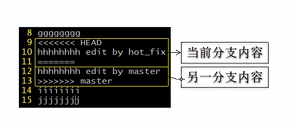
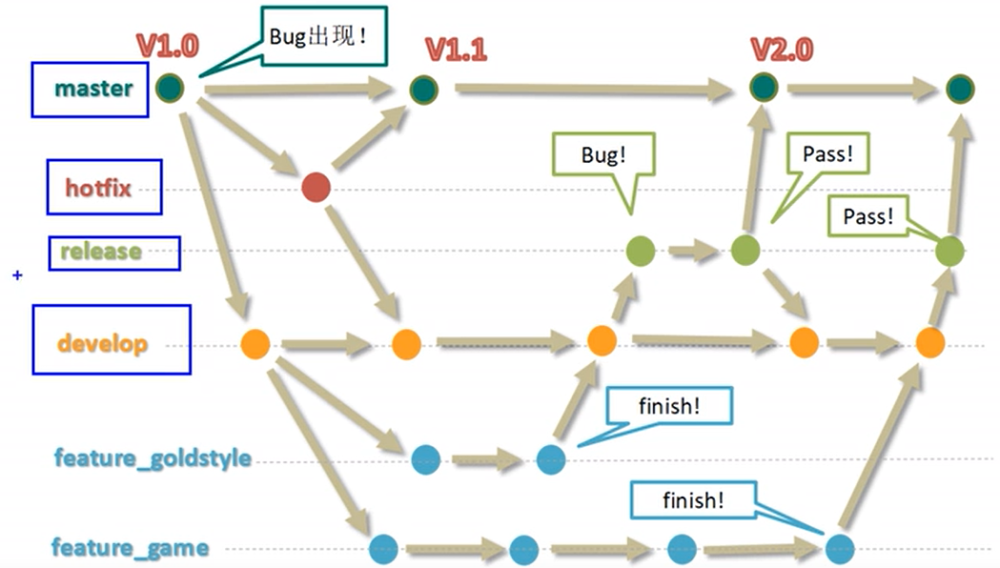

## 2021.4 Git


### 常用命令

``` shell

# 用户名
git config --global user.name yangzl
# 虚拟邮箱
git config --global user.email yangzl@git.com

# 初始化本地库
git init

# 从工作区 添加文件到 暂存区
git add ./*
# 从 暂存区 删除文件
git rm --cached hello.txt

# 查看 git 状态
git status

# 从暂存区 提交到 本地库
git commit -m "提交信息"

# 查看 log
git log
git reflog

######################### 版本控制
git reset --hard <commitId>

```


### 分支管理

``` shell

# 查看分支
git branch -v

# 创建分支
git branch hotfix

# 创建并切换到 branchName 分支
git checkout <branchName>

# 分支合并「把 branchName 合并到当前分支」
git merge <branchName>
```


#### 冲突合并

``` shell
########################
git checkout hot-fix

vim hello.txt

git commit -m "hot-fix edit" hello.txt

#########################
git checkout master

vim hello.txt

git commit -m "master edit" hello.txt

##############################
# 在 master 合并 hot-fix

git merge hot-fix

git status

#### both modified:	hello.txt ####
#### 此时需要手动合并代码

vim hello.txt

# 此时提交不能携带文件名
git commit -m “conflict commit”
```


### 团队协作

``` shell
git remote -v

# 推送操作「最小单位是分支」
git push origin master / dev

# 拉取操作
git pull origin master / dev
```


#### 团队内协作

``` shell
# 从本地库 推送到 远程库「推送之前需要先配置远程库」

# 岳不群
git remote add origin git@github.com:YBQ/hsjh.git
git commit -m "msg"
git push origin master / dev

# 令狐冲提交后，岳不群 pull
git pull origin master


#令狐冲
git clone git@github.com:YBQ/hsjh.git
git commit -m ""
git push orign master
```


#### 跨团队协作

提交 PR「Pull Request」进行代码合并

``` shell
# 东方不败 fork 岳不群华山剑法
# 远程仓库 fork
fork

# 克隆到本地库
git clone git@github.com:DFBB/hsjh.git

git commit -m "东方不败修改版华山剑法"

git push origin master

# 东方不败 发起 Pull Request
# 岳不群 审核
# 岳不群 merge
# 岳不群 pull

```


## 1 版本号控制

<kbd>工作区</kbd> -git add--> <kbd>暂存区</kbd> -git commit--> <kbd>本地库</kbd> 

+ 团队协作

本地库 -- push --> <kbd>远程库</kbd>

远程库 -- clone --> 本地库

+ 跨团队协作

远程库 -- fork --> 自己的远程库 -- clone --> 本地库-- push -->自己远程库 -- pull request --> 审核 & merge --> 远程库

## 2 简介

linux 中以.开始的是隐藏文件

**.git目录中存放的本地库相关文件**

设置签名：

**~/.gitconfig**

git config --global user.name yangzl

git config --global user.email yangzl@git.com

## 3 命令行

git --help

+ 工作区 -- add --> 暂存区

+ 暂存区 -- git restore --staged files --> 工作区

+ 工作区 -- git restore files --> 放弃做的修改

#### 3.1 git查看版本

git log：less打开 b上一页，f下一页，space下一页，q退出

git log --pretty=oneline

git log --oneline

git reflog


#### 3.2 基于索引操作版本号

gir reset --hard commit hash

git reset --hard HEAD^^ 后退2步

git reset --hard HEAD~n 后退n步

参数说明：

<kbd>soft</kbd> 移动本地库HEAD指针

<kbd>mixed</kbd> 移动本地库HEAD指针，重置暂存区

<kbd>hard</kbd> 移动本地库HEAD指针，重置暂存区，工作区

#### 3.3 比较文件差异

git diff test.txt **工作区 diff 暂存区**

git diff HEAD test.txt **工作区 diff 本地库版本**

git diff --cached test.txt **暂存区 diff 本地库**

#### 3.4 分支操作

git branch -v

git branch hot_fix

**git checkout -b hot_fix** 创建并切换到hot_fix分支

**分支合并**

+ git checkout master(**将其它分支合并到master**)
+ git merge [**有新内容的分支**]



解决冲突：

**删除特殊字符，git add apple.txt** 

**git commit -m 'master & hot_fix both commit' 这里不能带文件名**

#### 3.5 远程操作

``` shell
git remote -v

git remote add origin address

git clone -b 5.1.x spring-framework ./spring-framework = git init + git remote add origin ...

git push -u origin master

git pull origin master = git fetch + git merge

git fetch origin master

# 切换到远程分支查看内容
git checkout origin/master
# 切换到本地master
git checkout master 

merge冲突解决同分支合并冲突解决

#c 将远程库分支合并到本地master分支
git merge origin/master
```


## 4 图形化

.gitignore文件

``` shell
~/.gitconfig文件中添加配置
[core]
	excludesfile = c:/Users/yangzl/Java.gitignore
```


## 5 git工作流

+ **集中式工作流** 同SVN，所有提交到master分支
+ **GitFlow工作流** 多分支



+ **Forking工作流** 跨团队协作


## GitHub

大厂 TMD

``` javascript
// github搜索
zookeeper in:name,description,readme
springboot starts:>=5000
springcloud forks:>1000
springboot starts:>5000 forks :>1000
awesome redis 用于收集学习，工具，书籍
高亮显示 #L13-L50

// 带版本号fork
git clone -b 5.1.x git@github.com:spring-projects/spring-framework.git ./spring-framework

// 提交错误文件夹|文件
git rm -r --cached dirname|filename

// git pull & git fetch & git merge
pull == fetch + merge
git pull origin master == git fetch origin master & git merge
```

