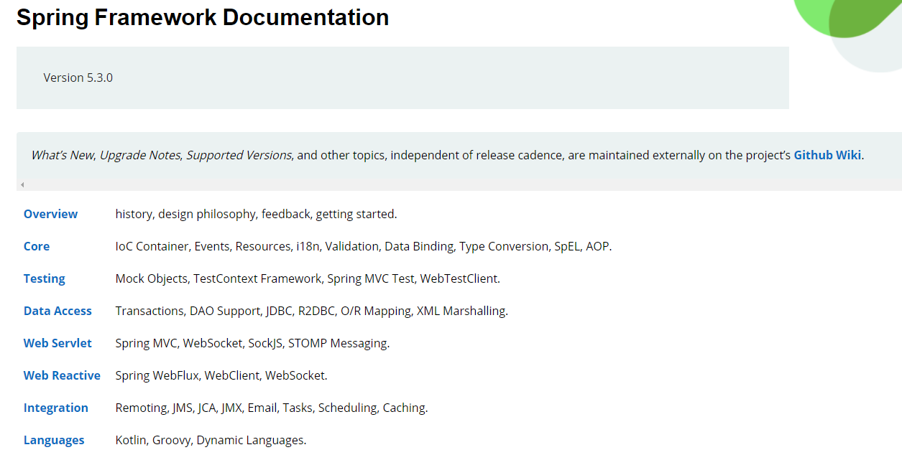

### 2 介绍Spring



#### 2.2 模块

##### 2.2.1 核心容器

+ spring-core
+ spring-beans
+ spring-context
+ spring-context-support
+ spring-expression

spring-core和spring-beans提供框架基础功能，包括IOC容器和依赖注入功能。BeanFactory是工厂模式实现，你无需再编程实现单例模式。


spring-context模块建立在Core和Beans模块之上，提供框架式的对象访问方式，类似于一个JNDI注册表。==Context模块==继承Beans功能，并添加国际化（资源集合），事件传播，资源负载，并透明的创建上下文（如Servlet容器）

ApplicationContext接口时Context模块的焦点，spring-context-support支持第三方库导Spring应用上下文（如高速缓存ehcache，JCache和调度CommonJ，Quartz）的支持


spring-expression提供表达式语言去支持查询和操作运行时对象图。

支持属性设置、获取、分配；方法调用；访问数组、集合、索引器的内容；逻辑算术运算；支持列表投影，常见列表聚合。==变量名以Spring IoC容器中名称检索对象==


##### 2.2.2 AOP & Instrumentation

spring-aop提供符合AOP要求的面向切面的编程实现。

单独的spring-aspects模块提供与AspectJ的继承


spring-instrumentation模块提供类植入支持和类加载器的实现


##### 2.2.3 Message

spring-messaging消息传递模块


##### 2.2.4 数据访问/集成

数据访问/集成层由JDBC, ORM, OXM, JMS和Transaction模块组成

spring-jdbc提供JDBC抽象层，消除JDBC繁琐代码；屏蔽不同数据库的差异

spring-tx用于实现特殊接口和所有POJO类的 ==编程和声明式事务== 管理

spring-orm为对象关系映射（object-relational mapping）API提供集成层，包括JPA和Hibernate

spring-oxm提供支持对象/XML映射实现的抽象层，如JAXB，Castor，JiBX, XStream

spring-jms（Java Messaging Service）包含用于生产和消费信息的功能，并提供与spring-messaging的集成


##### 2.2.5 Web

Web层由spring-web, spring-webmvc（又称webservlet）和spring-websocket模块组成

Web Reactive（Spring WebFlux,WebClient）


##### 2.2.6 Test

支持JUnit | TestNG对Spring组件进行单元测试和集成测试


### 3 IoC容器

`org.springframework.context.ApplicationContext`代表Spring Ioc容器

实现类`ClasspathXmlApplicationContext, FileSystemXmlApplicationContext`


#### 3.2 概述


##### 3.2.1 配置元数据

配置元数据三种方式：

+ XML
+ 基于注解配置
+ 基于Java配置（@Configuration，@Bean，@Import，@DependsOn）


#### 3.12 基于Java的容器配置


##### 3.12.1 @Bean & @Configuration

@Configuration注解的类，表示该类作为一个bean定义的资源文件

@Bean注解的方法，是Spring IoC容器来管理的对象的实例化，配置和初始化方法


当@Bean没有在使用@Configuration注解的类中声明时，它们被认为是“lite”模式

“lite”模式不应该调用的@Bean方法，推荐在“full”模式下调用其它@Bean方法，可以防止意外的调用多次


##### 3.12.2 AnnatationConfigApplicationContext

不仅限于@Configuration注解的类，同时可使用@Component，JSR-330注解的类

``` java
main(String[] args) {
    ApplicationContext ctx = new AnnotationConfigApplicationContext(AppConfig.class);
    ctx.getBean(TestService.class);
}
```


**`AnnotationConfigWebApplicationContext` 对Web应用的支持**

当配置Spring ContextLoaderListener servlet监听器，Spring MVC DispacterServlet时用此实现。


##### 3.12.3 @Bean

可以在@Configuration，@Component注解的类中使用@Bean注解


**生命周期回调**

@Bean定义的类支持常规生命周期回调，且可以使用JSR-250中@PostConstruct和@PreDistroy

==如果一个bean实现InitializingBean，DisposableBean | Lifecycle接口，它们相关方法会被容器调用==

默认情况下，使用Java config定义的具有公开关闭或停止方法的bean将自动加入销毁回调，如果你不希望在容器关闭时调用，只需配置@Bean(destroyMethod= "")

``` java
@Bean(destroyMethod="")
public DataSource dataSource() throws NamingException {
    return (DataSource) jndiTemplate.lookup("Mysql")
}
```


通过@Bean方法，通常选择编程来进行JDDI查找

+ Spring JndiTemplate / JndiLocatorDelegate
+ JNDI InitialContext


##### 3.12.4 @Configuration

``` java
@Configuration
public class AppConfig {
    @Bean
    public Foo foo() {
        // 调用另一个@Bean方法，不能在@Component的类中使用这种依赖关系
        // 单例模式下，多次调用会取缓存
        return new Foo(bar());
    }
    @Bean
    public Bar bar() {
        return new Bar();
    }
}
```


##### 3.12.5 @Import

``` java
@Configuration
public class ConfigA {
    @Bean
    public A a() {
        return new A();
    }
}

@Configuration
@Import(ConfigA.class)
public class ConfigB {
    @Bean
    public B b() {
        return new B();
    }
}

ctx = new AnnotationConfigApplicationContext(ConfigB.class);
```


**有条件的@Configuration类，@Bean方法**

@Profile注解的@Configuration

@Conditional注解的@Bean


**Java and XML混合配置**

==@ImportResource在Java config中引入所需的XML配置==


#### 3.13 环境抽象

集成在容器的抽象环境模型有两个方面

+ profiles
+ properties

无论XML或注解，bean都会被分配给一个profile。

Properties可能有各种来源：属性文件，JVM系统属性文件，系统环境变量，JNDI，servlet上下文，Maps

``` java

@Profile("dev")
@Profile("production")
@Profile("default")

/**
 * 激活profile的几种方式
 */
spring.profiles.active = "dev";
-Dspring.profiles.active="profile1,profile2";
ctx.getEnvironment().setActiveProfiles("profile1", "profile2")
```


##### 3.13.3 属性源抽象

`StandardEnvironment, StandardServletEnvironment`

系统属性优先于环境变量，StandardServletEnvironment属性优先级如下：

+ ServletConfig参数
+ ServletContext参数
+ JNDI环境变量（“java:comp/env/”）
+ JVM系统属性（-D命令行参数）
+ JVM系统环境变量（OS环境变量）


##### @PropertySource

@PropertySource注解对添加属性到Spring的环境变量中提供了便捷的声明式机制

``` java
@PropertySource("classpath: datasource.propertites")

@Autowried
Environment env;

@Bean
public TestBean testBean() {
    String val = env.getProperty("test.name");
    return new TestBean(val);
}
```


#### 3.16 BeanFactory

==BeanFactory为Spring的IoC功能提供了底层的基础，但是它仅仅被用于和第三方框架的集成==，现在对于大部分的Spring用户来说都是历史了。BeanFactory及其相关的接口，例如：BeanFactoryAware，InitializingBean，DisposableBean，在Spring中仍然有所保留，目的就是为了让大量的第三方框架和Spring集成时保持向后兼容


尽量使用ApplicationContext除非你有更好的理由不用它。ApplicationContext包括了BeanFactory的所有功能，==仅仅只使用简单的BeanFactory，很多的支持功能将不会有效，例如：事务和AOP==


特性矩阵

| Feature                          | BeanFactory | ApplicationContext |
| -------------------------------- | ----------- | ------------------ |
| Bean实例化/装配                  | √           | √                  |
| BeanPostProcessor自动注册        | ×           | √                  |
| BeanFacotryPostProcessor自动注册 | ×           | √                  |
| MessageSource国际化（i18n）      | ×           | √                  |
| ApplicationEvent Publish         | ×           | √                  |

当使用BeanFactoryPostProcessors和BeanPostProcessors的时候。ApplicationContext这些机制实现了一些很重要的功能，例如：==属性的占位替换和AOP。==


用BeanFactory的实现来明确的注册一个bean的后置处理器，你需要写和下面类似的代码

``` java
MyBeanPostProcessor postProcessor = new MyBeanPostProcessor();
factory.addBeanPostProcessor(postProcessor);
```


### 4 资源

提供对资源统一访问的抽象

当Resource单独使用，仅会对spring部分依赖

#### 4.2 interface Resource

``` java
public interface Resource extends InputStreamSource {
    boolean exists();
    boolean isOpen();
    URL getURL() throws IOException;
    File getFile() throws IOException;
    Resource createRelative(String relativePath) throws IOException;
    String getFilename();
    String getDescription();
}

public interface InputStreamSource {
    InputStream getInputStream() throws IOException;
}
```


#### 4.3 Resource实现


##### 4.3.1 UrlResource

封装java.net.URL对象，包括：

+ 访问文件系统路径file:
+ 通过http协议访问资源的http:
+ 通过ftp协议访问资源的ftp:
+ ...


##### 4.3.2 ClassPathResource

从类路径上加载资源，可使用线程上下文加载器，指定加载器或指定class类的加载器的任意一个来加载资源

当类路径上的资源存于==fs（文件系统）==中，ClassPathResource支持以java.io.File形式访问

==当资源处于jar包中，不能以java.io.File的形式访问，各种Resource都可以java.net.URL形式访问（Spring Boot中常有此问题）==


##### 4.3.3 FileSystemResource

我们可以使用 FileSystemResource 的 getFile() 函数获取 File 对象，使用 getURL() 获取 URL 对象。


##### 4.3.4 ServletContextResource

获取web根路径的ServletContext资源


##### 4.3.5 InputStreamResource

在没有找到其他合适的 Resource 实现时，才使用 InputSteamResource。如果可以，尽量选择 ByteArrayResource 或其他基于文件的 Resource 实现来代替


##### 4.3.6 ByteArrayResource

针对字节数组提供的 Resource 实现。可以通过一个字节数组来创建 ByteArrayResource。

当需要从字节数组加载内容时，ByteArrayResource 是一个不错的选择


#### 4.4 interface ResourceLoader

``` java
public interface ResourceLoader {
    Resource getResource(String location);
}
```


==通过 ClassPathXmlApplicationContext 实例来调用，那 spring 会返回一个 ClassPathResource 对象==；如果是通过实例 FileSystemXmlApplicationContext 实例调用的，返回的是一个 FileSystemResource 对象；如果是通过 WebApplicationContext 实例的，返回的是一个 ServletContextResource 对象

```
Resource template = ctx.getResource("some/resource/path/myTemplate.txt");
```


你可能会强制需要获取一个 ClassPathResource 对象，通过加上指定的前缀来实现这一需求

```
Resource template = ctx.getResource("classpath:some/resource/path/myTemplate.txt");
```


类似的，你可以通过其他任意的 url 前缀来强制获取 UrlResource 对象：

```
Resource template = ctx.getResource("file:///some/resource/path/myTemplate.txt");
Resource template = ctx.getResource("http://myhost.com/resource/path/myTemplate.txt");
```


#### 4.7 应用上下文和资源路径


若位置路径带有 classpath 前缀或 URL 前缀，会覆盖默认创建的用于加载 bean 定义的 Resource 类型，比如这种情况下的 FileSystemXmlApplicationContext

```
ApplicationContext ctx = new FileSystemXmlApplicationContext("classpath:conf/appContext.xml");
```

实际是从类路径下加载了 bean 的定义。可是，这个上下文仍然是 FileSystemXmlApplicationContext，而不是 ClassPathXmlApplicationContext，==在后续作为 ResourceLoader 来使用时，不带前缀的路径仍然会从文件系统中加载==


##### 4.7.2 通配符构造应用上下文


**Ant风格模式**

当位置路径使用了 ant 风格，解释器会遵循一套复杂且预定义的逻辑来解释这些位置路径


### 5 验证，数据绑定和类型转换

todo


### 9 Spring下的测试


### 10 单元测试


### 11 集成测试


### *14 DAO支持

==DAO（数据访问对象）==，旨在使JDBC，Hibernate，JPA，JDO等数据访问技术一致处理，这样可很容易的切换持久化技术，而无需担心每种技术的特有异常


#### 14.2 一致的异常层

==SQLException异常类层级用DataAccessException作为根异常（请捕获该异常）==


#### 14.3 @Repository

任何DAO或库实现都需要访问持久的源，依赖于持久化技术的使用；例如：一个基于JDBC的库需要访问一个JDBC DataSource，一个基于JPA的库需要访问一个 EntityManager，最简单的方式就是使用 @Autowired, @Inject, [**@Resource**](https://github.com/Resource) 或[**@PersistenceContext**](https://github.com/PersistenceContext) 这些注解中的一个完成资源的依赖注入


JPA库的例子：

```
@Repository
public class JpaMovieFinder implements MovieFinder {
@PersistenceContext
private EntityManager entityManager;
}
```

如果你使用传统的Hibernate API，你可以注入SessionFactory：

```
@Repository
public class HibernateMovieFinder implements MovieFinder {
    private SessionFactory sessionFactory;
    @Autowired
    public void setSessionFactory(SessionFactory sessionFactory) {
    this.sessionFactory = sessionFactory;
    }
}
```

典型的JDBC支持，你将会在初始化方法中注入 DataSource ，在初始化方法中，你将使用这个DataSource创建一个JdbcTemplate 和其他与SimpleJdbcCall相似的数据访问支持类。

```
@Repository
public class JdbcMovieFinder implements MovieFinder {
    private JdbcTemplate jdbcTemplate;
    @Autowired
    public void init(DataSource dataSource) {
    this.jdbcTemplate = new JdbcTemplate(dataSource);
    }
}
```


### 15 JDBC

| 操作                     | Spring | Developer |
| ------------------------ | ------ | --------- |
| 定义连接参数             |        | X         |
| 打开连接                 | X      |           |
| 指定SQL语句              |        | X         |
| 声明参数和提供参数值     |        | X         |
| 准备和执行语句           | X      |           |
| 返回结果的迭代（如果有） | X      |           |
| 具体操作每个迭代         |        | X         |
| 异常处理                 | X      |           |
| 事务处理                 | X      |           |
| 关闭连接、语句和结果集   | X      |           |


##### 15.1.1

JDBC数据库访问有几种基本类型途径，它们可以任意组合

+ JdbcTemplate
+ SimpleJdbcInsert
+ SimpleJdbcCall
+ 面向对象的RDBMS对象风格的方法（类似于JDO的查询设计）


#### 15.2 JDBC处理及异常处理


##### 15.2.1 JdbcTemplate

封装了对资源的创建和释放，可以帮你避免忘记关闭连接等常见错误。它也包含了核心JDBC工作流的一些基础工作、例如执行和声明语句，而把SQL语句的生成以及查询结果的提取工作留给应用代码

==JdbcTemplate执行查询、更新SQL语句和调用存储过程，运行结果集迭代和抽取返回参数值==

==捕获JDBC异常并把它们转换成更加通用、解释性更强的异常层次结构（DataAccessException异常体系）==


##### 15.2.2 NamedParameterJdbcTempalte

NamedParameterJdbcTemplate 提供对JDBC语句命名参数的支持，而普通的JDBC语句只能使用经典的 ‘?’参数。NamedParameterJdbcTemplate内部包装了JdbcTemplate，很多功能是直接通过JdbcTemplate来实现的

可以传递Map风格的命名参数及参数值


##### 15.2.3 SQLExceptionTranslator

==SQLExceptionTranslator接口用于SQLExceptions和org.springframework.dao.DataAccessException之间做转换==


##### 15.2.4 执行SQL

`this.jdbcTemplate.execute('create table test(id, integer, name varchar(100))');`


##### 15.2.5 查询

`queryForObject`

`queryForList`


##### 15.2.6 更新

`this.jdbcTemplate.update(sql)`


##### 15.2.7 获取自增Key

update()方法支持获取数据库自增Key。这个支持已成为JDBC3.0标准之一


#### 15.3 建立连接


##### 15.3.1 DataSource

==Spring提供一种通用的连接工厂DataSource，屏蔽连接池或事务管理等底层逻辑。==

Spring JDBC获取数据源：

+ JNDI（JNDI查找数据源）
+ DataSource（连接池获取数据源，DBCP, C3P0, Durid）


#### 15.4 JDBC批量操作

减少数据来回传输次数


##### 15.4.1 基础批量操作

实现`BatchPreparedStatementSetter`接口的两个方法

``` java
public void setValues(PreparedStatement ps, int i) throws SQLException {
    ps.set...
}
public int getBatchSize() {
    return list.size();
}
```


##### 15.4.2 对象列表的批处理

```
public int[] batchUpdate(final List<Actor> actors) {
		SqlParameterSource[] batch = SqlParameterSourceUtils.createBatch(actors.toArray());
		int[] updateCounts = namedParameterJdbcTemplate.batchUpdate(
				"update t_actor set first_name = :firstName, last_name = :lastName where id = :id",
				batch);
		return updateCounts;
	}
```


### 32 *缓存

Spring框架从3.1开始提供透明式添加缓存的支持

==抽象缓存允许一致地使用各种缓存方案==，并对代码影响最小

从4.1开始，缓存抽象支持JSR-107注释和更多自定义选项


#### 32.2 缓存抽象

缓存作用于Java方法上，可减少方法执行次数。

> 显然只适用于给定输入（参数）返回相同输出（结果），无论执行多少次

==Spring缓存服务只是一种抽象（不是缓存实现），且需要市级的存储器来存储缓存数据，这个抽象由`org.springframework.cache.Cache 和 org.springframework.cache.CacheManager`接口实现==


缓存实现：

+ java.util.concurrent.ConcurrentMap
+ Ehcache2.x
+ JSR-107缓存（如Ehcache3.x）

使用缓存抽象：

+ 缓存声明 - 注解方法并配置策略
+ 缓存配置 - 数据读写的缓存数据库


#### 32.3 **基于声明式注解缓存

对于缓存声明，抽象提供一组Java注解

+ @Cacheable：放入缓存
+ @CacheEvict：缓存失效
+ @CachePut：更新缓存，不影响方法的执行
+ @Caching：组合多个缓存操作到一个方法
+ @CacheConfig：类级别共享及缓存相关配置


##### 32.3.1 @Cacheable

注解方法，当再次调用（相同入参）时返回缓存结果，而无需执行该方法

``` java
// 允许指定多个名称，以便使用多个缓存
@Cacheable({"books", "isbns"})
public Book findBook(ISBN isbn) {...}
```


**默认键生成**

`KeyGenerator`

+ 没有参数，返回`SimpleKey.EMPTY`
+ 如果只有一个参数，返回该实例
+ 如果大于一个参数，返回一个包含所有参数的`SimpleKey`

算法对大多数用例很适用，只需要参数具有自然键并实现有效的`hashCode()`和`equals()`

如果需要提供自定义的键生成，则需要实现`org.springframework.cache.interceptor.KeyGenerator`接口


**自定义键生成**

```
@Cacheable("books")
public Book findBook(ISBN isbn, boolean checkWarehouse, boolean includeUsed)
```

==两个boolean参数对缓存没有任何用处，`@Cacheable`允许用户通过键属性指定`key`生成方式，使用SpEl选择需要的参数（或其嵌套属性），而无需实现任何接口。==

 SpEL 声明的一些示例

```
@Cacheable(cacheNames="books", key="#isbn")
public Book findBook(ISBN isbn, boolean checkWarehouse, boolean includeUsed)

@Cacheable(cacheNames="books", key="#isbn.rawNumber")
public Book findBook(ISBN isbn, boolean checkWarehouse, boolean includeUsed)

@Cacheable(cacheNames="books", key="T(someType).hash(#isbn)")
public Book findBook(ISBN isbn, boolean checkWarehouse, boolean includeUsed)
```


如果生成键的算法太具体或者需要共享，可以操作中定义一个自定定义的 `keyGenerator`。为此，请指定要使用的 `KeyGenerator` Bean 实现的名称：

```
@Cacheable(cacheNames="books", keyGenerator="myKeyGenerator")
public Book findBook(ISBN isbn, boolean checkWarehouse, boolean includeUsed)
```

> key 和 keyGenerator 的参数是互斥的，指定两者的同样的操作将导致异常。


**默认缓存解析**

缓存抽象使用`CacheResolver`，在`CacheMannager`配置操作级别来检索缓存

需要不同的缓存解析器，需要实现接口`org.springframework.cache.interceptor.CacheResovler`


**自定义缓存解析**

默认缓存解析适用于单个`CacheManager`并且在不需要复杂缓存解析的应用程序

对于使用多个缓存管理器的应用，可为每一个操作设置一个`cacheMananger`

```
@Cacheable(cacheNames="books", cacheManager="anotherCacheManager")
public Book findBook(ISBN isbn) {...}
```


可以使用`CacheResolver`来代替`CacheManager`

```
@Cacheable(cacheResolver="runtimeCacheResolver")
public Book findBook(ISBN isbn) {...}
```

> 自 Spring 4.1 以后，缓存注解的属性值是不必要的，因为 CacheResolver 可以提供该特定的信息，无论注解的内容是什么。与 key 和 keyGenerator 类似，cacheManager 和 cacheResolver 参数是互斥的，并且指定两者同样的操作会导致异常，因为 CacheResolver 的实现将忽略自定义的 CacheManager。这是你不希望的。


**同步缓存**

在多线程环境中，某些操作可能会导致同时引用相同的参数（通常在启动时）

只有一个线程将忙于计算值，而其他线程会被阻塞，直到该缓存对象被更新为止。

```
@Cacheable(cacheNames="foos", sync="true")
public Foo executeExpensiveOperation(String id) {...}
```


**条件缓存**

使用SpEl表达式的`condition`参数，true则缓存方法，false则不缓存

`unless`与`condition`相反，true则不缓存，false则缓存


```
@Cacheable(cacheNames="book", condition="#name.length < 32")
public Book findBook(String name)
```

`unless` 参数用于是否向缓存添加值。不同于 `condition` 参数

```
@Cacheable(cacheNames="book", condition="#name.length < 32", unless="#result.hardback")
public Book findBook(String name)
```

缓存抽象支持 `java.util.Optional`,只有当它作为缓存值的时候才可使用。上面的例子可以重写如下：

注意结果仍然是Book而非Optional

```
@Cacheable(cacheNames="book", condition="#name.length < 32", unless="#result.hardback")
public Optional<Book> findBook(String name)
```

缓存 SpEL 元数据

| 参数名        | 用处               | 描述                       | 例子                                                |
| ------------- | ------------------ | -------------------------- | --------------------------------------------------- |
| methodName    | root object        | 被调用的方法名             | `#root.methodName`                                  |
| method        | root object        | 被调用的方法               | `#root.method.name`                                 |
| target        | root object        | 被调用的对象               | `#root.target`                                      |
| targetClass   | root object        | 被调用的类                 | `#root.targetClass`                                 |
| args          | root object        | 被调用的的类目标参数       | `#root.args[0]`                                     |
| caches        | root object        | 当前方法执行的缓存列表     | `#root.caches[0].name`                              |
| argument name | evaluation context | 任何方法参数的名称         | `#iban` 或 `#a0` (也可以使用 `#p0` 或者 `#p<#arg>`) |
| result        | evaluation context | 方法调用的结果（缓存的值） | `#result`                                           |


##### 32.3.2 [**@CachePut**](https://github.com/CachePut) 

需要更新缓存而不影响方法执行，可使用@CachePut，该方法始终执行，并将结果放入缓存中，它与@Cacheable有相同的选项

```
@CachePut(cacheNames="book", key="#isbn")
public Book updateBook(ISBN isbn, BookDescriptor descriptor)
```

> 不推荐同一方法注解@Cacheable和@CachePut


##### 32.3.3 @CacheEvict

```
@CacheEvict(cacheNames="books", allEntries=true)
public void loadBooks(InputStream batch)
```


##### 32.3.4 @Caching

[**@Caching**](https://github.com/Caching) 允许在同一个方法上使用多个嵌套的 `@Cacheable` 、`@CachePut` 和 `@CacheEvict` ：

```
@Caching(evict = { @CacheEvict("primary"), @CacheEvict(cacheNames="secondary", key="#p0") })
public Book importBooks(String deposit, Date date)
```


##### 32.3.5 @CacheConfig

`@CacheConfig` 是一个类级别的注解，可以共享缓存名称。自定义 `KeyGenerator`，自定义 `CacheManager` 和自定义 `CacheResolver`。

```
@CacheConfig("books")
public class BookRepositoryImpl implements BookRepository {

    @Cacheable
    public Book findBook(ISBN isbn) {...}
}
```

每个缓存操作都有三个级别的定义：

+ 全局配置，CacheManager，KeyGenerator
+ 类级别，@CacheConfig
+ 操作级别层面（方法注解）


##### 32.3.6 @EnableCaching


即使声明缓存注解也不会主动触发动作 - Spring 中很多东西都这样，该特性必须声明式的启用

对于Java配置，使用`@EnableCaching`

```
@Configuration
@EnableCaching
public class AppConfig {}
```

对于 XML 配置，使用 `cache:annotation-driven` 元素：

```xml
<beans xmlns="http://www.springframework.org/schema/beans"
    xmlns:xsi="http://www.w3.org/2001/XMLSchema-instance"
    xmlns:cache="http://www.springframework.org/schema/cache"
    xsi:schemaLocation="
        http://www.springframework.org/schema/beans http://www.springframework.org/schema/beans/spring-beans.xsd
        http://www.springframework.org/schema/cache http://www.springframework.org/schema/cache/spring-cache.xsd">

        <cache:annotation-driven />
</beans>
```

`cache:annotation-driven` 元素和 `@EnableCaching` 注解允许指定多种选项，

==如果将 `<cache:annotaion-driven />` 配置在 `DispatcherServlet` 的 `WebApplicationContext` ，它只检查controller中的bean，而不是您的service==（事务同样）

> Spring建议只使用@Cahce*注解具体的类（方法），而不是接口


 @Cacheable, @CachePut, [**@CacheEvict**](https://github.com/CacheEvict) 和 [**@CacheConfig**](https://github.com/CacheConfig) 可作为元注解，也可以被其他注解使用。换句话说，可以自定义一个通用的注解替换 `@Cacheable` 声明：

```
@Retention(RetentionPolicy.RUNTIME)
@Target({ElementType.METHOD})
@Cacheable(cacheNames="books", key="#isbn")
public @interface SlowService {
}
```

以上我们定义的注解 `@SlowService` ，并使用 `@Cacheable` 注解 - 现在我们替换下面的代码：

```
@Cacheable(cacheNames="books", key="#isbn")
public Book findBook(ISBN isbn, boolean checkWarehouse, boolean includeUsed)
```

改为：

```
@SlowService
public Book findBook(ISBN isbn, boolean checkWarehouse, boolean includeUsed)
```


#### 32.4 JCache(JSR-107)注解

JCache标准注解：

+ @Cacheable
+ @CachePut
+ @CacheRemove
+ @CacheRemoveAll
+ @CacheDefaults
+ @CacheKey
+ @CacheValue


##### 32.4.1 

| Spring                         | JSR-107           | 备注                                                         |
| ------------------------------ | ----------------- | ------------------------------------------------------------ |
| `@Cacheable`                   | `@CacheResult`    | 相似，`@CacheResult` 可缓存特定的异常，并强制执行该方法，不管缓存的结果。 |
| `@CachePut`                    | `@CachePut`       | Spring 调用方法之后获取结果去更新缓存，但 JCache 将其作为使用 `@CacheValue` 的参数传递。所以 JCache 允许实际方法调用之前或者之后更新缓存。 |
| `@CacheEvict`                  | `@CacheRemove`    | 相似， `@CacheRemove` 支持条件回收，以防止方法调用导致异常   |
| `@CacheEvict(allEntries=true)` | `@CacheRemoveAll` | 查阅 `@CacheRemove`                                          |
| `@CacheConfig`                 | `@CacheDefaults`  | 允许类似的方式配置相同的属性                                 |

JCache 的 `javax.cache.annotation.CacheResolver` 概念和 Spring 的 `CacheResolver` 是一样的，除了 JCache 只支持单个缓存。默认下，根据注解声明的名称检索要使用的缓存。如果没有指定缓存的名称，则会自动生成默认值


#### 32.5 缓存声明式XML配置


#### **32.6 配置缓存

可简单声明CacheManager控制和管理cache


##### 32.6.1 JDK ConcurrentMap-based Cache

基于JDK的Cache实现位于`org.springframework.cache.concurrent`，它允许使用`ConcurrentHashMap`存储

```
<bean id="cacheManager" class="org.springframework.cache.support.SimpleCacheManager">
    <property name="caches">
        <set>
            <bean class="org.springframework.cache.concurrent.ConcurrentMapCacheFactoryBean" p:name="default"/>
            <bean class="org.springframework.cache.concurrent.ConcurrentMapCacheFactoryBean" p:name="books"/>
        </set>
    </property>
</bean>
```

上面的代码片段使用`SimpleCacheManager`创建一个`CacheManager`,为两个嵌套的`ConcurrentMapCache`实例命名为_default_和_books_。请注意，这些名称是为每个缓存直接配置的。

==缓存由应用程序创建的，因此它们生命周期一致，适用于基本用例，测试或简单应用程序。缓存规模好，速度快，但不提供任何管理、持久化能力或缓存清除策略。==


##### 32.6.2 Ehcache-based Cache

基于Ehcache的缓存

Ehcache2.x实现位于`org.springframework.cache.ehcache`

使用它只需要声明适当的`EhCacheManager`

```
<bean id="cacheManager"
      class="org.springframework.cache.ehcache.EhCacheCacheManager" p:cache-manager-ref="ehcache"/>
<!-- EhCache library setup -->
<bean id="ehcache"
      class="org.springframework.cache.ehcache.EhCacheManagerFactoryBean" p:config-location="ehcache.xml"/>
```


##### 32.6.3 Caffeine Cache

Caffeine是Java 8的重写Guava缓存，其实现位于`org.springframework.cache.caffeine`

```
<bean id="cacheManager"
      class="org.springframework.cache.caffeine.CaffeineCacheManager"/>
```

还可以明确提供使用的缓存。在这种情况下，只有manager才能提供：

```
<bean id="cacheManager" class="org.springframework.cache.caffeine.CaffeineCacheManager">
    <property name="caches">
        <set>
            <value>default</value>
            <value>books</value>
        </set>
    </property>
</bean>
```

Caffeine `CacheManager`也支持自定义的`Caffeine` 和 `CacheLoader`


##### 32.6.4 GemFire-based Cache

GemFire是面向内存/磁盘支持，弹性可扩展，持续可用，主动（内置基于模式的订阅通知），全局复制数据库，并提供功能齐全的边缘缓存


##### 32.6.5 JSR-107 Cache

Spring的缓存抽象也可以使用兼容JSR-107的缓存。JCache实现位于`org.springframework.cache.jcache`包下。
要使用它，只需要声明适当的`CacheManager`：

```
<bean id="cacheManager"
      class="org.springframework.cache.jcache.JCacheCacheManager"
      p:cache-manager-ref="jCacheManager"/>

<!-- JSR-107 cache manager setup  -->
<bean id="jCacheManager" .../>
```


##### Dealing with caches without a backing store

（处理没有后端存储的缓存）

有时在切换环境或进行测试时，可能会有缓存声明，而不配置实际的后备缓存。由于这是一个无效的配置，因此在运行时将会抛出异常，因为缓存基础结构无法找到合适的存储。在这种情况下，而不是删除缓存声明（这可以证明是乏味的），可以连接一个不执行缓存的简单的虚拟缓存，也就是强制每次执行缓存的方法：

```
<bean id="cacheManager" class="org.springframework.cache.support.CompositeCacheManager">
    <property name="cacheManagers">
        <list>
            <ref bean="jdkCache"/>
            <ref bean="gemfireCache"/>
        </list>
    </property>
    <property name="fallbackToNoOpCache" value="true"/>
</bean>
```

上面的`CompositeCacheManager`链接多个`CacheManager`s，另外，通过`fallbackToNoOpCache`标志，添加了一个\_no op\_缓存，用于所有不被配置的缓存管理器处理的定义。也就是说，在`jdkCache`或`gemfireCache`（上面配置）中找不到的每个缓存定义都将由\_no op\_缓存来处理，这不会执行缓存


### 33 Spring FrameWork 5.0

5.0基于Java8开发

+ 使用泛型提高可读性
+ 对Java8代码提供支持
+ 运行时兼容Java9
+ 取消部分包`beans.factory.access, dbc.support.nativejdbc`
+ 删除 @Deprecated注解的类和方法

+ ==Spring 5.0框架自带了通用的日志封装==
+ 自动检测log4j 2.x, SLF4J, JUL（java.util.Logging）而不是其他的支持


**SpringWebFlux**

- 新的spring-webflux模块，一个基于reactive的spring-webmvc，完全的异步非阻塞，旨在使用enent-loop执行模型和传统的线程池模型。
- Reactive说明在spring-core比如编码和解码
- spring-core相关的基础设施，比如Encode 和Decoder可以用来编码和解码数据流；DataBuffer 可以使用java ByteBuffer或者Netty ByteBuf;ReactiveAdapterRegistry可以对相关的库提供传输层支持。
- 在spring-web包里包含HttpMessageReade和HttpMessageWrite


### 注解编程模型


**元注解**

元注解是一种标注在别的注解之上的注解。如果一个注解可以标注在别的注解上，那么这个注解已然是元注解。例如，任何需要被文档化的注解，都应该被`java.lang.annotation`包中的元注解`@Documented`标注。


**Spring Composed**

```
译者注：Spring Composed项目是spring的一个社区项目，内含一些有特色的组合注解。可点击下文中的链接下载源码
```

[Spring Composed](https://github.com/sbrannen/spring-composed)项目是可以在在spring4.2.1和更高版本中使用的一系列组合注解。你可以在Spring MVC使用像`@Get`,`@Post`,`@Put`, 和`@Delet`这样的注解，也可以在Spring MVC REST应用中使用`@GetJson`,`@PostJson`等等注解。


### 37 Spring AOP


#### 37.1 切点API

Spring切点模型能让切点重用不同的独立的增强类型。


`org.springframework.aop.Pointcut`用于将增强定位到特定的类或者方法上

``` java
public interface Pointcut {
    ClassFilter getClassFilter();
    MethodMatcher getMethodMatcher();
}
```


接口用于将切点限制在给定的目标类上。 如果`matches()`方法总是返回true，所有的类都会被匹配上。

```java
public interface ClassFilter {
    boolean matches(Class clazz);
}
```


`MethodMatcher`接口通常更为重要。完整的接口描述如下：

```MethodMatcher接口通常更为重要。完整的接口描述如下：
public interface MethodMatcher {
    boolean matches(Method m, Class targetClass);
    boolean isRuntime();
    boolean matches(Method m, Class targetClass, Object[] args);
}
```

`matches(Method, Class)`方法用于测试切点是否匹配目标类的一个指定方法。 这个测试可以在AOP代理创建时执行，避免需要在每一个方法调用时，再测试一次。

 如果对于一个给定的方法，`matches(Method, Class)`方法返回true，并且对于同MethodMatcher实例的`isRuntime()`方法也返回true， 那么在每次被匹配的方法执行时，都会调用`boolean matches(Method m, Class targetClass, Object[] args)`方法。 这样使得在目标增强执行前，一个切点可以在方法执行时立即查看入参


#### 37.2 切点操作

Spring切点操作，主要是`union`并集，`intersection`交集

使用AspectJ的切点表达式通常是一种更为简单的方式。


#### 37.3 AspectJ切点表达式

Spring使用的最重要的切点类型`org.springframework.aop.aspectj.ApectJExpressionPointCut`


**静态切点**

静态切点是基于方法和目标类的，不能将方法参数也考虑其中。 对于大多数用法，静态切点是足够且最佳的选择。

对于Spring来说，当一个方法第一次被调用时，对静态切点仅仅评估一次是可行的：在本次评估后，再次调用该方法时，就没有必要再对切点进行评估。


**动态切点**

动态切点的判定代价比静态切点要大。动态切点除了静态信息外，还需要考虑方法`参数`。 这意味着它们在每次方法调用时都必须进行判定；判定的结果不能被缓存，因为参数是变化的。


#### 37.4 Advice

每个Advice都是Spring的一个Bean。一个Advice实例在被增强的对象间共享


**环绕型增强**

Spring中最基本的增强类型之一就是`拦截式环绕型增强`， 使用方法拦截器， 环绕型方法拦截器应该实现以下接口：

```java
public interface MethodInterceptor extends Interceptor {
    Object invoke(MethodInvocation invocation) throws Throwable;
}
```

`invoke()` 方法的`MethodInvocation`表示了将要被调用的方法、目标连接点、AOP代理、以及该方法的参数。 `invoke()` 方法应当返回调用结果：目标连接点的返回值。

一个简单的`方法拦截器`实现如下所示：

```java
public class DebugInterceptor implements MethodInterceptor {
    public Object invoke(MethodInvocation invocation) throws Throwable {
        System.out.println("Before: invocation=[" + invocation + "]");
        // 将拦截器链路调向连接点，请调用proceed()
        Object rval = invocation.proceed();
        System.out.println("Invocation returned");
        return rval;
    }
}
```


**前置增强**

==前置增强的优势是不需要调用`proceed()`方法，因此不会无故中断调用链。==

`MethodBeforeAdvice`接口如下所示。

```java
public interface MethodBeforeAdvice extends BeforeAdvice {
    void before(Method m, Object[] args, Object target) throws Throwable;
}
```

返回类型void，不能改变返回结果。 如果一个前置增强抛出一个异常，它会中断调用链中接下来的执行步骤

统计所有方法的执行次数：

```java
public class CountingBeforeAdvice implements MethodBeforeAdvice {
    private int count;
    public void before(Method m, Object[] args, Object target) throws Throwable {
        ++count;
    }
    public int getCount() {
        return count;
    }
}
```


**异常抛出增强**

当连接点返回的结果是一个抛出的异常时，异常抛出增强会被调用。 Spring提供异常抛出增强。 需要主意的是`org.springframework.aop.ThrowsAdvice` 接口不包括任何方法：它是一个标签式接口，标识给出的对象实现了一个或多个类型的异常抛出增强。 它们的格式如下所示：

```java
afterThrowing([Method, args, target], subclassOfThrowable)
```

只有最后一个参数是必须的。

1个参数：

```java
public class RemoteThrowsAdvice implements ThrowsAdvice {
    public void afterThrowing(RemoteException ex) throws Throwable {
        // Do something with remote exception
    }
}
```

如果一个`ServletException`被抛出，下面这个增强就会被调用。 与上面不同的是，该方法声明了4个参数，因此它可以访问被调用的方法、方法参数和目标对象：

4个参数：

```java
public class ServletThrowsAdviceWithArguments implements ThrowsAdvice {
    public void afterThrowing(Method m, Object[] args, Object target, ServletException ex) {
        // Do something with all arguments
    }
}
```