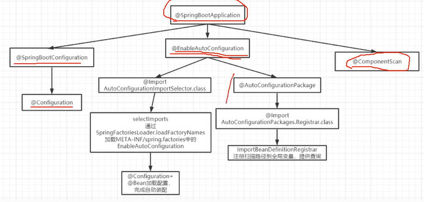

### ZK 初始选举和崩溃选举

选举最重要的两个属性：

+ zxid「事务 id，唯一标识客户端的一次请求」
+ myid「节点 id，echo 1 > $ZK_HOME/myid」

> 先投自己，选票内容（zxid，myid），先对比 zxid，再对比 myid，**选票都会投给持有最新数据的节点**
>
> **投票箱**：保存在本地，维护所有节点的投票信息，各节点改投时更新自己投票箱，并广播，让其它节点更改投票箱结果

节点状态：

+ LOOKING：竞选状态，不对外提供服务
+ FLLOWING：fllower 节点状态，同步 leader 数据，参与投票
+ OBSERVING：观察者节点状态，同步 leader 数据，不参与投票
+ LEADING：leader 节点状态


#### 初始化选举

1. 第一台服务器启动，无 zxid = 0，首先投给自己，与其它节点通信无响应「集群不对外提供服务」
2. 第二台服务器启动，无 zxid = 0，首先投给自己，与节点 1 通信交换选举结果，节点 1 发现节点 2 sid 较大，所以改投节点 2 并广播，此时，节点 2 票数已达半数，成为 leader，集群对外提供服务
3. 第三台服务器启动，无 zxid，首先投给自己，与节点 1 2 通信，虽然 sid 最大，但节点 2 已经是 leader，则节点 3 切换为 follwer，同步 leader 状态「数据」


#### 崩溃选举

1. 假设 leader 宕机，follower 切换为 LOOKING 状态
2. 各节点先投票給自己（zxid，myid），广播投票
3. **接收到其它节点的投票，对比 zxid，myid，投最大 zxid 的节点「数据是最新的」**，改投后广播
4. 比较是否有节点票数达到半数，如果有该节点为 leader ，并广播


### 简述 zk 的存储模型

是一颗以“/”为根节点的树，每个节点叫做ZNode，按照层次关系形成ZNode树

整个树型目录结构常驻内存，为保证高吞吐低延迟，ZK每个节点的负载（payload）上限1MB


#### ZNode 节点类型

+ 临时节点「在一次 session 内有效，会话失效则删除节点，**临时节点不允许有子节点**」
+ 有序临时节点
+ 持久节点
+ 有序持久节点


#### ZNode 内容

> 一个二进制数组，存储节点内容，ACL 访问控制，自身状态信息「stat」
>
> + czxid：创建节点的事务 id（客户端一次请求）
> + mzxid：最后一次被更新的事务 id
> + pzxid：子节点最后一次被更新的事务 id
> + ctime：创建时间
> + mtime：最后更新时间
> + **version：版本号（表示对节点数据，子节点数据或 ACL 信息修改的次数，依据该特性可避免并发更新问题「使用乐观锁机制，比较更新」）**
> + cversion：子节点版本号
> + aversion：ACL 版本号
> + **ephemeralOwner：创建节点的 sessionId，持久节点值为 0**
> + dataLength：数据长度
> + numChildren：子节点个数

``` shell
# 命名服务
create /mall-product "192.168.0.104:5000"

# 查看节点的状态
stat /mall-product

```


### ZK 数据同步原理

根据三个属性的大小对比结果，选择不同的数据同步方式


#### peerLastZxid：

==Learner（Follower / Observer 统称）==最后处理的 zxid「也就是从服务器最后处理的数据」

#### minCommitedLog：

Leader 的 proposal「客户端请求会封装为提议」缓存队列 commitedLog 最小 zxid

#### maxCommitedLog：

Leader proposal 缓存队列 commitedLog 最大 zxid


#### 数据同步方式

##### DIFF

> **差异化同步**，minCommitedLog < peerLastZxid < maxCommitedLog

##### TRUNC + DIFF

> **先回滚再差异化同步**，learner 存在小部分数据比 leader 新，让 learner 回滚再做差异化同步

##### TRUNC

> **仅回滚同步**，peerLastZxid > maxCommitedLog

##### SNAP

> **全量同步**，peerLastZxid < maxCommitedLog


### ZK watch 机制

观察者模式

步骤：

1. 对某个节点注册监听
2. 事件到达，处理完事件后再继续注册监听

> 在 ZK 中对某个节点的监听是一次性的

**客户端和服务端都需要保存 watcher 事件和节点对应关系`Map<String, Set<Watcher>>`**

key 是 path，value 是该节点的所有监听事件


### ZK 分布式锁

**基于临时有序「EPHMERAL_SEQUENTIAL」节点实现**


#### 方式一

步骤：

1. ==**所有 client 在同一个父节点「持久节点」下创建多个临时有序节点，约定编号最小的那个节点表示获得了锁**==
2. 如果当前 client 不是最小节点，就对上一个节点进行监听「临时有序」
3. **只要上一个节点释放锁，自己就可以创建节点，表示分布式锁获取成功「排队机制，并发不是很高」**

> 为什么用临时节点？
>
> 如果抢占到锁而宕机，临时节点会自动删除，表示锁释放或取消排队
>
> 为什么只对当前序号的上一个节点进行监听？
>
> 有效防止惊群效应，只唤醒一个 client 进行处理，缺点是可能导饥饿


#### 方式二

所有 client 在父节点下抢占式创建同一个临时节点，誰创建成功代表获取锁


### ZK 应用场景

1. 数据发布 / 订阅：配置中心
2. 负载均衡：通过提供服务者列表，客户端自己做负载均衡
3. 命名服务：提供服务名到服务器 ip 映射
4. 分布式协调 / 通知：watch 机制和临时节点
5. 集群管理
6. 分布式队列


### ZK 对事务支持

``` java
op1 = zkclient.create(...);
op2 = zkclient.delete(...);

zk.multi(op1, op2);
```


### ZK observer 机制

如果想将当前节点设置为 observer，那么需要添加如下配置：

``` shell
peerType=observer
server.1:localhost:2181:3181:observer
```

> **观察者节点设计是希望能扩展 zk 集群又不降低写性能**
>
> + 不参与投票，只获取投票结果
> + 处理读请求，转发写请求
> + observer 节点宕机不影响集群


### ZAB 协议

> ZAB 协议来保证数据强一致性

**ZAB 协议是为分布式协调服务 ZK 提供的支持崩溃恢复和消息广播协议。**

实现分布式数据一致性，所有写请求都由 leader 处理，然后将数据同步到 follwer 节点

**ZAB 协议包括两种基本模式：消息广播和崩溃恢复**


#### 消息广播

集群中所有事务请求都由 leader 处理，leader 将请求封装为 proposal「提议」，并将 proposal 分发给集群中所有 follower

完成广播后，leader 等待半数以上 follower 反馈后，leader 再向集群内广播 commit 信息，将之前的 proposal 提交「**类似于二阶段提交（2PC）**」

**事务操作分两步操作：**

1. 广播事务操作「proposal」
2. 广播提交


#### 崩溃恢复

以下情况会产生集群服务不可用：

1. 初始化集群
2. leader 崩溃
3. leader 失去半数机器的支持

> 此时，ZAB 协议规定，集群处于**崩溃恢复模式**
>
> 1. 新一轮的 leader 选举
> 2. 同步新 leader 的数据，进入**消息广播模式**

zxid，是 ZAB 协议规定的事务编号，64B，低 32B 是一个递增的计数器，针对 client 每次请求计数器 + 1，高 32B 代表 epoch「每次 leader 选举 epoch + 1」


### CAP BASE 理论


#### CAP

C 一致性：所有节点在同一时间数据完全一致

A 可用性：宕机部分节点服务仍然可用

P 分区容错性：节点间网络不可达时，仍然能对外提供服务。当发生网络分区时，CA 只能二选一


#### BASE

1. 基本可用
   1. 响应时间上的损失：允许响应延时
   2. 系统功能上损失：降级
2. 软状态「数据同步允许一定的延迟」
3. 最终一致性（数据同步存在时延，但数据最终一致）


### 数据一致性模型有哪些

1. 强一致性
2. 弱一致性
3. 最终一致性
4. 因果一致性
5. 会话一致性


### Quorum、WARO 算法

> **waro：副本控制协议，写操作，只有当所有副本都更新成功之后，这次写操作才算成功，对于读服务只要存活一个节点就能提供**
>
> Quorum：对于 5 个副本，允许其中 3 个成功更新「大多数」，那么至少读取 3 个副本才能保证读到最新数据


### Paxos 算法

解决一个分布式系统中对某个值「提议」达成一致（多节点一致）。

角色：

Proposer

Acceptor

Learner


#### Basic-Paxos


#### Multi-Paxos


#### Fast-Paxos


### Raft 算法

> 分布式一致性算法，基于 Paxos 优化
>
> raft 算法会先选举 leader，leader 负责 replicated log「日志副本，用于数据同步」 的管理，leader 处理所有请求，然后将数据复制到 follower 节点。

节点状态：

leader：处理所有客户端请求「如果请求 follower 则会转发到 leader」

follower：不处理 client 请求，只响应来自 leader / candidate 的请求

candidate：候选人


**何时触发选举？**

集群初始化时，所有节点都是 follower，每个节点随机超时（sleep(0 ~ 200ms)，先到先得），变成 candidate 发起选举

如果 follower 在心跳周期内还未收到来自 leader 心跳，则当前 follower 变成 candidate 主动发起选举


### 负载均衡类型与策略


#### 策略

1. 轮询，加权轮询
3. 随机，加权随机
5. 源地址哈希
6. 最小连接数


#### 负载均衡类型

硬件

软件「Nginx、LVS」

+ 应用层负载均衡

+ 传输层负载均衡


##### Nginx

七层负载均衡「在应用层做负载均衡」，支持 HTTP、SMTP 协议。

也支持 4 层负载均衡


##### LVS

运行在内核态，4 层负载均衡「在传输层做负载均衡」


### SOA 与微服务

SOA「Service Oriented Architecture」：面向服务的架构

中心化实现：ESB「企业服务总线」，各服务通过 ESB 交互

去中心化实现：微服务，各服务间通过 restapi 直接调用


### 集群和分布式


集群：同一个应用部署多台服务，水平扩展

分布式：将单体应用拆分为多个模块「每个模块被称为一个微服务」，多个模块部署在多台服务器，单个节点不能提供完整服务


### 分布式系统设计

+ 可扩展性
+ 高可用
+ 无状态「尽量作为无状态服务，session 放在 redis 解决」


### 分布式事务有哪些解决方案？


**==JTA 事务是 Java 对 XA 规范的实现，对应 JDBC 单库事务==**


#### 基于 XA 协议

「是一种规范，MySQL XA 实现了这种规范」

典型的有：2PC / 3PC，需要数据库支持

``` shell
# mysql InnoDB 支持 XA

# 开启一个事务，并将事务处于 ACTIVE 状态，此后执行的 SQL 都处于该事务中
XA START xid;

DML...

# 将事务置于 IDEL 状态，表示事务内 SQL 操作完成
XA END xid;

# 实现事务提交准备工作，事务状态为 PREPARED。如果事务无法完成提交前的准备，该语句执行失败
# 就是执行事务中的 sql 但不提交
XA PREPARE xid;

# 事务最终提交，完成持久化
XA COMMIT xid;

# 事务回滚
XA ROLLBACK xid;

# 查看 MySQL 中处于 PREPARED 状态的 XA 事务
XA RECOVER;
```


##### 2PC

**两阶段提交（Two Phase Commit，2PC）：解决分布式系统架构下多节点进行事务提交时保持一致性的算法**

分布式事务通常采用 2PC


###### 步骤

+ 第一阶段，TC 发送 Prepare「预提交，执行事务内 SQL 但不提交」：所有 TM 实现本地事务提交前准备（执行 SQL），如果有 TM 执行失败则分布式事务直接失败

+ 第二阶段，TC 发送 Commit「提交」到所有 TM，每个 TM 实现本地提交，释放锁和资源，然后反馈给 TC，当存在任何一个 TM 不能提交，TC 发起 cancel


###### RM

RM「Resource Manager」，资源管理器，通常指数据源。一个分布式事务通常涉及多个数据源「多个 RM」

###### TM

TM「Transaction Manager」，事务管理器，通常指本地事务管理器。一个分布式事务通常涉及多个本地事务「多个 TM」

###### TC

TC「Transaction Coordinate」，事务协调器，管理多个本地事务。根据每个 TM 的响应结果决定 Commit / Rollback


###### 2PC 存在的问题

1. TC 单点故障
2. 数据不一致：TC 只发送了部分 commit 到 TM「发送一部分后宕机」
3. 响应时间长「所有参与者都被锁住，提交回滚后才能释放」


##### 3PC

阶段一：发送 CanCommit，确认各 TM 网络环境是否正常「探测机制，降低问题概率」

阶段二：发送 PreCommit，执行所有 sql「不提交」

阶段三：发送 DoCommit，通知所有 TM 提交本地事务


> 1. 探测网络环境是否正常
>
> 2. 引入 TM 超时机制「2PC 下 TC 有超时机制，等待 TC commit 超时则本地提交」


#### TCC：基于事务补偿机制

完全从业务层面实现，与数据库无关系

**==「根据我们的业务编写反向操作实现回滚逻辑」==**

> TCC，Try Confirm Cancel
>
> 栗子：
>
> 我们的业务：update t set a = a + 1
>
> **补偿 SQL： update t set a = a - 1**


#### try

做业务检查和资源预留

#### confirm

做业务确认

#### cancel

实现一个与 try 相反的补偿操作实现回滚机制。


#### 流程

TC 发起所有分支事务「TM」的 try，任何一个 TM 失败，TC 将发起所有 分支事务「TM」 的 Cancel。若是 try 全部成功，TC 发起所有分支事务「TM」的 confirm 操作

**其中，confirm / cancel 失败，TC 会进行重试**


#### 缺点

1. 对业务入侵行较高
2. 每个操作都要实现 `try confirm cancel` 接口
3. confirm / cancel 操作必须实现幂等性「有些业务不太好改」


#### 基于事务性消息

需要消息中间件支持事务性消息


##### 流程

1. A 分支事务执行并发送消息到 mq1**（B 事务不可见 mq1，B 与 mq2 交互）**

2. 当 A 事务提交完毕，将 mq1 消息发送到 mq2

3. B 事务与 mq2 交互


### 简述 TCC 事务模型

TCC（Try，Confirm，Cancel），**补偿事务模型**

**==针对每个事务操作，都注册一个与其对应的补偿操作「撤销 / 反向」==**

Try 做业务检查与资源预留，Confirm 做业务确认，Cancel 实现与业务相反的回滚操作


TC 首先发起所有 TM 本地事务的 try，任何一个本地事务 try 失败，TC 将发起所有 TM 的 Cancel 操作

若 try 全部成功，TC 发起所有 TM Confirm 操作，其中 Confirm / Cancel 失败会进行重试


#### 缺点

1. 对业务入侵性较大，每个操作都需要 `try confirm cancel` 三个接口实现

2. Confirm / Cancel 出错且重试失败，需要人工介入


### 如何理解 RPC

RPC，Remote Procedure Call

RPC 涉及：

1. 动态代理「需要为接口构造一个实现，显然需要动态代理」
2. 序列化反序列化，codec「code + decode」
3. 通信，可以选择 http 应用层协议，或者直接选择 tcp / udp 协议「效率高于 http」


### Dubbo 是什么？能做什么？

**==基于 Java 实现的高性能 RPC 分布式服务调用框架==**

核心部分包括：

1. 远程通信：封装多种网络通信框架「netty，mina等」，透明化远程方法调用「像本地方法调用一样，只需简单配置」
2. 集群容错：软负载均衡「应用实现，F5 为硬件负载均衡」
3. 服务注册发现：注册中心提供「可选用 zk / redis」


#### Dubbo 角色

服务提供者

服务消费者

注册中心「zk / redis」

监控中心


### 简述 Dubbo SPI 机制

spi，service provider interface，服务提供接口「是一种服务发现机制」

1. Dubbo SPI「不同的协议配置，查找不同的实现类」
2. Spring SPI
3. JDK SPI


#### JDK SPI

1. 在 jar 包中 META-INF 下新建文件夹 services
2. 新建文件以接口全限定名命名「如 `java.sql.Driver` 」文件内容为实现类的全限定名「如 `com.mysql.cj.jdbc.Driver`」

``` java

// java 调用
Class.forName("com.mysql.cj.jdbc.Driver")
```


### Dubbo 调用过程

1. 调用接口生成的代理类的方法，然后从集群中经过路由的过滤，负载均衡选择一个 server 进行 rpc，记录请求 id 等待服务端响应
2. 服务端接受请求后查找服务暴露的 map，得到相应 exporter，最后调用真正的实现类，返回响应结果
3. 消费者接收到响应后，通过 id 查找刚才的请求，将相应放入 Future 中，唤醒线程继续执行


### Dubbo 注册中心 zk 宕机，消费者还能使用吗？

1. 针对消费者，对 zk 只是读请求，任意一台宕机会切换到另一台
2. 注册中心全部宕机，消费者仍然可以使用本地缓存通信


### Dubbo 服务调用容错机制？

服务调用出错时 dubbo 如何容错？

c 端 和 p 端都可以配置，c 端配置优先


1. Failover：自动切换，dubbo 默认容错方案，调用失败时切换到其它节
2. Failback：调用失败记录日志和调用信息，返回空结果
3. Failfast：只会调用一次，失败后立刻抛出异常
4. Failsafe：client 不会感知到异常，返回空结果
5. Forking：并行调用多个服务提供者，其中一个返回「幂等」
6. Broadcast：逐个调用每个 provider，其中一台异常则抛出异常「比如：更新缓存」


### Dubbo 支持的协议

主要分为两类：

1. 基于 http 等应用层协议通信
2. 基于 tcp / udp 等协议通信

分别有：

dubbo 协议

hessian 协议

http 协议

RMI 协议

thrift 协议


### Dubbo 与 Spring Cloud 对比

spring cloud 应该与 k8s 对比。

1. springcloud 使用 http 协议传输数据，使用 json 格式占用带宽较多
2. dubbo 解决了服务注册发现，服务调用等功能。spring cloud 是分布式全栈解决
3. dubbo 注册中心 zk 实现的 CP，cloud 注册中心 eureka 实现的 AP。


### 缓存穿透，缓存击穿，缓存雪崩

#### 缓存雪崩

缓存在同一时间大面积失效，导致查询打在 DB

解决方案：

	1. 随机过期时间
	2. 加锁查询 DB


#### 缓存穿透

缓存和 DB 中都不存在的 key

解决方案：

	1. bloom filter「一个 bitmap，对每个 k 计算多个 hash 映射到 bitmap 中」
	2. 空值也缓存一小段时间


#### 缓存击穿

某个热点 key 缓存过期后被大量并发查询，打在 DB 上

解决方案：

	1. DB 查询添加互斥锁
	2. 热点数据不过期


### 分布式系统中缓存方案有哪些

1. 客户端缓存：页面缓存，localStorage，sessionStorage
2. CDN 缓存：内容存储
3. nginx 缓存：静态资源
4. 服务端缓存：本地缓存「map」，外部缓存「ehcache」
5. 持久层缓存「mybatis 二级缓存（比较少用），hibernate 三级缓存」
6. 数据库缓存「MySQL 查询缓存」
7. 操作系统缓存「Page Cache（页缓存），Buffer Cache」


### 简述 Hystrix 实现机制

==**分布式调用容错框架**==，在服务调用可实现服务限流，降级，熔断等，并提供实时监控与告警。


#### 资源隔离

线程隔离（每个微服务使用一个线程池与其它微服务隔离），信号量隔离

##### 线程隔离

Hystrix 为每个服务分配一个单独线程池

##### 信号量隔离

客户端向服务端发起请求时，首先需要获取一个信号量才能发起调用「Semaphore」**，当并发超过信号量数时，后续的请求会被拒绝，进入 fallback 流程**「自定义 fallback 逻辑」。这可以防止请求线程大面积阻塞，达到限流和防止雪崩的目的


#### 熔断和降级

服务调用异常快速失败，直接进入 fallback 逻辑


### 简述 RabbitMQ 架构设计

> RabbitMQ 是基于 AMQP 协议的消息中间件实现

producer1 —> Broker「Exchange 1 —Routing Key1—> Queue1」:arrow_lower_right: Consumer1

producer2—> Broker「Exchange 2 —Routing Key2—> Queue2」:arrow_upper_right: Consumer2


#### Broker：

rabbitmq 服务节点


#### Queue：

存放消息的队列，**多个消费者可订阅同一个队列，这些消息会负载均衡的分摊发送給多个消费者**，如果需要广播模式（发布 / 订阅模式），可以采用一个 **Exchange** 通过 **Routing Key** 路由到多个队列上，每个消费者消费一个队列

#### Exchange：

交换器，**生产者发送消息并不直接到 Queue，而是发送到 Exchange，之后通过 Exchange + Routing Key 路由到匹配「Binding Key」的Queue**，这个 Routing Key 需要与 Binding Key 联合使用才最终生效


##### Direct

（点对点，将消息路由到 Routing Key 与 Binding Key **完全匹配**的队列中）

##### Fanout

（扇出，路由到所有与 Exchange 绑定的队列中「此时指定 Routing Key 无效」）

##### Topic

（topic 模式，Exchange 将消息路由到所有 **Rotuing Key 与 Binding Key 匹配「正则**」的队列中）


#### Binding：

通过 binding 将交换器和队列关联，绑定时需要指定一个 **Binding Key**

> 交换器与队列是多对多，通过 Routing Key 与 Binding Key 匹配，路由到正确的 Queue


#### Channel「信道」：

TCP 连接到 broker，客户端创建多个 AMQP 信道「**一条 TCP 连接上建立多个 AMQP 信道**」，每个信道有一个唯一 ID，可以复用 TCP 连接提高性能，


### Rabbit MQ 如何确保消息发送与接受？

> Rabbit MQ 消息确认有 producer ack 和 concumer ack

1. 确保消息发送到队列
2. 确保消费者接收到消息


#### 发送方确认

1. **信道需要设置为 confirm 模式**，则所有在信道发送的消息都会分配一个唯一 ID
2. **一旦消息到达 queue「持久化消息需要等到持久化完毕」** ，信道会发送一个 ack 給 prodcuer「包含消息唯一 ID」
3. 若 Rabbit MQ 发生内部错误导致消息丢失，信道会发送 nack「未确认」給生产者
4. producer ack 是异步的，在等待确认时 producer 可以继续发送消息
5. `ConfirmCallback`：消息路由到 queue 成功，则回调该接口的函数`ConfirmCallback#confirm`
6. `ReturnCallback`：消息发送失败则回调该接口的方法


#### 消费者确认

1. 设置为手动确认：`autoAck = false`
2. consumer 手动 ack 后 Rabbit MQ 才会从队列「持久化消息是从磁盘」移除消息
3. 消费者接收到的每条消息需要手动 ack 后才能继续消费消息，如果无法 ack 则队列也不会向该消费者继续发送消息
4. **ack 没有超时时间，它判断消息是否需要重新投递的唯一依据是消费者是否断开，如果 consumer 在返回 ack 之前断开（可能已经消费了，还没有 ack），Rabbit MQ 会将该消息分发给下一个订阅者「这可能导致重复消费，需要幂等判断」**


### Rabbit MQ 事务性消息

考虑以下流程：

1. 发送 MQ
2. sql 事务
3. sql 提交 / 回滚
4. MQ 提交 / 回滚


#### 信道事务设置：

> 1. channel.txSelect()：通知 broker 开启事务
> 2. channel.basicPublish()：发送消息
> 3. channel.txCommit();
> 4. channel.txRollback();
>
> 任意环节出现问题，抛出 IOException，通过捕获该异常进行事务回滚
>
> **事务消息并不是直接路由到 consumer 消费的 queue，而是先存放到临时的 queue，只有做了事务提交才会将消息从临时队列到具体消费的队列**


#### 消费者事务设置：

1. autoAck = false，**手动提交 ack，有事务以事务提交 / 回滚为准**
2. **autoAck = true，不支持事务**


### Rabbit MQ 死信队列，延时队列

死信队列：延长消息生命周期

什么情况进入死信队列？

1. 消息被 consumer 否定确认，`channel.basicNack / channel.basicReject`，且 `requeue = false`
2. 消息在队列中存活时间超过设置的 TTL「可对消息 / 队列（队列中所有消息 TTL ）设置」 
3. 消息队列数量超过最大队列长度

如果没有配置死信队列，则这些消息将被丢弃。


#### 如何配置死信队列？

设置一个死信交换机「可以是 Direct，Fanout，Topic」，一个死信队列，并将他们绑定


#### 延时队列

1. 设置队列 TTL，为延时队列 
2. consumer 监听死信队列
3. 延时队列 TTL 过期后，会被路由到 死信队列
4. consumer 消费死信队列的消息


### 简述 Kafka 架构设计

**Rocket MQ 借鉴 Kafka 并按业务优化**


#### Kafka Cluster：

broker0，broker1，broker2


#### Consumer Group：

消费者组，组内每个消费者消费不同分区「Partition」，提高消费能力

#### Topic：

Topic 将消息分类，kafka 无 queue 的概念

#### Partition：

分区，提供并发能力。一个 **Topic** 以多个 Partition 分布在多个 broker 上，每个 Partition 是一个有序队列，**每个 Partition 有多个副本「**replica，**分片集群**，还有一种方式：主从复制全量集群」，副本有一个 leader 和多个 follower，leader 处理生产和消费请求，follower 只做从 leader 的数据同步

#### Offset：

记录 consumer 消费的位置信息，当 consumer 宕机重连后从 offset 继续消费

#### Zookeeper：

kafka 存储集群信息，集群管理，节点宕机剔除等


### Kafka 消息丢失情况

#### ack = 0，不重试

> 自动确认，可能导致消息丢失

#### ack = 1 / n

> ack = 1，leader 确认即成功，还未同步至 follower 可能导致消息丢失
>
> ack = n，leader 确认后等待 n - 1 个 follower 同步后成功

#### ack = all / -1，tries > 1

> **leader 确认后等待所有 ISR follower 同步后才算成功**，如果有异常则重试「副本数量可能影响吞吐量」
>
> 不允许 ISR 以外的副本作为 leader


#### ISR

in-sync-replicas，ISR 节点的数据与 leader 相同


#### Offset 提交与消息消费

1. 先提交 offset 再消费消息，如果消息消费失败，则 offset 是无效的提交
2. 先消费消息，还未提交 offset 宕机，可能导致重复消费「**需要幂等判断**」


#### Broker 刷盘

这里指：broker 缓存刷新到 page cache 的时间间隔

**broker buffer 刷到 page cache，os 将 page cache 刷到磁盘**


### Kafka push pull

#### pull 模式：

+ consumer 可以根据自己的消费能力拉取数据
+ 设置不同的提交方式，可实现不同的消息事务「最少一次，最多一次，精确一次」

缺点：

​	如果 producer 无数据，则 consumer 可能产生大量的空轮询「消耗 CPU」

解决：

​	如果 consumer 拉取不到数据，则阻塞一小段时间


#### push 模式

producer 推送，忽略了 consumer 的消费能力，可能导致拥塞或拒绝服务等情况


### Kafka 高性能


#### 顺序写

**kafka 不基于内存，而是硬盘存储**

利用磁盘的顺序访问，kafka 消息都是 append 操作，partition 有序，节省磁盘的寻道时间，同时通过批量操作，节省写入次数


#### 零拷贝


传统文件读取步骤：

1. 应用读取文件，切换到内核态，**system call** 读取文件
2. DMA 将数据拷贝至 kernel buffer「DMA 拷贝」
3. CPU 将 kernel buffer 数据拷贝至用户空间缓冲区
4. CPU 将用户空间缓冲区数据拷贝到 socket buffer
5. CPU 将socket buffer 将数据拷贝到网卡


### 分布式锁解决方案

添一个中间件，可以是**数据库，redis，zk 等**


#### 数据库

利用主键冲突控制只能有一个线程获取锁


##### 缺点

1. 不可重入
2. 单点故障
3. 无法设置失效时间


#### Zookeeper 分布式锁

##### 创建同一个临时节点

##### 创建多个有序临时节点，形成排队


#### Redis 分布式锁

> Redis 处理网络请求是单线程「多路复用的事件循环」


##### set nx ex


##### 注意事项

1. 解锁判断是否自己的锁
2. lua 脚本解锁
3. 事务 解锁


##### 缺点

1. 无法续期「`watch dog`」
2. 可重入性


##### Redlock


##### 注意事项

1. redis sentinel 模式下，master 宕机导致主从切换，可能导致锁丢失「redis 同步未完成」
2. **redlock 可以从多节点申请锁，当半数以上节点获取成功，锁才算获取成功**


### 分布式 id 生成方案


#### uuid

##### 组成

1. 当前时间戳
2. 时钟序列
3. 全局唯一 IEEE 机器识别号「MAC 地址」


##### 缺点

1. 无序，对索引维护不友好
2. 可能暴露 mac 地址


#### 数据库自增序列


##### 缺点

1. 完全依赖于 DB，单点故障「主从复制」
2. DB 压力大：每次获取 ID 都需要读写一次 DB
3. 主从同步未完成时，存在数据不一致性


#### snowflake

**64b 整型数字，生成的 id 趋势递增**

**==在 1024 节点顶配场景，同一毫秒能生成的 id = 1024 x 4096==**

##### 0 ~ 41b 时间戳

##### 10b workerId

##### 12b 序列号


#### 基于 redis、mongodb、zk 等中间件生成


### 简述你对 RPC, RMI 的理解

RMI 是 Java 远程调用规范

RPC：远程过程调用「Remote Procedue Call」，跨语言实现，不仅仅局限于 Java


#### RPC

跨网络实现过程调用

**可以基于 HTTP 协议，TCP / UDP 协议。这些都算是 RPC**


#### RMI

本质上：通过 socket 将自己拷贝传输给 server

##### java.rmi.Remote

标记接口

##### java.rmi.server.UniCastRemoteObject

``` shell
interface IService extends Remote {
	String hello() throws RemoteException;
}

class IServiceImpl extends UnicastRemoteObject implements IService {
	
	@Override public String hello() {
		return "hello"
	}
}

class Server {
	main() {
		Iservice service = new ServiceImpl();
		Context namingContext = new InitialContext();
		namingContext.rebind("rmi://127.0.0.1/service", service);
	}	
}

class Client {
	main() {
		String uri = "rmi://127.0.0.1/";
		try {
			Context namingContext = new InitialContext();
			Iservice service = (Iservice) namingContext.lookup(uri + "service");
			Class stubClass = service.getClass();
			
			// com.sun.proxy.$Proxy0
			// JDK 生成的代理
			sout(stubClass);
			
			Class<?>[] interfaces = stubClass.getInterfaces();
			for (Class<?> c : interfaces) {
				sout("implement" + c.getName() + "interface")
			}
			
			sout(service.hello());
		}
	}
}
```

##### 运行 %JAVA_HOME%/bin/rmiregistry.exe 才能注册服务


### 分布式 Session 解决方案


#### 1. stateless 服务，抛弃 session


#### 2. 存入 cookie「安全问题」

用户禁用 cookie


#### 3. 服务器 session 同步

每个服务节点全量 session 信息「冗余太多」，服务节点增多时，同步延迟甚至失败


#### 4. IP 绑定策略

使用 Nginx 负载时，策略选择为 hash，根据 ip 固定访问 server，session 无需复制

当一台机器宕机，该机器所有用户被影响


#### 5. Redis 存储 session

优点

1. session 可以共享
2. 可以实现水平扩展
3. 跨服务器，跨语言


### Redis 主从复制

``` shell
slaveof no one

slaveof 192.168.0.104 6379
```

#### 全量复制

1. 主节点 `bgsave` fork 子进程进行 RDB 持久化
2. master 将 RDB 文件发送給从节点
3. 从节点从 RDB 恢复数据「阻塞，无法响应客户端」


#### 部分复制

Redis 2.8 以后提供

##### 复制偏移量

执行复制的双方，主从节点，分别维护一个复制偏移量 offset


##### 复制积压缓冲区

master 维护一个固定长度，FIFO 队列作为复制积压缓冲区

当主从节点 offset 相差超过缓冲区长度时，必须全量复制 


### Redis 集群方案「高可用」


#### 哨兵模式

Sentinel 模式基于主从复制

##### 特点

1. 判断 master 是否宕机，客观宕机「大部分节点认为宕机，涉及分布式选举」
2. 部分哨兵节点宕机，集群仍然能正常工作「有一个就可以提供服务，AP 实现」
3. sentinel 模式通常需要 3 个实例
4. sentinel 保证 redis 集群高可用，不保证数据零丢失


##### 集群监控

负责监控 master 和 slaver 是否正常工作

##### 故障转移

master 宕机「客观宕机」，sentinel 进入故障恢复模式，选举一个 slaver 称为新的 master


##### 消息通知

##### 配置中心


#### Redis Cluster

是一种服务端 Sharding 技术。

==**将整个集群分为 2<sup>13</sup> 个 slot「槽」**==，请求发送到任意节点，接收请求的节点会路由到正确节点执行

**Redis Cluster 模式下节点互为主从**


##### 说明

1. 通过 hash，将数据分片，每个节点存储一定 slot 的数据
2. 每个分片数据存储在多个**互为主从的多节点上**
3. **数据写入主节点，再同步到从节点「支持配置为阻塞同步，强一致性」**
4. 同一分片多节点的数据不保证强一致性
5. 客户端 key 请求会被路由到正确的节点处理
6. 扩容时旧节点数据需迁移
7. 在 Redis Cluster 模式下，每个节点需要占用 2 个端口：6379，6379 + 10000，以此类推

> 16379 端口用于节点间通信


##### 优点

1. 节点地位均等，支持动态扩容
2. 具备 Sentinel 监控和自动 Failover「故障转移」
3. client 连接到集群任意节点


##### 缺点

1. 只能使用 db[0]
2. 不支持管线化操作「pipeline」


### Redis 事务


#### WATCH

提供乐观锁机制，监视指定的 key

#### UNWATCH

取消监视 key

#### MULTI

标识事务开始，以后的命令入队「FIFO，除本身这 5 个命令以外的都入队」

#### EXEC

提交事务

#### DISCARD

1. 语法错误会导致回滚
2. 逻辑错误，Redis 不提供回滚操作


### Redis 线程模型

基于单 Reactor「多路复用器、分发器、处理器」的网络事件处理器，也叫做**文件时间处理器**，处理所有文件事件是单线程的。


#### 单线程 vs 多线程

业务流程长，多 I/O 环境适合多线程

只做转发等适用单线程「Nginx、Redis」


#### 单 Reactor 单线程


#### 单 Reactor 多线程


#### 多 Reactor 多线程「主从 Reactor」


### Redis 过期键删除策略

#### 惰性删除

访问一个 key 时，判断有没有过期

#### 定期删除

Redis Server 每 100ms 扫描一定数量的过期字典「expires 字典」的 key 删除。


### RDB AOF


#### AOF

``` shell
# aof 开关
appendonly yes

# 将缓存回写策略交给操作系统，Linux 默认 30s 将缓冲区数据刷回磁盘
appendfsync  no

appendfsync  everysec

appendfsync  always
```


### MyISAM InnoDB 存储引擎


#### MyISAM

1. 不支持事务
2. 不支持外键
3. 表级别锁「每次操作锁表」
4. 存储了 row count
5. 一个 MyISAM 表包含三个文件：frm、data、index
6. **==非聚集索引：索引文件的数据域存的是指向文件数据的指针==**


#### InnoDB

1. 支持事务，实现标准的 4 种隔离级别，并在 RR 规范上通过 间隙锁 解决了 RR 级别幻读问题
2. 支持行锁，**==提供 MVCC 支持读写并发==**
3. 支持外键
4. 一个 InnoDB 表包含一个文件：ibd
5. 主键采用聚集索引，非主键索引采用非聚集索引


### MySQL 主从同步


#### 原理

MySQL 主从同步主要涉及三个线程

+ master binlog dump thread

> 1. 主节点 binlog，master 对所有变更 SQL 记录到 binlog
>
> 2. 主节点 log dump 线程，当 binlog 变动，log dump 线程读取修改内容「offset」发送給从节点

+ slaver I/O thread

> 从节点 I/O 线程收到 binlog，将其写入 relay log 文件

+ slaver SQL thread

> 从节点 SQL 线程读取 relay log 内容，执行SQL。保证数据一致性


#### 主从复制默认异步

假设主节点宕机，从节点处理 binlog 失败。**日志丢失**

#### 主从同步复制：

binlog 同步到从库后，所有从库执行成功返回，**影响性能**

#### 半同步复制

binlog 同步到从库后，有一个从节点执行成功后返回


### 什么是 MVCC

多版本并发控制协议

**MVCC：通过快照读，版本链实现读写并发**

==MVCC 只在 RC RR 隔离级别下工作，与 RC SERIALIZABLE冲突==


#### 如何实现？

聚簇索引记录中两个隐藏列

##### trx_id

对记录修改时候的事务 id

##### roll_pointer

每次修改都会把老版本写入 undo log 中，这个 roll_pointer 指针指向当前记录上一个版本的位置


#### ReadView

> 事务开始时，维护当前活动事务 id「未提交事务」排序成一个数组
>
> **当前读**，获取数据中的事务 id「最新」，对比 ReadView，读取正确的版本

RC 隔离级别下的事务只在第一次读「当前读」的时候生成一个 ReadView「所以不可重复读」

RR 隔离级别下的事务在每次查询「当前读」都生成一个独立的 ReadView


#### 总结

MVCC 通过版本连，实现多版本，达到读写并发

通过 ReadView 生成策略实现不同隔离级别「生成一次 RC，每次生成 RR」


### ACID 靠什么保证


#### redo log

**==用于记录事务操作的变化==**，不管事务是否提交，都记录数据修改后的值

数据库掉电时，InnoDB 会使用 redo log 来恢复


#### binlog

**==用于主从复制==**，binlog 记录对 MySQL 执行更改的所有操作，不包括 SELECT SHOW


A 原子性：由 undo log 保证，记录了需要回滚的日志信息

C 一致性：一致性是目的，由其它三个特性保证

I 隔离性：由事务隔离级别保证「MVCC」

D 持久性：由 redo log 保证。MySQL 在修改数据的同时在内存和 redo log 记录。宕机从 redo log 恢复

``` shell
1. InnoDB redo log 写盘 事务进入 prepare
2. 果 prepare 成功， binlog 刷盘，再将事务日志持久化到 binlog
3. binlog 持久化成功 事务进入 commit 
4. 在 redo log 写入 commit 记录
```

> redo log 刷盘会在系统空闲时进行「Linux buffer 刷盘默认 30s」


### SQL 慢查询

1. 索引是否命中
2. 是否 load 不需要的数据列
3. 数据量太大


#### 分析 SQL 执行计划

```sql
explain select ...
```

##### type

system：系统表，表中只有一行数据

const：主键索引命中，匹配一行数据「不需要回表查询」

eq_ref：**唯一索引扫描**，匹配一行记录「需要回表查询」

ref：非唯一索引扫描，匹配某个值的所有行

range：检索给定范围的行「一般用于 between，>，<」

index：索引全扫描

all：全表扫描，无法使用索引


#### possiable_keys

可能用到的索引

##### key

具体用到的索引


##### rows

扫描的行数


##### filter

扫描的行数 x filter = 实际返回的行数


##### extra

###### using filesort

MySQL 对结果集进行文件排序「无法使用索引排序」。建议优化

###### using index

索引覆盖

###### using temporary

使用临时表，一般在排序，分组，多表 join 时。建议优化

###### using where

使用 where 过滤，效率较高


### MySQL 锁类型


#### 基于锁粒度

##### 行锁

##### 表锁

##### 页锁

介于行锁与表锁之间

##### 间隙锁

> 行锁 + 间隙锁解决幻读


#### 意向锁

##### 意向 S 锁

当有事务对表中的某些行加了 S 锁之后，该表存在一个意向 S 锁，此时其它事务不能对该表加 X 锁


##### 意向 X 锁

当有事务对表中的某些行加了 X 锁之后，该表存在一个意向 X 锁，此时其它事务不能对该表 加 S / X 锁。

**这样无需遍历表的所有行查看是否有 X 锁，提高效率**


### MyBatis 拦截器

1. MyBatis 只针对 ParameterHandler、ResultSetHandler、StatementHandler、Executor 这 4 种接口提供插件支持。
2. 使用 JDK 动态代理，为需要拦截的接口生成代理对象，实现接口方法拦截功能「`InvocationHandler#invoke()`」
3. 实现 Interceptor 接口


### Spring Boot Starter


#### @SpringBootApplication

包含三个注解：

@SpringBootConfiguration

@ComponentScan

@EnableAutoConfiguration




#### 流程：

1. 编写一个 starter jar 包
2. 一个标注 @Configuration 的配置类「**xxxAutoConfiguration**」，类中定义各种自动配置的 bean
3. 在 starter 类路径下 META-INF/spring.factories 种写入该配置类的全限定名
4. Spring SPI 扫描 META-INF/spring.factories 文件中的配置类

> 如果要定义读取配置文件，那么添加一个 @ConfigurationProperites 标注的类
>
> 在 @Configuration 标注的 xxxAutoConfiguration 中添加 @EnableConfigurationProperties({xxxProperties.class})


#### Spring Boot 自动配置

##### @Import

##### @Configuration

##### Spring SPI


### Spring MVC 核心组件


#### HandlerMapping

处理器映射器，可以理解为 url —> HandlerAdapter「以 url 查找 HandlerAdapter」


#### HandlerAdapter

处理器适配器，适配器设计模式，针对不同类型的处理器「servlet / controller」使用适配器解决


#### HandlerExceptionResovler

异常解析器，根据异常设置 ModelAndView


#### ViewResolver

视图解析器「jsp / thymeleaf」


#### MultipartResolver

多部份解析器：做文件上传


### Spring MVC 工作流程

1. client 请求到 DispatcherServlet
2. DispacherServlet 调用 HandlerMapping 查找 HandlerAdapter
3. HandlerAdapter 调用具体的处理器（Controller，业务逻辑）
4. Controller 执行完毕后返回 ModelAndView
5. ModelAndView 通过 ViewResolver 解析返回 View
6. 根据 View 渲染视图
7. 响应用户


### Spring 事务

只有代理类才有事务，自调用事务失效


#### 事务传播属性

##### REQUIRED

如果当前有事务则加入，否则新建一个事务

##### REQUIRES_NEW

创建一个新事务，如果调用方已经有事务则挂起


##### SUPPORTS

如果当前存在事务则加入，否则以非事务方式运行

##### MANDATORY

如果当前存在事务，则加入，如果当前不存在事务则抛出异常

##### NOT_SUPPORTED

以非事务执行，如果当前存在事务，则挂起

##### NEVER

如果当前事务存在，抛出异常

##### NESTED

如果当前存在事务，则以嵌套事务执行，否则开启一个新事务


#### Spring 事务实现方式

##### 编程式事务

##### 声明式事务

##### Spring 和 数据库事务隔离级别不同会采用哪种方案？

答：采用 Spring 方案

``` shell
spring 会做类似的命令

set session transaction isolation level READ COMMITED
```


### Spring 用到了哪些设计模式

1. 工厂方法「实现了 FactoryBean 的 bean」
2. 单例
3. 适配器「Spring MVC 的 HandlerAdapter」
4. 代理模式「动态代理：AOP」
5. 观察者「Spring Reactor」
6. 策略模式


### Spring 单例 bean 线程不安全，如何解决

或者这样提问：Spring 事务如何保证获取同一个 Connection？


Spring 采用 ThreadLocal 解决

比如：数据库事务，Spring 事务管理器使用 ThreadLocal 为每个线程维护一个 Connection「数据库连接」，

提交回滚不会影响到其它线程


### BeanFactory 和 ApplicationContext


1. 都是 bean 容器
2. BeanFactory 是简单工厂，ApplicationContext 在 BeanFactory 基础上提供了高级功能「国际化，Resource，事务等」
3. BeanFactory 管理的 bean 延时加载，ApplicationContext 的 bean 在容器启动时创建


### IOC 理解

IOC 是一种思想，Spring 提供 IOC 容器实现了这种思想。

IOC 容器实际是一个 Map

核心思想是：控制反转，容器代替我们管理各对象之间的依赖关系，解耦