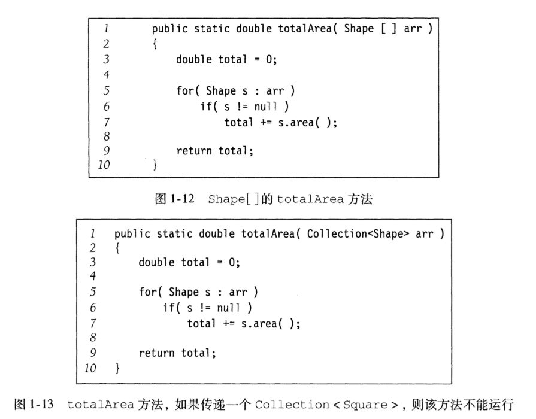
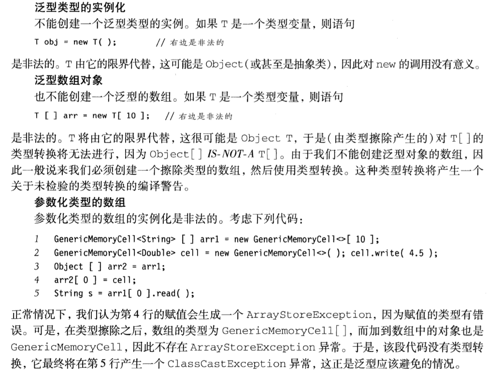

#### 数学知识

+ 模运算

> **A mod B = A - A / B * B**
>
> 同模：A≡B(mod N)，那么 A + C ≡ B + C(mod N)，AD≡BD(mod N)

+ 递归简论

> **基准情形**
>
> **向基准情形（已知方向）不断推进**

+ 实现泛型构件
    + 使用Object表示泛型（只使用Object已有方法才使用这种方式）
    + 使用接口类型表示泛型（Comparable，Comparator），如果接口是final就不可以扩展类，通过**Function Object**（函数对象）使用一些接口
    + 使用Java5泛型特性实现泛型构件

+ 关联关系
    + **IS-A**
    + **HAS-A**
    + **USE-A**

+ 数组类型的兼容性（协变性）

> Employee <kbd>IS-A</kbd> Person
>
> Student <kbd>IS-A</kbd> Person
>
> ``` java
> Person[] arr = new Person[5];
> // 这里是允许的（即能通过编译）
> // 运行时也不会抛出ClassCastException，因为数组是特殊类型，不存在类型转换
> arr[0] = new Employee();
> arr[1] = new Student();
> ```
>
> 以上称作<kbd>协变数组类型</kbd>，但使用时会抛出<kbd>ArraySotreException</kbd>
>
> Employee[ ] **IS-A** Person[ ]

+ 泛型

``` java
// 泛型类
public class Cell<T> {}
// 泛型接口
public interface Comparable<T> {}
// 带限制的通配符
```

> Employee <kbd>IS-A</kbd> Person
>
> Student <kbd>IS-A</kbd> Person
>
> Collection\<Employee\> **IS NOT A** Collection\<Person\>，如图1-12，1-13
>
> 使用<kbd>泛型通配符</kbd>来弥补这个不足
>
> ``` java
> // 将1-13方法签名修改
> public static double totalArea(Collection<? extends Shape> arr) {}
> ```



+ 泛型static方法和类型限界

``` java
// 泛型static方法，由于泛型擦除所以不能使用类上声明的泛型。
public static <T> boolean contains() {}

// 当我们想编写一个findMax例程。这个方法不能正常运行，因为我们不能确定T是否能调用compareTo
public static <T> T findMax(T[] arr) {
    int max = Integer.MIN_VALUE;
    for (int i = 0; i < arr.length; ++i) {
        if (arr[i].compareTo(max) > 0) {
            max = arr[i];
        }
    }
    return max;
}

// 虽然能够编译，但Cpmparable接口也是泛型
public static <T extends Comparable<T>> T findMax(T[] arr) {}

// Tips
public static <T extends Comparable<? super T>> int findMax(...){}
```

> Tips
>
> **此时我们让Shape实现Comparable**
>
> 于是Square **IS-A** Comparable\<Shape\>
>
> 但Square **IS NOT A** Comparable\<Square\>，所以Comparable接口中我们应该选取Square的父类
>
> 即T **IS-A** Comparable\<R\>，其中R 是 T的父类，表示为?  super T



