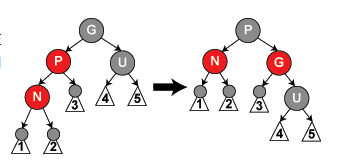

> 性质：
>
> + 节点是红色或黑色
> + 根是黑色
> + 所有叶子都是黑色
> + 红色节点的子节点都是黑色，从叶子到根的路径上不能有连续的红色节点
> + 从任意节点到其每个叶子节点的所有简单路径都包含相同数目的黑色节点

``` java
Node grandparent(Node node) {
    return node.parent().parent();
}
Node uncle(Node node) {
    Node grandparent = node.grandparent();
    if (node.parent() == grandparent.left) {
        return grandparent.right;
    } else {
        return grandparent.left;
    }
}
```

> Tips：旋转例程如下

``` java
// 右旋，主要是把左子节点的右儿子放到右子节点的左儿子上
void rightRotate(n) {
    Node left = n.left;
    Node newNode = new Node(n.val);
    newNode.left = left.right;
    newNode.right = n.right;
    n.val = left.val;
    n.left = left.left;
    n.right = newNode;
}

// 左旋，主要是把右子节点的左儿子放到左子节点的右儿子上
void leftRotate(Node n) {
    Node right = n.right;
    Node newNode = new Node(n.val);
    newNode.right = right.left;
    newNode.left = n.left;
    n.val = right.val;
    n.right = right.right;
    n.left = newNode;
}
```


+ insert

> 我们首先以二叉搜索树的方法**增加节点并标记为红色**，通过**颜色调换和旋转**进行调整

``` java
void insert_case1(Node n) {
    if(null == n.parent()) {
        n.color = BLACK;
    } else {
        inert_case2(n)
    }
}

/**
 *       黑
 *      /   \
 *     红    红
 */
void insert_case2(Node n) {
    if (n.parent().color == BLACK) {
        return; // 不需要处理
    } else {
        insert_case3(n);
    }
}
```

**情形3**:如父节点P和叔父节点U二者都是红色，（此时新插入节点N做为P的左子节点或右子节点都属于情形3，这里右图仅显示N做为P左子的情形）则我们可以将它们两个重绘为黑色并重绘祖父节点G为红色（用来保持性质5）。现在我们的新节点N有了一个黑色的父节点P。因为通过父节点P或叔父节点U的任何路径都必定通过祖父节点G，在这些路径上的黑节点数目没有改变。但是，红色的祖父节点G可能是根节点，这就违反了性质2，也有可能祖父节点G的父节点是红色的，这就违反了性质4。为了解决这个问题，我们在祖父节点G上递归地进行**情形1**的整个过程。（把G当成是新加入的节点进行各种情形的检查）


``` java
/**
 *       G黑
 *      /   \
 *     P红    U红
 *    /
 *   N红
 * parent 和 uncle 都是红色。修改 p u为黑色，修改g为红色，递归进行insert_case1（把g当作新加节点来执行各种情形的检查）（如果是根则直接修改g为黑色）
 */
void insert_case3(Node n) {
    Node uncle = this.uncle(n);
    if (null != uncle && uncle.color = RED) {
        n.parent().color = BLACK;
        uncle.color = BLACK;
        Node gp = this.grandparent(n);
        gp.color = RED;
        insert_case1(gp);
    } else {
        insert_case4(n);
    }
}
```

> Tips
>
> **余下的情形，未采用Wikipedia**

**情形4**:父节点P是红色而叔父节点U是黑色或缺少，并且新节点N是其父节点P的右子节点而父节点P又是其父节点的左子节点。在这种情形下，我们进行一次[左旋转](https://zh.wikipedia.org/wiki/树旋转)调换新节点和其父节点的角色;接着，我们按**情形5**处理以前的父节点P以解决仍然失效的性质4。注意这个改变会导致某些路径通过它们以前不通过的新节点N（比如图中1号叶子节点）或不通过节点P（比如图中3号叶子节点），但由于这两个节点都是红色的，所以性质5仍有效。


``` java
void insert_case4(Node n) {
    leftRotate(n.parent);
    // n = n.left;
    insert_case5(n.left);
}
```

**情形5**：父节点P是红色而叔父节点U是黑色或缺少，新节点N是其父节点的左子节点，而父节点P又是其父节点G的左子节点。在这种情形下，我们进行针对祖父节点G的一次[右旋转](https://zh.wikipedia.org/wiki/树旋转)；



``` java
/**
 * 要插入的节点是父节点的左儿子， 且父节点是祖父节点的左儿子。右旋祖父节点，并交换父节点和祖父节点的颜色，如上图
 */
void insert_case5(Node n) {
    Node g = this.grandparent(n);
    boolean gColor = g.color;
    // g = rightRotateWithReturn(g)
    rightRotate(g);
    g.color = n.parent.color;
    n.parent.color = gColor;
}

```

> Tips：当父节点在祖父节点右子树时，和上面两种情形互为镜像