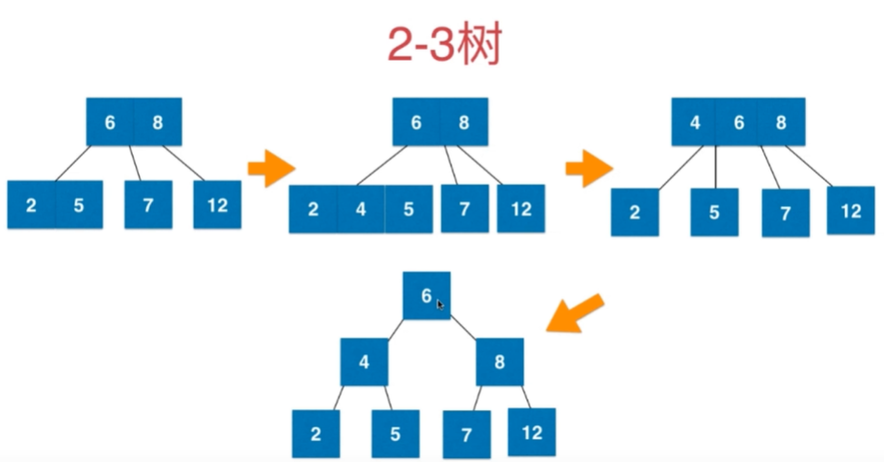

> Tips
>
> 2-3树绝对平衡，从任意节点出发到叶子节点深度相同（不管是2节点还是3节点，一定有一个黑色节点）
>
> + 2-3树添加节点永远执行最后一个叶子节点合并策略（不在空的位置添加）
>
> + 2节点形成3节点，3节点暂时形成4节点
>
> + 3节点的左侧为红色节点，所以添加新的节点都是红色
> + **所有红色节点向左倾斜**
>
> **红黑树与2-3树等价**
>
> 红黑树是保持“黑平衡”的二叉树，严格意义上不是平衡二叉树，最大高度是2logN（当每个节点都是3节点，所以额外有logN的红色节点）
>
> 红黑树的节点设置为红色，表示为应该与父节点融合在一起（等价于2-3树的3节点）




#### RB-insert（左倾红黑树）

**如下图，不同插入执行以下不同例程**


+ 是否需要左旋转
+ 是否需要右旋转
+ 是否需要颜色交换

``` java
// 颜色翻转
void filpColor(Node node) {
    node.color = RED;
    node.left.color = BLACK;
    node.right.color = BLACK;
}

/**
 *      node
 *      /  \       右旋
 *     x    T2    ----->
 *    / \
 *  y    T1
 *  Node x = node.left;
 *  node.left = x.right;
 *  x.right = node;
 *  原来的颜色 x.color = node.color
 *  相当于2-3树的4节点，设置为红色，表示与父节点融合在一起node.color = RED;
 */

// 以下步骤不是互斥条件
// 第二步骤
if (!isRead(node.left && isRed(node.right))) {
    node = leftRotate(node);
}
// 第三步骤
if (isRed(node.left) && !isRed(node.right)) {
    node = node.rightRotate(node);
}
// 第四步骤
if (isRed(node.left) && isRed(node.right)) {
    flipColor(node);
}
```

