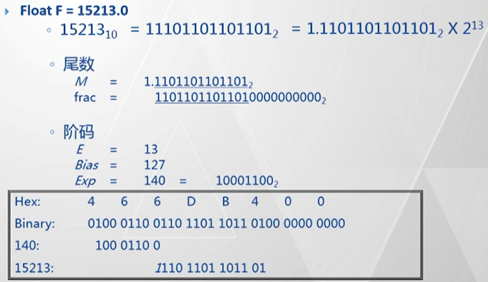
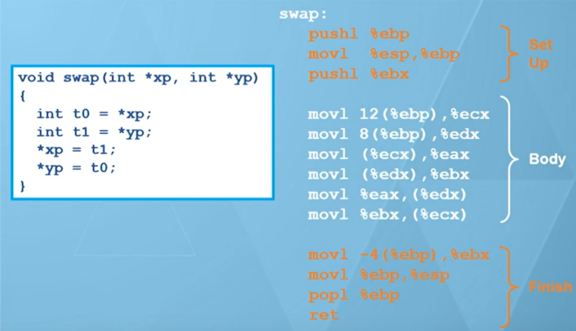
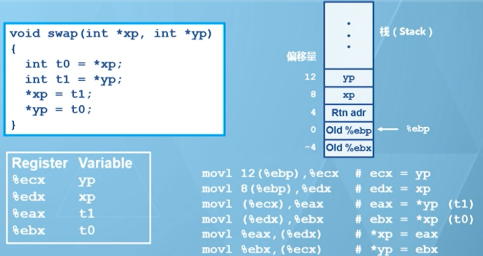
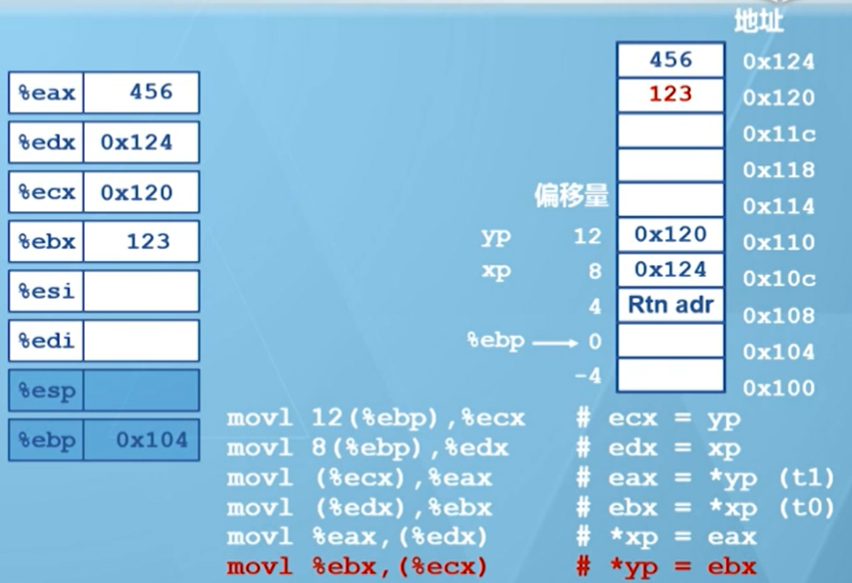

## 清华大学汇编程序设计


### 1 指令集体系

+ CISC
    + X86
    + ARM

> 个人机、服务器、超级计算机等都基于X86体系结构
>
> 优缺点：
>
> + 向上兼容
>
> + ==变长指令==（1 ~ 15字节，多数为2 ~ 3字节）
>
> + 多种寻址方式
>
> + 通用寄存器个数固定（X86-32有8个通用寄存器，X86-64有16个通用寄存器）
>
> + 最多能有一个操作数在内存中，另一个操作数为立即数 | 寄存器
> + 功耗较高

+ RISC（MIPS）

> 经典的RISC指令集，MIPS Ⅰ、MIPS Ⅱ、MIPS Ⅲ、MIPS Ⅳ、MIPS Ⅴ
>
> ==简化指令架构，充分利用处理器的流水线结构==
>
> 以寄存器堆为中心（32个）、只通过Load / Store指令访存
>
> 提供32个32b寄存器，32个浮点寄存器


#### 1.1 x86通用寄存器

+ rax：返回值
+ rbx：被调用者保存
+ rcx：第4个参数
+ rdx：第3个参数
+ rsi：第2个参数
+ rdi：第1个参数
+ rbp：被调用者保存
+ rsp：栈指针

> x86-64新增8个通用寄存器

+ r8 ~ r15


#### RSIC - ARM指令集

> 结合MIPS与X86特点
>
> + 使用Load / Store访存
> + 具有16b压缩指令集（Thumb）
> + ==大多数指令具有“条件执行”模式==


### 2 数值


#### 2.1 字节序

+ 大端序（低地址对高字节，Sun、PowerPC、Internet）
+ 小端序（低地址对低字节，x86）


#### 2.2 浮点数

见CSAPP浮点数

+ 规格化值

规格化值在内存中如何存储？

> 小数点左移相当于  / 2
>
> 右移相当于 * 2



+ 非规格化值
+ 特殊值


### 3 C与汇编

```shell
int sum(int x, int y) {
  int r = x + y;
  return r;
}

# AT&T格式的汇编码
pushl %ebp
movl %esp, %ebp
# (%ebp)取的是ebp寄存器中内存地址 + 12所表示的地址的数据，传送到eax寄存器
# 为什么 + 12呢，应该是函数调用时已经确定local variable大小，只需分配12字节的空间即可完成本次调用
movl 12(%ebp), %eax
movl 8(%ebp), %eax
movl %ebp,%esp
popl %ebp
ret
```


#### 3.1 寻址模式

> 函数的汇编码分三个部分：
>
> + Set Up：建立函数运行的栈帧
>
> + Body：运行
>
> + Finish：撤销栈帧




寄存器与数据对照图：

> **==ebp寄存器是栈帧的基址，往上加就可以访问父函数給的变量，往下减可以访问当前函数的局部变量==**




执行运算

