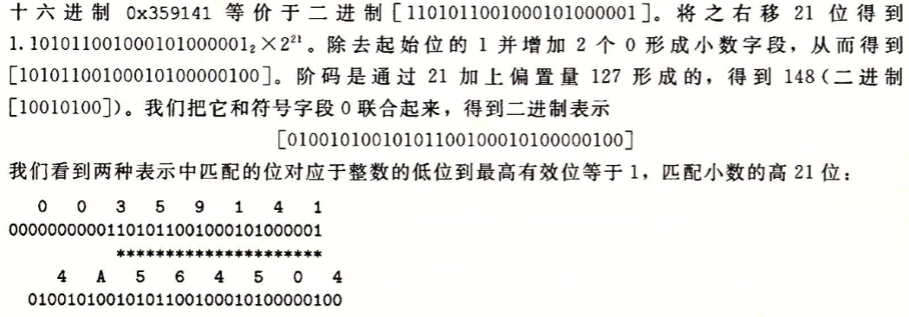
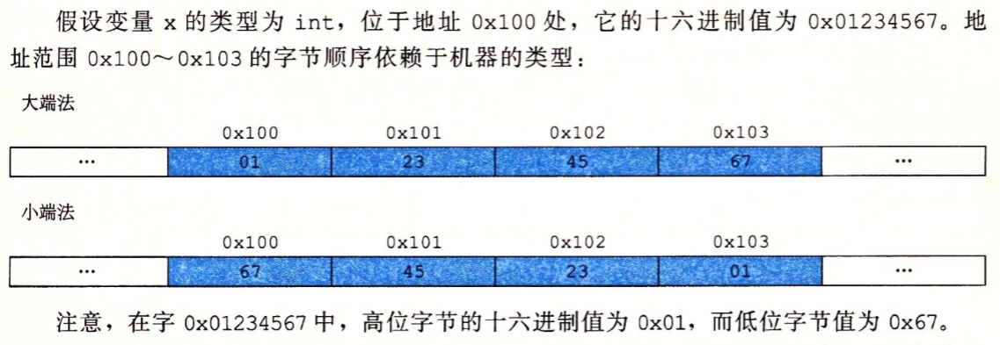

### 1 计算机系统漫游

hello.c

``` c
#include <stdio.h>
int main() {
    printf("hello world\n");
    return 0;
}
```

hello.c 	---->	汇编程序文本hello.s	-- 汇编器as ->	可重定位目标程序（二进制）hello.o	-- 链接器ld -> 可执行目标程序（二进制）hello


+ ==预处理阶段==。预处理器（cpp）根据#修改原始c程序，比如将stdio.h的内容插入到程序文本中，形成hello.i
+ 编译阶段。编译器（ccl）将文本文件hello.i翻译为汇编文本文件hello,s

+ 汇编阶段。接下来汇编器（as）将hello.s翻译成机器语言指令，保存在hello.o二进制文件中

+ 链接阶段。printf位于printf.o的预编译好的目标文件中，这个文件必须合并到hello.o，由链接器处理

``` commonlisp
// hello.s

main:
	subq	$8, %rsp
	movl	$.LC0, %edi
	call	puts
	movl	$0, %eax	(eax寄存器)
	addq	$8, %rsp
	ret
```


> ==switch是否总比if-else高效，一个函数调用开销多大，while是否比for更有效，为什么循环求和结果放到本地变量运行快很多，为什么重排列算术表达式括号能让函数运行更快==


==IO桥应该指南桥，根据陆俊林老师描述，南桥集成了大部分（显卡除外）IO设备控制器，包括DMA控制器==

==每个I / O设备通过控制器 / 适配器与 I / O总线相连==。控制器是I / O设备本身，或主板上的芯片组；适配器则是主板插槽上的卡，它们功能相同

==主存：由一组动态随机存取存储器（DRAM）芯片组成，逻辑上是一个线性字节数组，每条机器指令可能不同字节（变长指令）==

简单操作围绕：==主存，寄存器文件（寄存器堆），ALU进行==。如：

​	load（加载）：从主存复制一个字或一个字节到寄存器，覆盖寄存器原来的内容

​	store（存储）：从寄存器赋值一个字或一个字节到主存某个位置

​	操作：将两个寄存器的内容复制到ALU，执行运算并将结果存到一个寄存器中

​	跳转：从指令本身抽取一个字，将这个字复制到PC中，覆盖PC原来的值

==字长：IA32一个字长为4个字节，X86_64为8个字节。==

==指令架构与微体系结构区分开来==

==利用直接存储器存取（DMA），hello程序数据可不通过处理器（CPU）直接从磁盘到达主存==


机械原理：较大存储设备比较小存储设备运行慢

高速缓存（SRAM）：参考陆俊林老师讲解高速缓存，及Core i7多级缓存架构；

​	一个容量256K字节的L2高速缓存通过一条特殊总线连到CPU


系统调用：

​	hello程序没有直接访问硬件，它们依靠操作系统提供的服务 / 接口（==所有应用程序对硬件操作都必须通过OS提供的系统调用==）


指令集架构：对处理器硬件的抽象

OS基本抽象概念（进程，虚拟内存，文件）

​	虚拟机：对OS，CPU，主存，I/O设备的抽象

​	==进程： 对CPU，主存，I / O设备的抽象表示，是操作系统对一个正在运行程序的抽象==

​	==虚拟文件： 对主存，I/O设备的抽象表示==

​	==文件：对I/O设备的抽象表示==

``` shell
$ ./hello
```

==上下文==：寄存器文件的当前值，PC，主存的内容

单CPU系统中，==shell进程和hello进程并发==，当./hello 回车时，shell通过系统调用，==陷入（trap）==内核空间控制权传递给OS，OS保存shell进程上下文，创建hello新进程及其上下文，OS将CPU交给hello进程，hello进程终止后（也会执行中断调用），OS恢复shell进程的上下文，并将控制权传递給shell

上下文切换：

​	模式切换：涉及2次上下文切换，陷入内核态，从内核态返回到用户态

​	同一进程中线程切换

​	不同进程线程切换

==虚拟内存==：是一个抽象概念，每个进程都像是在独占地使用主存，每个进程看到内存都是一致的，称为虚地址空间

Linux中，地址空间最上面是保留给OS的代码和数据，地址空间的底部区域存放用户进程定义的代码和数据，注意：地址从下往上增大

​	程序代码和数据：对所有进程来说，代码从同一固定地址开始，紧接着是C全局变量对应的数据位置

​	堆：代码和数据区后是运行时堆

​	共享库：地址空间中间部分存放C标准库和数学库这样共享库的代码和数据区域

​	栈：用户虚拟地址空间顶部是用户栈，编译器用它实现函数调用

​	内核虚拟内存：地址空间顶部是为内核保留，用户程序需通过系统调用执行这些操作


8086为单周期处理器，通常（3 ~ 10）T执行一条指令

如果处理器可以达到比一个周期一条指令更快的执行速率，称之为==超标量处理器==

现代处理器每条指令大约20T及以上，通过==流水线==并行，可保持在每个时钟周期2 ~ 4条指令

+ 指令级并行（通过流水线技术实现）
+ 单指令，多数据并行（并行的8对单精度浮点数做加法指令）

==超线程（同时多线程==）：涉及CPU某些硬件多个备份（如PC, 寄存器文件），而其它硬件只有一份（如浮点运算单元）。常规处理器需要大约20000T做不同线程切换，而超线程处理器可在单周期决定要执行哪个线程，Core i7处理器可以让每个核执行两个线程。使用同一部件时只能执行单个线程（性能提升20% - 30%）

==多核处理器==：将多个CPU（“核”）集成到一个电路芯片；如下图：


### 2 信息的表示和处理

无符号编码：令一个整数有w位，每一位的1都对应数字值的一部分，用B2U<sub>w</sub>表示


​	==对于许多应用，我们还希望表示负数值，最高位1表示负数，0表示正数==

有符号数3种表示方法：原码（B2S<sub>w</sub>），反码（B2O<sub>w</sub>），补码（B2T<sub>w</sub>）；

​		原码： +2：0010		-2： 1010		2 +（-2） = -4结果错误

​		反码（Ones‘ complement）： +2：0010	-2：1101	2 +（-2）= 1111

​		补码（Two's complement）:	+2：0010 -2：1110	2 + （-2）= 0

​	原码和反码有正负0之分，原码中-0表示为：【10...0】，==反码中规定-0表示为【11...1】==

​	==对于非负数x，反码用【1...1】- x表示 -x， 补码用 2<sup>w</sup> - x表示 -x==

c++建立在c之上，它们使用相同的数字表示和运算，Java采用新的数字表示和运算标准，C有无符号数，Java中存在有符号数


无符号数的零扩展

补码数的符号扩展


+ 无符号数加法

x +<sub>w</sub><sup>u</sup> y =（x + y）mod 2<sup>w</sup>

模数加法形成一种数学结构，称为==阿贝尔群==

无符号数求反（非）： x = 0时，加法逆元 = 0，对于x > 0，加法逆元 = 2<sup>w</sup> - x	==》 (x +  2<sup>w</sup> - x) mod 2<sup>w</sup> = 0

是否溢出：s = x + (y - 2<sup>w</sup>) < x;	s < x | s < y 时发生溢出

+ 补码加法

将补码数转换为无符号数，执行无符号数加法，再将结果转换为补码

补码加法正溢出： x > 0, y > 0, s <= 0

​				负溢出：x < 0, y < 0, s >= 0

==补码的非==： x = TMin<sub>w</sub>时， 其加法逆元 = TMin<sub>w</sub>， x > TMin<sub>w</sub>时， 其加法逆元 = -x

​	按位取反 + 1	==>	-x = ~x + 1

​	令k是最右边的1，将k左边所有位取反	==>	1100（-4） -k是第二个1->	0100（4）


无符号数乘法：x * y = x * y mod 2<sup>w</sup>

补码乘法：与无符号乘法位级等价

整数乘法需要10T或更多时钟周期（Core i7 Haswell整数乘法也至少需要3T），然而（加，减，位级运算，移位）只需要1T，因此编译器使用一项重要优化：==用移位和加法组合代替乘以常数因子的乘法==

x * 14 ==> (x << 3) + (x << 2) + (x << 1)	==> (x << 4) - (x << 1)

整数除法一般需要30T或更多时钟周期，==除以2的幂可以使用右移实现==，无符号数逻辑右移，补码数算术右移，不能优化除以任意常数K（除法需要舍位）

==补码数算术右移（向下舍入）：(x < 0 ? x + (1 << k) - 1 : x) >> k==


浮点数：以2为基数的科学计数法表示实数，表示精度的位有限，所以浮点运算不能结合

考虑十进制小数：12.34<sub>10</sub>的表示： 1 * 10<sup>1</sup> + 2 * 10<sup>0</sup> + 3 * 10<sup>-1</sup> + 4 * 10<sup>-2</sup> = 12 + 34 / 100

二进制：101.11 = 1 * 2<sup>2</sup> + 0 + 1 + 1 * 2<sup>-1</sup> + 1 * 2<sup>-2</sup> = 5 + 3 / 4

​	小数点左移相当于这个数除以2	==> 10.111 = 2 + 0 + 1 / 2 + 1 / 4 + 1 / 8 = 2 + 7 / 8

​	小数点右移详单与这个数乘以2	==> 1011.1 = 8 + 0 + 2 + 1 + 1 / 2 = 11 + 1 / 2

假定我们仅考虑有限长度的编码，那么十进制无法准确表示1/ 3，类似的小数二进制只能表示那些能被写成x * 2<sup>y</sup>的数，其它的值只能够被近似的表示，增加二进制表示的长度可以提高精度

浮点数表示：V = (-1)<sup>s</sup> * M * 2<sup>E</sup>

​	符号（sign）

​	阶码（exponent）

​	尾数（significand）

==将浮点数的位划分为3个字段，分别编码==：

​	1位符号位

​	k位阶码字段，对于单精度数k = 8，双精度k = 11

​	n位小数字段，对于单精度n = 23，双精度n = 52

对给定位表示，根据exp（阶码）的值，被编码的数值分为3种情况，如下图：


+ 规格化的值

> 当exp既不全0也不全1（单精度255，双进度2047）时。阶码被解释为以偏置（biased）形式表示的有符号整数：E = e - Bias，e为阶码表示的无符号数，==Bias是固定等于2<sup>k-1</sup> - 1（单精度127，双精度1023）==的偏置值，由此产生==指数取值范围（单精度1 - 127 ~ 255 - 127，双精度1 - 1023 ~ 2047 - 1023）==
>
> 小数值0 <= f < 1，二进制表示为0.f<sub>n-1</sub>...f<sub>0</sub>，也就是二进制小数点在最高有效位的左边，尾数定义为M = 1 + f


对于8b浮点数，阶码4b，尾数3b

0	0001	001

==e（阶码）：0001	E：编码阶码==

==f（尾数）：001	M：编码尾数==

对于非规格化数：M = f，e = 0，E = 1 - Bais

​		规格化数：M = 1 + f，e 为无符号表示数，E = e - Bias

|                | 位表示     |          指数           |    小数     |        值         |
| :------------: | ---------- | :---------------------: | :---------: | :---------------: |
|                |            | e    E    2<sup>E</sup> |   f    M    |    V    十进制    |
|       0        | 0 0000 000 |     0    -6    1/64     |   0    0    |     0    0.0      |
| 最小非规格化数 | 0 0000 001 |     0    -6    1/64     | 1/8    1/8  | 1/512    0.001953 |
|                |            |                         |             |                   |
| 最大非规格化数 | 0 0000 111 |     0    -6    1/64     | 7/8     7/8 |                   |
|  最小规格化数  | 0 0001 000 |     1    -6    1/64     |  0    8/8   | 1/64    0.015625  |
|                |            |                         |             |                   |
|  最大规格化数  | 0 1110 111 |     14    7    128      | 7/8    15/8 |  1920/8    240.0  |
|     无穷大     | 0 1111 000 |                         |             |                   |




==浮点运算在加法上不具有分配性，只有有限的范围和精度，通过将数字编码为 x * 2<sup>y</sup>的形式近似的表示实数==


​	机器级程序将内存视为一个字节数组，称为虚拟内存，内存的每个字节都有一个唯一标识，称为它的地址，所有可能地址的集合称为==虚拟地址空间==

​	编译器和运行时系统将存储器划分为可管理单元，存放不同程序对象（程序数据，指令，控制信息）

==指针==：有两个方面，值和类型。值表示某个对象的位置，类型表示位置上所存储对象的类型

每台计算机都有一个字长（word size），指明指针数据的标称大小（normal size），因为==虚拟地址以一个字c长来编码==的，所以字长决定最重要系统参数是虚拟地址空间的大小。也就是说，对一个字长w位的机器，虚拟地址范围2<sup>w</sup> - 1



布尔代数：长度为w的位向量上的布尔运算& | ~形成布尔代数

布尔环：长度w位的位向量上^ & ~ 运算时会得到不同的数学形式。布尔环与整数运算有很多相同属性，例如：整数运算x+(-x) = 0，对于布尔环：a ^ a = 0，a ^ b ^ a = b

在实际应用中，用==位向量对集合编码==，用| &是实现集合并 交，~对应集合的补

我们通过指定一个位向量掩码，有选择的使用使能或屏蔽一些信号


逻辑运算符：|| && !，对应命题逻辑OR, AND, NOT运算，但==逻辑运算与位级运算完全不同==

==编译器可以安全的把常量乘法转换为一系列移位和加法==

不能用 x - y < 0代替x < y


### 3 程序的机器级表示

> 优化编译器能够重新排列执行顺序，消除不必要的计算，用快速操作替换慢速操作，甚至将递归变换为迭代
>
> 考虑如何在机器级实现数组数据结构
>
> 我们基于x86_64表述机器语言


x86_64机器代码

"PC"，在x86_64表示为 "%rip"

X86_64的虚拟地址由64位的字表示，在目前实现中地址高16位必设置为0，所以实际能指定2<sup>48</sup> = 64TB的空间，一般程序访问几千M字节的数据，OS负责将虚拟地址翻译为实际处理器内存中的物理地址


汇编代码格式：

​	Intel

​	ATT

> Intel省略只是大小的后缀，push | move，而不是pushq | movq
>
> Intel省略寄存器名字前“%”，使用rbx，而不是“%rbx”
>
> Intel用不同方式描述内存中的位置，“QWORD PTR [rbx]” 而不是 “(%rbx)”
>
> 在多个操作数的指令下，列出操作数的顺序相反
>
> ==Intel用术语“字（word）”表示16位数据类型，因此称32位数为“双字（double words）”，称64位数为“四字（quad words）”==


| C声明  | Intel数据类型 | 汇编代码后缀   | 字节 |
| ------ | ------------- | -------------- | ---- |
| char   | 字节          | b              | 1    |
| short  | 字            | w              | 2    |
| int    | 双字          | l（long word） | 4    |
| long   | 四字          | q              | 8    |
| float  | 单精度        | s              | 4    |
| double | 双精度        | l              | 8    |

例如：数据传送指令：==movb（传送字节），movw（传送字），movl（传送双字），movq（传送4字），用“l”表示4字节整数和8字节双精度浮点数，这不会产生歧义，因为浮点数使用一组完全不同的指令和寄存器==

16个通用整数寄存器：也可以指定ah，al


==push %ebp 调用方法保存上一栈帧基址==

==sub$0x18, %esp：給新栈帧分配空间==

==add$0x18, %esp：撤销栈帧==

==pop %ebp 恢复上一栈帧==


操作数三种类型：

​	立即数：$-577 | $0X1F

​	寄存器：r<sub>a</sub>

​	内存引用：M[addr]，允许多种形式的内存引用

​		如：Imm(r<sub>b</sub>, r<sub>i</sub>, s)，立即数偏移Imm，基址寄存器r<sub>b</sub>，变址寄存器r<sub>a</sub>和比例因子s；有效地址被计算为：

​			Imm + R[rb] + R[ri] * s


栈分配，寄存器使用惯例，参数传递

数据结构的分配和访问方式

整数与浮点运算指令

缓冲区溢出


### 4 处理器体系结构

单时钟周期数据通路 与 流水线思想


### 5 优化程序性能


### 6 存储器的层次结构

RAM

ROM

R（磁盘 & 固态）


### 7 链接

静态链接

动态链接


### 8 异常控制流

进程控制


### 9虚拟内存


### 10 系统级I / O


### 11 网络编程

进程，信号，字节顺序，内存映射，动态内存分配

简单Web服务器

HTTP（超文本传输协议）


### 12 并发编程


搭建并发Internet服务器

P, V信号量实现同步，线程安全和可重入，竞争条件及死锁


