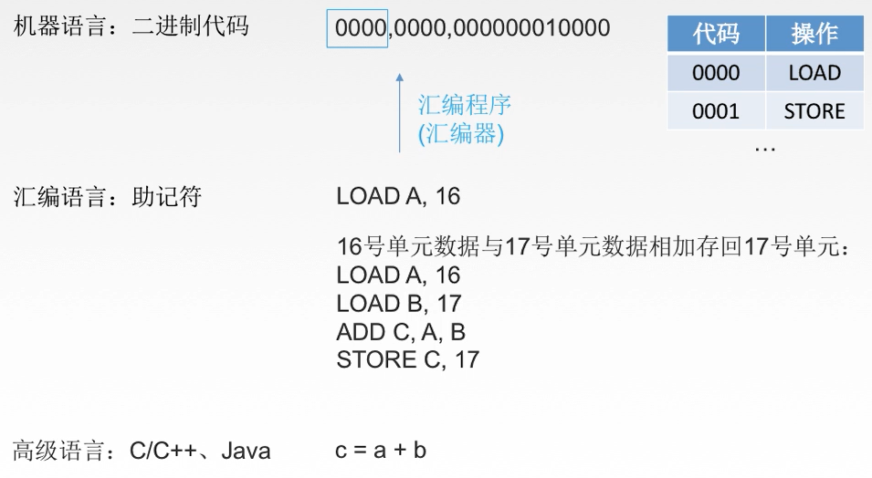
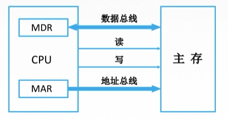
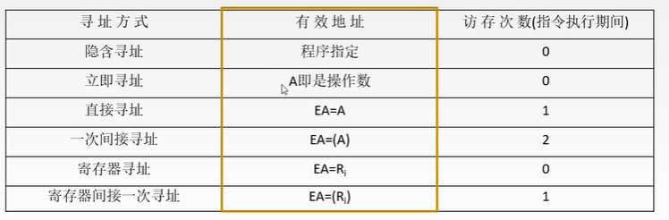
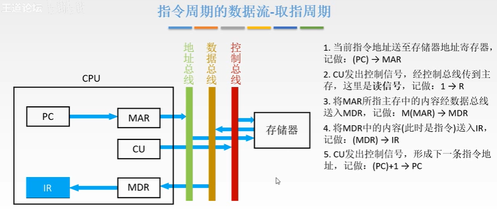

> 输入设备，控制器，运算器，存储器，输出设备
>
> **CPU：控制器，运算器，主存储器**
>
> 字长：CPU一次能处理的二进制位数的长度
>
> **CPU 与 Cache交换数据，Cache与主存交换数据，主存 < - I/O总线 -> 辅助存储器（磁盘 / 固态）交换数据**

#### Cache

> cache 使用 sram（static random access memory）
>
> 主存使用dram（dynamic random access memory）
>
> 1 Cache行与主存地址映射：全相联映射，组相联映射，直接映射
>
> 2 Cache替换算法：RAND， FIFO，LRU，LFU
>
> 3.1 Cache命中修改策略：写回法（Cache被替换时写回主存），全写法（修改时写入写缓冲（可能溢出）写回主存）
>
> 3.2 Cache未命中修改策略：写分配法（搭配写回法，将数据读入缓存行，在缓存行中修改），非写分配法（搭配全写法，直接在主存中修改）

#### 指令

> 假设指令字长及存储字长均为32位，操作码占8位（指令集最多255个）
>
> 四地址指令，4个指令地址码各占6位，寻址范围26，需访存4次
>
> 三地址指令，3个指令地址码各占8位，寻址范围28，访存4次
>
> 二地址指令，2个指令地址码各占12位，寻址范围212，访存4次
>
> 一地址指令（单目运算符），寻址范围224=16M字节， 加1减1取反求补访存3次，ACC访存2次
>
> 零地址指令：空操作，关中断，停机等指令

#### 数据寻址

#### CPU

> CPU功能和结构
>
> CPU：运算器（ALU），控制器（取指令，分析指令，执行指令）
>
> 指令执行过程
>
> 数据通路的功能和基本结构
>
> 控制器的功能和原理（）
>
> 指令流水线

