## 计算机组成 - 快速回顾


#### 2.2 总线

> USB：通用串行总线
>
> 无总线设计的话，输入设备，存储器，运算器，控制器，输出设备连线复杂


##### 2.2.1 总线分类

+ 片内总线

> 位于CPU内部，寄存器、高速缓存、控制器、运算器、中断系统

高速缓存 <——> 控制器

​	| ———总线—— |

中断系统	—— 运算器


+ 系统总线

    + 数据总线（传输数据）

    + 地址总线（传输数据的地址，寻址的位数）

    + 控制总线

        用来发出各种控制信号的传输线

        控制信号经控制总线从一个组件发送给另一个组件

        控制总线可以监视不同组件之间的状态（就绪/未就绪）

> 连接计算机外围设备的一条总线

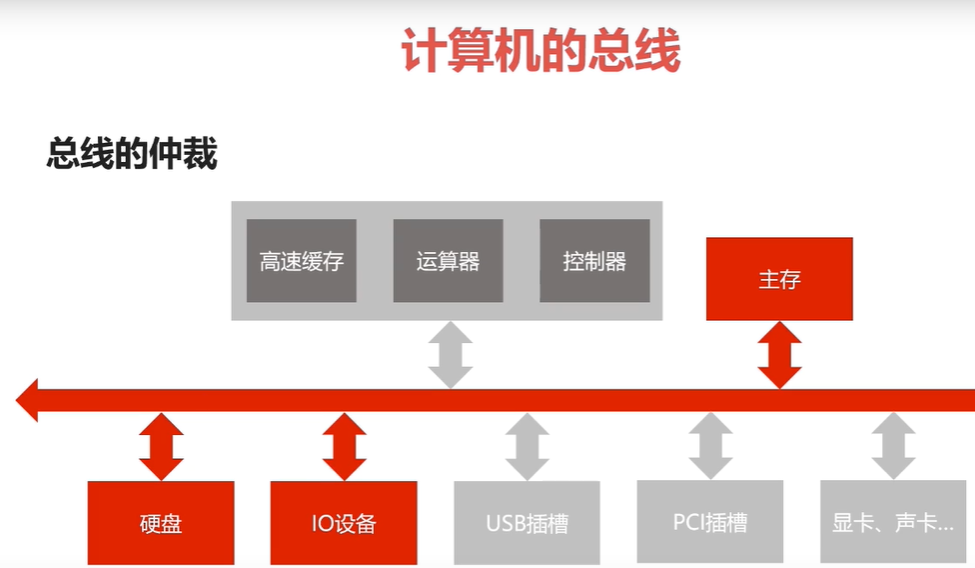


##### 2.2.2 总线的仲裁

> 如果硬盘与IO设备同时就绪，那么誰该使用总线？
>
> 总线仲裁解决不同设备使用总线的优先策略
>
> 仲裁控制器连接各种设备


+ 链式查询（串联电路连接，电路简单）
+ 计时器定时查询
+ 独立请求（设备连线多）


#### 2.3 输入输出


##### 2.3.2 输入输出接口的设计

> 有哪些要求？
>
> 发送数据、读取数据、设备是否连接、设备是否占用


+ 数据线
+ 状态线
+ 命令线（CPU向IO设备发送信号（读写信号））
+ 设备选择线


##### 2.3.3 CPU与IO的通信


+ 程序中断

> 低俗设备通知CPU的一种异步的方式
>
> 频繁的打断CPU导致CPU利用率低

+ DMA

> CPU — 主存 — DMA控制器 — I/O
>
> ==**不需要CPU参与**==


#### 2.4 存储器

按访问方式分类

+ RAM（SRAM、DRAM）
+ ROM（BIOS、手机固件）
+ 串行（磁带）


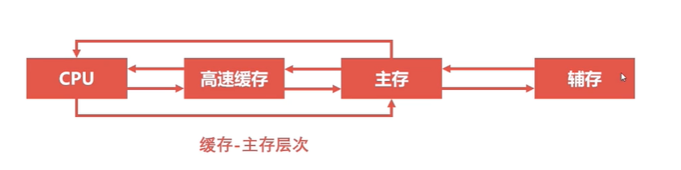

##### 2.4.1 局部性原理

+ 时间局部性
+ 空间局部性


##### 2.4.2 高速缓存

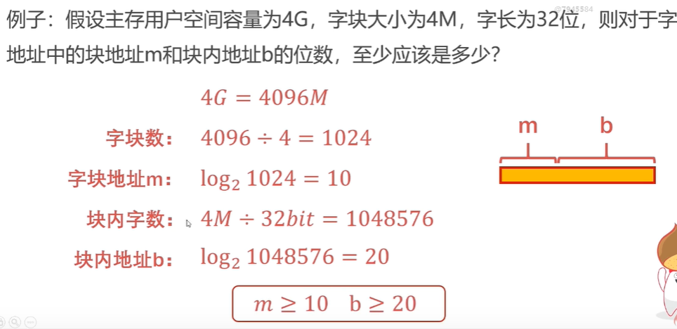


+ 缓存命中

+ 缓存不命中

    > 缓存替换策略：
    >
    > + 随机
    >
    > + FIFO
    >
    > + ==LRU（最近最久未使用）==
    >
    >     ==一般使用双向链表实现，将最近访问的数据移动到队头，然后替换队尾数据==
    >
    > + ==LFU（最近最少使用）==
    >
    >     ==添加额外的空间记录使用频率==


##### 2.4.3 主存

> RAM（随机存储器，Random Access Memory）
>
> 通过电容存储数据、需要定时刷新补充电荷


##### 2.4.4 磁盘调度算法

+ 先来先服务
+ 最短寻道时间优先算法
+ 扫描算法（电梯算法）

> 每次只往一个方向移动
>
> 达到一个方向的尽头再转向

+ 循环扫描算法

> 只能往一个方向读取


#### 2.7 指令系统

> 机器指令的形式：
>
> **==由操作码和地址码组成==**
>
> + 地址码给出操作数或操作数的地址
>
> + 分三、二、一、零地址指令
>
>     零地址指令
>
> 如空操作、停机操作、中断返回等
>
> ​		一地址指令
>
> 操作码 addr1
>
> `addr1 OP -> addr1`：自增
>
> `addr1 OP ACC -> addr1`
>
> ​		二地址指令
>
> 操作码（OP） addr1 addr2
>
> ​		三地址指令
>
> 操作码 addr1 addr2 addr3
>
> `addr1 OP addr2 -> addr3` ：addr1 操作码 addr2 将结果放入addr3


##### 2.7.1 机器指令寻址方式


+ 立即寻址（地址码位数，**限制操作数大小**）
+ 直接寻址（地址码位数，==限制操作数寻址范围==）
+ 间接寻址（第一次寻址是操作数地址，再通过地址查找主存中数据，需要多次寻址完成速度慢）


#### 2.8 计算机的控制器

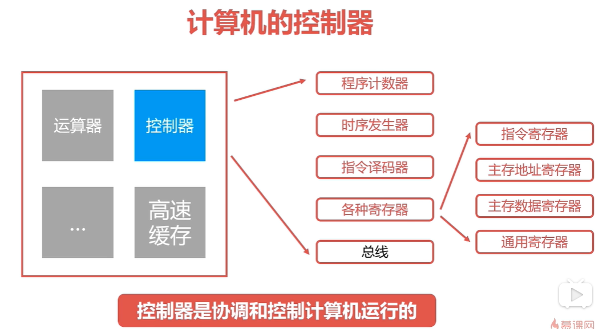

> 程序计数器：存储下一条指令的地址
>
> ==时序发生器：电气工程领域，发送时序脉冲==
>
> 指令译码器：翻译操作码对应的操作
>
> 指令寄存器：从主存或高速缓存取计算机指令
>
> 主存地址寄存器：通过地址总线与主存相连，存放CPU要访问主存的地址
>
> 主存数据寄存器：通过数据总线与主存相连，存放CPU将要读写的主存数据


#### 2.8 运算器

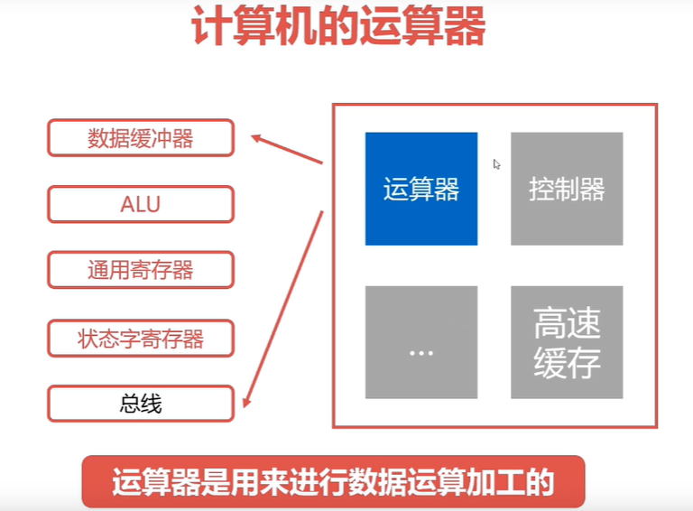


#### 2.9 指令执行过程


##### 2.9.1 机器指令执行过程

+ 取指

+ 译码
+ 执行
+ 访存
+ 回写


##### 2.9.2 流水线设计

> 运算器与控制器是串行的，CPU利用率低

取指 译码 执行 访存 回写

​		 取指 译码 执行 访存 回写


### 3 导学

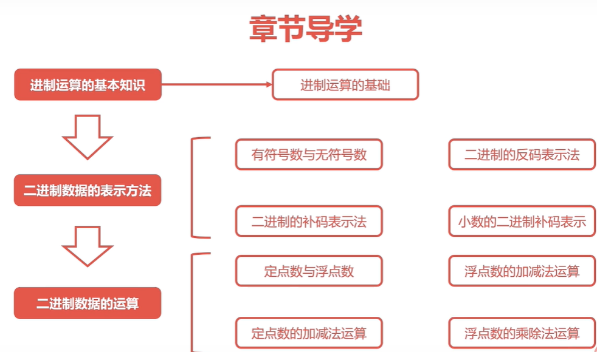


#### 3.1 二进制与十进制的转换

+ 整数

    > 二进制 -> 十进制
    >
    >  
    >
    > 十进制 -> 二进制
    >
    > **==除2取余倒序排列==**

+ 小数

    > 二进制 -> 十进制
    >
    > 11001 -> 1 * 2<sup>-4</sup> + ... + 1 = 25 / 32
    >
    >  
    >
    > 十进制 -> 二进制
    >
    > 25/32 -> ==**乘2取整顺序排列**==


#### 3.3 小数的补码

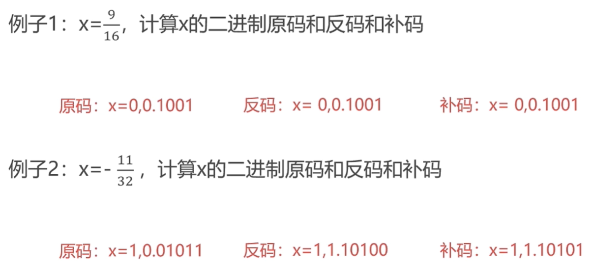


#### 3.4 浮点数

> 单精度浮点数：4字节：1b符号位，8b阶码，23b尾数
>
> 双精度浮点数：8字节，1b符号位，11b阶码，52b尾数

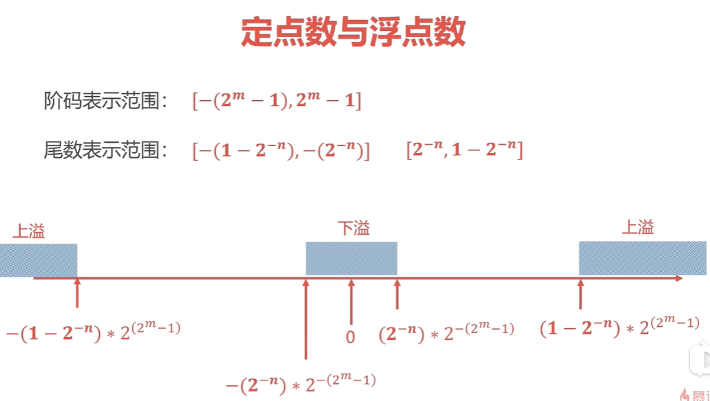

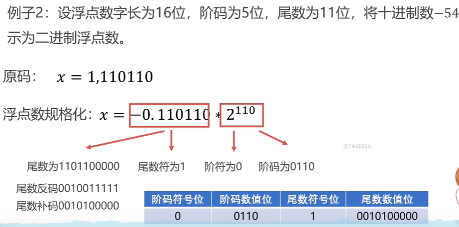


##### 3.4.1 浮点数的加减

> 溢出如何解决：双符号位


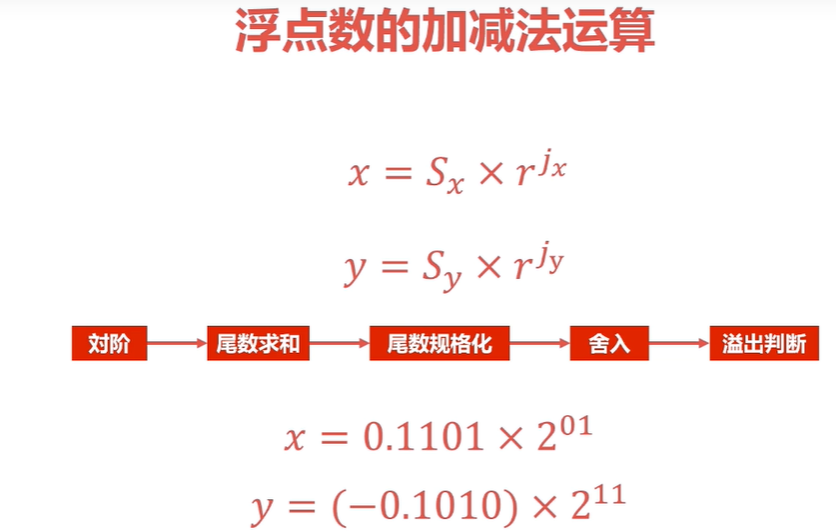


### 4 代码实现


+ 双向链表

``` py
class Node：
	def __init__(self, key, value):
		self.key = key
		self.value = value
		self.prev = None
		self.next = None
		
  def __str__(self):
  	val = f'[ {self.key}, {self.value} ]'
  	return val
  	
  def __repr__(self):
  	return __str__(self)


class DoubleLinkedList:
	def __init__(self, capacity=0xffff):
		self.capacity = capacity
		self.head = None
		self.tail = None
		self.size = 0
		
	
	# 从头部添加节点	
	def __append_front(self, node):
		if not self.head:
			self.head = self.tail = node
		else:
			pass
    self.size += 1
    
  # 从尾部添加节点
  def __append(self, node):
  	if not self.tail:
  		self.head = self.tail = node
    else:
    	pass
   	self.size += 1
    
if __name__ == '__main__':
	list = DoubleLinkeList(2)
  	
    
```


+ FIFO
+ LRU
+ LFU


==必要时，请再读一遍陆俊林老师的计算机组成原理==

## 计算机组成 - 陆俊林

重要概念：

> X86：CISC + RISC
>
> ARM：RISC + CISC（不同于X86与MIPS）
>
> MIPS：RISC
>
> 单时钟周期数据通路 & 流水线思想


### 设计CPU

1. 设计指令系统
2. 认识门电路
3. 完成ALU
4. 数据通路
5. 集成控制信号


### 冯·诺依曼结构

> + 计算机应由<kbd>CA</kbd>，<kbd>CC</kbd>，<kbd>M</kbd>，<kbd>I</kbd>，<kbd>O</kbd>组成
>
> + <kbd>数据和程序（Instruction & Data）</kbd>均以**二进制形式**不加区别的存放在存储器中
> + 计算机工作时能自动从存储器中取指执行
>
> 指令执行过程：
>
> ​	取指（Memory）、译码、执行（ALU）、访存、回写（回写到寄存器堆）


#### 模型机

> 计算机结构简化模型


> + 存储器： 控制逻辑，地址译码器，MAR（存储器地址寄存器），MDR（存储器数据寄存器）
> + CPU：控制器，运算器
>     + 控制器： 控制电路（产生控制信号），指令译码部件（对IR中的指令译码），IR，PC，MAR，MDR
>     + 运算器：ALU，通用寄存器R0 - Rn - 1，寄存器Y，X，Z，F
>
> 
>
> 指令：ADD R0, [6] --> 将R0寄存器中数据与存储器地址为6中的内容相加，存到R0中
>
> ​	1 CA产生控制信号，将PC中地址通过内部总线送到MAR
>
> ​	2 MAR把地址送到地址总线
>
> ​	...
>
> 
>
> 名词解释：
>
> ​		==ALU：对X，Y进行计算，结果保存在Z，运算产生状态保存在F==
>
> ​		F：标志寄存器（零/正负/进位/溢出）
>
> ​		内部总线：CPU内部各个部件传递数据


#### 结构与实现

> 冯诺依曼结构与实现对应

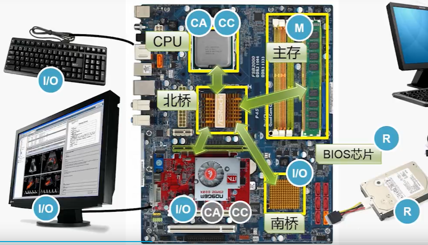

> 运行流程：**CPU通过北桥，南桥，到BIOS获取第一条指令，依次检查主板设备**
>
> 南北桥架构演变：三片式 --> 两片式


> 名词解释：
>
> ​	GPU：CA, CC参与运算
>
> ​	R：外部记录介质
>
> ​	==南桥：集成大多数I/O设备的控制器==


#### 1 自定义指令系统体系结构

> ADD R, M：将寄存器R中内容与存储器M中内容相加存入R
>
> LOAD R, M：将M中内容存入R
>
> STORE M, R：将R中内容存入M
>
> JMP L: 无条件转向L
>
> 
>
> 运算示例：将M1中内容与M2中内容相加存入M3
>
> 1. 将M1中内容送入Rx（某个寄存器）---> LOAD Rx, [M1]
>
>  	2. 将Rx中内容与M2中内容相加存入Rx ---> ADD Rx, [M2]
>  	3. 将Rx中内容存入M3 ---> STORE [M3], Rx
>  	4. 转移到L取下一条指令
>
> 
>
> 名词解释：
>
> ​	M, L为存储器地址，R为寄存器编号


### 指令集

#### X86

> X86：复杂指令体系结构（CISC）

==X86寄存器==：

|    16b （8086）     | 32b（x86，80386）  |        64b（AMD64，X86_64）        |
| :-----------------: | :----------------: | :--------------------------------: |
|    AX（AH, AL）     | EAX（AX, AH, AL）  |       RAX（EAX, AX, AH, AL）       |
|         BX          |        EBX         |                RBX                 |
|         CX          |        ECX         |                RCX                 |
|         DX          |        EDX         |                RDX                 |
|         SP          |        ESP         |                RSP                 |
|         BP          |        EBP         |                RBP                 |
|         SI          |        ESI         |                RSI                 |
| DI（通用寄存器完）  |        EDI         |                RDI                 |
|   IP（指令指针）    |        EIP         |                RIP                 |
| FLAGS（标志寄存器） | 状态标志，控制标志 | OF, DF, IF, TF, SF, ZF, AF, PF, CF |
|         CS          |                    |                                    |
|         DS          |                    |                                    |
|         ES          |                    |                                    |
|  SS（段寄存器完）   |                    |                                    |
|                     |   FS, GS段寄存器   |                                    |
|                     |                    |         R8 - R15通用寄存器         |

> MOVSB 串传送指令
>
> 
>
> 名词解释：
>
> ​	AX Accumulator（存放* / 等指令操作数）
>
> ​	BX Base（存放存储单元偏移地址）
>
> ​	CX Count（存放计数值）
>
> ​	DX Data（*产生的部分积，/的部分被除数）
>
> 
>
> 段寄存器（8086地址总线20b，物理地址 = 段寄存器地址 << 4 + 逻辑地址）
>
> ​	CS 代码段寄存器
>
> ​	DS 数据段
>
> ​	ES 附加段
>
> ​	SS 堆栈段
>
> 
>
> 标志寄存器F： OF（溢出标识位），DF（方向），IF（中断），TF（跟踪），SF（符号），ZF（零），AF（半进位）， PF（奇偶），CF（进位）


#### MIPS

> MIPS：精简指令体系结构（RISC）
>
> 指令长度固定（32b）
>
> 32个通用寄存器，每个通用寄存器32b
>
> 只有Load，Store访存
>
> 
>
> 3种类型指令：R（操作数在寄存器）， I（操作数是立即数）， J（转移）


+ R型指令

opcode + function确定指令类型

rs：第一个源操作数

rt：第二个源操作数

rd：目的操作数

shamt：移位

| 6b     | 5b   | 5b   | 5b   | 5b    | 6b       |
| ------ | ---- | ---- | ---- | ----- | -------- |
| opcode | rs   | rt   | rd   | shamt | function |


+ I型指令（立即数寻址16位）

| 6b     | 5b   | 5b   | 16b   |
| ------ | ---- | ---- | ----- |
| opcode | rs   | rt   | shamt |


+ J型指令（寻址26位）

| 6b     | 26b     |
| ------ | ------- |
| opcode | address |


**符号扩展，零扩展**


#### 2 门电路

> 晶体管（transitor）： MOS（金属氧化物半导体）
>
> NMOS：高电平导通
>
> PMOS：低电平导通
>
> CMOS：由NMOS, PMOS构成互补型MOS集成电路
>
> 
>
> ​	晶体管如何构成逻辑门电路
>
> “与非门” + "非门“ = ”与门“
>


#### 寄存器

> ==特性：只有在时钟上升沿（0 - > 1），采样输入传送到输出==
>
> 32个D触发器相连组成32位寄存器


#### ALU（算术逻辑单元）

+ 逻辑运算


##### ALU加法 & 减法

> 半加器，全加器
>
> A - B = A + (-B) = A + (~B + 1)
>
>  
>
> ==行波进位加法器（RCA）==
>
> ​	 4个全加器串联，进位来自前一个全加器
>
> 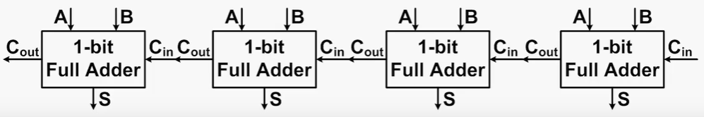
>
> ​	
>
> ​	线延迟（电磁波速度） & ==门延迟==（我们一般关注门延迟）
>
> ​	门延迟时间：
>
> ​		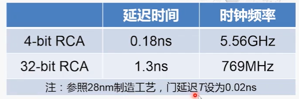
>
> ​	对于N位RCA延迟时间 = N * 2T + T
>
> ​		32位RCA延迟65T = 0.02 * 65 = 1.3ns，那么CPU频率最高达到769MHZ
>
> 
>
> 加法器优化：
>
> ​	==**超前进位加法器（CLA）**==
>
> ​		进位不来自前一个全加器，而是统一计算
>
> ​		门延迟固定，与位宽无关 = 3级 + 1级（统一计算进位） = 4级（设计电路复杂）
>
> 
>
> ​	通常采用多个小规模超前进位加法器按行波进位加拼接而成
>
> ​	

==晶体管28nm工艺制程，门延迟0.02ns==

|         | 延迟时间                                              | 时钟频率 |
| ------- | ----------------------------------------------------- | -------- |
| 32b RCA | 0.02 * 65 = 1.3ns                                     | 769MHz   |
| 1-CLA   | 0.02 * 4 = 0.08ns                                     | /        |
| 4-CLA   | 0.02 * 13 （3 * 4 + 1（进位统一计算门延迟））= 0.26ns | 3.84GHz  |


##### ALU 乘法运算

> 1000（Multiplicand） * 1001（Multiplier）
>
> ​	==对于二进制乘法，只需观察Multiplier的每一位，如果该位是1那么结果是被乘数本身，如果是0那么结果是全0==
>
> 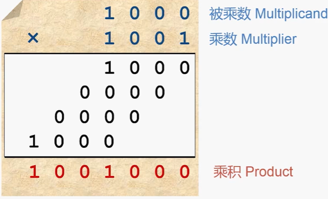
>
> 这是计算机选择二进制主要原因之一，二进制大幅简化 * / 的运算过程，尤其乘法
>
> 
>
> 硬件电路实现乘法器：
>
> 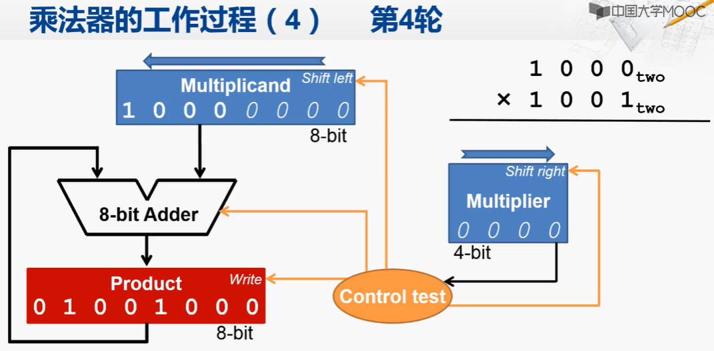
>
> ​	
>
> ​	==N位乘法流程==：
>
>  1. 检查乘数寄存器最低位
>
>     1a：如果是1，控制逻辑将乘积寄存器 与 被乘数寄存器内容相加存入乘积寄存器
>
> 2. CU将被乘数寄存器shift left
> 3. CU将乘数寄存器shift right
> 4. 是否第N次循环
>
> 
>
> ​	缺点：每执行一轮需要3个时钟周期（3T = 加法，左移，右移），对于32位 ≈ 100T
>
> ​	优化1：CC同时給加法，被乘数寄存器左移，乘数寄存器右移信号，在下一个时钟上升沿来临时会改变
>
> ​	

优化2：减少不必要的硬件资源

| 优化前                                      | 优化后                               |
| ------------------------------------------- | ------------------------------------ |
| 被乘数寄存器 8b带左移，有效数字始终4b       | 4b，不带左移                         |
| 乘数寄存器4b带右移，有效数字每T减少1b       | /                                    |
| 乘积寄存器8b，初始有效数字4位，且每T增加1b  | 高4b放乘积，带右移，低4位放乘数      |
| 加法器（Adder）8b，但参与运算有效数字实际4b | 加法器4b，乘积寄存器只有高4b参与运算 |

​	**硬件优化后的N位乘法：被乘数寄存器N位，加法器N位，乘积寄存器2N位**


##### ==ALU 除法运算==

> 00000111（Dividend） / 0010（Divisor）
>
> 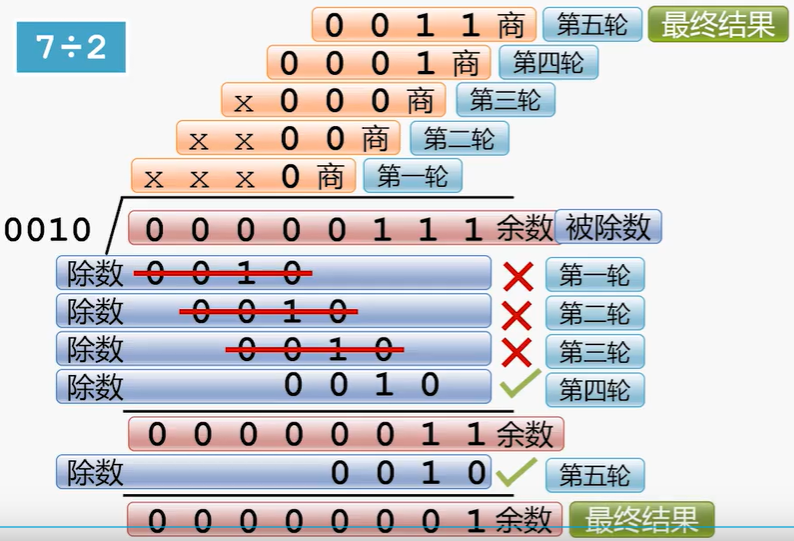
>
> ​		
>
> ​	流程：
>
> 1. 余数 / 被除数 = 余数 - 除数
>
>  	2. 判断余数寄存器值正负
>
> ​			2.1 负数： 余数 = 余数 + 除数，商左移补0
>
> ​			2.2 正数：商左移补1
>
> 3. 除数右移
>
> 4. 判断是否N + 1轮
>


对于4b除法器硬件优化：

| 优化前                    | 优化后                                         |
| ------------------------- | ---------------------------------------------- |
| 1个8b”余数寄存器“         | 8b”余数寄存器“，高4b余数，带右移，低4b商带左移 |
| 1个8b”除数寄存器“，带右移 | 除数寄存器4b，取消移位                         |
| 1个4b”商寄存器“，带左移   | /                                              |
| 1个8b”ALU“支持加法与减法  | 4b”ALU“支持加法与减法                          |


### MIPS处理器设计步骤

> 1. ==分析指令系统，得出对数据通路的要求==
> 2. ==为数据通路选择合适组件==
> 3. ==连接组件建立数据通路==
> 4. ==分析每条指令实现，确定控制信号==
> 5. ==集成控制信号==
>
>  
>
> ​	分析以上，得出处理器需要部件：
>
> ​		ALU
>
> ​		立即数扩展部件（==零扩展，符号扩展==）
>
> ​		PC（配置加法器 / ALU，顺序执行固定 + 4，跳转可能需ALU计算地址）
>
> ​		==寄存器堆（register file，两读一写）==
>
> ​		存储器（一读一写）
>
> 

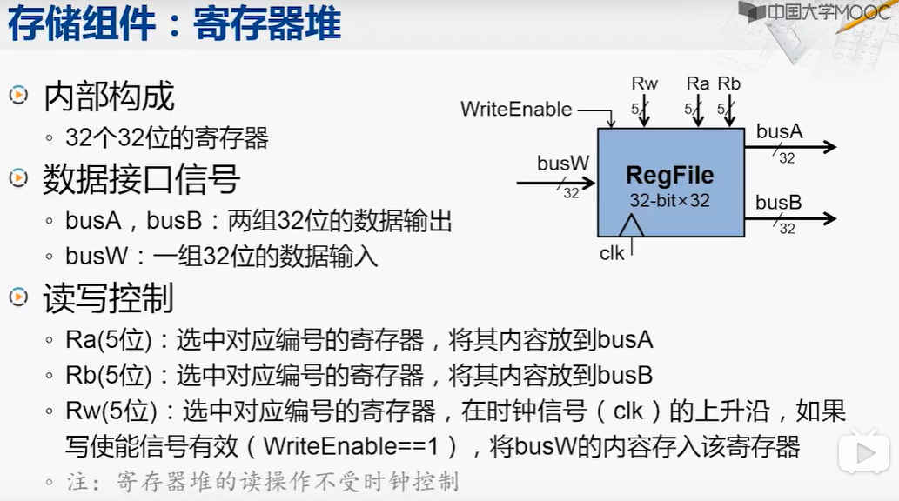


##### ==建立数据通路==

> 所有指令共同需求：IFU
>
> 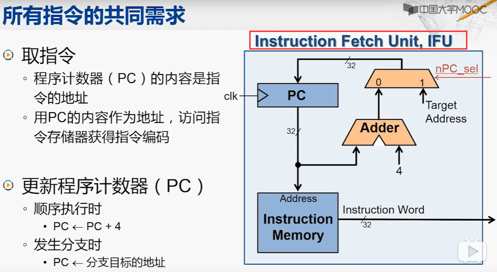
>
> 
>
> ==IFU输出32b信号，分为6组信号：opcode\<31:26\>, rs\<25:21\>, rt<20: 16>, rd<15: 11>, shamt\<10:6>, function\<5:0>==
>
> 
>
> 不同指令不同需求

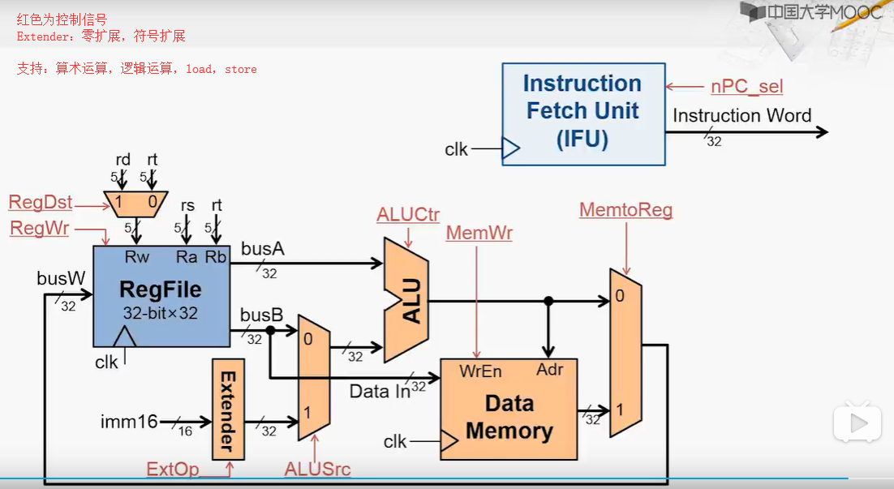

​		RegFile：寄存器堆


##### 控制信号

> 运算指令控制信号：根据IFU产生结果，设置对应控制信号
>
> 访存指令控制信号：
>
> ​		load控制信号：
>
> 1. MEM[PC]：从存储器取指
>
> 2. 指令指定操作：根据IFU结果，设置对应控制信号
>
> 3. PC = PC + 4
>
>     store控制信号：
>
> 4. MEM[PC]
>
> 5. ==指令指定操作：DataMemory{ R[rs] + SignExt[imm16] } = R[rt]==
>
>    6. nPC_sel = 4（时钟上升沿未到，所以PC值暂不改变）
>    7. 符号扩展信号ExtOp = "sign"
>
>    8. ALUCtr = "ADD"
>
>    9. MemWr = 1（存储器写使能信号有效）
>
>    10. MemtoReg = x (多选器随意选取)
>
>    11. RegWr = 0（寄存器堆写使能信号无效）
>
>    12. RegDst = x（随意选取）
>
> 13. PC = PC + 4


##### 控制信号集成

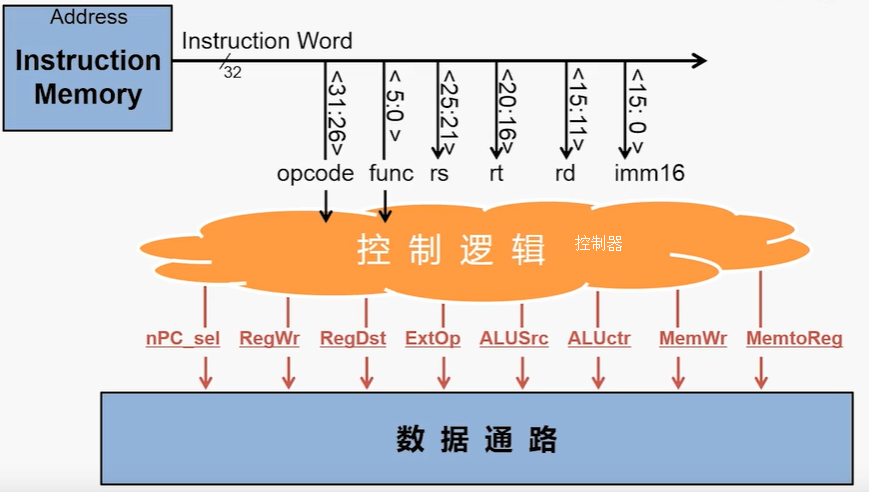

add: R[rd] <--- R[rs] + R[rt]; PC = PC + 4

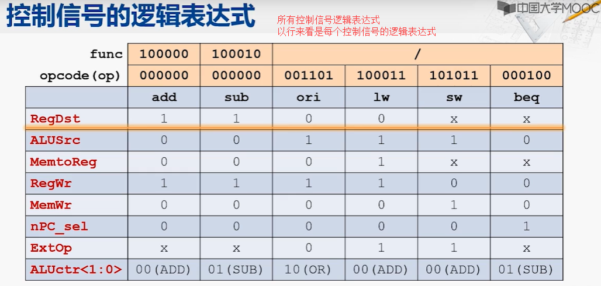

​			RegDst = add + sub


==ori：逻辑或==

所以得出控制逻辑的组成


### 流水线

单周期指令运行 --> 流水线指令运行

#### 流水线基本原理

> ==MIPS指令执行步骤：==
>
> 1. ==取值（从存储器取值，更新PC）==
>
>  	2. ==译码（译码，从寄存器堆读出需要操作哪些寄存器）==
>  	3. ==执行（运算指令，访存指令）==
>  	4. ==访存（对应访存指令，load：从存储器读数据，store：将数据写回存储器）==
>  	5. ==回写（将数据写入寄存器堆）==
>
>   
>
> ​	==流水线寄存器==：保存前一个阶段向后一个阶段传递的所有信息
>
> 令每个阶段延迟200ps	
>
> 令流水线寄存器延迟50ps

==5级流水线框架==


+ 流水线优化

    > 平衡流水线（将时间长的切分为平衡时间）
    >
    > ​	假设洗菜1min，切菜2min，炒菜1min，端菜1min形成4级流水线结构
    >
    > ​		为平衡流水线，我们将切菜分为两个阶段，形成5级流水线
    >
    > 

超级流水线（增加流水线深度，提升吞吐率（频率大战，文字游戏：时钟频率高），但性能反而是降低了）

|            | 时钟周期 | 单条指令延迟   | 流水线寄存器延迟比例 |
| ---------- | -------- | -------------- | -------------------- |
| 5级流水线  | 200 + 50 | 1000 + 5 * 50  | 250 / 1250           |
| 10级流水线 | 100 + 50 | 1000 + 10 * 50 | 500 / 1500           |

==现实情况：流水线深度维持在15级==


#### 超标量流水线

> ==两条 / 两条以上并行工作的流水线结构，超标量结构==
>
> ​	是空间并行性的优化，需要成倍的硬件资源
>
> 超标量流水线与多核CPU概念

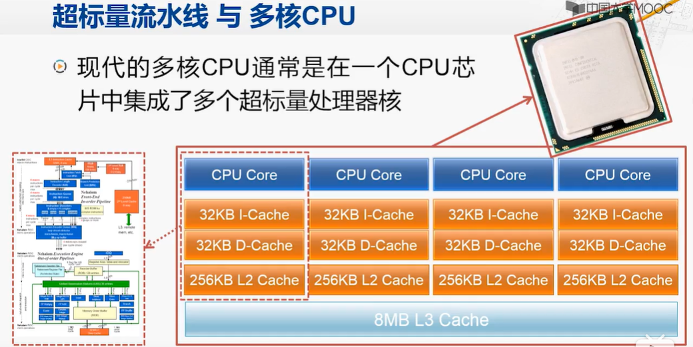


#### 流水线的”冒险“（Hazard）

> 结构冒险
>
> 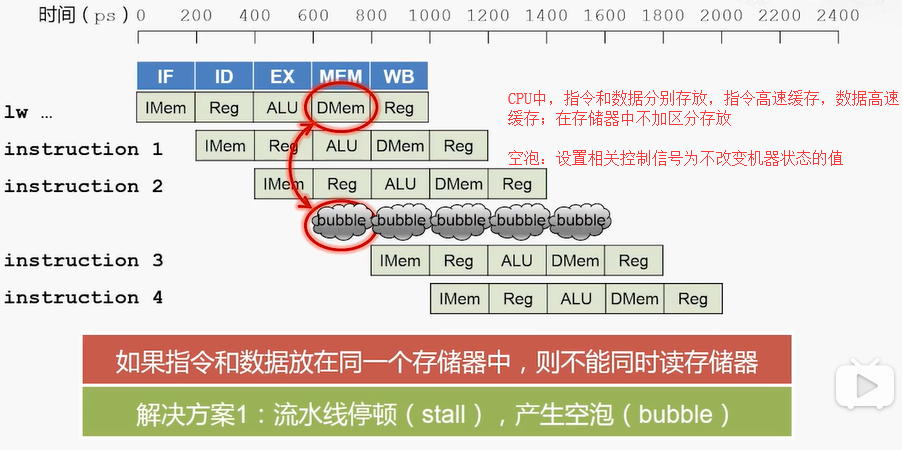
>
> ​	寄存器堆相较于其他部件读写速度快：
>
> ​		当同时读写，前半个时钟周期写，后半个时钟周期读（在硬件设计时分前周期，后周期）
>
> 数据冒险
>
> ​	空泡
>
> 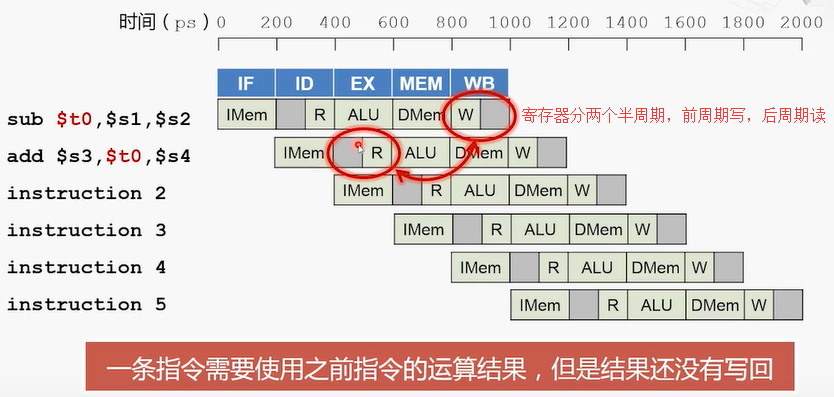
>
> ​	前递 / 旁路
>
> 
>
> 控制冒险
>
> ​	空泡


### 存储器


CPU <---> 寄存器 <---> 缓存 <---> 主存

寄存器的工作方式很简单，只有两步：（1）找到相关的位，（2）读取这些位。

内存的工作方式就要复杂得多：

（1）找到数据的指针。（指针可能存放在寄存器内，所以这一步就已经包括寄存器的全部工作了。）

（2）将指针送往内存管理单元（MMU），由MMU将虚拟的内存地址翻译成实际的物理地址。

（3）将物理地址送往内存控制器（memory controller），由内存控制器找出该地址在哪一根内存插槽（bank）上。

（4）确定数据在哪一个内存块（chunk）上，从该块读取数据。

（5）数据先送回内存控制器，再送回CPU，然后开始使用。


SRAM & DRAM

> ==D（dynamic）RAM==
>
> ​	定时刷新（电容会丢失，需定时充放电荷（==材料充放电时间无法提升，核心频率提升困难==）），速度慢
>
> S（static）RAM
>
> ​	6个晶体管保存1b，速度快用作高速缓存
>
> 
>
> ​	<kbd>主存</kbd>：S（Synchronous）DRAM
>
> ​	8个DRAM芯片（令每个芯片送出8b）组成==内存模组==，那么一次能送出64b
>
> ​	
>
> ​	==CPU访问主存延迟==：
>
> ​		1. tRCD（Row to Column Delay，行选到列选延迟），2 ~ 3T
>
> ​		2. CL（CAS Latency，列选延迟），2 ~ 3T
>
> ​		3.tRP（RAS Precharge，行预充电（关闭行）），2 ~ 3T 
>
> ​	
>
> ​	对于PC133标准（MHz）T = 7.5ns，令tRCD, CL, tRP均为3T
>
> ​	那么一次主存访问： 6 * 7.5 + （4芯片）每周期送出一条数据 + tRP ≈ 90ns
>
> 
>
> ==DDR（Double Data Rate）SDRAM==
>
> ​	双倍传输速率：在时钟上升沿和下降沿都传输1组数据
>
> ​	对于8b的SDRAM芯片，每次传送16b；那么对于8个SDRAM组成内存模组每次可传输128b
>
> 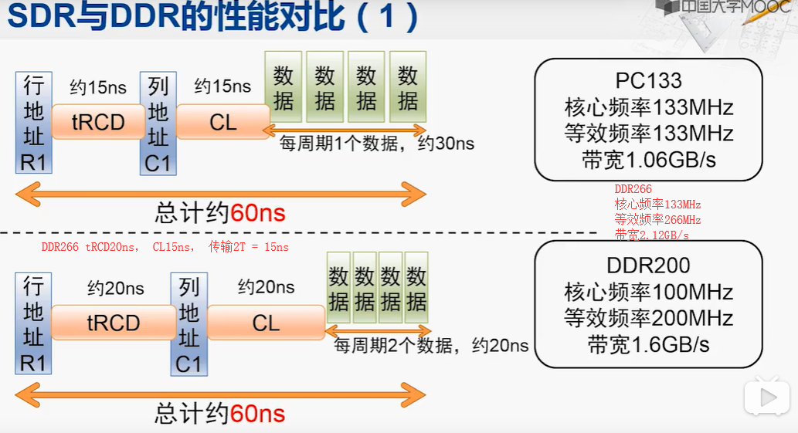
>
> 
>
> DDR2 SDRAM
>
> ​	DDR2-400：
>
> ​		**既然提升核心频率有困难（电容充放电决定），那么取出4倍的数据；例如借书手续10分钟我们并不提升为5分钟，但一次借你4本书，好像是提升速度了**
>
> DDR3 SDRAM
>
> DDR4 SDRAM
>
> 


### Cache

> 局部性原理：空间局部性，时间局部性
>
> 基本单位： 缓存行（cache line），一般与从内存模组取数据大小一致为64B
>
> CPU <== > Cache < == > Memory
>
>  ​	
>
> “Cache替换策略”：
>
> ​		Random
>
> ​		Round-Robin
>
> ​		LRU：硬件复杂
>
> ​	==“Cache命中写”==：
>
> ​		写穿透：写回Cache & Memory
>
> ​		写返回： 写回Cache，当该数据块被替换时写回Memory
>
> ​	==“Cache失效写”==：
>
> ​		写不分配：将数据写回Memory
>
> ​		写分配：读入Cache，数据写到Cache
>
> ​	“Cache读”：

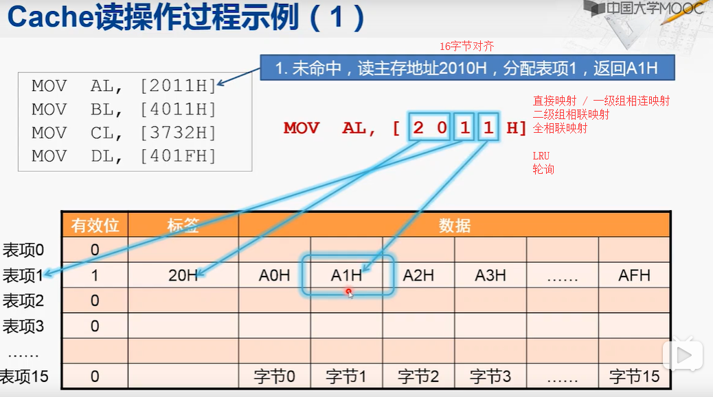

==“cache失效读”==

> 如果发生了Cache Miss，就需要从Memory中取数据，这个取数据的过程中，CPU可以执行几十上百条指令的，如果等待数据时什么也不做时间就浪费了。可以在这个时候提高CPU使用效率的有两种方法，一个是==乱序执行（out of order execution)==，即把当前线程中后面的、不依赖于当前指令执行结果的指令拿过来提前执行，另一个是==超线程技术==，即把另一个线程的指令拿过来执行。

+ 乱序执行
+ 超线程技术


=="Core i7 多级Cache结构"==

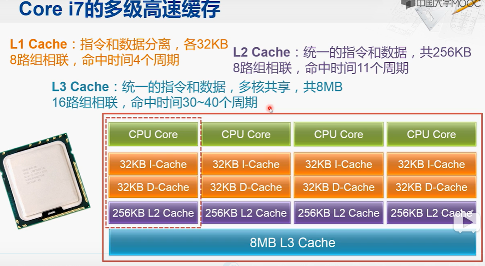


#### 速度差别

L1 cache: 3 cycles

L2 cache: 11cycles

L3 cache: 25 cycles

Main Memory: 100 cycles

==**CPU从cache取数据最小单位是字节，Cache（单位是Cache line，Cache line大小与DDR3、4一次访存能得到的数据大小是一致的，即64Bytes）从主存（内存模组：8组DRAM芯片组成，每次送出64B数据）获取数据为64B，Main Memory从磁盘获取数据一般为4K（4096B）**==


### 中断

> 中断 / 异常：外部中断（外设请求），内部中断（软件运行异常）
>
> ==8086“段加偏移”：物理地址 = 段基址 << 4 + 逻辑地址==
>
> 8086异常处理：
>
> ​	中断向量表：
>
> ​		主存最低1K字节，存放256个中断服务程序入口地址（中断向量），每个入口地址4B
>
> 
>
> 中断向量表位置：
>
> ​	==在实模式下，8086CPU复位之后，被南北桥芯片引导去BIOS取第一条指令，对主板各设备进行配置，其中一个工作是在主存地址0-1KB的地址构建中断向量表，[并准备中断服务程序 ?]==	
>
>  
>
> 中断指令： INT n
>
> 中断检测： CPU中断处理电路产生对应控制信号
>
> 关中断：CLI；开中断：STI
>
> 中断处理过程：
>
>   1. 关中断（不接受外部中断请求）（CLI）
>
>   2. 保存断点
>
>   3. 识别中断类型
>
>   4. 中断处的寄存器压入堆栈（IP, CS, FLAGS）
>
>   5. 执行中断处理程序
>
>   6. 恢复现场并返回
>
>      中断返回：IRET； 从栈顶弹出3个字，送入IP, CS, FLAGS寄存器
>
>  
>
> 内部中断（中断类型号由CPU产生，内部中断优先级高，一定会响应）：
>
> ​	单步中断，断点中断
>
> ​	溢出中断
>
> 外部中断（中断类型需查看外设）
>
>  
>
> BIOS中断，DOS中断


### IO

==I / O接口，通常集成在南桥芯片==，部分性能要求较高可采用独立芯片（显卡） / 板卡形式

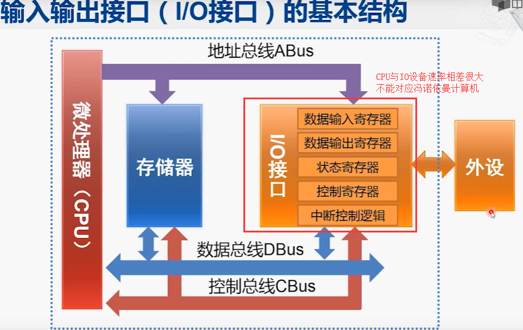


>  I / O端口：
>
>  ​	**I / O接口包含一组I / O端口的寄存器，每个I / O端口需要由自己的端口地址（端口号）**
>
>  I / O端口编址方式：
>
>  ​	IO端口与存储器分开编址（I / O映像，==“I / O Mapped I / O”==）：x86
>
>  ​		IN指令
>
>  ​		OUT指令
>
>  ​	IO端口与存储器统一编址（存储器映像I / O，==“Memeory Mapped I / O”==） ：ARM，MIPS，powerPC
>
>  
>
>  “CPU控制外设输入输出方式”：
>
>  + ==“程序控制式”：CPU传送数据==
>
>  ​		无条件传送（电子管等）
>
>  ​		程序查询方式（不断查询外设状态，确定就绪才传送数据）
>
>  + ==“中断式”：CPU传送数据==（现代计算机大量使用中断控制输入输出设备）
>
>  ​		中断控制器
>
>  ​		执行额外的中断程序
>
>  
>
>  外部中断（硬件中断）
>
>  + NMI非屏蔽中断：低电量
>
>  + INTR可屏蔽中断
>
>  ​				通过中断控制器（PIC可编程中断控制, A（Advance）PIC）连接多个外设
>
>  ​				对于高优先级中断，执行中断嵌套
>
>  
>
>  + ==“DMA”直接存储器访问，DMA控制器集成在南桥==
>
>  ​	DMAC工作步骤：
>
>  1. CPU设置DMAC内部配置寄存器（源地址及递增 / 递减，目的地址及递增 / 递减， 传送数据长度）
>
>   		2. DMAC处于空闲等待状态
> 		3. IO接口向DMAC发出DMA传送申请
>   		4. DMAC响应IO接口申请
> 		5. DMAC向IO接口发起总线读传输
>   		6. DMAC向存储器发起总线写传输
>
>  传送完成，DMAC发送中断信号
>  
>  对速率要求较高的硬件，自带DMA控制器


