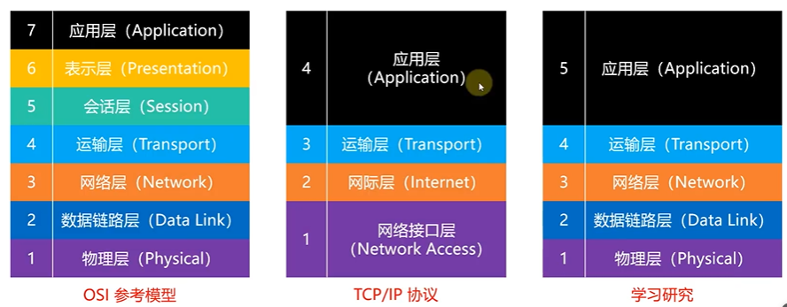
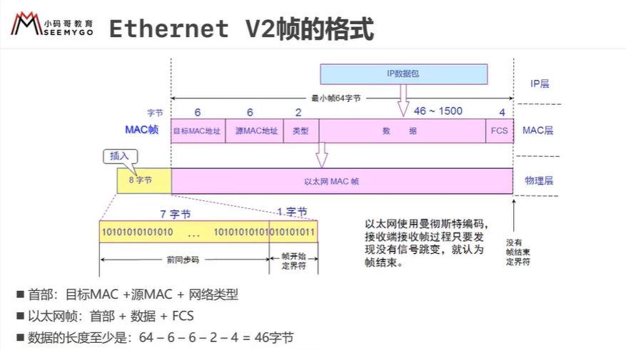
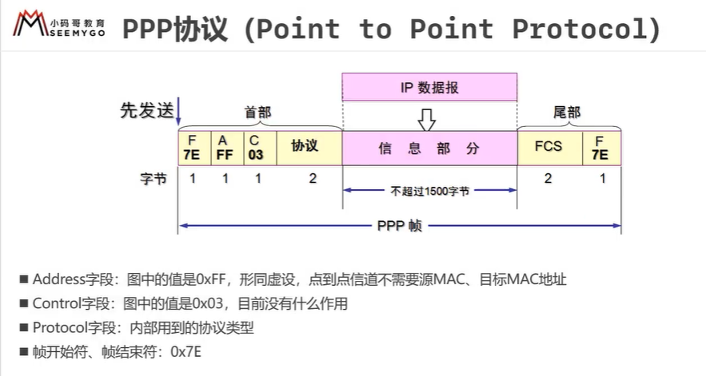
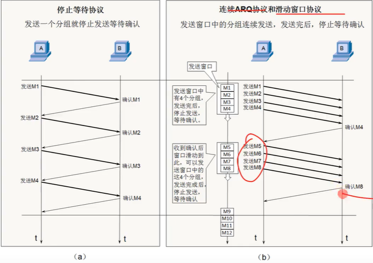
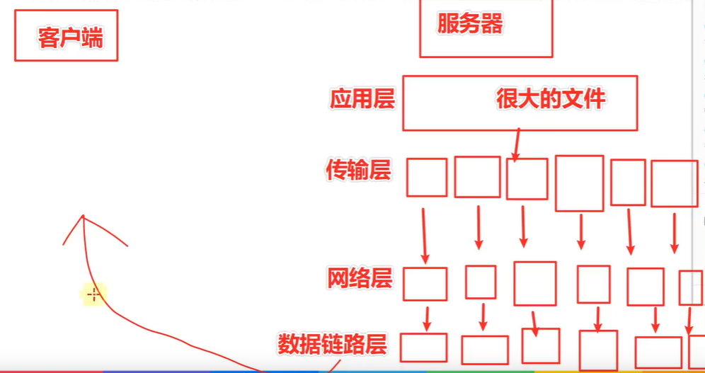
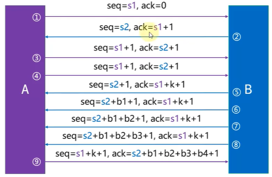
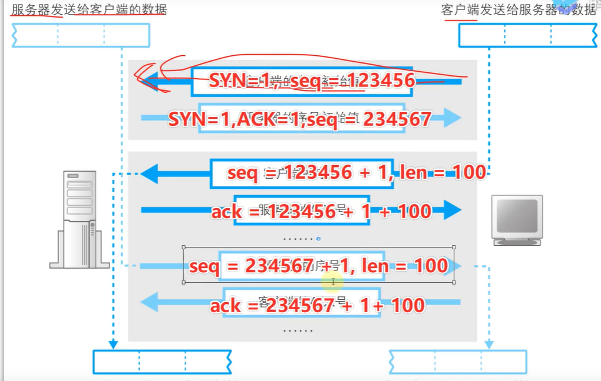
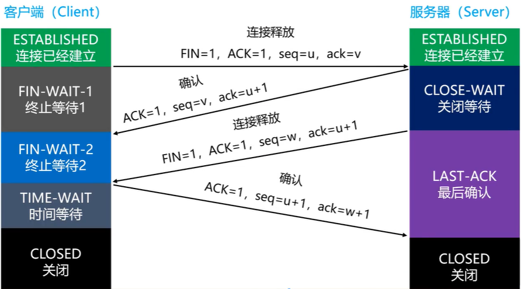
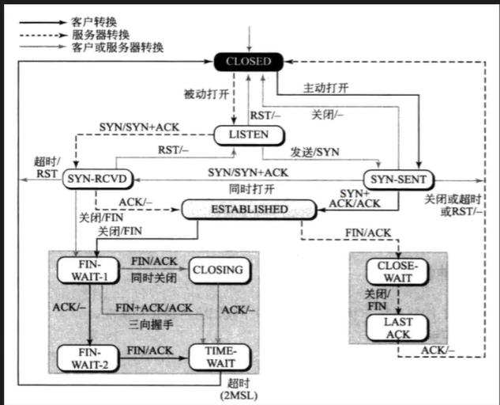

### 1 TCP

> + TCP提供一种**面向连接的、可靠的字节流服务**
>
> + TCP使用校验和，确认和重传机制来保证可靠传输
> + TCP給数据分节进行排序，并使用累计确认保证数据的顺序和非重复
> + **==TCP使用滑动窗口机制来实现流量控制，通过改变滑动窗口的大小进行拥塞控制==**


#### 1.1 三次握手四次挥手

> 三次握手：指客户端与服务端建立连接时共发送3个包
>
> 三次握手的目的
>
> 1. 连接服务器指定的端口，
> 2. 同步双方的序列号与确认号（每次传输需要使用序列号，sequence number）
> 3. 交换TCP窗口大小信息
>
> 在socket编程中，connect()调用将触发三次握手


## 网络互连模型




| 层级       | 协议                               | 数据            |
| ---------- | ---------------------------------- | --------------- |
| 应用层     | FTP, HTTP, SMTP, DNS, DHCP         | 报文、用户数据  |
| 传输层     | TCP，UDP                           | 数据段，segment |
| 网络层     | IP，ARP，ICMP                      | 包，packets     |
| 数据链路层 | CSMA/CD（广播信道），PPP（点对点） | 帧，frames      |
| 物理层     | ieee802                            | 比特流，bits    |


### 物理层

双绞线：橙白橙

网线不能超过 100m

定义接口、线缆等标准


#### 数字信号，模拟信号

模拟信号，抗干扰能力差

数字信号，是离散的，抗干扰能力强


数字信号 <== 调制解调器 ==> 模拟信号

光调制解调器


### 数据链路层

该层最重要三个问题：

1. 封装成帧
2. 透明传输
3. 差错检测


#### 封装成帧


> 最大传输单元 MTU（Maximum Tranfer Unit）
>
> 每一种数据链路层协议都规定了 MTU
>
> **以太网帧 MTU = 1500B（字节）**


#### 透明传输

+ 每帧都有帧开始符（SOH），帧结束符（EOT）

+ 数据存在 SOH，EOT 则进行转移


#### 差错检测

FCS = 数据 + 帧首部 计算而成

**以太网帧数据长度：46 ~ 1500 B**

以太网帧长度：64 ~ 1518 B


#### PPP 帧与 Ethernet V2 帧

PPP（Point to Point Protocol） 协议传输的是 PPP 帧

以太网协议传输的是以太网帧，是以前的广播协议（CSMA/CD 协议），已不使用

但由网络层传输下来的数据是一样的

**路由器与路由器直连是 PPP 帧，路由器与路由器之间通过集线器连接传输的是 Ethrnet 帧**


##### Ethernet V2 帧



> 目标 MAC（6B） + 源 MAC（6B）+ 网络类型（2B）+ FCS（4B） = 18B

##### PPP 帧




#### 网卡

==**工作在数据链路层与物理层，是二层设备**==

路由器是三层设备，工作在网络层，数据链路层，物理层

> 1. 差错校验失败则丢弃该帧
>
> 2. 校验通过，硬件会去掉 FCS


### 网际层

> 网络层数据包由以下 2 部分组成：
>
> 1. 首部
> 2. 数据（一般是由传输层传递下来的数据段）


#### 首部

<table>
  <tr align="center">
    <td rowspan="6"><b>首部</b></td>
  	<td>版本</td>
    <td>首部长度</td>
    <td>区分服务</td>
    <td>总长度</td>
  </tr>
  <tr align="center">
  	<td colspan="2">标识</td>
    <td>各种标志</td>
    <td>片偏移</td>
  </tr>
  <tr align="center">
  	<td>生存时间</td>
    <td>协议</td>
    <td colspan="2">首部校验和</td>
  </tr>
  <tr>
    <td colspan="4" align="center">源 IP</td>
  </tr>
  <tr>
  	<td colspan="4" align="center">目标 IP</td>
  </tr>
  <tr align="center">
  	<td colspan="3" align="center">可选字段（长度可变）</td>
    <td>填充</td>
  </tr>
  <tr align="center">
    <td><b>数据</b></td>
  	<td colspan="4">数据部分（由传输层而来）</td>
  </tr>
</table>

> **IP 首部每行 4B，可选字段一般没有，所以基本都是 20B，也至少 20B**
>
> 用 4B 表示 x 4 即为结果值：0b0101 ~ 0b1111 = 5 x 4 ~ 15 x 4
>
> 首部长度 20 ~ 60 B


#### ping www.baidu.com -l 800

> 发送 800B 数据到百度
>
> ICMP 首部：8B「跳过 TCP 层, TCP 首部 20B」
>
> IP 首部：20B
>
> Ethernet 首部：目标 MAC + 源 MAC + 网络类型= 14 B
>
> Ethernet 尾部: 4B「CRC」
>
> **total = 800 + 8 + 20 + 14 = 842**


### 传输层

| point        | TCP                            | UDP                                        |
| ------------ | ------------------------------ | ------------------------------------------ |
| 连接性       | 面向连接                       | 面向非链接                                 |
| 可靠性       | 可靠，不丢包                   | 不可靠，尽可能交付                         |
| 首部占用空间 | 20 ~ 60B（0b0101 ~ 0b1111）x 4 | 8B（源端口，目标端口，UDP长度，UDP校验和） |
| 传输速率     | 慢                             | 快                                         |
| 资源消耗     | 大                             | 小                                         |
| 应用场景     | 浏览器，文件传输，邮件         | 音视频通话，游戏，直播                     |
| 应用层协议   |                                | DNS，自定义                                |


#### UDP

1. 首部

> 源端口（随机分配的，0 ~ 65535），目标端口，UDP长度，UDP校验和
>
> 各 2B，一共 8B

2. 数据


#### TCP

##### 1. 首部

<table>
  <tr align="center">
    	<td colspan="2">源端口</td>
    	<td colspan="2">目标端口</td>
  </tr>
  <tr align="center">
    	<td colspan="4">序号</td>
  </tr>
  <tr align="center">
    	<td colspan="4">确认号</td>
  </tr>
  <tr align="center">
    	<td>数据偏移</td>
    	<td>保留</td>
    	<td>URG ACK PSH RST SYN FIN</td>
    	<td colspan="2">窗口</td>
  </tr>
  <tr align="center">
    	<td colspan="2">校验和</td>
    	<td colspan="2">紧急指针</td>
  </tr>
  <tr align="center">
    	<td colspan="3">可选项（长度可变）</td>
    	<td>填充</td>
  </tr>
</table>

###### URG（Urgent）

当 URG = 1 时，紧急指针字段有效。表明当前数据段有紧急数据传送


###### ACK（Acknowledgment）

当 ACK = 1 时，确认号字段才有效


###### PSH（Push）

服务器推送数据「？」


###### RST（Reset）

当 RST = 1 时，表示当前连接错误，必须释放重新建立连接


###### SYN（synchronization）

当 SYN = 1，ACK = 0 时，表示当前数据段是建立连接的段，数据 length = 0，只有 TCP 首部 20B

当 SYN = 1, ACK = 1 时，表示服务器同意建立连接


###### FIN（Finish）

当 FIN = 1 时，表示数据发送完毕要求释放连接，数据 length = 0，只有 TCP 首部 20B


###### 窗口

占 2B

**流量控制，用于告知对方下一次允许发送数据大小（B）**


2. ##### 数据

   

##### 可靠传输

如何保证可靠传输？

###### ARQ（停止等待协议）

###### 改进（连续 ARQ + 滑动窗口）



###### 重传

默认 5 次，如果还未发送成功，就会发送 RST 标志位的报文，标识断开后重连


###### 滑动窗口

**在建立连接的时候的确认窗口大小（传输过程中可能会改变，窗口大小与缓存「buffer」有关）**

假设窗口大小 10240B，每个包 1280 B，那么一次发送 8 个包，服务端确认时一次确认 8 个

> 如果中间有丢包，可以采用 SACK（Select Ackonwledgement）机制，只重传丢的包，而无需重传从失败开始以后的所有包（例如：12345678 包，服务端未收到 3，那会重传 345678，如果采用 SACK 只会重传 3）




> **数据链路层最多从网络层接受 1500B（MTU） 数据**
>
> **IP 首部：20 ~ 60 B**
>
> **TCP 首部： 20 ~ 60B**
>
> **假设都按照 20B 首部计算，应用层每个段最多 1460B**


##### 流量控制

**局部性，是点对点控制**

根据缓冲区，确认发送窗口大小


##### 拥塞控制

**全局控制，所有主机通过拥塞控制改变自己的 rwnd（拥塞窗口）**

涉及所有主机，路由器


> MSS「Maximum Segment Size」，传输层每个数据段最大大小（一般在连接时确认）
>
> ​	==客户端 MSS = 1460，服务端 MSS = 1412，则 MSS = 1412==
>
> 那一次最多能发送多少个包呢？
>
> ​	**取决于 window 大小，window / MSS**
>
> cwnd（congestion window）：拥塞窗口大小
>
> rwnd（Receieve Window）：接受窗口大小
>
> swnd（send window = min(cwnd, rwnd)）：实际发送窗口大小


###### 慢开始

> 新连接都从发送 1 个包开始，然后指数级增长


###### 拥塞避免

> 针对拥塞窗口来说的
>
> swnd = min(cwnd, rwnd)
>
> 常数级增长（ + n）

###### 快重传

> 失序的丢包会快速重传而不是等待超时重传


###### 快恢复

> 拥塞窗口不恢复为默认值，而是减半，然后再常数级增长


#### 总结

> 1. 可靠传输
>    1. 超时重传
>    2. 快速重传（连续收到 3 个重复确认）
> 2. 流量控制（连接时，确认窗口大小）
> 3. 拥塞控制
>    1. 慢开始
>    2. 拥塞避免
>       + 拥塞窗口常数级增加
>       + 达到阈值后减半缩小（1 / 2）
>       + 减半后快恢复（在阈值常数级增加）
>    3. 快重传
>    4. 快恢复


##### 连接管理

三次握手、四次挥手


###### 建立连接



> 1. 建立连接时确认双方序列号，MSS 大小，window 大小
> 2. 双方每次 ACK 都是期望对方給的值 + 序列号



``` shell
case SYNC_SENT 状态：
	if 超时：
		进入 CLOSED 状态
  if 收到 SYN 报文：
  	发送 SYN + ACK 报文
  	进入 SYN-RCVD 状态
  if 收到 SYN + ACK 报文：
  	发送 ACK
  	进入 ESTABLISHED 状态（已连接）
 	if 收到其它报文:
 		发出差错报文
 	break
```


###### 释放连接

4 次挥手




1. client 发送带 FIN 标志位报文到 server
2. server 发送 ACK 标志位 到 client
3. server 发送 FIN 标志位到 client
4. client 发送 ACK 标志位到 server



> FIN-WAIT-1：表示想主动关闭连接
>
> CLOSE-WAIT：表示在等待关闭（被动方收到 FIN 后处于 CLOSE-WAIT）
>
> FIN-WAIT-2：被动方发送 ACK 确认 FIN 后，主动方处于 FIN-WAIT-2
>
> CLOSING：**双方同时都想关闭（很少会有这种情况）**
>
> TIME-WAIT：被动方发送 FIN 后，主动方处于 TIME-WAIT 状态，被动方处于 LAST-ACK 状态


###### CLOSE-WAIT

**==被动方很好理解：别人说关闭连接，好那我处于 CLOSE-WAIT，我回了 ACK，FIN 后处于 LAST-ACK 状态==**

主动方：我发送 FIN 后处于 FIN-WAIT-1 状态，对方給我回了 ACK 后处于 FIN-WAIT-2 状态，**对方再回了 FIN 后我处于 TIME-WAIT 状态**


###### TIME-WAIT

表示收到了被动方的 FIN，并且我也发送了 ACK，等待 **2MSL「Maximum Segment Lifetime」** 后进入 CLOSED 状态

> 主动方为何要等待 2MSL ？
>
> **RFC 1122 建议 MSL 为 2分钟**


###### 3 次挥手

1. client 发送 FIN 到 server
2. **server 此时已经没有数据发送给客户端了，server 可以直接回 FIN 給 client（合并 ACK + FIN）**
3. client 发送 ACK 到 server


### 应用层


