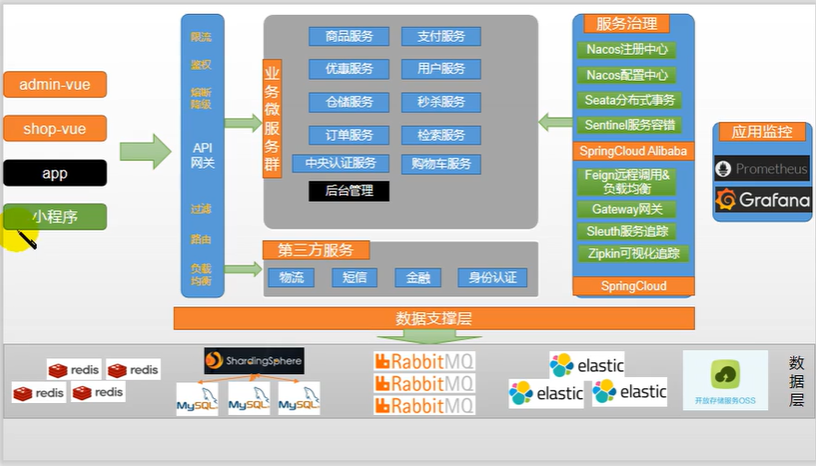

## 1 开篇


### 1.1 系统架构

> 后台管理、网关、商品、检索、订单、购物车、仓库、秒杀、物流、会员、优惠、支付
>
> 
>
> 动静分离 - Nginx
>
> 注册中心、配置中心 - nacos
>
> 认证中心（社交登录，weibo） - OAuth2.0
>
> 权限控制 - Spring Security
>
> 统一网关 - SpringCloud Gateway
>
> 客户端负载均衡 - Ribbon
>
> 服务熔断降级 - Sentinel
>
> 缓存系统 - redis
>
> 分布式事务 - Seata
>
> 远程调用 - openFeign
>
> 对象存储 - 阿里云对象存储 OSS
>
> 全文检索 - Elasticsearch
>
> 消息队列 - RabbitMQ
>
> 链路追踪 - Zipkin + Sleuth
>
> 线上监控系统 - Prometheus
>
> 日志系统 - ELK
>
> 压力测试 - Jmeter
>
> 性能优化
>
> 人人快速开发平台
>
> 支付宝API


### 1.2 服务划分




### 1.3 虚拟机网络配置

> VMnet0：使用桥接网络
>
> ​		在Bridged模式下，虚拟机同主机是相同的地位
>
> VMnet1：仅主机网络
>
> ​		虚拟机外部网络访问都通过物理主机「Host」
>
> VMnet8：NAT网络
>
> ​		源地址转换网络，最简单的组网方式，NAT和Host-Only区别在于NAT模式会多一个NAT服务

1. 虚拟机网络地址转换「NAT」 - 端口转发

   需要从主机映射端口到虚拟机端口，这样每个服务软件都需要端口转发

   windows 3306 --> vm ware linux 3306

2. 虚拟机使用桥接网络「为虚拟机配置与主机同一网段的ip，这样通过ip即可访问虚拟机」

   主机和虚拟机可互ping

> 我们需要将虚拟机设置为桥接网络


### 1.4 安装Docker

> Docker容器化技术，基于镜像，可以秒级启动容器，每个容器都是一个完整的运行环境，容器之间互相隔离
>
> `hub.docker.com`


安装docker-ce

`docs.docker.com`

``` shell
# 卸载
$ sudo yum remove docker \
                  docker-client \
                  docker-client-latest \
                  docker-common \
                  docker-latest \
                  docker-latest-logrotate \
                  docker-logrotate \
                  docker-engine
                  
# 安装依赖
$ sudo yum install -y yum-utils

# docker安装地址配置
$ sudo yum-config-manager \
    --add-repo \
    https://download.docker.com/linux/centos/docker-ce.repo
    
# 安装ce  
$ sudo yum install docker-ce docker-ce-cli containerd.io

# 启动
$ sudo systemctl start docker
 
# 运行hello-world
$ sudo docker run hello-world

# 开启自启动
$ sudo systemctl enable docker

# 配置镜像加速
# 登录阿里云，控制台，容器镜像服务
sudo mkdir -p /etc/docker
sudo tee /etc/docker/daemon.json <<-'EOF'
{
  "registry-mirrors": ["https://r6gnoa7o.mirror.aliyuncs.com"]
}
EOF
sudo systemctl daemon-reload
sudo systemctl restart docker
```


### 1.5 中间件安装

> docker安装所需中间件

#### MySQL

``` shell
docker pull mysql:8.0.23

# whereis mysql

# 端口映射与文件挂在启动
sudo docker run -p 3306:3306 --name mysql\
-v /mall/mysql/log:/var/log/mysql\
-v /mall/mysql/data:/var/lib/mysql\
-v /mall/mysql/conf:/etc/mysql\
-e MYSQL_ROOT_PASSWORD=123456\
-d mysql:8.0.23

# -p 端口映射 宿主机端口/容器端口
# -v 目录挂载 宿主机目录/容器目录
# -e MYSQL_ROOT_PASSWORD=123456，初始化root密码

docker exec -it mysql /bin/bash
docker update mysql --restart=always

# 查看启动的容器
docker ps

# 在挂载目录修改my.cnf

docker restart mysql
```


#### Redis

``` shell
docker pull redis

# 在安装docker的主机创建目录
mkdir -p /mall/redis/conf
touch /mall/redis/conf/redis.conf

# 配置端口映射与文件挂在
docker run -p 6379:6379 --name redis\
-v /mall/redis/data:/data\
-v /mall/redis/conf/redis.conf:/etc/redis/redis.conf\
-d redis redis-server /etc/redis/redis.conf # 以/etc/redis/redis.conf启动redis-server

# 开启redis持久化 vim /mall/redis/conf/redis.conf
# rdb / aof
appendonly yes

# docker版redis-cli
docker exec -it redis redis-cli
docker update mysql --restart=always
```

> 使用medis连接redis测试
>
> memory info
>
> cpu info
>
> ...


#### Nginx

``` shell

```


#### ElasticSearch

``` shell

```


### 1.6 其他配置


#### 1.6.1 vscode

1. 安装vscode
2. 安装插件


#### 1.6.2 git配置

``` shell
# 生成ssh免密连接使用的公钥，以github用户名为salt
ssh-keygen -t rsa -C "775698011@qq.com"

# 将密钥完整复制到码云的SSH公钥 KEY中
cat ~/.ssh/id_rsa.pub

# 测试免密设置是否成功
ssh -T git@gitee.com
```


### 1.7 CI / CD

持续集成

>  流程：
>
>  Developer - Github - Docker - Kubernetes API - Jekins Pipeline - OP运维


## 2 初级篇


### 2.1 项目搭建

#### 2.1.1 maven

1. 父项目mall

   依赖：

   `web-starter`

   `openfeign`

2. 子项目「springboot」

   包：com.yangzl.mall

   ​			.product

   ​			.order

   ​			.member

   ​			.cupon

   ​			.ware

3. gitignore配置

   ...

4. commit
5. push


#### 2.1.2 gradle

`https://github.com/Timesless/mall`


### 2.2 数据库设计

> 1. 不建立外键关联

``` sql
# 5个业务库 + 1个后台系统库
CREATE DATABASE `mall_oms` CHARACTER SET 'utf8mb4' COLLATE 'utf8mb4_0900_ai_ci';
`mall_pms`
`mall_sms`
`mall_ums`
`mall_wms`
`mall_admin`
```


### 2.3 人人快速开发平台


```shell
git clone git@gitee.com:renrenio/renren-generator.git
git clone git@gitee.com:renrenio/renren-fast.git
git clone git@gitee.com:renrenio/renren-fast-vue.git

# 删除.git

# 1. 运行renren-fast-vue
# 2.1 修改renren-generator代码生成配置文件（generator.properties）
# 2.2 修改 generator GenUtils.javva
# 3. 启动renren-generator
# 4. 逆向生成代码
```


### 2.4 Vue


### 2.5 mall 后台


## 3 高级篇


### Spring Seesion

> Spring Session解决的问题：
>
> + 子域父域session共享
> + 分布式session后端统一存储
>     + redis
>     + jdbc


#### Spring Session Redis

``` xml
<dependency>
  <groupId>org.springframework.session</groupId>
  <artifactId>spring-session-data-redis</artifactId>
</dependency>
```


``` groovy
dependencyManagement {
  imports {
    mavenBom 'org.springframework.session:spring-session-bom:Corn-SR2'
  }
}
dependencies {
  compile 'org.springframework.session:spring-session-data-redis'
}
```


```
spring.session.store-type=redis # Session store type.
server.servlet.session.timeout= # Session timeout. If a duration suffix is not specified, seconds is used.
spring.session.redis.flush-mode=on_save 
spring.session.redis.namespace=spring:session 

# redis 配置
spring.redis.host=localhost 
spring.redis.password=
spring.redis.port=6379
```


``` java
@EnableRedisHttpSession 
public class Client {
  
  @Resource
  private StringRedisTemplate redisTemplate;
  
}
```


### 单点登录

> 不同系统域名不同，让三个系统同步一个用户的票据：
>
> 1. 认证服务器：ssoserver.com
> 2. 所有系统登陆取ssoserver，登陆成功跳转回来
> 3. 其中一个系统登陆其它系统不用的公路
> 4. 全局统一一个sso.sessionID


## 4 高可用篇